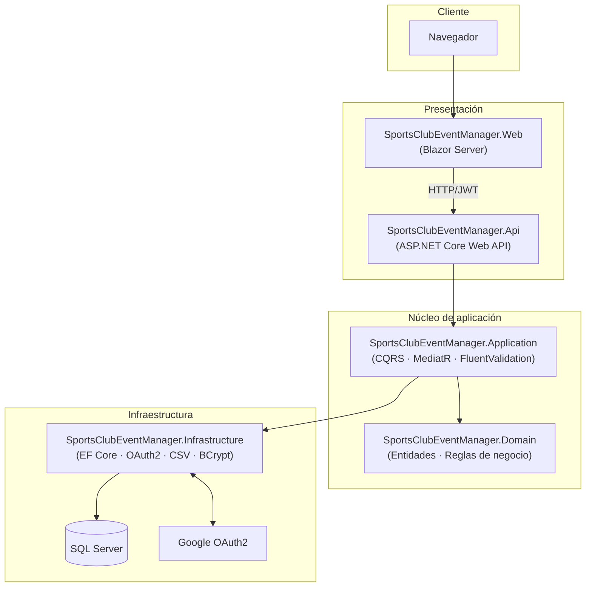

# 🏹 SportsClubEventManager


[](LICENSE)


> Trabajo de Fin de Máster — Plataforma de gestión de eventos para un club deportivo de tiro.

**SportsClubEventManager** es una aplicación web para la gestión integral de eventos de un club deportivo: publicación de un calendario de eventos, autoinscripción y cancelación por parte de los socios, y un panel de administración completo (eventos, usuarios, inscripciones e importación masiva vía CSV), todo ello protegido con autenticación OAuth2 + JWT y control de acceso basado en roles.

---

## Tabla de contenidos

- [a. Descripción general](#a-descripción-general)
- [b. Stack tecnológico](#b-stack-tecnológico)
- [c. Instalación y ejecución](#c-instalación-y-ejecución)
- [d. Estructura del proyecto](#d-estructura-del-proyecto)
- [e. Funcionalidades principales](#e-funcionalidades-principales)
- [f. Usuarios de prueba](#f-usuarios-de-prueba)
- [Calidad y CI/CD](#calidad-y-cicd)
- [Proyectos personales empleados en su construcción](#proyectos-personales-empleados-en-su-construcción)
- [Licencia](#licencia)

---

## a. Descripción general

El proyecto nace como una plataforma para que un club de tiro deportivo pueda gestionar sus eventos (tiradas, competiciones, entrenamientos) y la participación de sus socios en ellos. Evolucionó en varias iteraciones (Historias de Usuario) hasta convertirse en una aplicación completa:

1. **MVP sin autenticación**: modelo de dominio, persistencia y una API pública de solo lectura para consultar eventos.
2. **Autoinscripción**: los eventos pasan a poder aceptar inscripciones y cancelaciones con control de aforo.
3. **Interfaz Blazor**: calendario visual, listado, ficha de detalle y flujo de inscripción/cancelación para el usuario final.
4. **Seguridad y roles**: login con Google OAuth2 o email/contraseña, JWT, y dos roles (`User` / `Administrator`).
5. **Panel de administración**: gestión de usuarios, gestión de eventos (CRUD) y gestión de inscripciones, con registro de auditoría.
6. **Importación masiva**: carga de eventos desde CSV con previsualización, detección de duplicados y normalización automática de títulos.

La aplicación sigue una arquitectura en capas (Clean Architecture) con separación estricta entre dominio, aplicación, infraestructura y presentación (API + Blazor).



## b. Stack tecnológico

| Categoría | Tecnología |
|---|---|
| Plataforma | .NET 10 (SDK `10.0.100`, `LangVersion` 13, `Nullable` habilitado, warnings como errores) |
| Backend / API | ASP.NET Core Web API, arquitectura CQRS con **MediatR**, validación con **FluentValidation** |
| Frontend | **Blazor Server** con componentes **Radzen.Blazor** (calendario, tablas, formularios) |
| Persistencia | **Entity Framework Core 10** sobre **SQL Server 2022** (LocalDB en desarrollo local) |
| Autenticación | **OAuth2 (Google)** + login local con **BCrypt** (factor de coste 12), emisión de **JWT** y cookies de sesión (expiración deslizante de 30 min) |
| Autorización | RBAC con dos roles (`User`, `Administrator`), políticas por claim de rol |
| Importación de datos | **CsvHelper** para la carga masiva de eventos |
| Contenedores | **Docker** / **Docker Compose** (SQL Server + API + Web), imágenes multi-stage sobre `mcr.microsoft.com/dotnet/sdk:10.0` y `aspnet:10.0` |
| CI/CD | **GitHub Actions**: build + tests en cada PR a `develop`/`master`; build y publicación de imágenes a **GHCR** + despliegue vía webhook de **Portainer** en `master`, con smoke test post-despliegue y rollback totalmente automático (ver [runbook de despliegue](infrastructure/deploy/DEPLOYMENT_RUNBOOK.md)) |
| Testing backend | **xUnit**, **FluentAssertions**, **NSubstitute**, **Bogus** (datos de prueba), `coverlet.collector` |
| Testing Blazor | **bUnit**, **WireMock.Net** (mock de llamadas HTTP a la API) |
| Testing de integración | **Testcontainers** (SQL Server), **Respawn** (reseteo de BD), `Microsoft.AspNetCore.Mvc.Testing` |
| Documentación de API | Swagger / OpenAPI (`/swagger`) |

## c. Instalación y ejecución

### Requisitos previos

- [.NET SDK 10.0](https://dotnet.microsoft.com/download/dotnet/10.0) (versión fijada en `global.json`)
- [Docker](https://www.docker.com/) y Docker Compose (opción recomendada), **o bien** SQL Server / LocalDB instalado localmente
- Credenciales de [Google OAuth2](https://console.cloud.google.com/apis/credentials) (opcional si solo se va a usar el login local)

### Opción A · Docker Compose (recomendada)

1. Clonar el repositorio:

   ```bash
   git clone https://github.com/AlejBlasco/SportsClubEventManager.git
   cd SportsClubEventManager
   ```

2. Crear un archivo `.env` en la raíz del proyecto a partir de la plantilla `.env.example` (que no contiene ningún secreto real, solo la lista completa de variables esperadas):

   ```bash
   cp .env.example .env
   ```

   Y rellenar, al menos, las siguientes variables:

   ```env
   SA_PASSWORD=UnaContraseñaSegura123!
   CONNECTION_STRING=Server=sqlserver,1433;Database=SportsClubEventManager;User Id=sa;Password=UnaContraseñaSegura123!;TrustServerCertificate=True;MultipleActiveResultSets=true
   API_PORT=5240
   WEB_PORT=5123
   SQL_PORT=1433
   ASPNETCORE_ENVIRONMENT=Development
   JWT_SECRET_KEY=<clave-base64-de-al-menos-32-caracteres>
   ADMIN_PASSWORD=<contraseña para admin@sportsclub.local>
   GOOGLE_CLIENT_ID=<opcional-si-se-usa-login-con-Google>
   GOOGLE_CLIENT_SECRET=<opcional-si-se-usa-login-con-Google>
   ```

3. Levantar el stack completo:

   ```bash
   docker compose up --build
   ```

   > El `docker-compose.yml` de la raíz es un fichero `include:` de dos líneas; el contenido real del stack vive en [`infrastructure/docker-compose/`](infrastructure/docker-compose/README.md), pero el comando anterior sigue funcionando sin cambios.

4. Acceder a la aplicación:
   - Web (Blazor): http://localhost:5123
   - API + Swagger: http://localhost:5240/swagger

> Con `ASPNETCORE_ENVIRONMENT=Development` se aplican también las migraciones de datos de prueba (ver [sección f](#f-usuarios-de-prueba)). Con `ASPNETCORE_ENVIRONMENT=Production` (o cualquier valor distinto de `Development`), ambos hosts cargan `appsettings.json` (fichero base) como único perfil de configuración de producción — este repositorio no define un `appsettings.Production.json` separado; el fichero base ya cumple ese rol de forma explícita y documentada, y solo `appsettings.Development.json` diverge de él (logging más verboso).
>
> **Validación de arranque**: ambos hosts (`Api` y `Web`) validan de forma agregada, al arrancar y antes de aceptar ninguna petición HTTP, que toda la configuración crítica (`Authentication:JwtSettings`, `Authentication:Google`, `AdminUser:Password`, `Cors:AllowedOrigins` en `Api`; `ApiSettings:BaseUrl`, `Authentication:CookieSettings` en `Web`; `ConnectionStrings:DefaultConnection` en ambos) esté presente y sea válida. Si falta o es inválida alguna variable obligatoria, el proceso **no arranca**: termina con una excepción que agrega en un único mensaje **todos** los errores de configuración detectados (no solo el primero), en lugar de fallar de forma silenciosa o solo al primer uso.

### Opción B · Ejecución local con `dotnet run`

Requiere una instancia de SQL Server / LocalDB accesible.

```bash
# Configurar secretos de usuario para la API (el UserSecretsId ya viene precommiteado en el .csproj,
# no hace falta ejecutar "dotnet user-secrets init")
dotnet user-secrets set "Authentication:JwtSettings:SecretKey" "<clave-de-al-menos-32-caracteres>" --project src/SportsClubEventManager.Api
dotnet user-secrets set "Authentication:Google:ClientId" "<google-client-id>" --project src/SportsClubEventManager.Api
dotnet user-secrets set "Authentication:Google:ClientSecret" "<google-client-secret>" --project src/SportsClubEventManager.Api
dotnet user-secrets set "AdminUser:Password" "<contraseña-admin>" --project src/SportsClubEventManager.Infrastructure

# Aplicar migraciones de base de datos
dotnet ef database update --project src/SportsClubEventManager.Infrastructure --startup-project src/SportsClubEventManager.Web

# (Opcional) Aplicar datos de prueba — solo en entorno Development
dotnet ef database update AddDevelopmentSeedData --project src/SportsClubEventManager.Infrastructure --startup-project src/SportsClubEventManager.Web
dotnet ef database update SeedDevelopmentUserPasswords --project src/SportsClubEventManager.Infrastructure --startup-project src/SportsClubEventManager.Web

# Arrancar la API y la aplicación Web (en dos terminales)
dotnet run --project src/SportsClubEventManager.Api    # http://localhost:5240 · /swagger
dotnet run --project src/SportsClubEventManager.Web    # http://localhost:5123
```

Un fichero de referencia con todos los secretos necesarios está disponible en `.secrets-template.json`. Para el inventario completo de secretos y el procedimiento de alta/rotación de cada uno, ver [`docs/technical/secrets-management.md`](docs/technical/secrets-management.md).

### Ejecutar la batería de tests

```bash
dotnet test
```

## d. Estructura del proyecto

El repositorio sigue una arquitectura en capas (Clean Architecture):

```
/src
  /SportsClubEventManager.Domain           → Entidades, enumerados y reglas de negocio
  /SportsClubEventManager.Application      → Casos de uso CQRS (MediatR), validaciones
  /SportsClubEventManager.Infrastructure   → EF Core, migraciones, OAuth2, importación CSV
  /SportsClubEventManager.Shared           → DTOs compartidos entre capas
  /SportsClubEventManager.Api              → API REST (controladores, middleware, Swagger)
  /SportsClubEventManager.Web              → Interfaz Blazor Server (páginas, componentes)
/tests
  /SportsClubEventManager.Domain           → Tests unitarios de dominio (xUnit)
  /SportsClubEventManager.Application      → Tests unitarios de casos de uso (xUnit, NSubstitute)
  /SportsClubEventManager.Infrastructure   → Tests unitarios de infraestructura
  /SportsClubEventManager.Web.Tests        → Tests de componentes Blazor (bUnit, WireMock.Net)
  /SportsClubEventManager.IntegrationTests → Tests de integración (Testcontainers, Respawn)
/docs
  /functional                              → Documentación funcional por Historia de Usuario (castellano)
  /technical                               → Documentación técnica por Historia de Usuario (inglés)
/docker
  Dockerfile.api, Dockerfile.web
/infrastructure                            → Infraestructura como código (Docker Compose, documentación de despliegue)
/.github/workflows                         → Pipelines de CI (build + test) y CD (build + deploy)
/.claude                                   → Kit de agentes de IA usado durante el desarrollo (ver más abajo)
docker-compose.yml                         → Orquestación local del stack completo
global.json / Directory.Build.props        → Configuración común de compilación
```

## e. Funcionalidades principales

**Para socios (rol `User`):**
- Consulta del calendario de eventos en vista de calendario o listado (`/events`).
- Ficha de detalle de cada evento, con aforo disponible y estado ("completo"/"disponible").
- Inscripción y cancelación de inscripción en eventos, con validación de aforo, duplicados y eventos ya finalizados.
- Página "Mis inscripciones" con histórico y cancelación.
- Gestión del perfil propio (nombre, género, email, licencia) y cambio de contraseña.
- Login con **Google** o con email/contraseña.

**Para administradores (rol `Administrator`):**
- **Gestión de usuarios**: listado paginado/filtrable, edición, cambio de rol, activación/desactivación y borrado (con protección para no eliminar al último administrador).
- **Gestión de eventos (CRUD)**: alta, edición y borrado de eventos, con validaciones de fecha futura y aforo coherente con las inscripciones existentes.
- **Gestión de inscripciones**: filtrado, ordenación, paginación, inscripción manual de socios y exportación a **CSV/PDF**.
- **Importación masiva de eventos por CSV**: plantilla descargable, previsualización sin escritura en base de datos, edición fila a fila, detección automática de duplicados y normalización de títulos, con confirmación "todo o nada".
- **Registro de auditoría** de las acciones administrativas relevantes.

## f. Usuarios de prueba

Al ejecutar el entorno en modo `Development` (Docker con `ASPNETCORE_ENVIRONMENT=Development`, o tras aplicar las migraciones de datos de prueba en local) se dispone de los siguientes usuarios:

| Rol | Email | Contraseña |
|---|---|---|
| Administrador | `admin@sportsclub.local` | La definida en la variable `ADMIN_PASSWORD` / secreto `AdminUser:Password` en el primer arranque |
| Socio | `carmen.garcia@example.com` | `Password1!` |
| Socio | `javier.martinez@example.com` | `Password1!` |
| Socio | `ana.fernandez@example.com` | `Password1!` |
| Socio | `miguel.sanchez@example.com` | `Password1!` |
| Socio | `laura.rodriguez@example.com` | `Password1!` |
| Socio | `carlos.jimenez@example.com` | `Password1!` |

> El acceso mediante **Google OAuth2** requiere registrar credenciales reales en [Google Cloud Console](https://console.cloud.google.com/apis/credentials); no existe un proveedor simulado para ese flujo.

## Calidad y CI/CD

- El pipeline de **CI** (`.github/workflows/ci.yml`) compila la solución y ejecuta los tests unitarios en cada Pull Request contra `develop`/`master`.
- El pipeline de **CD** (`.github/workflows/cd.yml`) construye y publica las imágenes Docker de la API y la Web en GHCR, desplegándolas automáticamente al fusionar en `master`.
- Antes de publicar, cada imagen pasa por un job `validate` (matriz `api`/`web`) que se ejecuta también en cada Pull Request contra `master`: escaneo de vulnerabilidades con **Trivy** (falla el pipeline ante hallazgos `CRITICAL` con parche disponible), aviso no bloqueante si el tamaño de la imagen crece significativamente respecto a `docker/image-size-baseline.json`, y un smoke test que arranca el contenedor junto a un SQL Server efímero para comprobar que responde en `/health/live`. Los informes de Trivy se publican como artefacto del workflow y en la pestaña [Security](https://github.com/AlejBlasco/SportsClubEventManager/security/code-scanning) del repositorio.
- Tras el despliegue real al homelab (webhook de Portainer), el job `post-deploy-smoke-test` verifica el estado real de la aplicación desplegada haciendo *polling* de `/health/live` y `/health/ready` contra la URL pública; el resultado queda registrado como un GitHub **Deployment** del entorno `homelab-production` (pestaña [Environments](https://github.com/AlejBlasco/SportsClubEventManager/deployments)). Si el smoke test falla, el job calcula y publica en el resumen la última versión correcta y las instrucciones de rollback. Si pasa, `tag-deployed-version` etiqueta el commit desplegado (`deployed/homelab/<sha-corto>`), que es la fuente de verdad para el rollback.
- El **rollback es totalmente automático** vía `.github/workflows/rollback.yml` (`gh workflow run rollback.yml -f version=<sha-corto>`): valida la versión solicitada, llama a la API de Portainer para fijar `APP_VERSION` y forzar el redeploy, y vuelve a ejecutar el smoke test. El procedimiento completo (flujo automático, *fallback* manual vía UI de Portainer y rollback manual paso a paso) está documentado en el [runbook de despliegue](infrastructure/deploy/DEPLOYMENT_RUNBOOK.md).
- La cobertura de tests se mide por Historia de Usuario durante el desarrollo (entre el 75% y el 98% según el módulo, ver `.claude/docs/US-*/unit-test-report.md`); la agregación de un porcentaje único a nivel de repositorio está pendiente de reactivarse en CI.

## Proyectos personales empleados en su construcción

Este TFM se ha apoyado en varias herramientas y proyectos personales desarrollados previamente por el autor:

- 🏠 **Homelab casero** — infraestructura propia (Docker, Portainer) usada para el despliegue continuo de la aplicación.
- ⚙️ [**claude-sdlc-kit**](https://github.com/AlejBlasco/claude-sdlc-kit) — kit de agentes de IA que automatiza el ciclo de vida completo de desarrollo de software (análisis, diseño, implementación, testing, documentación y revisión), utilizado durante todo el proyecto (ver carpeta `.claude/`).
- 🔨 [**BlitzSliceForge**](https://github.com/AlejBlasco/BlitzSliceForge) — plantilla de generación de soluciones .NET en Clean Architecture, empleada como punto de partida de este repositorio.

## Licencia

Este proyecto está licenciado únicamente para uso académico y no comercial. Consulta el archivo [LICENSE](LICENSE) para más detalles y restricciones de uso comercial.
