# Arquitectura del sistema

Documento de referencia para la sección [`f. Estructura del proyecto`](../../README.md#f-estructura-del-proyecto) del README. Describe la arquitectura de **SportsClubEventManager**, los patrones de diseño aplicados y por qué, con diagramas [Mermaid](https://mermaid.js.org/) que respaldan cada decisión sobre la base del código real del repositorio (no un diseño aspiracional).

## Índice

- [1. Principios arquitectónicos](#1-principios-arquitectónicos)
- [2. Vista de capas (Clean Architecture)](#2-vista-de-capas-clean-architecture)
- [3. Grafo de referencias entre proyectos](#3-grafo-de-referencias-entre-proyectos)
- [4. Estructura de carpetas](#4-estructura-de-carpetas)
- [5. CQRS: comandos y consultas](#5-cqrs-comandos-y-consultas)
- [6. Mediator y pipeline de comportamientos (MediatR)](#6-mediator-y-pipeline-de-comportamientos-mediatr)
- [7. Modelo de dominio](#7-modelo-de-dominio)
- [8. Persistencia: inversión de dependencias sobre EF Core](#8-persistencia-inversión-de-dependencias-sobre-ef-core)
- [9. Flujo end-to-end: inscribirse a un evento](#9-flujo-end-to-end-inscribirse-a-un-evento)
- [10. Manejo centralizado de errores](#10-manejo-centralizado-de-errores)
- [11. Comunicación Web → API: cadena de DelegatingHandlers](#11-comunicación-web--api-cadena-de-delegatinghandlers)
- [12. Tareas en segundo plano](#12-tareas-en-segundo-plano)
- [13. Composition root e inyección de dependencias](#13-composition-root-e-inyección-de-dependencias)
- [14. Resumen de patrones de diseño aplicados](#14-resumen-de-patrones-de-diseño-aplicados)

---

## 1. Principios arquitectónicos

El proyecto sigue **Clean Architecture** (Robert C. Martin): el dominio de negocio no depende de ningún detalle técnico (base de datos, framework web, proveedores externos), y son esos detalles los que dependen del dominio, nunca al revés. Esta inversión se conoce como la **regla de dependencia**: las flechas de dependencia de código fuente solo pueden apuntar hacia dentro, hacia las capas más abstractas.

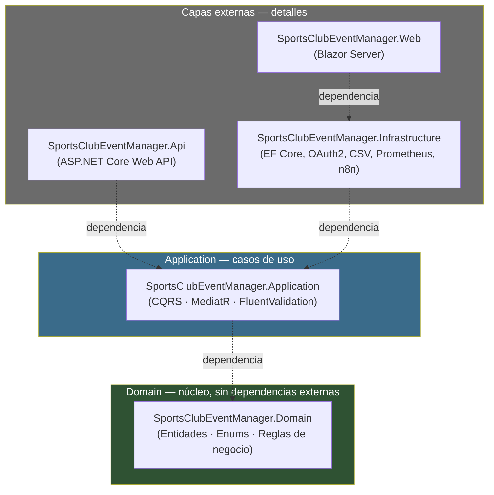

Ninguna clase de `Domain` referencia `Application`, `Infrastructure`, `Api` ni `Web`. `Application` no conoce Entity Framework Core ni ASP.NET Core: define **interfaces** (`IApplicationDbContext`, `IPasswordHasher`, `ITokenService`, `IWorkflowNotifier`...) que las capas externas implementan — es el **Principio de Inversión de Dependencias** (la "D" de SOLID) aplicado de forma sistemática en todo el proyecto.

Sobre esta base se apoyan varios patrones de diseño concretos, desarrollados en las secciones siguientes:

| Patrón | Dónde |
|---|---|
| CQRS (Command Query Responsibility Segregation) | `Application` — comandos y consultas separados por caso de uso |
| Mediator | `Application` — MediatR desacopla los controladores de los handlers |
| Pipeline / Chain of Responsibility | Comportamientos de MediatR, middlewares de ASP.NET Core, `DelegatingHandler` de `HttpClient` |
| Inversión de dependencias sobre persistencia | `IApplicationDbContext` (Application) / `AppDbContext` (Infrastructure) |
| Repository implícito vía `DbSet<T>` | `AppDbContext` actúa como Unit of Work sobre EF Core |
| Options pattern | Configuración fuertemente tipada (`JwtSettingsOptions`, `GoogleAuthOptions`, `MetricsOptions`, `N8nOptions`, `ApiSettingsOptions`...) |
| Composition root | Un método `AddXxx(this IServiceCollection)` por capa, invocado desde cada `Program.cs` |
| Hosted Service / Background worker | `ActiveEventsGaugeUpdater`, `EventReminderBackgroundService` |
| Optimistic concurrency | `Event.RowVersion` (control de concurrencia en inscripciones) |

## 2. Vista de capas (Clean Architecture)

Vista de componentes, ampliando el diagrama de la sección `a.` del README con el detalle de las dependencias externas de cada capa:

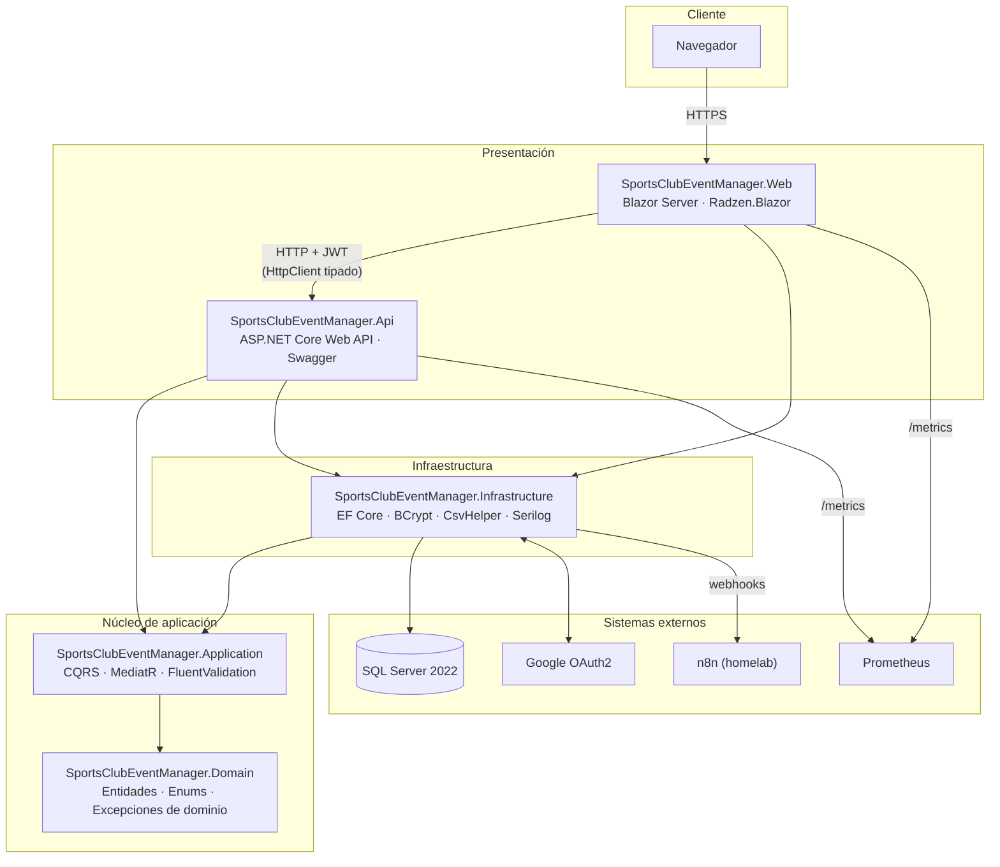

`SportsClubEventManager.Shared` (DTOs) no aparece en el diagrama por claridad: es referenciado transversalmente por `Api`, `Application` y `Web` para definir los contratos de datos que cruzan la frontera HTTP, sin acoplar `Web` a los tipos internos de `Application`/`Domain`.

> Este diagrama muestra las **capas de código** dentro de cada proceso. Para la vista C4 Container equivalente (unidades de despliegue reales — `Api`, `Web`, `SQL Server`, y los sistemas externos `Google`/`n8n`/`Prometheus`/`Grafana`, sin exponer las capas internas), ver [`docs/technical/diagrams/c4-container.md`](../technical/diagrams/c4-container.md).

## 3. Grafo de referencias entre proyectos

Dependencias reales declaradas en cada `.csproj` (`<ProjectReference>`), que materializan la regla de dependencia de la sección 1:

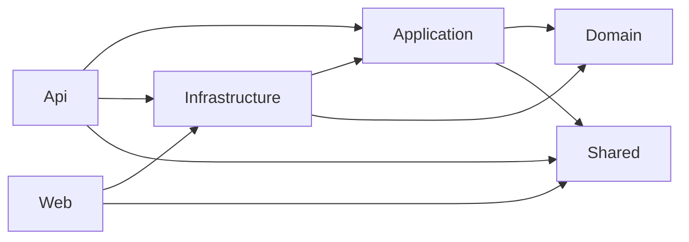

`Domain` no tiene ninguna flecha saliente: es el único proyecto sin `ProjectReference` a ningún otro, confirmando que es el núcleo de la arquitectura. `Web` no referencia `Application` directamente — solo consume la API vía HTTP (ver [sección 11](#11-comunicación-web--api-cadena-de-delegatinghandlers)), aunque comparte proceso con `Infrastructure` para health checks y logging.

## 4. Estructura de carpetas

```
/src
  /SportsClubEventManager.Domain
    /Common            → BaseEntity (Id, CreatedAt, UpdatedAt)
    /Entities           → Event, Registration, User, AuditLog, EventReminderNotification
    /Enums              → RegistrationStatus, Role, Gender, AuditAction
    /Exceptions         → DomainException, EntityNotFoundException, CapacityExceededException, DuplicateRegistrationException
  /SportsClubEventManager.Application
    /Common
      /Behaviors        → LoggingBehavior, ValidationBehavior (pipeline de MediatR)
      /Interfaces        → IApplicationDbContext, IPasswordHasher, ITokenService, IWorkflowNotifier, IApplicationMetrics...
      /Exceptions, /Models, /Validators, /Constants
    /Events             → Commands (CreateEvent, UpdateEvent, DeleteEvent, RegisterForEvent, CancelRegistration) + Queries (GetEvents, GetEventById, GetEventsAdmin)
    /Registrations      → Commands (CreateAdminRegistration, CancelRegistrationById) + Queries (GetUserRegistrations, GetRegistrationsAdmin)
    /Users              → Commands (UpdateProfile, ChangePassword, UpdateUserAsAdmin, UpdateUserRole, UpdateUserStatus, DeleteUser) + Queries (GetAllUsers, GetUserById, GetUserProfile)
    /Import             → Commands (ParseCsvFile, BulkCreateEvents)
    /Authentication     → Commands (Login, Logout, RefreshToken)
    /Authorization       → Policies
  /SportsClubEventManager.Infrastructure
    /Persistence         → AppDbContext, /Configurations (Fluent API de EF Core)
    /Migrations          → historial de migraciones EF Core
    /Authentication       → OAuth2, JWT, BCrypt
    /Import               → parser CSV
    /Metrics              → ActiveEventsGaugeUpdater (prometheus-net)
    /Notifications        → EventReminderBackgroundService, cliente HTTP de n8n
    /Logging              → configuración de Serilog
    /Services             → AuditService
    /Configuration         → Options fuertemente tipadas + carga de secretos
  /SportsClubEventManager.Shared
    /DTOs                 → contratos de datos entre Api y Web
  /SportsClubEventManager.Api
    /Controllers           → EventsController, RegistrationsController, UsersController, AuthenticationController, AdminEventsController, AdminRegistrationsController, AdminImportController
    /Middleware             → ExceptionHandlingMiddleware, CorrelationIdMiddleware, RequestUserLogContextMiddleware, UnauthorizedAccessLoggingMiddleware
    /Configuration           → registro de servicios de la Api
    /HealthChecks
  /SportsClubEventManager.Web
    /Components
      /Pages, /Admin, /Events, /Authentication, /Layout, /Shared
    /Services               → EventService, RegistrationService, UserManagementService... + DelegatingHandlers (AuthTokenHandler, CorrelationIdHandler, ApiCallLoggingHandler)
    /Configuration
/tests                       → un proyecto de test por capa (ver docs/development/overview.md)
```

Organización interna de `Application` **por feature** (vertical slices), no por tipo técnico — cada carpeta de caso de uso agrupa el comando/query junto a su handler y su validador:

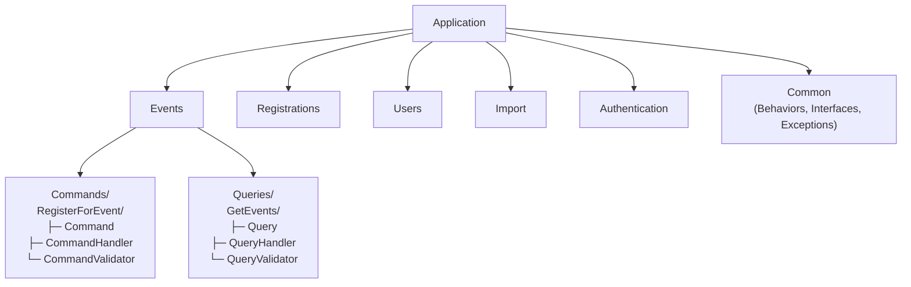

Esta organización (**vertical slice architecture** dentro de la capa Application) favorece la cohesión: todo lo necesario para entender o modificar un caso de uso concreto vive en una sola carpeta, en vez de repartirse entre capas técnicas horizontales (`Controllers/`, `Services/`, `Repositories/`...).

## 5. CQRS: comandos y consultas

**CQRS** separa las operaciones que modifican estado (**Commands**) de las que solo leen datos (**Queries**), cada una con su propio modelo de entrada/salida. En este proyecto ambas viajan por el mismo `IMediator`, pero como tipos (`IRequest<TResponse>`) e intención completamente distintos:

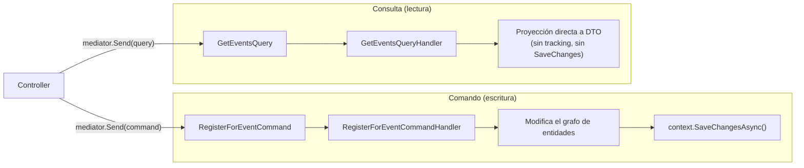

Inventario de casos de uso existentes, agrupados por *feature*:

| Feature | Comandos (escritura) | Consultas (lectura) |
|---|---|---|
| Events | CreateEvent, UpdateEvent, DeleteEvent, RegisterForEvent, CancelRegistration | GetEvents, GetEventById, GetEventsAdmin |
| Registrations | CreateAdminRegistration, CancelRegistrationById | GetUserRegistrations, GetRegistrationsAdmin |
| Users | UpdateProfile, ChangePassword, UpdateUserAsAdmin, UpdateUserRole, UpdateUserStatus, DeleteUser | GetAllUsers, GetUserById, GetUserProfile |
| Import | ParseCsvFile, BulkCreateEvents | — |
| Authentication | Login, Logout, RefreshToken | — |

Cada comando/query es un `record` inmutable que implementa `IRequest<TResponse>`; cada handler implementa `IRequestHandler<TRequest, TResponse>` y es la **única** clase que conoce cómo resolver ese caso de uso concreto (principio de responsabilidad única aplicado a nivel de caso de uso, no de clase técnica).

## 6. Mediator y pipeline de comportamientos (MediatR)

Los controladores de la Api no invocan handlers directamente: publican la petición a través de `IMediator` (**patrón Mediator**), que la enruta al handler correspondiente atravesando antes una cadena de **comportamientos transversales** (**patrón Pipeline / Chain of Responsibility**), registrados en `Application/DependencyInjection.cs`:

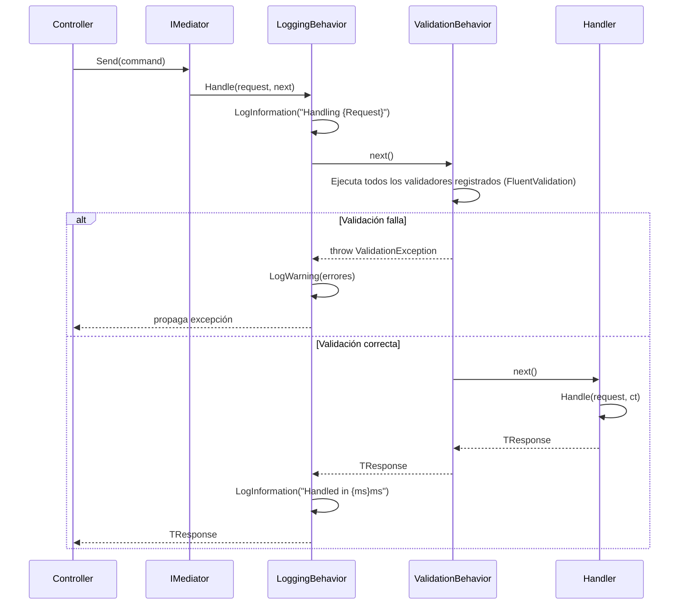

`LoggingBehavior` se registra **antes** que `ValidationBehavior` para ser la capa más externa del pipeline: así también queda registrado cuándo y por qué falla una validación, no solo los fallos del propio handler. Ningún comportamiento atrapa la excepción de forma silenciosa — todas se propagan hasta el [middleware de manejo de errores](#10-manejo-centralizado-de-errores) de la Api.

## 7. Modelo de dominio

Entidades del dominio, todas heredando de `BaseEntity` (identidad + auditoría de fechas), sin ninguna dependencia de EF Core ni de ningún framework:

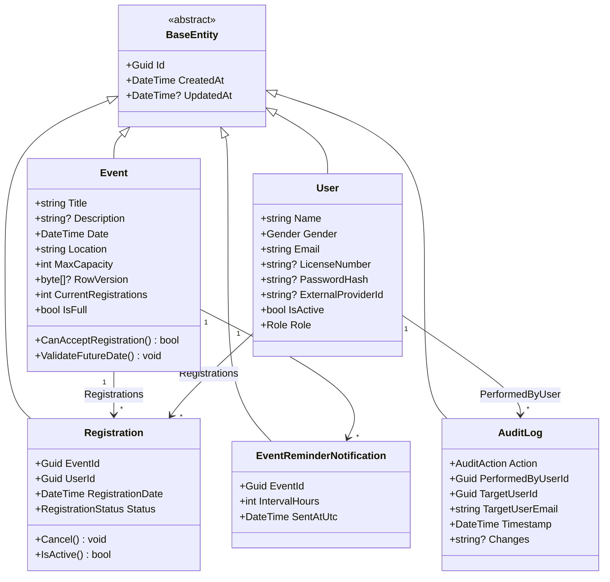

El modelo aplica **encapsulación real** (no son simples *anemic models*): `Event.MaxCapacity` valida en su propio setter que sea mayor que cero (`ValidateCapacity`), lanzando `DomainException` si no lo es; `User.Email` valida su formato en el setter con una expresión regular compilada; `Event.IsFull`/`CanAcceptRegistration()` calculan invariantes de negocio (aforo) a partir de sus propias colecciones, en vez de delegar esa lógica a la capa de aplicación. `Event.RowVersion` habilita **concurrencia optimista** de EF Core para evitar condiciones de carrera cuando dos socios se inscriben simultáneamente en la última plaza disponible.

> Este `classDiagram` muestra el **modelo de dominio rico** (comportamiento, invariantes). Para el **esquema relacional** (columnas, tipos, claves foráneas y cardinalidad, verificado contra las 5 `IEntityTypeConfiguration<T>` reales), ver [`docs/technical/diagrams/er-diagram.md`](../technical/diagrams/er-diagram.md).

## 8. Persistencia: inversión de dependencias sobre EF Core

`Application` no conoce Entity Framework Core: define la interfaz `IApplicationDbContext` con únicamente lo que los casos de uso necesitan (los `DbSet<T>` y `SaveChangesAsync`). `Infrastructure.AppDbContext` es la única clase que implementa esa interfaz y la única que sabe que existe SQL Server detrás.

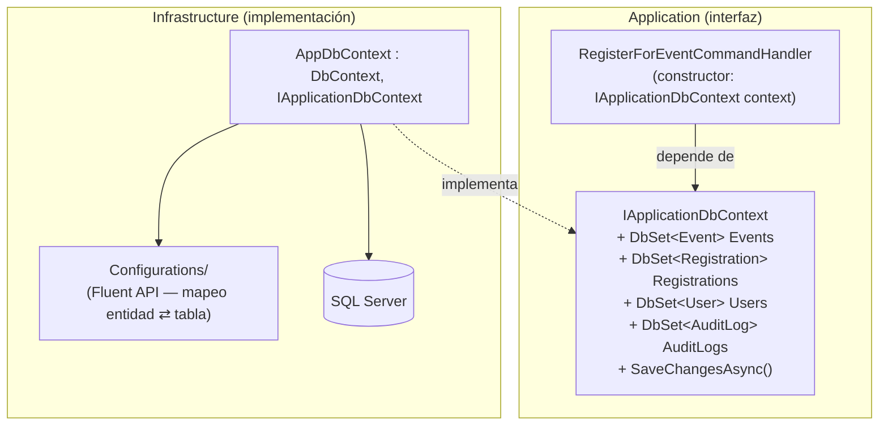

`AppDbContext` actúa de facto como un **Unit of Work**: agrupa todos los cambios pendientes en el `ChangeTracker` de EF Core y los confirma de forma atómica en una única llamada a `SaveChangesAsync`, sin que los handlers necesiten coordinar transacciones manualmente. No existe una capa `Repository` explícita por entidad — se ha optado deliberadamente por exponer `DbSet<T>` a través de la interfaz (patrón habitual en plantillas de Clean Architecture como la de Jason Taylor), evitando una capa de indirección adicional que aquí no aportaría valor: los `DbSet<T>` ya son en sí mismos una implementación del patrón Repository sobre EF Core, y el mapeo objeto-relacional (columnas, claves, índices únicos) se mantiene separado en `Persistence/Configurations/` mediante `IEntityTypeConfiguration<T>`, no en las entidades de dominio.

## 9. Flujo end-to-end: inscribirse a un evento

Ejemplo completo, de extremo a extremo, del caso de uso `RegisterForEvent` — desde el clic del socio en el navegador hasta la confirmación de negocio, atravesando todas las capas y patrones descritos arriba:

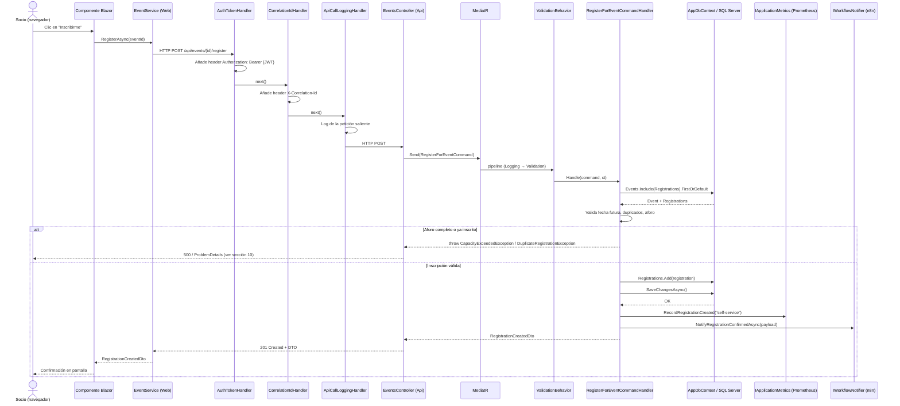

Este flujo ilustra por qué las métricas y las notificaciones se disparan **después** de `SaveChangesAsync` y no antes: si la transacción falla (por ejemplo, un conflicto de concurrencia sobre `RowVersion`), ni el contador Prometheus ni el webhook de n8n deben contabilizar una inscripción que nunca llegó a persistirse.

## 10. Manejo centralizado de errores

Ningún controlador de la Api contiene bloques `try/catch`: todas las excepciones (de validación, de negocio o inesperadas) atraviesan sin capturar el pipeline de MediatR y llegan hasta `ExceptionHandlingMiddleware`, que las traduce a una respuesta `ProblemDetails` (RFC 7807), centralizando en un único punto la política de errores de toda la Api.

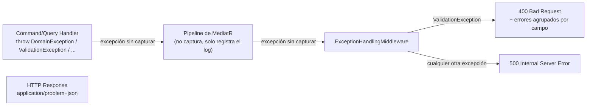

Este es el mismo patrón (**Chain of Responsibility** vía middleware de ASP.NET Core) que ASP.NET Core aplica de forma nativa a toda la *request pipeline*: cada middleware decide si maneja la petición/excepción o la delega en el siguiente. `CorrelationIdMiddleware`, `RequestUserLogContextMiddleware` y `UnauthorizedAccessLoggingMiddleware` siguen la misma filosofía para enriquecer cada log con contexto (ID de correlación, usuario autenticado) sin acoplar esa responsabilidad a los controladores.

## 11. Comunicación Web → API: cadena de DelegatingHandlers

`SportsClubEventManager.Web` no accede a la base de datos ni a `Application` directamente: consume `SportsClubEventManager.Api` como cualquier cliente HTTP externo, a través de servicios tipados (`EventService`, `RegistrationService`, `UserManagementService`...) registrados con `IHttpClientFactory`. Cada `HttpClient` tipado encadena tres `DelegatingHandler` (**patrón Decorator / Chain of Responsibility** aplicado sobre `HttpClient`), en el mismo orden para todos los servicios:

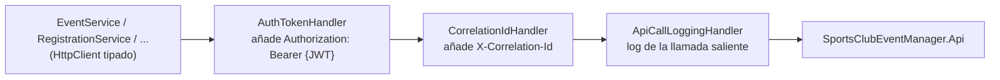

Cada servicio de `Web/Services` implementa una interfaz propia (`IEventService`, `IRegistrationService`...), lo que permite sustituirlos por dobles de prueba (`WireMock.Net`) en los tests de componentes Blazor con **bUnit**, sin necesidad de levantar la Api real.

## 12. Tareas en segundo plano

Dos `BackgroundService` (patrón **Hosted Service** de .NET) ejecutan trabajo periódico fuera del ciclo petición/respuesta HTTP, cada una con su propio `IServiceScope` por iteración para resolver dependencias con ciclo de vida `Scoped` (como `IApplicationDbContext`) de forma segura desde un servicio `Singleton`:

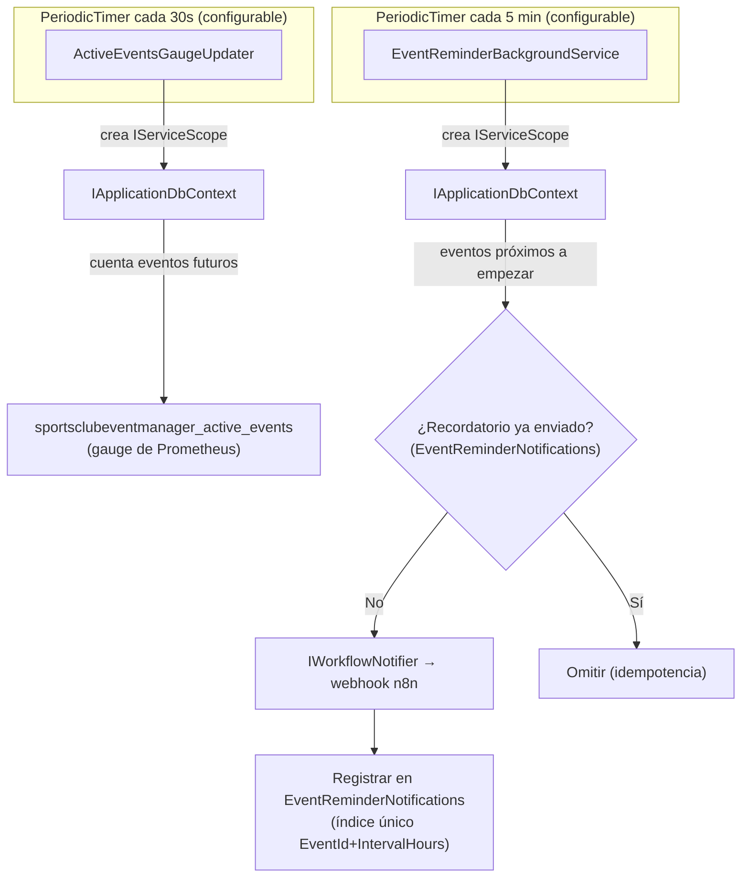

El índice único `EventId`+`IntervalHours` sobre `EventReminderNotification` es lo que garantiza la idempotencia del recordatorio incluso ante un reinicio del contenedor a mitad de un ciclo de sondeo.

## 13. Composition root e inyección de dependencias

Cada capa expone su propio método de extensión `AddXxx(this IServiceCollection)` (`Application.DependencyInjection.AddApplication()`, `Infrastructure.DependencyInjection.AddInfrastructure()`, `Api.Configuration.ApiConfigurationExtensions`, `Web.Configuration.WebConfigurationExtensions`), responsable únicamente de registrar los servicios que esa capa aporta. El único punto donde todas se ensamblan es el **Composition Root**: el `Program.cs` de cada host.

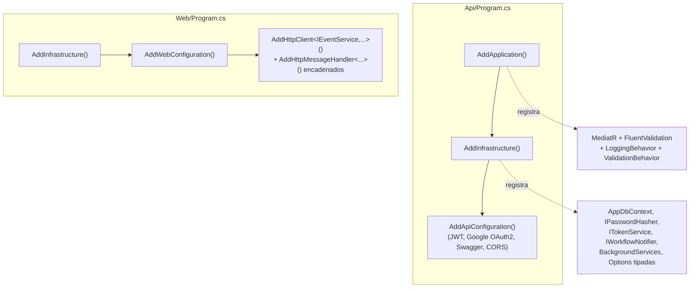

Ninguna capa interna (`Domain`, `Application`) conoce el contenedor de DI de ASP.NET Core más allá de estos métodos de extensión — es la única concesión pragmática a un framework concreto, y queda confinada a un único fichero por capa.

## 14. Resumen de patrones de diseño aplicados

| Patrón | Categoría (GoF / arquitectura) | Dónde se aplica | Por qué |
|---|---|---|---|
| Clean Architecture / regla de dependencia | Arquitectónico | Todo el `src/` | Aísla el dominio de negocio de los detalles técnicos (framework, BD, proveedores externos) |
| CQRS | Arquitectónico | `Application` (Commands/Queries por feature) | Separa intención de lectura y escritura; cada caso de uso es autocontenido |
| Mediator | Comportamiento | MediatR, `Api` → `Application` | Desacopla los controladores de los handlers concretos |
| Pipeline / Chain of Responsibility | Comportamiento | `LoggingBehavior`/`ValidationBehavior` (MediatR), middlewares (`Api`), `DelegatingHandler` (`Web`) | Aplica comportamiento transversal (logging, validación, autenticación) sin ensuciar cada caso de uso |
| Inversión de dependencias | Estructural (SOLID) | `IApplicationDbContext`, `IPasswordHasher`, `ITokenService`, `IWorkflowNotifier`, `IApplicationMetrics` | `Application` define contratos; `Infrastructure` los implementa |
| Repository / Unit of Work (implícito) | Estructural | `AppDbContext` vía `DbSet<T>` + `SaveChangesAsync` | Persistencia agrupada en una única transacción por caso de uso |
| Options pattern | Estructural | `JwtSettingsOptions`, `GoogleAuthOptions`, `MetricsOptions`, `N8nOptions`, `ApiSettingsOptions` | Configuración fuertemente tipada y validada al arranque (ver [`docs/development/installation.md`](../development/installation.md)) |
| Composition root | Estructural | Un `AddXxx()` por capa, invocado desde cada `Program.cs` | Un único punto de ensamblado por host, capas internas ignoran el contenedor DI |
| Hosted Service | Comportamiento | `ActiveEventsGaugeUpdater`, `EventReminderBackgroundService` | Trabajo periódico fuera del ciclo petición/respuesta |
| Optimistic concurrency | Estructural (persistencia) | `Event.RowVersion` | Evita condiciones de carrera al inscribirse en la última plaza disponible |
| Vertical slice | Organizativo | Carpetas por feature dentro de `Application` (`Events/`, `Users/`...) | Alta cohesión: todo lo relativo a un caso de uso vive junto |
