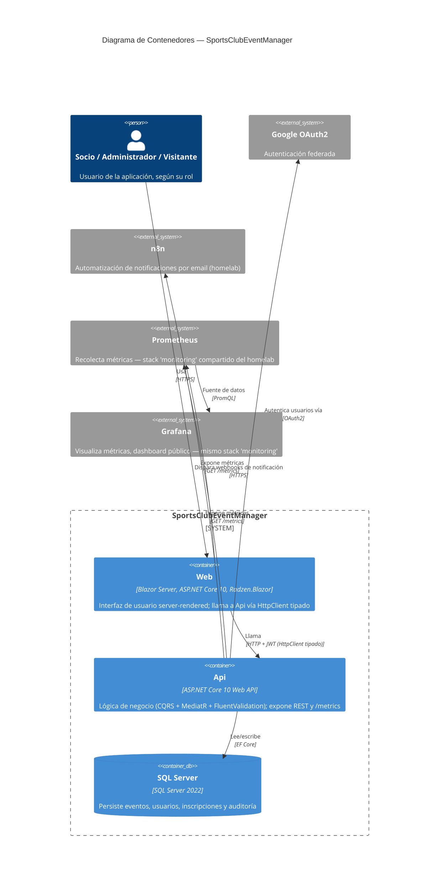

# C4 — Diagrama de Contenedores

Parte del catálogo de diagramas de la issue [#51](https://github.com/AlejBlasco/SportsClubEventManager/issues/51). Ver el índice completo en [`README.md`](README.md).

Nivel 2 del modelo [C4](https://c4model.com/): zoom dentro de la caja `SportsClubEventManager` del [Diagrama de Contexto](c4-context.md), mostrando las **unidades realmente desplegables** (contenedores en sentido C4 — procesos/servicios, no solo contenedores Docker) y los sistemas externos con los que cada una habla directamente.

> Esta es la vista C4 "oficial" que pide la issue #51. `docs/architecture/architecture.md` §2 tiene un diagrama relacionado pero con un propósito distinto: muestra las **capas de código** de Clean Architecture (Application, Domain, Infrastructure) dentro de `Api`/`Web`, útil para entender la organización interna del código — no la unidad de despliegue. Aquí, esas tres capas se consideran un único contenedor cada una (`Api`, `Web`), tal y como exige la notación C4 Container.

## Notas

- **`Web` nunca llama directamente a la base de datos** — todo pasa por `Api` vía HTTP, ver `docs/architecture/architecture.md` §2 y §11 (cadena de `DelegatingHandlers`).
- **`Api`/`Web` no tienen ningún contenedor Prometheus/Grafana propio en producción** — ambos son del stack `monitoring` compartido del homelab, no de este proyecto. `Api`/`Web` solo exponen `/metrics`; quién lo scrapea y visualiza es responsabilidad de infraestructura externa. Detalle completo en [`docs/observability/observability.md`](../../observability/observability.md).
- `SportsClubEventManager.Shared` (DTOs) no aparece como contenedor aparte — es una librería compartida entre `Api` y `Web`, no un proceso propio; a nivel C4 Container solo cuentan las unidades desplegables independientemente.
