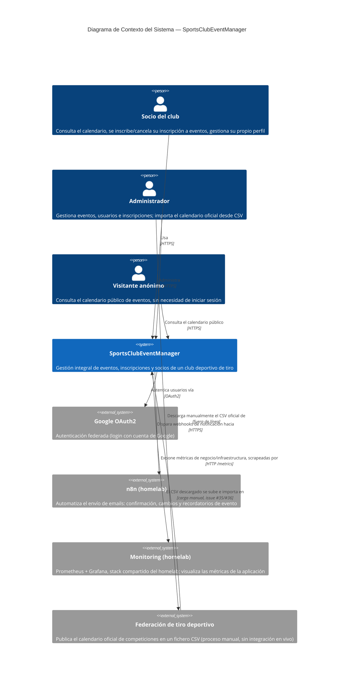

# C4 — Diagrama de Contexto

Parte del catálogo de diagramas de la issue [#51](https://github.com/AlejBlasco/SportsClubEventManager/issues/51). Ver el índice completo en [`README.md`](README.md).

Nivel más alto del modelo [C4](https://c4model.com/): **SportsClubEventManager** como una única caja, sus actores humanos y los sistemas externos con los que se integra. No entra en el detalle de `Api`/`Web`/base de datos — eso es el [Diagrama de Contenedores](c4-container.md).

## Notas

- **La Federación no es una integración en vivo**: no hay ninguna API ni webhook con la federación — es un fichero CSV que el administrador descarga manualmente de la web de la federación y sube a través de [Importación masiva de eventos](../../operations/importacion-masiva-eventos.md). Se representa aquí como sistema externo porque es la fuente de datos real que origina todo el proyecto (ver la introducción del [README](../../../README.md)), aunque la interacción sea manual y offline.
- **`monitoring` (Prometheus + Grafana) no es propiedad de este proyecto**: es un stack compartido preexistente del homelab, reutilizado en vez de duplicado — ver [`docs/observability/observability.md`](../../observability/observability.md) para el porqué y el detalle completo.
- Los tres tipos de `Person` reflejan los tres niveles de acceso reales de la aplicación: anónimo (solo calendario público), `User` (autoservicio) y `Administrator` (gestión completa) — ver [`docs/technical/issue-28-autorizacion-basada-en-roles.md`](../../technical/issue-28-autorizacion-basada-en-roles.md).
