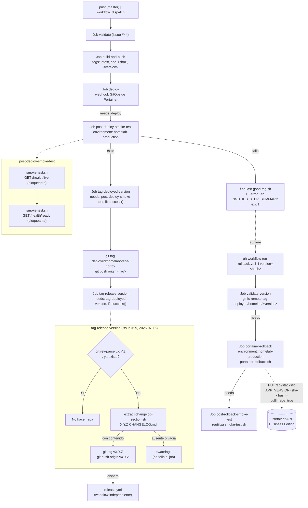

# CI/CD — Diagrama de flujo del pipeline

Parte del catálogo de diagramas de la issue [#51](https://github.com/AlejBlasco/SportsClubEventManager/issues/51). Ver el índice completo en [`README.md`](README.md).

**Movido** desde `docs/technical/issue-45-despliegue-automatizado-al-homelab.md` (única fuente de verdad; ese documento ahora enlaza aquí en vez de tener una copia propia, para no arriesgar que las dos versiones diverjan). Cubre el pipeline completo: `push`/`workflow_dispatch` → construcción/validación → despliegue → verificación post-despliegue → *rollback* automático si falla.

## Puntos clave

- **`deploy` no verificaba nada antes de esta issue** (#45): llamaba al webhook de Portainer y el pipeline terminaba ahí. `post-deploy-smoke-test` y `tag-deployed-version` son los dos jobs que añaden verificación real y trazabilidad de qué versión está desplegada en cada momento.
- **El tag `deployed/homelab/<sha-corto>` es la fuente de verdad** de qué se desplegó con éxito por última vez — `rollback.yml` lo usa para validar que la versión a la que se quiere volver existió de verdad.
- **`tag-release-version` (issue #99, 2026-07-15) cierra el último paso manual del release**: si `Directory.Build.props` trae una versión sin tag `vX.Y.Z` todavía y `CHANGELOG.md` ya la documenta (lo normal, si se siguió el runbook de release), crea y empuja ese tag automáticamente — disparando `release.yml` sin intervención humana. Si `CHANGELOG.md` no está listo, solo deja un `::warning::` y sigue sin crear el tag; nunca hace fallar el job, porque el despliegue al homelab (jobs anteriores) ya tuvo éxito en ese punto.
- **El rollback no reconstruye ninguna imagen**: `portainer-rollback.sh` solo actualiza `APP_VERSION` en el stack de Portainer vía su API (`pullImage=true` para asegurar que se tira de la imagen ya publicada en GHCR con ese tag), y vuelve a correr el mismo smoke test.
- Procedimiento operativo completo (comandos exactos, troubleshooting) en [`docs/deployment/homelab-deployment.md`](../../deployment/homelab-deployment.md), única fuente de verdad (fusionado con el antiguo `infrastructure/deploy/DEPLOYMENT_RUNBOOK.md` el 2026-07-15).
