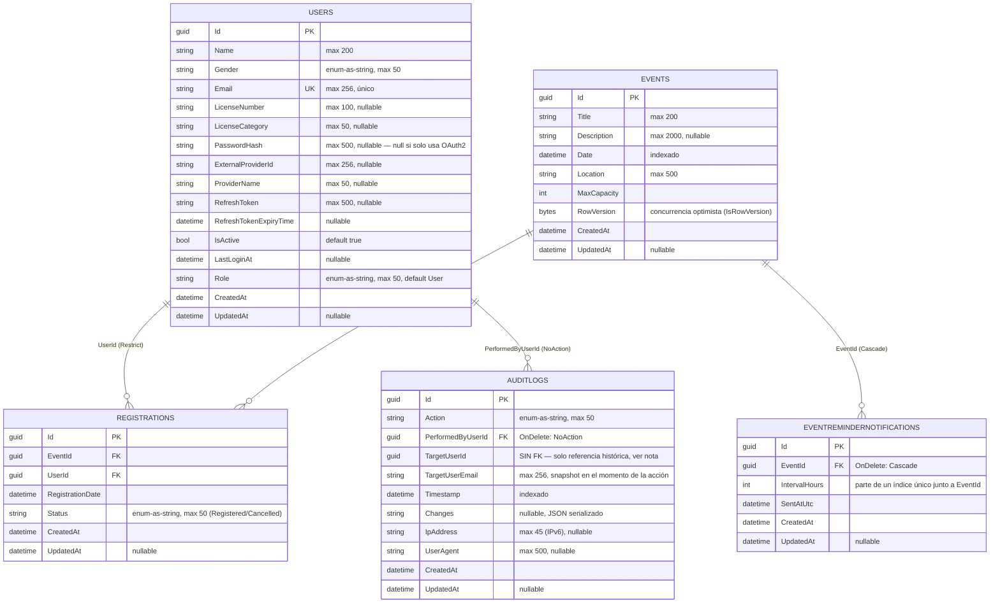

# Diagrama Entidad-Relación (ER)

Parte del catálogo de diagramas de la issue [#51](https://github.com/AlejBlasco/SportsClubEventManager/issues/51). Ver el índice completo en [`README.md`](README.md).

Modelo relacional final, **verificado directamente contra las 5 clases `IEntityTypeConfiguration<T>` de `src/SportsClubEventManager.Infrastructure/Persistence/Configurations/`** (no contra un diseño previo) el 2026-07-14. Complementa al `classDiagram` de dominio de `docs/architecture/architecture.md` §7: aquél muestra el modelo rico de dominio (comportamiento, invariantes); este muestra el esquema relacional real (columnas, claves, cardinalidad).

## Notas — detalles que un ER "genérico" no capturaría

- **`AuditLogs.TargetUserId` no tiene restricción de clave foránea**, a propósito: `AuditLogConfiguration` solo declara la relación con `PerformedByUserId` (`OnDelete: NoAction`, para no perder el rastro de auditoría si se borra al administrador). `TargetUserId` es un `Guid` suelto — el usuario objetivo de la acción puede haber sido eliminado después (`DeleteUserCommand`), y por eso `TargetUserEmail` existe como *snapshot* de texto en el momento de la acción, no como algo recuperable vía `JOIN`.
- **Cardinalidad `Restrict` vs `Cascade` no es uniforme, y es intencional**: borrar un `Event` cancela en cascada sus `Registrations` y `EventReminderNotifications` (`OnDelete: Cascade` en ambas), pero borrar un `User` con inscripciones **está bloqueado a nivel de base de datos** (`OnDelete: Restrict` en `Registrations.UserId`) — coherente con que `DeleteUserCommandHandler` exige cancelar las inscripciones del usuario antes de poder borrarlo.
- **Tres índices únicos no evidentes en un ER básico**:
  - `Users.Email` — único global.
  - `(Users.ProviderName, Users.ExternalProviderId)` — único, pero con filtro (`HasFilter`) que solo aplica a filas donde ambos campos no son `NULL` — permite múltiples usuarios de login local (`ProviderName`/`ExternalProviderId` ambos `NULL`) sin violar la unicidad.
  - `(EventReminderNotifications.EventId, IntervalHours)` — único; barrera de base de datos contra reminders duplicados, redundante a propósito con la comprobación en `EventReminderBackgroundService`.
- **`Event.RowVersion`** es una columna de concurrencia optimista real de EF Core (`IsRowVersion()`), no un campo de negocio — se usa para detectar ediciones simultáneas de un evento por dos administradores (ver `UpdateEventCommandHandler`).
- `Event.CurrentRegistrations` e `Event.IsFull` (vistas en el `classDiagram` de dominio) **no son columnas** — son propiedades calculadas en memoria (`builder.Ignore(...)` en `EventConfiguration`), a partir de la colección `Registrations` ya cargada.
