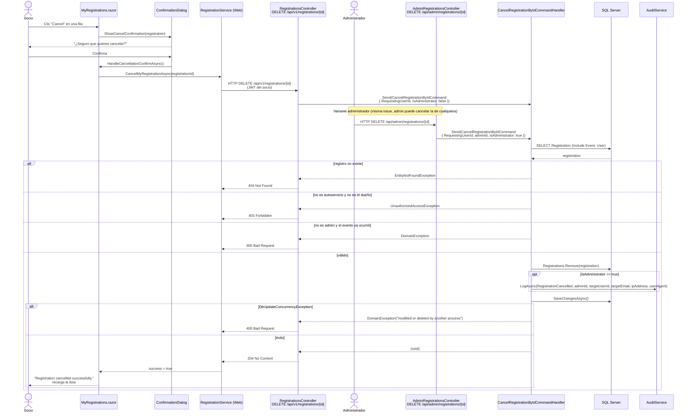

# Sequence Diagram — Cancelación de inscripción

Parte del catálogo de diagramas de la issue [#51](https://github.com/AlejBlasco/SportsClubEventManager/issues/51). Ver el índice completo en [`README.md`](README.md).

Complementa al flowchart (lógica de decisión) de [`docs/operations/inscripcion-eventos.md`](../../operations/inscripcion-eventos.md) con la interacción real componente-a-componente en el tiempo. Cubre las **dos** variantes que existen en el código — autoservicio y administrador — porque ambas pasan por el mismo `CancelRegistrationByIdCommandHandler`, solo cambia el flag `IsAdministrator`.

## Notas

- **Sin auditoría en autoservicio**: `AuditService.LogAsync` solo se invoca cuando `IsAdministrator == true` — un socio cancelando su propia inscripción no genera entrada de auditoría (ver [`administracion-inscripciones.md`](../../operations/administracion-inscripciones.md)).
- **Eliminación física, no *soft-delete***: `Registrations.Remove(registration)` borra la fila; no hay una columna `IsDeleted`. La decisión de diseño y su justificación están en `docs/technical/US-32-administracion-gestion-inscripciones.md`, tabla "Decisiones de Diseño".
- **Un administrador puede cancelar inscripciones de eventos ya ocurridos**; un socio no — es la única rama del `alt` que depende de `IsAdministrator`, aparte del registro de auditoría.
- **Concurrencia**: aunque `Registration` no tiene `RowVersion` propio, `SaveChangesAsync` puede lanzar `DbUpdateConcurrencyException` si la fila fue borrada por otro proceso entre el `SELECT` y el `DELETE` (por ejemplo, si el evento se elimina — cascada — justo mientras el socio cancela su inscripción).
