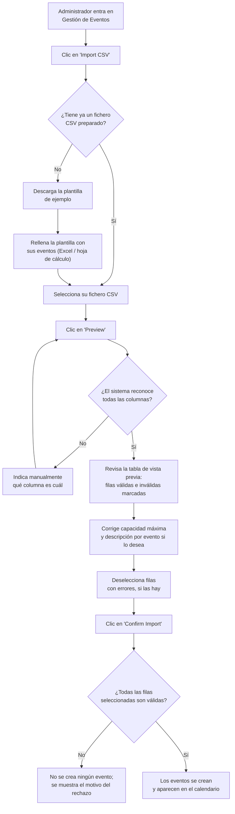

# Importación de Eventos desde CSV — Documentación Funcional

**Versión:** 2026-07-08
**Aplicable a:** Sports Club Event Manager (Administración)
**Issue relacionada:** #35

---

## ¿Qué es esta funcionalidad?

Hasta ahora, un administrador tenía que crear cada evento del calendario deportivo uno por uno,
rellenando un formulario. La **Importación de Eventos desde CSV** permite en su lugar subir un
único fichero con muchos eventos a la vez (por ejemplo, todo el calendario de tiradas de un mes o
de una temporada) y darlos de alta todos juntos, en lugar de repetir el proceso manual decenas de
veces.

El administrador sube un fichero en formato CSV (una hoja de cálculo simple, exportable desde
Excel u hojas de Google), el sistema le muestra una **vista previa** de cómo quedarían esos eventos
antes de guardarlos, le avisa de qué filas tienen problemas, y solo cuando el administrador da su
visto bueno final se crean los eventos de verdad.

**Quién lo usa:** Administradores del sistema (usuarios con rol "Administrador").

---

## ¿Por qué importa?

- **Ahorra tiempo:** dar de alta 30 o 50 eventos a mano puede llevar horas; con la importación,
  el mismo trabajo se reduce a preparar un fichero y unos pocos clics.
- **Reduce errores de transcripción:** al provenir de un fichero ya preparado (por ejemplo, el
  calendario oficial del club), se evita volver a escribir manualmente cada dato en el formulario.
- **Da control antes de confirmar:** nada se guarda hasta que el administrador revisa la vista
  previa, corrige lo necesario y confirma explícitamente. No hay sorpresas de "se creó algo mal
  sin darme cuenta".
- **Todo o nada:** si al confirmar sigue habiendo alguna fila con problemas, no se crea ningún
  evento — así se evita quedarse con una importación "a medias" e inconsistente.
- **Queda registrado:** cada importación queda anotada en el registro de auditoría del sistema,
  igual que cualquier otra acción administrativa.

---

## Cómo funciona (perspectiva del usuario)

El proceso tiene cuatro grandes pasos: preparar el fichero, previsualizar, revisar/ajustar, y
confirmar.

### Paso 1: Preparar el fichero

Desde la pantalla de **Gestión de Eventos**, el administrador pulsa el botón **"Import CSV"**, que
lo lleva a una nueva pantalla dedicada a la importación.

Si no tiene todavía un fichero preparado, puede pulsar **"Download Template"** para descargar un
CSV de ejemplo con las columnas correctas ya puestas (`DÍA`, `MODAL.`, `NOMBRE TIRADA`, `HORA`,
`CAMPO`, `LUGAR`, `CAT`) y una fila de muestra, que puede abrir y editar en Excel o cualquier hoja
de cálculo.

### Paso 2: Subir y previsualizar

El administrador selecciona su fichero CSV y pulsa **"Preview"**. El sistema no guarda nada
todavía: solo lee el fichero y muestra, en una tabla, cómo quedaría cada evento si se importase —
título, fecha y hora, ubicación y capacidad máxima — junto con los datos originales (modalidad,
campo y categoría, tal y como venían en el fichero) para poder comparar. La descripción del evento
no se rellena automáticamente: queda en blanco y es el administrador quien decide si escribir algo,
igual que al crear un evento manualmente.

Si alguna columna del fichero no coincide exactamente con lo esperado (por ejemplo, si el
administrador ha usado un nombre de columna ligeramente distinto), el sistema le deja indicar
manualmente "esta columna del fichero corresponde a esta columna esperada" y volver a generar la
vista previa.

Cada fila de la vista previa se marca como **válida** o **con errores**. Si hay errores, se
explica el motivo junto a la fila (por ejemplo: fecha con formato incorrecto, título vacío,
ubicación demasiado larga, capacidad no válida).

### Paso 3: Revisar y ajustar

En la propia tabla de vista previa, el administrador puede:

- **Editar la capacidad máxima** de cada evento, ya que el fichero de origen no trae ese dato (se
  aplica un valor por defecto configurable, que se puede cambiar fila por fila).
- **Escribir una descripción** para cada evento, si lo desea — el campo viene en blanco, ya que el
  fichero de origen no aporta un texto descriptivo, solo modalidad/campo/categoría.
- **Marcar o desmarcar** qué filas quiere incluir en la importación final. Las filas válidas
  vienen marcadas por defecto; las que tienen errores no.

### Paso 4: Confirmar

Al pulsar **"Confirm Import"**, el sistema vuelve a comprobar que todo lo seleccionado es correcto
y, solo si **todas** las filas marcadas son válidas, crea los eventos de una sola vez. Si alguna
fila seleccionada tuviera un problema en ese momento, **no se crea ningún evento** y se muestra el
detalle de qué falló, para que el administrador pueda corregirlo y reintentarlo.

Cuando la importación tiene éxito, los nuevos eventos aparecen de inmediato en la lista de
Gestión de Eventos y en el calendario público, disponibles para que los socios se inscriban.

---

## Qué esperar después de la importación

- Los eventos importados aparecen en la tabla de Gestión de Eventos igual que si se hubieran
  creado uno a uno.
- Aparecen también en el calendario público del club, disponibles para inscripción inmediata.
- Queda un único registro en el historial de auditoría indicando cuántos eventos se importaron y
  quién lo hizo.
- Si la importación fue rechazada (por tener filas inválidas en el momento de confirmar), no se
  crea ningún evento — el sistema no deja importaciones "a medias".

---

## Limitaciones

- **Solo se admite formato CSV.** No se pueden subir directamente ficheros Excel (`.xlsx`); si se
  tiene un Excel, hay que exportarlo/guardarlo primero como CSV.
- **No detecta duplicados.** Si el mismo evento (mismo título, fecha y ubicación) ya existe o
  aparece dos veces en el fichero, el sistema no avisa — se crearían eventos repetidos.
- **La capacidad máxima no viene en el fichero.** Como el fichero de origen no incluye ese dato,
  se aplica un valor por defecto que el administrador puede ajustar manualmente antes de
  confirmar, fila por fila.
- **Formato de fichero simple.** El sistema espera un fichero "plano", una fila por evento. No
  admite todavía formatos más complejos con secciones por mes o rangos de fechas dentro de una
  misma celda.
- **Modalidad, campo y categoría no se incluyen automáticamente en la descripción.** El sistema los
  muestra como columnas de referencia en la vista previa, pero no compone ningún texto a partir de
  ellos; si el administrador quiere que consten en la descripción del evento, tiene que escribirlos
  él mismo en ese campo.
- **Tamaño y número de filas limitados.** El fichero no puede superar cierto tamaño (por defecto
  5 MB) ni cierto número de filas (por defecto 5.000), para proteger el rendimiento del sistema.
  Si se supera, se avisa con un mensaje claro antes de procesar nada.
- **No hay notificación automática a los socios** cuando se importan eventos; los eventos
  simplemente aparecen disponibles en el calendario.

---

## Preguntas Frecuentes

**¿Se crea algo en la base de datos solo con hacer clic en "Preview"?**
No. La vista previa es solo una simulación: el sistema lee el fichero y muestra cómo quedarían los
eventos, pero no guarda nada hasta que se pulsa "Confirm Import".

**¿Qué pasa si mi fichero tiene una fila con un error?**
Esa fila aparece marcada como inválida en la vista previa, con una explicación del problema. Puedes
corregir el fichero original y volver a subirlo, o simplemente dejar esa fila sin seleccionar y
continuar con el resto.

**Si algunas filas están bien y otras mal, ¿se importan solo las buenas?**
Solo si tú, como administrador, dejas marcadas únicamente las filas válidas antes de confirmar. Si
confirmas con alguna fila inválida todavía seleccionada, no se importa nada — el sistema exige que
todo lo seleccionado sea correcto.

**¿Puedo deshacer una importación?**
No hay un botón de "deshacer" para la importación en conjunto; los eventos importados se gestionan
después igual que cualquier otro evento (se pueden editar o eliminar individualmente desde Gestión
de Eventos).

**¿Qué formato de fecha y hora debo usar en el fichero?**
La fecha debe indicarse como día/mes/año (por ejemplo `15/09/2026`) y la hora en formato de 24
horas (por ejemplo `10:00`). Si dejas la hora en blanco, el sistema aplica una hora por defecto
configurada por el equipo de administración.

**¿Qué pasa si mi fichero de Excel tiene los nombres de columna en otro orden o con leves
diferencias?**
El sistema intenta reconocer las columnas automáticamente. Si alguna no coincide exactamente,
te permite indicar manualmente a qué columna esperada corresponde cada columna de tu fichero antes
de generar la vista previa.

**¿Quién puede usar esta funcionalidad?**
Solo los usuarios con rol de Administrador. Si no ves el botón "Import CSV" en Gestión de Eventos,
tu cuenta no tiene permisos suficientes.

---

**Fin de Documentación Funcional — Issue #35 (Importación de Eventos CSV)**
