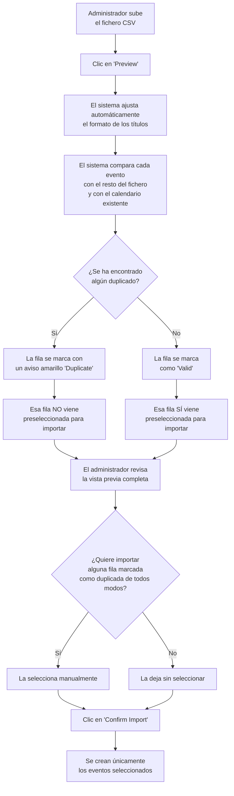

# Validación y Normalización de Eventos Importados desde CSV — Documentación Funcional

**Versión:** 2026-07-08
**Aplicable a:** Sports Club Event Manager (Administración)
**Issue relacionada:** #36
**Funcionalidad relacionada:** Importación de Eventos desde CSV (#35) —
`docs/functional/US-35-csv-event-import.md`

---

## ¿Qué es esta funcionalidad?

La importación de eventos desde un fichero CSV (implementada previamente) ya permitía a un
administrador dar de alta muchos eventos a la vez en lugar de crearlos uno por uno. Esta mejora
añade dos comprobaciones adicionales, automáticas, que se ejecutan en el momento de previsualizar
el fichero, **antes** de que se importe nada:

- **Detección automática de eventos duplicados**: el sistema avisa cuando dos filas del propio
  fichero describen el mismo evento, o cuando una fila coincide con un evento que ya existe en el
  calendario.
- **Formato automático del título**: los títulos de los eventos se ajustan automáticamente a un
  formato de capitalización consistente (por ejemplo, "tirada de primavera" pasa a mostrarse como
  "Tirada De Primavera").

Ninguna de las dos cosas requiere ninguna acción manual del administrador: ocurren solas al
generar la vista previa. El administrador solo necesita fijarse en los avisos que aparecen en
pantalla.

**Quién lo usa:** Administradores del sistema (usuarios con rol "Administrador"), los mismos que
ya usan la importación CSV.

---

## ¿Por qué importa?

- **Evita eventos repetidos por accidente.** Antes, si el mismo evento aparecía dos veces en el
  fichero (por ejemplo, por un error al copiar y pegar en la hoja de cálculo), o si ya se había
  importado antes, el sistema los creaba igualmente, duplicados, sin avisar. Ahora el
  administrador lo ve marcado antes de confirmar y puede decidir qué hacer.
- **Títulos más presentables y consistentes.** Si el fichero de origen trae títulos en minúsculas
  o con capitalización irregular (algo habitual al copiar de distintas fuentes), el sistema los
  deja con un aspecto uniforme sin que el administrador tenga que corregirlos manualmente fila por
  fila.
- **Sigue sin guardar nada hasta confirmar.** Estas comprobaciones se suman al mismo mecanismo de
  vista previa ya existente: nada se guarda en el calendario hasta que el administrador revisa y
  pulsa "Confirm Import".
- **Las filas duplicadas quedan visibles, no ocultas.** El sistema no elimina silenciosamente las
  filas duplicadas de la vista previa: las muestra igualmente, marcadas con claridad, para que el
  administrador pueda comprobar por qué se han detectado como tales antes de decidir.

---

## Cómo funciona (perspectiva del usuario)

El flujo general de importación (subir → previsualizar → revisar → confirmar) no cambia respecto
a lo que ya existía. Lo que cambia es lo que el administrador ve durante la revisión:

### El aviso de "Duplicate" en la vista previa

En la tabla de vista previa, cada fila muestra un indicador de estado. Hasta ahora existían dos:
**"Valid"** (en verde) y un aviso de error (en rojo, con el número de problemas encontrados).
Ahora existe un tercero:

- **"Duplicate"** (en amarillo): indica que esta fila coincide, por título y fecha/hora exactos,
  con otra fila del mismo fichero o con un evento que ya existe en el calendario. Al pasar el
  cursor sobre el aviso se puede ver el motivo exacto (por ejemplo, "coincide con la fila 3" o "ya
  existe un evento con este título y fecha").

Una fila marcada como "Duplicate" **no viene marcada por defecto** para importarse — a diferencia
de una fila "Valid", que sí viene premarcada. Esto es intencionado: el sistema asume que, salvo
que el administrador decida lo contrario, un posible duplicado no debería colarse en el
calendario sin revisión. Si tras comprobarlo el administrador decide que en realidad **no** es un
duplicado real (por ejemplo, dos tiradas distintas que casualmente comparten nombre y hora), puede
marcarla manualmente para incluirla igualmente en la importación.

### El formato automático de títulos

Cuando el fichero trae un título en minúsculas o con mayúsculas irregulares, el sistema lo
convierte automáticamente a un formato con la primera letra de cada palabra en mayúscula (por
ejemplo, `tirada de primavera` se muestra como `Tirada De Primavera`). Este ajuste se aplica solo
a la vista previa y a lo que finalmente se guarda — no requiere ninguna acción del administrador.

Este comportamiento se puede desactivar a nivel de configuración del sistema si en la práctica
produce resultados poco naturales con algunos títulos (por ejemplo, títulos con apóstrofos o
numeración especial). Esa activación/desactivación es una decisión de configuración del equipo
técnico, no algo que el administrador ajuste desde la pantalla de importación.

---

## Qué esperar después de la importación

- Los títulos de los eventos importados aparecen ya con el formato de capitalización ajustado.
- Ningún evento marcado como "Duplicate" se importa, salvo que el administrador lo haya
  seleccionado manualmente antes de confirmar.
- El resto del comportamiento (vista previa sin guardar nada, importación todo-o-nada, registro en
  auditoría) sigue siendo exactamente el mismo que en la importación CSV original.

---

## Qué se considera "duplicado"

Para que el administrador sepa qué esperar, dos eventos se consideran el mismo evento cuando
coinciden exactamente en:

- El **título** (sin distinguir mayúsculas de minúsculas, y ya con el formato normalizado
  aplicado).
- La **fecha y la hora exactas** del evento.

Cosas a tener en cuenta:

- **La ubicación no se tiene en cuenta.** Dos eventos con el mismo título y la misma fecha/hora
  pero en instalaciones distintas se marcarán igualmente como duplicados entre sí.
- **Una diferencia de hora, por pequeña que sea, evita que se detecten como duplicados.** Dos
  tiradas con el mismo nombre el mismo día pero a horas distintas (por ejemplo, mañana y tarde) se
  consideran eventos legítimamente diferentes y no se marcan.
- **Si varias filas del fichero son idénticas entre sí**, se conserva la primera como válida y el
  resto se marcan como duplicadas de esa primera fila.

---

## Limitaciones

- El sistema no "adivina" si dos títulos parecidos pero no idénticos son el mismo evento (por
  ejemplo, "Tirada Primavera" y "Tirada de Primavera" no se detectarían como duplicados entre sí);
  solo detecta coincidencias exactas de título y fecha/hora.
- Si dos filas del fichero dejan la hora en blanco, ambas heredan la misma hora por defecto del
  sistema y, por tanto, sí podrían marcarse como duplicadas entre sí aunque en la intención del
  administrador fueran eventos distintos.
- El formato automático de títulos es simple: capitaliza la primera letra de cada palabra sin
  reglas especiales para casos como ordinales o apóstrofos (por ejemplo, "1ª Tirada" podría
  quedar con un resultado poco natural). Si esto ocurre con frecuencia en los ficheros del club,
  puede solicitarse al equipo técnico desactivar este ajuste automático.
- Sigue vigente el resto de limitaciones ya conocidas de la importación CSV (solo formato CSV, sin
  soporte de secciones por mes, tamaño y número de filas limitados, etc.) — ver
  `docs/functional/US-35-csv-event-import.md`.

---

## Preguntas Frecuentes

**¿Tengo que hacer algo para que se detecten los duplicados o se formatee el título?**
No. Ambas comprobaciones se ejecutan automáticamente al generar la vista previa, sin ninguna
acción adicional por tu parte.

**Si una fila aparece marcada como "Duplicate", ¿significa que no se puede importar?**
No necesariamente. Simplemente no viene preseleccionada para importar por defecto. Si tras
revisarla decides que sí quieres incluirla (por ejemplo, porque en realidad no es un duplicado
real), puedes marcarla manualmente antes de confirmar.

**¿Contra qué se comparan los duplicados: solo el fichero que estoy subiendo, o también el
calendario que ya existe?**
Contra ambos. El sistema avisa tanto si dos filas del propio fichero describen el mismo evento,
como si una fila coincide con un evento que ya está guardado en el calendario.

**¿Por qué dos eventos con el mismo nombre y el mismo día no aparecen como duplicados?**
Probablemente porque tienen horas distintas, o porque están en ubicaciones distintas y aun así el
título/fecha/hora no coinciden del todo. El sistema exige coincidencia exacta de título y de
fecha+hora; la ubicación no se tiene en cuenta al comparar.

**¿Puedo desactivar el formato automático de títulos?**
Es una opción de configuración a nivel de sistema, no un botón en la pantalla de importación. Si
el formato automático produce resultados que no os convencen con vuestros títulos habituales,
pedid al equipo técnico que lo revise.

**¿Esto cambia algo del resto del proceso de importación (plantilla, remapeo de columnas,
confirmación)?**
No. Todo el resto del flujo (descargar plantilla, previsualizar, remapear columnas si no coinciden,
editar capacidad, confirmar) funciona exactamente igual que antes; esta mejora solo añade las dos
comprobaciones descritas arriba dentro de ese mismo flujo.

---

**Fin de Documentación Funcional — Issue #36 (Validación y Normalización de Eventos CSV)**
