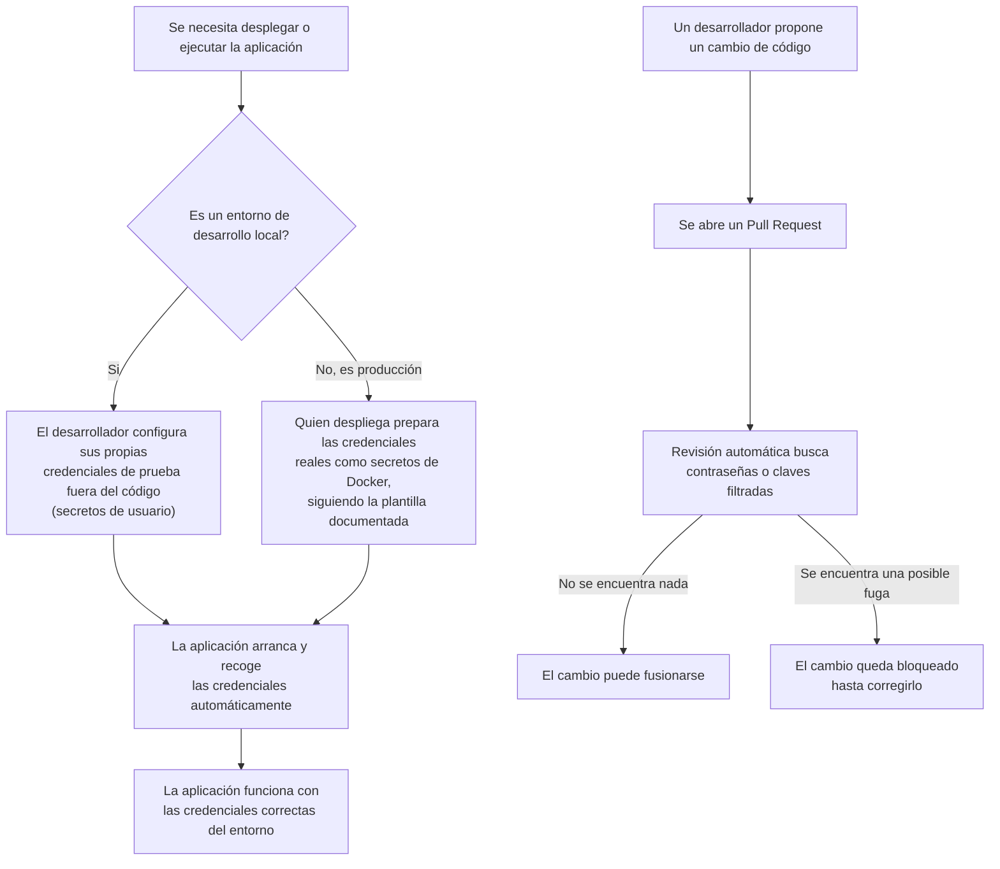

# US-38 Gestión de Secretos — Documentación Funcional

## Qué hace esto

Esta mejora protege las contraseñas y credenciales sensibles que usa
SportsClubEventManager para funcionar: la clave de acceso al inicio de sesión
con Google, la clave que firma las sesiones de los usuarios, la contraseña
de la cuenta de administrador y los datos de conexión a la base de datos.

Antes, algunas de estas credenciales podían quedar escritas directamente en
los ficheros de configuración del proyecto, con el riesgo de acabar
guardadas en el repositorio de código. Ahora, ninguna credencial real viaja
dentro del código: cada entorno (el ordenador de un desarrollador, o el
servidor donde corre la aplicación en producción) recibe sus propias
credenciales de forma separada y segura en el momento de arrancar.

Además, se ha añadido una comprobación automática que revisa cada cambio de
código antes de aceptarlo, buscando específicamente si alguien ha subido por
error una contraseña o clave real al repositorio.

## Por qué importa

- **Reduce el riesgo de fuga de credenciales**: si el código fuente se
  compartiera o se hiciera público por error, ya no expondría contraseñas ni
  claves reales, porque estas nunca están escritas en él.
- **Protege el entorno de producción**: las credenciales que usa la
  aplicación en el servidor real (donde están los datos de los socios y
  eventos del club) se gestionan de forma independiente del código, y solo
  las conoce quien despliega el sistema.
- **Detecta errores humanos antes de que lleguen a producción**: la revisión
  automática en cada Pull Request actúa como una red de seguridad: si alguien
  pega una clave real por descuido, el sistema bloquea la fusión del cambio
  hasta que se corrija.
- **Facilita el mantenimiento**: hay una plantilla clara y documentada con
  todas las credenciales que la aplicación necesita, lo que evita
  configuraciones incompletas u olvidos al desplegar en un entorno nuevo.

## Qué cambia operativamente

- **Al desarrollar en local**: quien desarrolla configura sus propias
  credenciales de prueba usando el mecanismo de "secretos de usuario" de
  .NET (fuera del código, solo en su máquina), siguiendo la plantilla
  `.secrets-template.json`. Este paso ya estaba en marcha antes; ahora es
  ligeramente más simple porque un identificador técnico que antes había que
  generar a mano ya viene preparado en el proyecto.
- **Al desplegar en producción**: las credenciales se entregan a la
  aplicación mediante el mecanismo de "secretos" de Docker, en vez de
  variables de entorno visibles en texto plano. Esto ya se aplicaba
  parcialmente al entorno de pruebas, pero **faltaba por completo en el
  fichero usado para el despliegue real del homelab** — ahora ambos entornos
  siguen el mismo procedimiento seguro.
- **En cada Pull Request**: se ejecuta automáticamente una revisión que
  escanea todo el historial de cambios propuesto en busca de credenciales
  filtradas. Si encuentra algo sospechoso, el cambio no se puede fusionar
  hasta resolverlo.

## Cómo funciona (perspectiva de uso)

## Preguntas frecuentes

**¿Esto afecta a los usuarios finales del club (socios, administradores)?**
No. Es un cambio interno de cómo se protege y gestiona la aplicación por
dentro; nadie que use la web o la app nota ningún cambio en su
funcionamiento.

**¿Se pierde alguna credencial o hay que reconfigurar algo urgentemente?**
No. Las credenciales existentes en producción siguen funcionando igual;
simplemente ahora se entregan a la aplicación por un canal más seguro. Sí es
necesario que quien despliega revise que el entorno de producción tiene
todas las credenciales preparadas correctamente antes de la próxima
actualización, siguiendo la plantilla incluida.

**¿Qué pasa si a alguien se le olvida y sube una contraseña real por
error?**
La revisión automática en el Pull Request debería detectarlo y bloquear el
cambio antes de que llegue a las ramas principales del proyecto. Es una red
de seguridad adicional, no la única medida.

**¿Esto elimina por completo el riesgo de fuga de credenciales?**
Lo reduce de forma importante, pero ninguna medida técnica es infalible. Por
eso se combina con buenas prácticas (no compartir credenciales fuera de los
canales previstos) y con la revisión automática como capa adicional.

**¿Hay algún seguimiento pendiente de este cambio?**
Sí, dos menores: un mensaje de error interno de la aplicación todavía hace
referencia a un servicio de terceros ("Azure Key Vault") que no se usa
realmente en este proyecto — es solo un texto informativo desactualizado, no
afecta a la seguridad ni a la funcionalidad, y se corregirá en un ajuste
posterior. Además, se recomienda que el equipo técnico haga una prueba
completa de despliegue con Docker antes de la próxima puesta en producción,
como verificación final.
