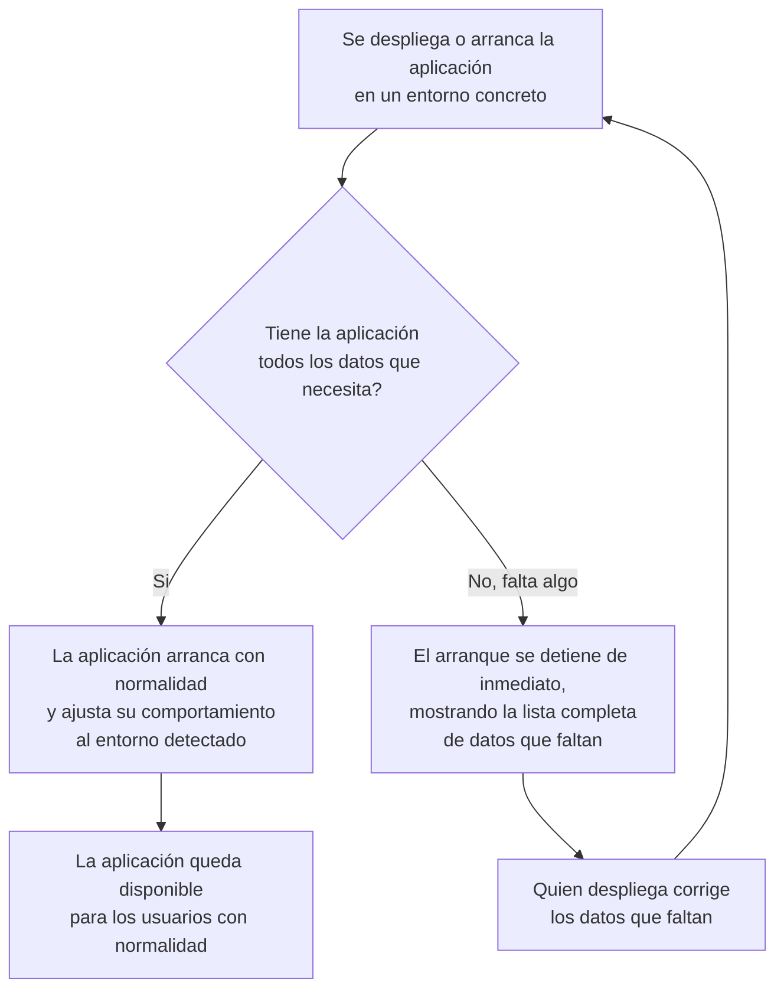

# US-39 Configuración basada en entorno — Documentación Funcional

## Qué hace esto

Esta mejora hace que la aplicación pueda arrancar en distintos "entornos"
(el ordenador de un desarrollador, o el servidor real donde corre en
producción) usando **el mismo paquete de la aplicación sin necesidad de
volver a construirlo**, adaptando automáticamente su comportamiento (nivel de
detalle de los registros internos, qué credenciales exige) según en cuál de
esos entornos se encuentre.

Además, si a la aplicación le falta algún dato imprescindible para funcionar
correctamente (por ejemplo, la dirección del servidor con el que debe
comunicarse, o una clave de seguridad), ahora se detiene **inmediatamente al
arrancar**, mostrando de una vez todos los problemas encontrados, en lugar de
arrancar "a medias" y fallar más tarde de forma confusa cuando alguien
intenta usar una función concreta.

## Por qué importa

- **Un único paquete para todos los entornos**: antes, para pasar de
  desarrollo a producción con la configuración correcta, había que confiar en
  que cada configuración se ajustara manualmente en cada sitio. Ahora la
  propia aplicación sabe distinguir en qué entorno está y se comporta en
  consecuencia (por ejemplo, registrando mucho más detalle técnico en
  desarrollo, y solo lo esencial en producción, para no saturar los registros
  del servidor real).
- **Los errores de configuración se detectan al instante, no días después**:
  si al desplegar una nueva versión falta un dato obligatorio, la aplicación
  ya no arranca "aparentemente bien" para luego fallar de forma extraña la
  primera vez que alguien usa una pantalla concreta. Ahora se detiene de
  inmediato con un mensaje claro que dice exactamente qué falta, permitiendo
  corregirlo antes de que ningún usuario llegue a notar un problema.
- **Menos sorpresas al desplegar**: se ha documentado, en un fichero de
  plantilla dedicado, la lista completa y exacta de datos que la aplicación
  necesita para arrancar en un servidor nuevo, reduciendo el riesgo de
  despliegues incompletos u olvidos.

## Qué cambia operativamente

- **Al desplegar en el servidor real**: quien despliega ahora dispone de una
  plantilla (`.env.example`) con la lista completa de datos que la aplicación
  necesita, en lugar de tener que deducirlos o buscarlos en varios sitios.
- **Si falta un dato obligatorio al arrancar**: el proceso de arranque se
  detiene inmediatamente y muestra de una sola vez **todos** los datos que
  faltan (no solo el primero que encuentra), lo que acelera mucho el
  diagnóstico cuando hay varios problemas a la vez.
- **Los registros internos de la aplicación son ahora distintos entre el
  entorno de desarrollo y el de producción**: en desarrollo se registra
  mucho más detalle técnico (útil para depurar); en producción solo lo
  esencial, reduciendo el volumen de registros generados por el
  funcionamiento normal del sistema.
- **Qué NO cambia**: esta mejora es puramente interna, de cómo la aplicación
  se protege frente a configuraciones incompletas. No añade ni quita ninguna
  funcionalidad visible ni cambia ninguna pantalla.

## Cómo funciona (perspectiva de uso)

## Preguntas frecuentes

**¿Esto afecta a los usuarios finales del club (socios, administradores)?**
No. Es un cambio interno de cómo la aplicación valida su propia
configuración al arrancar; nadie que use la web o la app notará ningún
cambio en su funcionamiento habitual.

**¿Esto tiene algo que ver con proteger contraseñas o credenciales?**
No directamente: la protección de credenciales (contraseñas, claves de
acceso) ya se resolvió en una mejora anterior. Esta mejora se limita a
comprobar, al arrancar, que esas credenciales (vengan de donde vengan) estén
realmente presentes y sean válidas, deteniendo el arranque si no es así.

**¿Se necesitan manifiestos o configuración especial de Kubernetes?**
No. Este proyecto no despliega hoy sobre Kubernetes (usa Docker Compose); esa
parte del pedido original se ha documentado como no aplicable en este
sistema, sin inventar artefactos de despliegue que no se van a usar.

**¿Se han añadido "interruptores" para activar o desactivar funciones según
el entorno (feature flags)?**
No. Se consideró como posibilidad, pero no había ningún caso concreto que lo
justificara todavía, así que no se ha añadido esa complejidad sin necesidad
real.

**¿Hay algún seguimiento pendiente de este cambio?**
Sí, uno menor y ya documentado: una carpeta de pruebas automáticas de
integración (que verifica precisamente este comportamiento de arranque)
todavía no está conectada al proceso de verificación automática (CI) del
proyecto — es una limitación ya existente desde antes de esta mejora, no
introducida por ella, y queda pendiente de una tarea de mantenimiento
separada.
