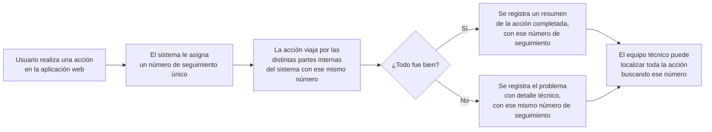

# US-40 Logging Estructurado — Documentación Funcional

## Qué hace esto

Esta mejora cambia **cómo el sistema registra internamente lo que ocurre**
mientras funciona: cada vez que un usuario hace algo (consultar eventos,
inscribirse, cancelar una inscripción, iniciar sesión, etc.), el sistema deja
ahora un "rastro" mucho más ordenado y completo de esa acción en sus
registros internos (los llamados *logs*), pensado para que el equipo técnico
pueda diagnosticar problemas mucho más rápido cuando algo falla.

No es una funcionalidad que el usuario vea o use directamente: es un cambio
"bajo el capó", una mejora de mantenimiento y de capacidad de diagnóstico del
propio sistema.

## Por qué importa

- **Seguir el rastro de una acción de principio a fin.** A partir de ahora,
  cada acción de un usuario recibe una especie de "número de seguimiento"
  interno (un identificador de correlación) que acompaña a esa acción a
  través de todo el sistema, incluso cuando pasa por varias partes internas
  distintas (la parte web que el usuario ve y la parte que gestiona los
  datos). Si algo falla, el equipo técnico puede localizar rápidamente todo lo
  que ocurrió durante esa acción concreta, en lugar de tener que revisar
  registros sueltos y desordenados.
- **Detectar y resolver problemas más rápido.** Al quedar todo registrado de
  forma ordenada y con más contexto (qué usuario, qué acción, cuánto tardó, si
  hubo un error y de qué tipo), el equipo técnico puede detectar patrones de
  fallos, problemas de lentitud o comportamientos inesperados mucho antes de
  que se conviertan en un problema visible para los usuarios.
- **Garantía reforzada de que los datos sensibles nunca aparecen en los
  registros.** Contraseñas, tokens de sesión y otra información sensible
  quedan automáticamente ocultas (sustituidas por un texto de aviso) en
  cualquier registro interno, incluso en los registros más detallados que
  ahora se generan para diagnóstico. Esta protección se revisó y se confirmó
  activa y correcta durante la fase de pruebas de esta mejora.

## Qué cambia a nivel operativo

- Los registros internos del sistema pasan a generarse en un formato
  estructurado (JSON) fácil de procesar automáticamente, en lugar de simple
  texto libre, tanto en el entorno de desarrollo como en producción.
- Los registros se guardan además en un fichero local con una política de
  conservación de **7 días**; pasado ese tiempo se descartan automáticamente
  los más antiguos. En el servidor de producción, ese fichero es una copia
  adicional de trabajo, no la copia definitiva: la conservación real en
  producción corre a cargo de la infraestructura de contenedores, que ya
  captura esos mismos registros de forma persistente por su cuenta.
- No se conecta (todavía) ningún sistema centralizado externo de análisis de
  registros (por ejemplo, herramientas como Loki o Elasticsearch); esta mejora
  solo deja el formato preparado para que, cuando esa infraestructura exista,
  pueda aprovecharse sin más cambios.
- Cada línea de registro relevante incluye automáticamente quién hizo la
  acción (una vez ha iniciado sesión) y su rol, además del número de
  seguimiento mencionado arriba.

## Qué se mantiene exactamente igual para los usuarios finales

Nada cambia en la experiencia de uso de la aplicación. No hay ninguna
pantalla, botón, flujo de inscripción, ni comportamiento visible que se vea
afectado. Esta mejora es puramente interna: mejora la capacidad de vigilancia
y diagnóstico del sistema, sin tocar ninguna función que un usuario o
administrador utilice directamente.

## Cómo funciona (perspectiva de usuario)

Aunque el usuario no ve nada distinto, así es como su acción queda "seguida"
internamente de principio a fin:

## Preguntas frecuentes

**¿Los usuarios notarán algún cambio al usar la aplicación?**
No. Es una mejora completamente interna de observabilidad; ninguna pantalla,
flujo ni tiempo de respuesta percibido cambia por esta mejora en sí misma.

**¿Esto significa que ahora se guardan más datos personales?**
No se guardan datos nuevos sobre los usuarios. Se registra con más orden y
detalle la actividad técnica del sistema (qué acción se hizo, cuándo, si
falló), no información personal adicional. Además, cualquier dato sensible
(contraseñas, tokens) sigue estando expresamente prohibido de aparecer en
texto legible en los registros, y esto se comprueba de forma automática.

**¿Durante cuánto tiempo se conservan estos registros?**
El fichero de registro local se conserva 7 días y luego se descarta
automáticamente. La copia real de referencia en el servidor de producción la
gestiona la infraestructura de contenedores por su cuenta.

**¿Se envían estos registros a algún proveedor o servicio externo?**
No. No hay ninguna integración activa con un sistema externo de análisis de
registros en este momento; solo se ha dejado el formato preparado para
facilitar esa integración en el futuro, si el equipo decide implementarla.

**¿Qué pasa si algo falla mientras se procesa una acción de un usuario?**
El sistema sigue respondiendo exactamente igual de cara al usuario (mismos
mensajes de error que antes); lo único que cambia es que, internamente, el
equipo técnico dispone de mucha más información ordenada y correlacionada
para investigar qué ocurrió y por qué.

## Referencias

- Diseño: `.claude/docs/sdlc/design/issue-40-structured-logging.md`
- Resumen de implementación: `.claude/docs/sdlc/development/issue-40-structured-logging.md`
- Resumen de testing: `.claude/docs/sdlc/testing/issue-40-structured-logging.md`
