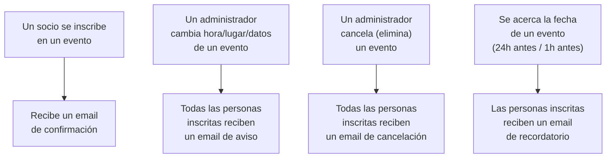

# Flujos de Trabajo n8n para Notificaciones de Eventos — Documentación Funcional

## Qué hace esto

Hasta ahora, cuando un socio se registraba en un evento, o cuando un administrador modificaba o
cancelaba un evento, nadie recibía ningún aviso automático: había que enterarse por otros medios
(revisando la aplicación, un mensaje aparte, etc.).

Esta funcionalidad añade **notificaciones automáticas por correo electrónico** en cuatro
situaciones:

1. **Confirmación de registro**: un socio recibe un email al inscribirse correctamente en un
   evento.
2. **Aviso de evento actualizado**: si un administrador cambia la hora, el lugar u otros detalles
   de un evento, todas las personas ya inscritas reciben un aviso.
3. **Aviso de evento cancelado**: si un administrador elimina un evento, todas las personas ya
   inscritas reciben un aviso de la cancelación.
4. **Recordatorio antes del evento**: las personas inscritas reciben un recordatorio automático
   antes de que empiece el evento, en dos momentos configurables (por defecto, 24 horas antes y 1
   hora antes).

Los correos no los envía la propia aplicación: se apoya en una herramienta de automatización
llamada **n8n**, ya usada por el club para otras tareas, que es quien realmente construye y envía
el email a través de un proveedor de correo (Brevo).

## Por qué importa

- **Menos trabajo manual**: nadie tiene que acordarse de avisar por su cuenta a los socios cuando
  cambia o se cancela un evento, ni de recordarles que se acerca la fecha.
- **Mejor experiencia para los socios**: reciben confirmación inmediata al inscribirse, se enteran
  a tiempo de cualquier cambio o cancelación, y no se olvidan de un evento al que se apuntaron.
- **Menos "sorpresas" de última hora**: si un evento se cancela o cambia de hora/lugar, quienes ya
  estaban inscritos se enteran automáticamente, en vez de descubrirlo al presentarse.
- **Sin coste de mantenimiento adicional**: se reutiliza una herramienta de automatización que el
  club ya tiene funcionando para otras cosas, no se monta ninguna infraestructura nueva propia de
  esta aplicación.

## Cómo funciona (perspectiva de la persona usuaria)

Desde el punto de vista de quien usa la aplicación día a día, no hay ninguna pantalla nueva ni
ningún paso adicional que aprender: al inscribirse en un evento, todo sigue funcionando igual que
antes — simplemente, ahora también llega un correo. Los recordatorios y los avisos de cambios
llegan sin que nadie tenga que hacer nada.

## Qué NO incluye todavía esta funcionalidad

- **No cubre la cancelación de una inscripción individual.** Si una persona cancela únicamente su
  propia inscripción (sin que el evento en sí cambie o se elimine), no se envía ningún correo por
  ese motivo — solo se notifica cuando el evento completo se actualiza o se cancela, o al
  inscribirse por primera vez. Es una decisión deliberada, confirmada durante el diseño de esta
  funcionalidad.
- **Solo email, por ahora.** Aunque en el futuro podrían añadirse otros canales (SMS, notificaciones
  push), esta primera versión solo envía correo electrónico.
- **Está desactivada por defecto fuera del entorno real de producción.** En los entornos de
  desarrollo y pruebas, esta función permanece apagada — solo se activa en el servidor de
  producción del club, una vez completada una configuración manual (credenciales, verificación del
  dominio de envío de correo, etc.) que corresponde a quien administra la infraestructura del club.
- **Un fallo en el envío nunca bloquea la acción principal.** Si por cualquier motivo la
  notificación no pudiera enviarse (por ejemplo, si la herramienta de automatización estuviera
  temporalmente caída), el registro, la actualización o la cancelación del evento se completan
  igualmente con normalidad para la persona usuaria — el envío del aviso es una consecuencia del
  éxito de la acción, nunca una condición para que esta se complete.
- **Los recordatorios se comprueban periódicamente, no al instante.** El sistema revisa cada pocos
  minutos qué eventos están a punto de empezar; no es una alarma exacta al segundo, sino una
  comprobación regular que garantiza que el aviso llega dentro de la ventana esperada (por ejemplo,
  en algún momento de la hora en que corresponde el recordatorio de "24 horas antes").
- **Un mismo recordatorio nunca se envía dos veces**, incluso si el sistema se reinicia — queda
  registrado internamente para evitar duplicados, aunque el servidor se reinicie entre medias.

## Frequently Asked Questions

**¿Tengo que hacer algo distinto para recibir estos correos?**
No. Si te inscribes en un evento con tu cuenta habitual, el correo de confirmación llega
automáticamente a la dirección de email asociada a tu cuenta.

**¿Qué pasa si cancelo mi propia inscripción, sin que el evento cambie?**
No se envía ningún correo automático en ese caso concreto. Los avisos automáticos cubren la
inscripción inicial y los cambios/cancelación del evento completo, no la cancelación de una
inscripción individual.

**¿Y si el evento se cancela justo antes de empezar?**
Todas las personas que estuvieran inscritas reciben un correo de cancelación tan pronto como el
administrador confirma la eliminación del evento.

**¿Puedo perderme el recordatorio si el sistema tiene algún problema técnico?**
El sistema está diseñado para reintentarlo en la siguiente comprobación si algo falla
puntualmente, y nunca reenvía el mismo recordatorio dos veces una vez se ha enviado con éxito.

**¿Esto ralentiza la inscripción a un evento?**
No de forma perceptible. El envío del aviso tiene un tiempo de espera máximo muy corto y
configurado deliberadamente bajo, precisamente para que nunca añada una demora notable a la
acción que la persona usuaria está realizando.

**¿Quién envía realmente el correo, el club o un tercero?**
La aplicación del club se limita a avisar a la herramienta de automatización (n8n) de que ha
ocurrido algo relevante; es esa herramienta la que construye y envía el correo real, a través de
un proveedor de envío de emails (Brevo), usando una dirección de remitente verificada del propio
club.

**¿Se pueden ampliar en el futuro los canales de notificación (SMS, notificaciones push)?**
Sí, la funcionalidad está construida de forma que añadir un canal nuevo en el futuro no requeriría
rediseñar lo ya existente, solo ampliarlo.
