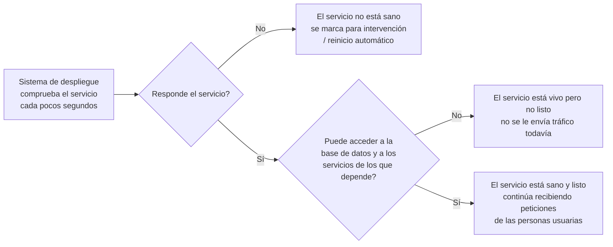

# Endpoints de Health Check (Api y Web) — Documentación Funcional

## What this does

Se han añadido "puntos de comprobación de salud" a los dos servicios de la plataforma (el servicio de API y el sitio web). Son tres direcciones web especiales que, en lugar de devolver contenido para una persona usuaria, devuelven una respuesta sencilla que indica si el servicio está funcionando correctamente y si puede acceder a todo lo que necesita para operar (principalmente, la base de datos, y en el caso del sitio web, también el servicio de API del que depende).

En la práctica, estas comprobaciones las consultan automáticamente las herramientas técnicas que gestionan el despliegue (Docker y el sistema de orquestación de contenedores), no las personas usuarias finales de la aplicación.

## Why it matters

Hasta ahora, el sistema de despliegue solo sabía si un servicio "respondía a algo", sin comprobar realmente si podía hacer su trabajo (por ejemplo, si tenía acceso a la base de datos). Esto significa que un servicio podía aparecer como "funcionando" aunque, en realidad, no pudiera atender ninguna petición de verdad.

Con esta mejora:

- El sistema de despliegue puede detectar automáticamente cuándo un servicio no está realmente operativo y actuar en consecuencia (por ejemplo, no dirigir tráfico hacia él o reiniciarlo si corresponde).
- El sitio web solo se pone en marcha una vez que el servicio de API ya está listo para responder, evitando errores por arrancar en el orden equivocado.
- Se reduce el riesgo de que una incidencia pase desapercibida durante más tiempo del necesario, lo cual mejora la fiabilidad general del servicio para las personas usuarias.
- Se distingue entre "el proceso está vivo" y "el proceso está listo para trabajar", lo que evita reinicios innecesarios cuando hay un problema puntual y pasajero (por ejemplo, un pequeño corte de red con la base de datos de un par de segundos).

## How it works (user perspective)

Las personas usuarias de la plataforma no interactúan directamente con estas comprobaciones — ocurren de forma automática, en segundo plano, cada pocos segundos, como parte de la infraestructura que mantiene el servicio disponible.

En resumen: primero se comprueba si el proceso sigue en marcha; después, si tiene todo lo necesario para atender peticiones reales. Solo cuando ambas comprobaciones son positivas, el servicio se considera plenamente operativo.

Un ejemplo concreto de por qué esto importa: cuando se despliega una nueva versión, el sitio web espera a que el servicio de API confirme que está listo antes de empezar a recibir tráfico, evitando así una ventana de errores para las personas usuarias justo después de un despliegue.

## Frequently Asked Questions

**¿Esto cambia algo para las personas usuarias de la plataforma?**
No de forma directa. No hay ninguna pantalla ni funcionalidad nueva visible para quienes usan la aplicación. El cambio es de infraestructura: ayuda a que el servicio esté disponible de forma más fiable.

**¿Qué pasa si la base de datos deja de responder un instante?**
El sistema distingue entre un corte breve y un fallo real. Un corte muy corto no provoca un reinicio innecesario del servicio; solo si el problema persiste, el servicio se marca como "no listo" y el sistema de despliegue puede intervenir.

**¿Se puede ver esta información en algún sitio?**
Sí, es una información técnica pensada para quien opera la plataforma (o para las herramientas automáticas de despliegue). No forma parte de la experiencia de la persona usuaria final.

**¿Se comprueba también el sistema de autenticación con Google?**
No. Esa conexión solo se usa en el momento puntual en que alguien inicia sesión, no es algo que deba comprobarse de forma periódica en segundo plano; hacerlo podría incluso generar bloqueos innecesarios por parte de Google.

**¿Incluye comprobaciones de espacio en disco o memoria del servidor?**
No por ahora. Se planteó como posible mejora futura, pero no se ha implementado porque todavía no hay un criterio claro de qué umbral debería considerarse un problema.

**¿Se despliega esto en Kubernetes?**
No; esta plataforma se despliega mediante contenedores Docker gestionados con Portainer, no con Kubernetes. Las comprobaciones de salud se han integrado con las herramientas de despliegue que realmente se usan (Docker), que cumplen el mismo propósito.
