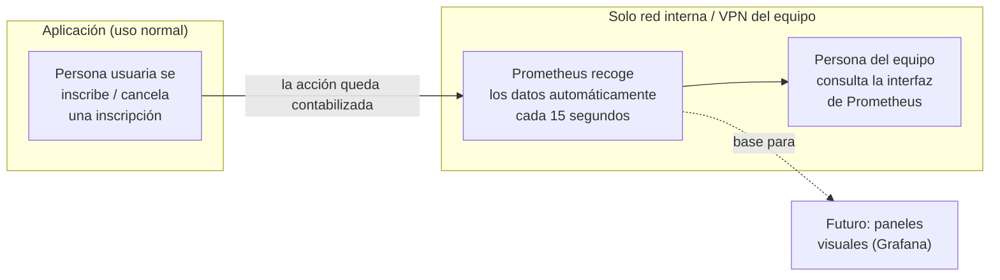

# Integración de Prometheus para recolección de métricas — Documentación Funcional

## Qué hace esto

Hasta ahora, la aplicación no ofrecía ninguna forma de ver, de un vistazo, cómo se está
comportando: cuánta gente se está inscribiendo a eventos, cuántas cancelaciones hay, cuántos
eventos activos existen en cada momento, o si la aplicación está respondiendo con normalidad o
con errores.

Esta funcionalidad añade un sistema de **recolección de métricas**: la aplicación empieza a
llevar la cuenta, en todo momento, de una serie de indicadores de uso y de salud, y los deja
disponibles para que una herramienta externa llamada **Prometheus** los recoja automáticamente
cada 15 segundos y los guarde en su propio histórico.

Prometheus no es un panel visual bonito por sí mismo — es la pieza que **recoge y almacena**
los datos. La forma de visualizarlos de manera amigable (gráficas, paneles) llegará con una
funcionalidad futura relacionada (Grafana), que se apoya directamente en lo que se construye
aquí.

## Por qué importa

- **Visibilidad operativa**: hoy, si algo va mal (la aplicación responde lento, hay muchos
  errores, un pico inusual de cancelaciones), nadie se entera hasta que un usuario se queja.
  Con esto, esa información queda registrada de forma continua y consultable.
- **Datos de negocio en tiempo real**: cuántas inscripciones se han creado, cuántas se han
  cancelado y cuántos eventos siguen activos (es decir, eventos cuya fecha aún no ha pasado) son
  indicadores directamente relevantes para quien gestiona el club.
- **Base para el siguiente paso**: esta funcionalidad es un requisito previo de una futura
  integración con Grafana (paneles visuales), que dependerá exactamente de los datos que se
  empiezan a recoger aquí. Sin esto, esa siguiente funcionalidad no tendría datos que mostrar.
- **Sin impacto para las personas usuarias**: es una funcionalidad completamente interna, de
  observación. Nadie que use la aplicación para inscribirse a un evento notará ningún cambio.

## Qué se puede ver ahora, y dónde

Una vez desplegado, existe una interfaz web de Prometheus donde se pueden consultar estos datos:

- **Tráfico y salud de la aplicación**: número de peticiones que recibe, cuánto tardan en
  responder, y cuántas terminan en error (agrupadas por el tipo de código de respuesta, por
  ejemplo, distinguiendo errores del propio usuario de errores técnicos internos).
- **Inscripciones a eventos**: cuántas se han creado, separando si las hizo la propia persona
  usuaria ("self-service") o si las dio de alta un administrador.
- **Cancelaciones**: mismo desglose que las inscripciones.
- **Eventos activos**: cuántos eventos con fecha futura hay en cada momento, actualizado
  automáticamente cada 30 segundos (este intervalo es ajustable).

**Importante sobre el acceso**: esta interfaz **no es pública**. Solo es accesible desde dentro
de la red interna del homelab donde vive la aplicación, o a través de la VPN privada (Tailscale)
que ya usa el equipo para tareas de administración. No se enruta a través del dominio público ni
del proxy que sí usan las páginas normales de la aplicación. Es una decisión deliberada: estos
datos son para uso interno del equipo, no para el público general.

## Cómo funciona (perspectiva de usuario/operador)

Desde la perspectiva de quien usa la aplicación día a día, no hay ningún paso nuevo ni ninguna
pantalla nueva — todo ocurre de forma transparente en segundo plano. Desde la perspectiva de
quien administra o supervisa la aplicación, se gana una fuente de datos consultable que antes no
existía.

## Qué NO incluye todavía esta funcionalidad

- **No distingue por "tipo de evento".** Hoy la aplicación no tiene ningún concepto de
  categoría o tipo asociado a un evento (por ejemplo, "torneo" vs. "entrenamiento"), así que las
  métricas tampoco pueden desglosarse por ese criterio. Si en el futuro se añade esa
  clasificación a los eventos, se podría añadir después sin romper nada de lo ya construido.
- **No hay un contador dedicado de "llamadas fallidas".** En vez de crear un indicador nuevo y
  separado para esto, se reutiliza la información que ya se recoge sobre el código de respuesta
  de cada petición (que ya distingue, por ejemplo, un error del propio usuario de un fallo
  técnico interno). Se decidió así para no duplicar trabajo con datos que ya existían.
- **No incluye paneles visuales ni alertas automáticas.** Eso es precisamente lo que aportará la
  futura integración con Grafana, que se construirá sobre esta base.
- **No es una herramienta de auditoría de usuarios concretos.** Los datos recogidos son
  agregados (totales, contadores) y no incluyen nombres, correos electrónicos ni identificadores
  de personas o de eventos concretos.

## Frequently Asked Questions

**¿Esto ralentiza la aplicación para quien la usa?**
No de forma perceptible. Contar una acción es una operación prácticamente instantánea, mucho
más rápida que el resto de lo que ya hace la aplicación al procesar una inscripción.

**¿Puede ver estos datos cualquier persona desde internet?**
No. La interfaz donde se consultan estos datos solo es accesible desde la red interna del
equipo o a través de la VPN privada que ya se usa para tareas de administración. No está
enlazada desde ninguna parte pública de la aplicación.

**¿Qué pasa si el sistema que recoge las métricas falla momentáneamente?**
No afecta a la aplicación en sí. Como mucho, se pierde temporalmente la foto más reciente de
"eventos activos" (que se recalcula sola en el siguiente ciclo), sin que eso interrumpa el
servicio a las personas usuarias.

**¿Cuándo se van a poder ver estos datos en gráficas, en vez de en una interfaz técnica?**
Eso corresponde a una funcionalidad futura relacionada (integración con Grafana), que ya está
prevista como el siguiente paso natural sobre lo que se entrega aquí.

**¿Se guarda esta información para siempre?**
No, se conserva un histórico de 15 días. Es un valor pensado para el tamaño actual de la
infraestructura y se puede ajustar más adelante si hiciera falta un histórico más largo.
