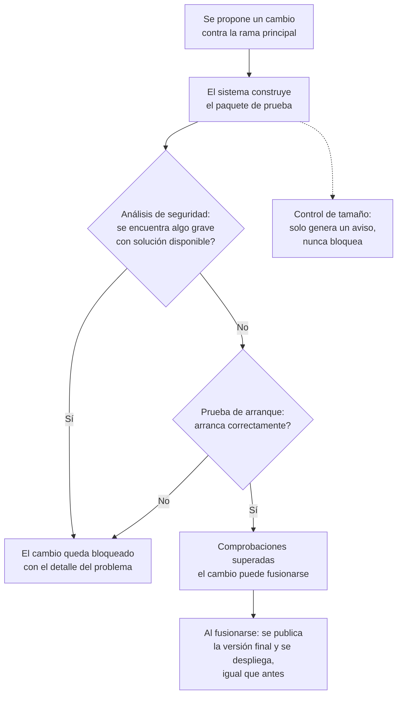

# Validación automatizada de imágenes Docker en el pipeline de CD — Documentación Funcional

## What this does

Cada vez que se propone un cambio para el sitio web o el servicio de API (una "propuesta de cambio", o *pull request*, contra la rama principal), el sistema ahora construye una versión de prueba del programa empaquetado y la somete a tres comprobaciones automáticas antes de que ese cambio pueda publicarse:

1. **Un análisis de seguridad**, que busca vulnerabilidades conocidas y graves en todo lo que compone ese paquete.
2. **Un control de tamaño**, que avisa si el paquete ha crecido de forma significativa respecto a lo habitual.
3. **Una prueba de arranque real**, que enciende el paquete en un entorno temporal (con su propia base de datos de prueba) y comprueba que arranca y responde correctamente, tal y como lo haría en producción.

Solo si estas comprobaciones pasan, el cambio queda en condiciones de fusionarse y, más adelante, de publicarse y desplegarse. Antes de esta mejora, el sistema construía y publicaba el paquete directamente, sin ninguna de estas verificaciones automáticas previas.

## Why it matters

Hasta ahora era posible que una versión del sitio web o del servicio de API llegara a producción con un fallo que impidiera arrancar correctamente, o con una vulnerabilidad de seguridad grave, y que ese problema no se detectara hasta que ya estaba desplegado y afectando al servicio real.

Con esta mejora:

- **Los problemas se detectan antes de publicar, no después.** Una versión que no arranca, o que tiene una vulnerabilidad de seguridad grave con solución ya disponible, queda bloqueada automáticamente y no llega a publicarse.
- **Menos incidentes en producción por causas evitables.** El equipo gana confianza en que lo que se despliega ha pasado por una verificación mínima real, no solo por una compilación correcta del código.
- **Visibilidad de los hallazgos de seguridad.** Los resultados del análisis quedan disponibles como informe descargable y también en el apartado de seguridad del repositorio de código, para que el equipo pueda revisarlos sin tener que reproducir el análisis manualmente.
- **Ningún cambio inesperado en el uso diario del pipeline**: si todo funciona correctamente, el proceso de publicación y despliegue sigue funcionando exactamente igual que antes; la novedad es la comprobación previa, no el resultado final cuando todo está en orden.

## How it works (user perspective)

Desde la perspectiva de quien propone un cambio (una persona del equipo de desarrollo), el proceso se integra en el flujo habitual de revisión de código:

En la práctica, quien propone el cambio ve dos nuevas comprobaciones ("checks") en la pantalla de revisión de la propuesta, junto a las que ya existían para el código. Si alguna falla, la propuesta queda marcada como no lista para fusionar hasta que se resuelva el problema; el propio informe indica qué ha fallado y por qué.

## Implicaciones de proceso

- **Nuevas comprobaciones obligatorias en la rama principal.** Una vez activada esta protección, ninguna propuesta de cambio contra la rama principal podrá fusionarse sin que estas dos nuevas comprobaciones ("validate (api)" y "validate (web)") hayan finalizado en verde, igual que ya ocurre hoy con la comprobación de compilación y pruebas existente.
- **Activación manual pendiente.** El archivo de configuración de esta protección ya está actualizado, pero la propia protección **debe activarla manualmente una persona con permisos de administración** del repositorio, y solo después de confirmar que las nuevas comprobaciones se han ejecutado correctamente al menos una vez. Esto es intencional: evita bloquear accidentalmente todas las propuestas de cambio antes de que el nuevo proceso esté probado.
- **Ligero aumento del tiempo del proceso de validación** en cada propuesta de cambio (el tiempo que tarda en arrancar una base de datos de prueba y comprobar que el servicio responde), a cambio de una detección más temprana de fallos.
- **Sin cambios para las personas usuarias finales de la plataforma.** Esta mejora no añade ninguna pantalla ni funcionalidad visible; es un cambio interno del proceso de desarrollo y publicación.
- **Limitación conocida y aceptada por el equipo**: al probar el sitio web, la prueba de arranque usa la última versión ya publicada del servicio de API (no la que se está proponiendo en el mismo cambio, si ambas se modifican a la vez). En el caso poco frecuente de que un mismo cambio rompiera ambos servicios a la vez, esta combinación concreta podría no detectarse en esta primera versión del proceso.

## Frequently Asked Questions

**¿Esto significa que ya no pueden llegar errores a producción?**
No lo garantiza al cien por cien, pero reduce significativamente el riesgo: detecta fallos de arranque y vulnerabilidades de seguridad graves y ya solucionadas antes de publicar, que es justamente el tipo de problema que antes solo se descubría una vez desplegado.

**¿Qué pasa si el análisis de seguridad encuentra una vulnerabilidad pero todavía no existe solución para ella?**
En ese caso no bloquea el proceso. Solo se bloquea cuando existe una solución disponible y no se ha aplicado; de lo contrario, el equipo quedaría permanentemente bloqueado por problemas que no puede resolver en ese momento.

**¿Qué pasa si el paquete crece de tamaño?**
Se genera un aviso informativo, pero no bloquea nada. El equipo puede revisar si el crecimiento es intencional (por ejemplo, una nueva dependencia necesaria) y, si lo es, actualizar el valor de referencia.

**¿Quién puede ver los resultados del análisis de seguridad?**
El equipo técnico, tanto como informe descargable de cada ejecución como en el apartado de seguridad del repositorio de código, sin necesidad de repetir el análisis manualmente.

**¿Cuándo entra en vigor la obligatoriedad de estas comprobaciones?**
En cuanto una persona administradora del repositorio active manualmente la protección correspondiente, una vez verificado que las nuevas comprobaciones funcionan correctamente. Hasta entonces, se ejecutan igualmente en cada propuesta de cambio, pero de forma informativa.
