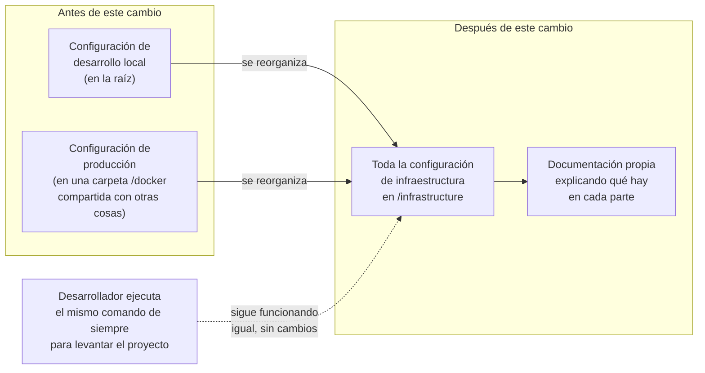

# Infraestructura como Código — Documentación Funcional

## What this does

Toda la configuración que describe cómo se levanta y se despliega la aplicación — qué piezas la componen (base de datos, API, sitio web), cómo se conectan entre sí y cómo se pone en marcha en el servidor del club — vivía repartida entre dos lugares distintos del repositorio de código, sin una carpeta única y clara donde encontrarla.

Con este cambio, toda esa configuración pasa a vivir en un único lugar, claramente organizado y documentado: una carpeta llamada `/infrastructure/` en la raíz del repositorio. Además, se le da un nombre explícito a la red interna que conecta las distintas piezas de la aplicación, en vez de dejar que Docker (la herramienta que las orquesta) le asigne una automáticamente sin nombre reconocible.

Nada de esto cambia lo que la aplicación hace ni cómo se ve para los socios del club o los administradores — es un cambio interno de organización, no una funcionalidad nueva.

## Why it matters

Antes de este cambio existían dos puntos débiles:

- **La configuración de infraestructura estaba dispersa.** Parte vivía en la raíz del repositorio y parte en una carpeta llamada `/docker`, sin ningún lugar único que reuniera "todo lo necesario para levantar o desplegar la aplicación". Revisar o entender esa configuración de punta a punta exigía saber de antemano dónde buscar cada pieza.
- **El criterio de aceptación del proyecto exigía explícitamente que esta infraestructura estuviera organizada como código versionado**, revisable como cualquier otro cambio del proyecto (mediante una solicitud de revisión, igual que el resto del código), en una ubicación concreta y predecible.

Con este cambio:

- **Toda la infraestructura como código queda en un único lugar**, con documentación propia que explica qué hay en cada subcarpeta y cómo se usa.
- **Queda lista para revisarse igual que cualquier otro cambio de código**, a través del proceso normal de solicitud de revisión del repositorio (que ya exige aprobación antes de fusionar cualquier cambio).
- **La forma de arrancar el proyecto en un ordenador de desarrollo no cambia en absoluto** — el mismo comando de siempre sigue funcionando igual.

## How it works (user perspective)

Desde la perspectiva de quien necesita encontrar o entender la configuración de infraestructura del proyecto (un desarrollador nuevo en el equipo, o cualquiera revisando el repositorio):

En el día a día, para un desarrollador que ya conocía el proyecto no cambia nada: el comando que usa para levantar la aplicación en su propio ordenador sigue siendo exactamente el mismo. Lo que cambia es que, si alguien necesita revisar o entender cómo está organizada la infraestructura del proyecto — por ejemplo, una persona que se incorpora al equipo, o quien revisa una solicitud de cambios — ahora hay un único punto de entrada claro en vez de tener que buscar en dos sitios distintos.

## Implicaciones de proceso

- **Dos pasos de configuración pendientes, a cargo de la persona responsable del servidor del club (el "homelab").** Como parte de esta reorganización, uno de los ficheros de configuración de producción cambió de ubicación dentro del repositorio. El panel de administración del servidor todavía apunta a la ubicación antigua, así que hay que actualizar esa referencia manualmente una única vez. Además, queda pendiente un paso, también manual y también a cargo de esa misma persona, para exponer la aplicación de forma pública a través del dominio del club (un paso de configuración de red a nivel de servidor, fuera de este repositorio). Ninguno de los dos pasos afecta al funcionamiento actual del proyecto en desarrollo.
- **El resto de mejoras de infraestructura relacionadas quedan fuera de este cambio, con seguimiento propio.** Paneles de monitorización visual del estado de la aplicación y automatización de flujos de trabajo internos son mejoras planificadas, pero cada una se gestiona como su propia iniciativa independiente — no forman parte de esta reorganización.
- **Sin cambios para las personas usuarias finales de la plataforma.** Esta mejora no añade ninguna pantalla ni funcionalidad visible en el sitio web ni en la API; es un cambio interno de organización del proyecto.

## Frequently Asked Questions

**¿Esto cambia algo para los socios del club o los administradores que usan la aplicación?**
No. Es un cambio puramente interno de organización del código del proyecto. Nadie que use la aplicación notará ninguna diferencia.

**¿Los desarrolladores tienen que hacer algo distinto para levantar el proyecto en su ordenador?**
No. El comando que usan para arrancar el proyecto localmente sigue siendo exactamente el mismo que antes de este cambio.

**¿Por qué era necesario reorganizar esto si nada cambiaba de cara al usuario?**
Porque el propio proyecto tenía como requisito que su infraestructura estuviera organizada de forma clara y revisable, como cualquier otro cambio de código. Antes, esa configuración estaba repartida en dos sitios sin un punto de entrada único; ahora cualquiera puede encontrarla y revisarla en un solo lugar.

**¿Queda algo pendiente tras este cambio?**
Sí, dos pasos puntuales que debe realizar la persona responsable del servidor del club: actualizar la ruta de un fichero en el panel de administración del servidor, y completar la configuración de red que permite acceder a la aplicación públicamente a través del dominio del club. Ninguno de los dos bloquea el trabajo diario de desarrollo.

**¿Se han incluido en este cambio los paneles de monitorización o la automatización de flujos que se habían mencionado antes?**
No. Son mejoras planificadas por separado, cada una con su propio seguimiento independiente. Este cambio se limita a organizar la infraestructura ya existente.
