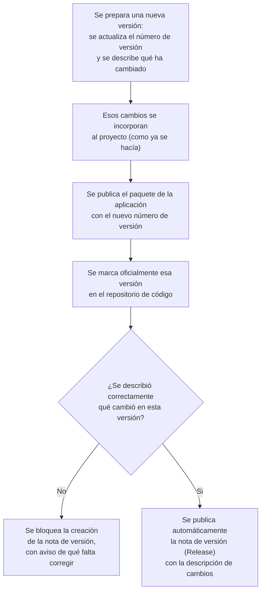

# Versionado real de imágenes Docker y releases — Documentación Funcional

## What this does

Cada vez que se publica una nueva versión de la aplicación, esta ahora recibe un número de versión real y con significado (por ejemplo, `0.3.0`), acompañado de una descripción de lo que ha cambiado. Ese número se usa de forma consistente en dos sitios: en el paquete publicado del programa y en una página de "Release" (nota de versión) que GitHub genera automáticamente, con el detalle de las novedades redactado de forma legible en vez de una lista automática de referencias técnicas.

Además, se ha añadido una comprobación de seguridad en el proceso: si alguien olvida escribir qué ha cambiado en esa versión, el sistema bloquea la publicación de la nota de versión hasta que se corrija, en vez de publicar una página vacía o sin información útil.

## Why it matters

Hasta ahora, cada paquete publicado de la aplicación llevaba siempre la misma etiqueta de versión (`1.0.0`), sin que esa etiqueta se actualizara nunca. Esto significaba que, mirando únicamente la versión publicada, era imposible saber si se trataba de la primera entrega del proyecto o de la más reciente, ni qué había cambiado entre una y otra.

Con esta mejora:

- **Cada versión publicada es identificable de verdad.** El número de versión ahora aumenta con cada release real y coincide con la etiqueta que ya se usa en el repositorio de código, en vez de quedarse fijo para siempre.
- **Cada versión tiene una explicación de qué trae.** La página de "Release" en GitHub, que antes se generaba automáticamente con una lista técnica poco legible (títulos de tareas internas, incluyendo actualizaciones automáticas de dependencias), ahora se redacta a partir de una descripción de cambios ya organizada y pensada para leerse por categorías (novedades, cambios, correcciones).
- **Se reduce el riesgo de publicar una versión "muda".** Si el equipo olvida documentar qué ha cambiado en una versión antes de publicarla, el sistema detiene automáticamente la creación de esa nota de versión y avisa exactamente de qué falta, en vez de dejar constancia de una release sin información útil para quien la consulte después.
- **No afecta al funcionamiento diario de la plataforma.** Es una mejora del proceso interno de publicación de versiones; las personas usuarias finales de la aplicación no perciben ningún cambio en su experiencia.

## How it works (user perspective)

Desde la perspectiva de quien prepara una nueva versión (una persona del equipo de desarrollo), el proceso se integra en el flujo de trabajo habitual, sin herramientas nuevas que aprender:

En la práctica, la persona que prepara la versión solo tiene que recordar dos cosas, ambas ya parte de su rutina habitual: actualizar el número de versión y anotar qué ha cambiado. Todo lo demás — publicar el paquete, comprobar que la información está completa y crear la nota de versión — ocurre automáticamente.

## Antes y después

| | Antes | Ahora |
|---|---|---|
| Número de versión del paquete publicado | Siempre `1.0.0`, nunca cambiaba | Aumenta con cada versión real (por ejemplo, `0.2.0`, `0.3.0`...) |
| Nota de versión (Release) en GitHub | Creada a mano, con una lista automática de referencias técnicas poco legible | Creada automáticamente, con la descripción de cambios ya redactada por el equipo |
| Comprobación de que la versión está bien documentada | No existía | Bloquea la publicación de la nota de versión si falta la descripción de cambios |

## Implicaciones de proceso

- **El proceso es intencionalmente simple y manual.** No se ha introducido ninguna herramienta nueva de cálculo automático de versiones. Se evaluó esa opción, pero se descartó para este proyecto: el historial de cambios del repositorio no seguía todavía un formato lo bastante uniforme como para que un cálculo automático fuera fiable, y el proyecto (desarrollado por una sola persona, dentro de un calendario ajustado) se beneficiaba más de mantener el proceso simple que de invertir tiempo en una automatización más compleja.
- **No hay pasos nuevos que aprender.** Actualizar el número de versión y describir los cambios ya eran parte de la rutina habitual al preparar una nueva versión; lo único que cambia es que ahora es obligatorio hacerlo correctamente, porque una nueva comprobación lo verifica.
- **Nueva red de seguridad.** Si se olvida documentar los cambios de una versión, el sistema lo detecta y detiene la publicación de la nota de versión correspondiente, con un mensaje claro de qué falta corregir, en vez de dejar pasar una publicación incompleta.
- **Sin gestión automática del orden de los pasos.** El proceso confía en que el equipo siga el orden correcto (actualizar la versión y publicar el paquete antes de marcar oficialmente esa versión). No hay ninguna comprobación automática adicional que impida marcarla en el orden equivocado; si ocurriera, el sistema lo detectaría igualmente al fallar la comprobación de coincidencia de versión, evitando una publicación incorrecta.
- **Sin cambios para las personas usuarias finales de la plataforma.** Esta mejora no añade ninguna pantalla ni funcionalidad visible en la aplicación; es un cambio interno del proceso de publicación de versiones.

## Frequently Asked Questions

**¿Los usuarios de la aplicación notarán algún cambio?**
No. Esta mejora afecta únicamente a cómo el equipo de desarrollo publica y documenta nuevas versiones internamente; no cambia nada en la aplicación tal y como la ve quien la usa.

**¿Qué pasa si el equipo olvida describir los cambios de una nueva versión?**
La publicación de la nota de versión (Release) se bloquea automáticamente, con un aviso indicando exactamente qué falta. No se llega a publicar una nota de versión vacía o sin información útil.

**¿Por qué no se automatizó también el cálculo del número de versión?**
Porque el historial de cambios del proyecto todavía no sigue un formato lo bastante consistente como para que ese cálculo automático fuera fiable sin trabajo adicional previo. Se ha optado por mantener el proceso simple y manual ahora, dejando la automatización completa como una mejora posible en el futuro si se decide invertir en normalizar ese formato.

**¿Esto cambia cómo se despliega la aplicación o cómo se puede revertir una versión con problemas?**
No. El mecanismo que ya existía para identificar exactamente qué build está desplegado y para revertir a una versión anterior en caso de problema no depende del número de versión que introduce esta mejora; sigue funcionando exactamente igual que antes. El número de versión nuevo es, sobre todo, una forma más clara de comunicar qué versión es cada release, no la pieza de la que depende la recuperación ante fallos.

**¿Se necesita algún permiso especial para publicar una nueva versión?**
No, más allá de los mismos permisos que ya se requerían para fusionar cambios en la rama principal del proyecto y crear una marca de versión en el repositorio de código.
