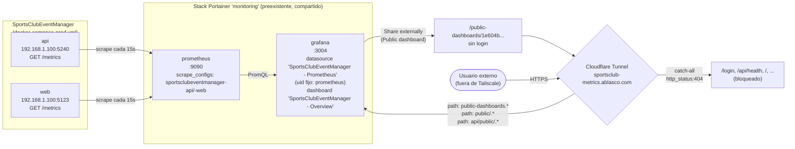
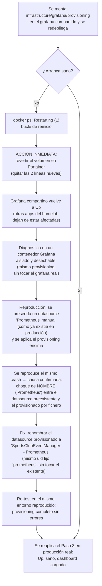

# Observabilidad: Grafana en producción (issues #42 y #43)

Guía paso a paso de cómo las métricas de **SportsClubEventManager** llegan a un dashboard de Grafana
visible públicamente en `https://sportsclub-metrics.ablasco.com`, y cómo reproducir/mantener ese
montaje si hay que tocarlo en el futuro (nueva versión de Grafana, nuevo panel, rotación de
credenciales, etc.). Documenta también, con el mismo nivel de detalle que
[`docs/deployment/homelab-deployment.md`](../deployment/homelab-deployment.md), un incidente de
producción real (Grafana entró en bucle de reinicio) para que no se repita el mismo error.

**Estado:** completado y verificado en producción — 2026-07-14. Las issues #42 (métricas Prometheus)
y #43 (dashboard Grafana) estaban cerradas en GitHub desde antes, pero solo cubrían el código de este
repositorio; el trabajo manual de producción descrito aquí (Prometheus scrapeando `api`/`web`,
dashboard cargado, visibilidad pública) no se había ejecutado hasta esta guía.

---

## Por qué esto no es "un contenedor Grafana más"

La decisión de diseño más importante de toda esta funcionalidad es esta: **este proyecto no
despliega su propio Prometheus/Grafana en producción.** El homelab ya tiene un stack `monitoring`
independiente (Portainer, stack `#16`) con su propio Prometheus, Grafana, `node-exporter` y
`cAdvisor`, compartido por varias aplicaciones del homelab (no solo `SportsClubEventManager`).
Añadir una segunda copia duplicaría exactamente las mismas métricas de host/contenedor y arriesgaría
colisión de puertos con los servicios reales.

Por eso [`infrastructure/docker-compose/docker-compose.prod.yml`](../../infrastructure/docker-compose/docker-compose.prod.yml)
**no** tiene servicios `grafana`/`prometheus`/`node-exporter`/`cadvisor` (sí los tiene, solo para
desarrollo local, `infrastructure/docker-compose/docker-compose.yml`). En su lugar:

- `api`/`web` exponen `/metrics` en formato Prometheus (issue #42, código de este repositorio).
- El dashboard/datasource/alertas de Grafana se versionan como código en
  [`infrastructure/grafana/`](../../infrastructure/grafana/) (issue #43), pero se **aplican** sobre
  la Grafana ya existente del homelab mediante *provisioning* por fichero — un paso manual de
  infraestructura, fuera de este repositorio, documentado paso a paso más abajo.

Decisión original y su historial completo (incluidas las correcciones de diseño de 2026-07-12 y
2026-07-13) en `.claude/docs/sdlc/design/issue-43-dashboard-grafana-monitorizacion.md`, "Apéndice A"
y "Riesgos y Decisiones Abiertas" punto 7.

---

## Arquitectura



Puntos clave del diagrama:

- `api`/`web` no saben nada de Grafana ni de Cloudflare — solo exponen `/metrics`, issue #42, sin
  cambios para esta guía.
- El datasource de Grafana se llama **`SportsClubEventManager - Prometheus`**, no `Prometheus` a
  secas — motivo explicado en la sección [Incidente](#incidente-grafana-en-bucle-de-reinicio-datasource-provisioning-error).
- La ruta pública de Cloudflare no expone toda la Grafana compartida, solo las 3 rutas necesarias
  para renderizar el dashboard público — ver [Paso 5](#paso-5--ruta-pública-en-cloudflare-tunnel-con-restricción-por-path).

---

## Prerrequisitos

- Acceso SSH al host del homelab (`adminlab@100.80.33.63`, clave dedicada — ver memoria de este
  proyecto / `~/.ssh/id_ed25519_homelab_agent`).
- Acceso a Portainer, con permisos para editar el stack `monitoring` (id `16`).
- Acceso a la Grafana del stack `monitoring` (`http://192.168.1.100:3004`, o `grafana.ablasco.com`
  dentro de Tailscale) con credenciales de administrador.
- Acceso a Cloudflare Zero Trust (**Networks → Tunnels**) del dominio `ablasco.com`.
- `api`/`web` ya desplegados y respondiendo en `192.168.1.100:5240`/`192.168.1.100:5123` (ver
  [`docs/deployment/homelab-deployment.md`](../deployment/homelab-deployment.md)).

---

## Procedimiento paso a paso

### Paso 0 — Confirmar que `/metrics` responde

Antes de tocar nada de Prometheus/Grafana, confirma que la issue #42 ya funciona en producción:

```bash
ssh adminlab@100.80.33.63 "
curl -s -o /dev/null -w 'API /metrics: %{http_code}\n' http://localhost:5240/metrics
curl -s -o /dev/null -w 'WEB /metrics: %{http_code}\n' http://localhost:5123/metrics
"
```

Ambos deben devolver `200`. Si no, el problema está en el código de `api`/`web`
(`UseHttpMetrics()`/`MapMetrics()`), no en nada de esta guía.

### Paso 1 — Dar de alta `api`/`web` como *scrape targets* de Prometheus

El Prometheus del stack `monitoring` no sabe nada de este proyecto por defecto. Su configuración
vive en un fichero plano en el host (no en un volumen Docker, así que se edita directamente),
montado en el contenedor `prometheus` vía
`/home/adminlab/monitoring/prometheus.yml:/etc/prometheus/prometheus.yml`.

Añade estos dos *jobs* al final del fichero existente (no toques los jobs ya presentes:
`prometheus`, `node-exporter`, `cadvisor`, `opensky`):

```yaml
  - job_name: 'sportsclubeventmanager-api'
    static_configs:
      - targets: ['192.168.1.100:5240']

  - job_name: 'sportsclubeventmanager-web'
    static_configs:
      - targets: ['192.168.1.100:5123']
```

> Usa la IP real del host (`192.168.1.100`), no un nombre de contenedor Docker: `api`/`web` corren
> en la red `sportsclub-network` de este proyecto, **no** en la `monitoring_network` del otro stack,
> así que no hay resolución DNS de Docker entre ambos — solo puertos publicados en el mismo host
> físico. Confirmado por hechos (mismo host, sin red compartida ni *port-forwarding* nuevo) en el
> Apéndice A del diseño de la issue #43, punto "Decisión 2".

Aplica el cambio y recarga Prometheus (no soporta *hot-reload* sin `--web.enable-lifecycle`, así que
un reinicio simple del contenedor es suficiente y no pierde datos históricos, viven en el volumen
`prometheus_data`):

```bash
ssh adminlab@100.80.33.63 "docker restart prometheus"
```

**Verificación** — ambos targets deben aparecer con `"health":"up"`:

```bash
ssh adminlab@100.80.33.63 "curl -s http://localhost:9090/api/v1/targets" | grep -o 'sportsclubeventmanager-[a-z]*.\{0,160\}health\":\"[a-z]*\"'
```

### Paso 2 — Copiar el *provisioning* de Grafana de este repositorio al host

El dashboard/datasource/alertas viven versionados en
[`infrastructure/grafana/`](../../infrastructure/grafana/):

```
infrastructure/grafana/
├── dashboards/
│   └── sportsclubeventmanager-overview.json
└── provisioning/
    ├── alerting/rules.yaml
    ├── dashboards/dashboards.yaml
    └── datasources/datasources.yaml
```

Para producción, se copian tal cual (sin modificar) a una carpeta en el host, siguiendo el mismo
patrón que ya usa `prometheus.yml` (fichero de configuración externo al repositorio, gestionado
manualmente):

```bash
scp -r infrastructure/grafana/provisioning infrastructure/grafana/dashboards \
    adminlab@100.80.33.63:/home/adminlab/monitoring/sportsclubeventmanager/
```

### Paso 3 — Montar el *provisioning* en el contenedor `grafana` (Portainer)

En Portainer → **Stacks → monitoring** → editar el servicio `grafana`. El bloque `volumes:`
original es solo:

```yaml
    volumes:
      - grafana_data:/var/lib/grafana
```

Añádele estas dos líneas (no toques `grafana_data` ni ningún otro servicio del stack —
`prometheus`, `node-exporter`, `cadvisor`, `scrutiny`, `opensky-exporter` son de otras
aplicaciones/funciones del homelab y no deben tocarse):

```yaml
    volumes:
      - grafana_data:/var/lib/grafana
      - /home/adminlab/monitoring/sportsclubeventmanager/provisioning:/etc/grafana/provisioning:ro
      - /home/adminlab/monitoring/sportsclubeventmanager/dashboards:/etc/grafana/provisioning/dashboards/json:ro
```

**Update the stack** (o el equivalente `docker compose up -d --no-deps grafana` por SSH, que recrea
solo el contenedor `grafana`).

> ⚠️ **Antes de aplicar esto en un homelab distinto o en un `grafana_data` con historial**, lee
> primero la sección [Incidente](#incidente-grafana-en-bucle-de-reinicio-datasource-provisioning-error)
> — este paso, tal cual, causó una caída completa de la Grafana compartida la primera vez que se
> ejecutó.

**Verificación:**

```bash
ssh adminlab@100.80.33.63 "
docker ps --filter name=grafana --format '{{.Names}}\t{{.Status}}'
curl -s http://localhost:3004/api/health
docker logs grafana 2>&1 | grep -iE 'provisioning|error' | grep -v 'plugins provisioning'
"
```

Debe verse `Up <tiempo>` (sin *restarting*), `"database":"ok"` en `/api/health`, y en el log:
`"inserting datasource from configuration" name="SportsClubEventManager - Prometheus"`,
`"finished to provision alerting"`, `"finished to provision dashboards"` — sin ningún `level=error`
salvo el ya esperado y no crítico `"Failed to read plugin provisioning files from directory"`
(no hay carpeta `plugins/` provisionada, es normal).

### Paso 4 — Activar el dashboard público en Grafana

Desde Grafana 11.5, la función se renombró de "Public dashboard" a **"Share externally"**, y se
movió: ya **no** está en Dashboard Settings (el engranaje), sino en el botón **Share** de la esquina
superior derecha de la vista normal del dashboard (no en modo edición).

1. Abre **SportsClubEventManager → SportsClubEventManager - Overview**.
2. Botón **Share** (arriba a la derecha) → **Share externally**.
3. **Link access: "Anyone with the link"**.
4. **Enable time range**: activado (recomendado — Prometheus retiene 30 días,
   `--storage.tsdb.retention.time=30d`, y el tráfico de este proyecto es bajo, así que dejar
   explorar rangos de fecha distintos no supone un riesgo real de carga).
5. **Display annotations**: indiferente — este dashboard no tiene anotaciones configuradas.

Copia el UID que aparece en la URL generada (`/public-dashboards/<uid>`) — hace falta para el
siguiente paso y para las verificaciones.

> La URL que muestra Grafana en pantalla empieza por `http://localhost:3000/...` — es solo estético
> (no hay `GF_SERVER_ROOT_URL` configurado en este Grafana). Lo único que importa es la ruta
> `/public-dashboards/<uid>`, válida sobre cualquier host/puerto que sirva esa misma Grafana.

**Verificación** (sin credenciales, debe devolver `200`):

```bash
ssh adminlab@100.80.33.63 "curl -s -o /dev/null -w '%{http_code}\n' http://localhost:3004/public-dashboards/<uid>"
```

### Paso 5 — Ruta pública en Cloudflare Tunnel, con restricción por *path*

Una ruta ingenua de Cloudflare Tunnel apuntando el hostname entero al puerto de Grafana
(`192.168.1.100:3004`) expone **toda** la Grafana compartida — login, `/api/health`, listados de
otros dashboards — no solo el dashboard público. Antes de exponerlo así, se confirmaron
empíricamente (contra el Grafana real, con el UID ya activo) los 3 prefijos que la página del
dashboard público realmente necesita, y solo esos:

| Prefijo | Para qué sirve | Confirmado con |
|---|---|---|
| `/public-dashboards/*` | La página HTML del dashboard | `curl` → `200` |
| `/public/*` | Assets estáticos (JS/CSS, ej. `grafana.app.*.css`, `app.*.js`) | Referenciados en el HTML servido; `curl` directo → `200` |
| `/api/public/*` | Configuración del dashboard y consultas de datos por panel, ámbito anónimo | `GET .../api/public/dashboards/<uid>` → `200`; `POST .../panels/:id/query` → `400` (rechaza el payload de prueba, pero **no** `401` — confirma que no exige autenticación) |

`/login`, `/api/health`, `/api/frontend/settings` y el resto de la API devolvían `200`/`401` (según
el endpoint) antes de este endurecimiento — alcanzables sin querer, simplemente porque no había
ninguna regla de *path* que los excluyera.

**Configuración en Cloudflare Zero Trust** (**Networks → Tunnels** → el túnel que ya sirve
`sportsclub.ablasco.com` → pestaña **Public Hostname** / **Routes**), 4 reglas para el mismo
hostname `sportsclub-metrics.ablasco.com`, **en este orden** (Cloudflare evalúa de arriba a abajo,
gana la primera que hace match; el catch-all sin *path* debe quedar el último):

| # | Path | Service |
|---|------|---------|
| 1 | `public-dashboards.*` | HTTP → `192.168.1.100:3004` |
| 2 | `public/.*` | HTTP → `192.168.1.100:3004` |
| 3 | `api/public/.*` | HTTP → `192.168.1.100:3004` |
| 4 | *(vacío — catch-all)* | **HTTP Status** → `404` |

El DNS de `sportsclub-metrics.ablasco.com` debe quedar como `CNAME` al túnel (nunca un registro `A`
directo a la IP de Tailscale del host — el error ya cometido antes con `grafana.ablasco.com`, que
sigue resolviendo hoy a `100.80.33.63` y por tanto solo es alcanzable dentro de la VPN).

**Verificación** (desde cualquier red, sin VPN):

```bash
# Deben seguir funcionando:
curl -s -o /dev/null -w '%{http_code}\n' "https://sportsclub-metrics.ablasco.com/public-dashboards/<uid>"   # 200
curl -s -o /dev/null -w '%{http_code}\n' "https://sportsclub-metrics.ablasco.com/public/build/<algún-asset>" # 200
curl -s -o /dev/null -w '%{http_code}\n' "https://sportsclub-metrics.ablasco.com/api/public/dashboards/<uid>" # 200

# Deben dar 404 ahora:
curl -s -o /dev/null -w '%{http_code}\n' "https://sportsclub-metrics.ablasco.com/login"       # 404
curl -s -o /dev/null -w '%{http_code}\n' "https://sportsclub-metrics.ablasco.com/api/health"   # 404
curl -s -o /dev/null -w '%{http_code}\n' "https://sportsclub-metrics.ablasco.com/"             # 404
```

---

## Verificación manual (resumen de extremo a extremo)

Para comprobar que todo el pipeline sigue funcionando sin depender de ninguna UI:

```bash
# 1. api/web exponen métricas
ssh adminlab@100.80.33.63 "curl -s -o /dev/null -w 'api:%{http_code} ' http://localhost:5240/metrics; curl -s -o /dev/null -w 'web:%{http_code}\n' http://localhost:5123/metrics"

# 2. Prometheus scrapea ambos con éxito
ssh adminlab@100.80.33.63 "curl -s http://localhost:9090/api/v1/targets" | grep -o 'sportsclubeventmanager-[a-z]*.\{0,160\}health\":\"[a-z]*\"'

# 3. Grafana está sano (no en bucle de reinicio) y el provisioning cargó sin errores
ssh adminlab@100.80.33.63 "docker ps --filter name=grafana --format '{{.Status}}'; curl -s http://localhost:3004/api/health"

# 4. El dashboard público responde sin credenciales
curl -s -o /dev/null -w '%{http_code}\n' "https://sportsclub-metrics.ablasco.com/public-dashboards/<uid>"

# 5. El resto de la Grafana compartida NO es alcanzable desde ese hostname
curl -s -o /dev/null -w '%{http_code}\n' "https://sportsclub-metrics.ablasco.com/login"   # debe ser 404
```

---

## Incidente: Grafana en bucle de reinicio (`Datasource provisioning error: data source not found`)

Al aplicar el [Paso 3](#paso-3--montar-el-provisioning-en-el-contenedor-grafana-portainer) por
primera vez, el contenedor `grafana` **compartido por todo el homelab** (no solo por este proyecto)
entró en bucle de reinicio inmediatamente:

```
logger=provisioning t=... level=error msg="Failed to provision data sources" error="Datasource provisioning error: data source not found"
Error: ✗ invalid service state: Failed, expected: Terminated, ... [starting module provisioning: ... Datasource provisioning error: data source not found]
```



### Causa raíz

El stack `monitoring` ya tenía, desde antes, un datasource llamado literalmente **"Prometheus"**
creado a mano desde la UI de Grafana (uid autogenerado, `is_default: true`). El *provisioning* por
fichero de Grafana empareja datasources existentes **por nombre** (no por uid) al reconciliar el
estado declarado en `datasources.yaml` contra la base de datos. `infrastructure/grafana/provisioning/datasources/datasources.yaml`
declaraba también un datasource llamado `Prometheus`, pero con un `uid` fijo (`prometheus`)
distinto al autogenerado ya existente. Ese choque de nombre + uid distinto deja a Grafana en un
estado en el que no sabe si debe actualizar el registro existente o crear uno nuevo, y falla con
`"data source not found"` — un error fatal que tira abajo **todo el módulo de *provisioning*** al
arrancar, no solo el datasource en conflicto, y con él, toda la instancia.

Diagnóstico verificado, no solo teorizado:

1. Se leyó (en modo solo lectura, sin tocar el contenedor en marcha) la base de datos real de
   Grafana copiándola desde el volumen `grafana_data` a un contenedor desechable:
   `SELECT id, uid, name, type, is_default FROM data_source;` → confirmó el datasource
   `Prometheus` preexistente, uid `bfmqzj39p924gd`, `is_default=1`.
2. Se reprodujo el fallo en un Grafana **aislado y desechable** (mismo `datasources.yaml`, misma
   imagen `grafana/grafana:latest` 13.0.1): con una base de datos nueva y vacía, el *provisioning*
   funcionaba perfectamente. Solo al pre-sembrar manualmente un datasource "Prometheus" (simulando
   el estado real de producción) y volver a arrancar con el *provisioning* montado, se reprodujo
   exactamente el mismo error.
3. Tras renombrar el datasource provisionado a `SportsClubEventManager - Prometheus`
   (`infrastructure/grafana/provisioning/datasources/datasources.yaml`, manteniendo el mismo
   `uid: prometheus` fijo que ya referencian el dashboard y las reglas de alerta), el mismo
   entorno reproducido provisionó sin errores. Solo entonces se reaplicó el cambio contra la
   Grafana real.

### Solución

`infrastructure/grafana/provisioning/datasources/datasources.yaml` — el datasource se llama
`SportsClubEventManager - Prometheus`, no `Prometheus`. No hace falta tocar
`alerting/rules.yaml` ni el dashboard JSON: ambos referencian el datasource por `uid` (`prometheus`,
fijo), no por nombre, así que el *rename* es transparente para ellos.

### Lección para el futuro

**Antes de provisionar por fichero un datasource sobre una Grafana que no es solo tuya, comprueba
primero si ya existe uno con el mismo nombre** (`SELECT name FROM data_source` sobre una copia de la
base de datos, o simplemente mirar en la UI, **Connections → Data sources**). Si existe, usa un
nombre distinto para el tuyo — nunca asumas que un `uid` fijo alcanza para evitar colisiones; Grafana
concilia por nombre primero.

---

## Incidente 2: `isDefault: true` cambió silenciosamente el datasource por defecto de la Grafana compartida (descubierto 2026-07-15)

Al revisar este documento se detectó que
[`infrastructure/grafana/provisioning/datasources/datasources.yaml`](../../infrastructure/grafana/provisioning/datasources/datasources.yaml)
provisionaba `SportsClubEventManager - Prometheus` con `isDefault: true`, pese a que ni el dashboard
de este proyecto ni sus reglas de alerta lo necesitan — ambos referencian el datasource por su
`uid: prometheus` fijo, nunca por "el que sea el default".

**Verificado contra la Grafana real** (mismo método de solo-lectura que el Incidente 1 — volumen
`monitoring_grafana_data` montado `:ro` en un contenedor Alpine desechable, `sqlite3` instalado ahí,
sin tocar el contenedor `grafana` en marcha):

```
id | uid            | name                                 | is_default
1  | bfmqzj39p924gd  | Prometheus                          | 0
2  | prometheus      | SportsClubEventManager - Prometheus | 1
```

Confirmado: provisionar con `isDefault: true` desmarcó automáticamente el datasource `Prometheus`
preexistente (compartido con otras apps del homelab, antes `is_default=1`). Un efecto colateral real
sobre infraestructura que no es solo de este proyecto — cualquier consulta ad-hoc en **Explore**, o
cualquier panel de otra app que dependa del datasource por defecto sin fijar un `uid` explícito, pasó
a apuntar a nuestro datasource sin que nadie lo pidiera.

**Solución aplicada (en código):** `isDefault: false` en `datasources.yaml`.

**Pendiente (no aplicado todavía, deliberadamente):** el cambio de código anterior evita que esto
vuelva a pasar en el **próximo** redeploy del *provisioning*, pero **no revierte** el estado actual
de la Grafana real — el datasource `Prometheus` preexistente sigue con `is_default=0` ahora mismo.
Restaurarlo a `is_default=1` requiere una acción manual (UI: **Connections → Data sources →
Prometheus → Default**, o volver a aplicar el *provisioning* corregido) — pendiente de coordinar con
el propietario del homelab antes de tocar la instancia compartida real.

---

## Troubleshooting

### `/public-dashboards/<uid>` da 404 tras configurar la ruta de Cloudflare

**Causa más probable:** la regla de *path* `public-dashboards.*` no quedó por delante del
catch-all (`http_status:404`) en el orden de reglas del hostname, o el catch-all no tiene el
*path* vacío (si tiene un valor, deja de ser catch-all).

**Solución:** revisa el orden de las 4 reglas en **Public Hostname** — deben aparecer en el orden
exacto de la tabla del [Paso 5](#paso-5--ruta-pública-en-cloudflare-tunnel-con-restricción-por-path),
con el catch-all al final.

### Los paneles del dashboard público se quedan en blanco / "No data"

**Causa más probable:** Prometheus no tiene (o perdió) los *scrape targets* de `api`/`web` — revisa
el [Paso 1](#paso-1--dar-de-alta-apiweb-como-scrape-targets-de-prometheus). También puede ser que
`api`/`web` se hayan redesplegado con una IP/puerto distinto tras un cambio en
`docker-compose.prod.yml` — los targets están fijados a `192.168.1.100:5240`/`192.168.1.100:5123`
como IPs/puertos literales, no como nombres de servicio Docker, así que un cambio de puerto exige
editar `prometheus.yml` a mano.

### Grafana no arranca tras tocar el *provisioning* (bucle de reinicio)

Ver la sección completa [Incidente](#incidente-grafana-en-bucle-de-reinicio-datasource-provisioning-error)
de este mismo documento. Resumen de la acción inmediata: **revertir primero** (quitar los volúmenes
nuevos en Portainer y redeploy) para restaurar el servicio compartido, y solo después diagnosticar
con calma en un contenedor Grafana aislado — nunca depurar en caliente sobre la instancia
compartida por el resto del homelab.

### La URL que muestra Grafana para el dashboard público empieza por `localhost:3000`

No es un error — ver la nota del [Paso 4](#paso-4--activar-el-dashboard-público-en-grafana). Solo
importa la ruta (`/public-dashboards/<uid>`), no el host/puerto que Grafana muestra en pantalla.

---

## Referencias

- `.claude/docs/sdlc/design/issue-42-integracion-prometheus-metricas.md` — diseño de las métricas
  `/metrics` de `api`/`web` y su Apéndice A (scrape targets de producción).
- `.claude/docs/sdlc/design/issue-43-dashboard-grafana-monitorizacion.md` — diseño del dashboard,
  con el historial completo de la corrección "ya existe un stack `monitoring`" y su Apéndice A
  (mecanismo de *provisioning*, visibilidad pública, runbook original de 4 pasos).
- [`infrastructure/grafana/`](../../infrastructure/grafana/) — dashboard JSON y *provisioning*
  versionados (datasource, dashboards, alertas).
- [`infrastructure/docker-compose/docker-compose.prod.yml`](../../infrastructure/docker-compose/docker-compose.prod.yml) —
  confirma que `grafana`/`prometheus`/`node-exporter`/`cadvisor` no se despliegan en producción
  como parte de este proyecto (comentario explícito en el propio fichero).
- [`docs/deployment/homelab-deployment.md`](../deployment/homelab-deployment.md) — despliegue de
  `api`/`web`, mismo homelab, mismo estilo de documentación.
- Issues [`#42`](https://github.com/AlejBlasco/SportsClubEventManager/issues/42) y
  [`#43`](https://github.com/AlejBlasco/SportsClubEventManager/issues/43) en GitHub.
