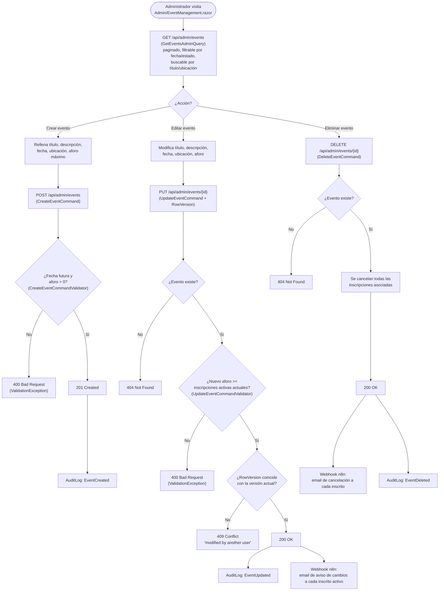

# Administración de eventos (CRUD)

Exclusiva del rol `Administrator`: alta, edición y baja de los eventos que los socios pueden consultar y a los que pueden inscribirse. Referenciado desde la sección [`e. Funcionalidades principales`](../../README.md#e-funcionalidades-principales) del README.

## Flujo

## Explicación del flujo

`AdminEventsController` (`[Authorize(Roles = "Administrator")]`, ruta `api/admin/events`) es el CRUD completo de eventos. El listado (`GetEventsAdminQuery`) añade sobre la vista pública ([`calendario-eventos.md`](calendario-eventos.md)) paginación, filtro por rango de fechas y por si el evento es futuro o pasado (`isUpcoming`), y búsqueda de texto por título o ubicación — vistas que un socio no necesita pero un administrador sí, para gestionar decenas o cientos de eventos históricos.

`CreateEventCommandValidator` (FluentValidation, ejecutado por `ValidationBehavior` antes de que el handler se invoque) exige fecha futura y aforo mayor que cero; la propia entidad `Event` repite ambas comprobaciones en sus *setters* como defensa adicional (`ValidateFutureDate()`, validación de `MaxCapacity`), de modo que ninguna vía de creación de un `Event` — presente o futura — pueda saltárselas (ver [modelo de dominio](../architecture/architecture.md#7-modelo-de-dominio)).

`UpdateEventCommand` añade dos protecciones que `CreateEvent` no necesita, al modificar un evento que ya puede tener inscripciones:

- **Coherencia de aforo**: `UpdateEventCommandValidator` consulta el número de inscripciones activas del evento y rechaza (`ValidationException` → `400 Bad Request`) cualquier `MaxCapacity` inferior a ese número, para no dejar "de más" a socios ya inscritos.
- **Concurrencia optimista**: la petición debe incluir el `RowVersion` que el cliente leyó al cargar el formulario de edición; si otro administrador modificó el evento entretanto, EF Core lanza `DbUpdateConcurrencyException` y la Api responde `409 Conflict`, obligando a recargar los datos antes de reintentar — el mismo mecanismo que evita que dos socios se inscriban simultáneamente en la última plaza (ver [`inscripcion-eventos.md`](inscripcion-eventos.md)).

Tanto editar como eliminar un evento notifican, tras el `SaveChangesAsync`/`CommitAsync` exitoso, a cada socio con una inscripción activa a través del webhook de n8n correspondiente (`event-updated` o `event-cancelled`) — `DeleteEventCommand`, además, cancela automáticamente todas las `Registration` asociadas antes de eliminar el evento, así que ningún socio inscrito se queda sin avisar de que el evento ya no tendrá lugar. Las tres operaciones de escritura quedan registradas en `AuditLog` (`EventCreated`/`EventUpdated`/`EventDeleted`).
