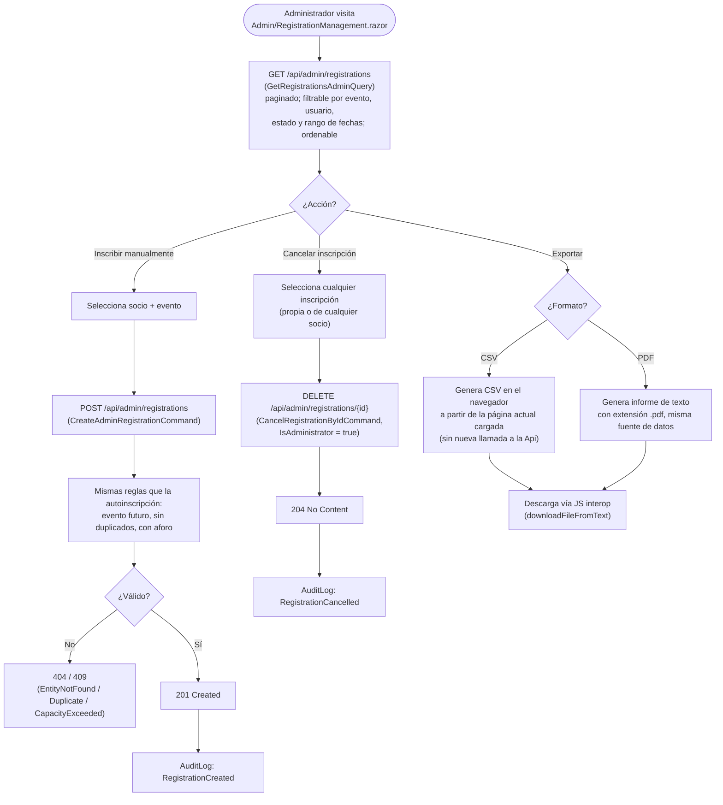

# Administración de inscripciones

Exclusiva del rol `Administrator`: visión global de todas las inscripciones del club, inscripción manual de un socio y cancelación de cualquier inscripción, con exportación a CSV/PDF. Referenciado desde la sección [`e. Funcionalidades principales`](../../README.md#e-funcionalidades-principales) del README.

## Flujo

## Explicación del flujo

`AdminRegistrationsController` (`[Authorize(Roles = "Administrator")]`, ruta `api/admin/registrations`) da a los administradores la vista que antes solo existía en la cabeza del secretario del club: todas las inscripciones de todos los socios a todos los eventos, filtrables por evento, por socio, por estado (`RegistrationStatus`) y por rango de fechas del evento, con paginación y ordenación configurables (`GetRegistrationsAdminQuery`).

**Inscripción manual** (`POST /api/admin/registrations`, `CreateAdminRegistrationCommand`) cubre el caso de un socio que sigue prefiriendo pedir la inscripción por teléfono o en persona: el administrador la da de alta en su nombre. El handler aplica exactamente las mismas reglas de negocio que la autoinscripción (evento no finalizado, sin duplicados, con aforo disponible — ver [`inscripcion-eventos.md`](inscripcion-eventos.md)), evitando dos implementaciones divergentes de la misma regla.

**Cancelación** (`DELETE /api/admin/registrations/{id}`, `CancelRegistrationByIdCommand` con `IsAdministrator = true`) reutiliza el mismo comando que la cancelación de autoservicio (`RegistrationsController.CancelMyRegistration`), pero con el flag `IsAdministrator` que omite la comprobación de propiedad — el administrador puede cancelar la inscripción de cualquier socio, no solo la propia.

**Exportación a CSV/PDF**: a diferencia del resto de operaciones descritas en este documento, la exportación **no llama a ningún endpoint nuevo de la Api**. `RegistrationManagement.razor.cs` construye el fichero directamente en el navegador (`ExportCsvAsync`/`ExportPdfAsync`) a partir de los datos **ya cargados en la página actual** (`_registrations.Items`) y lo descarga vía interoperabilidad JavaScript (`downloadFileFromText`). Esto implica que la exportación refleja exactamente lo que el administrador está viendo en pantalla — la página actual, con los filtros aplicados — y no un volcado completo de todas las inscripciones si hay más de una página de resultados; para exportar un conjunto distinto hay que ajustar antes los filtros o el tamaño de página.
