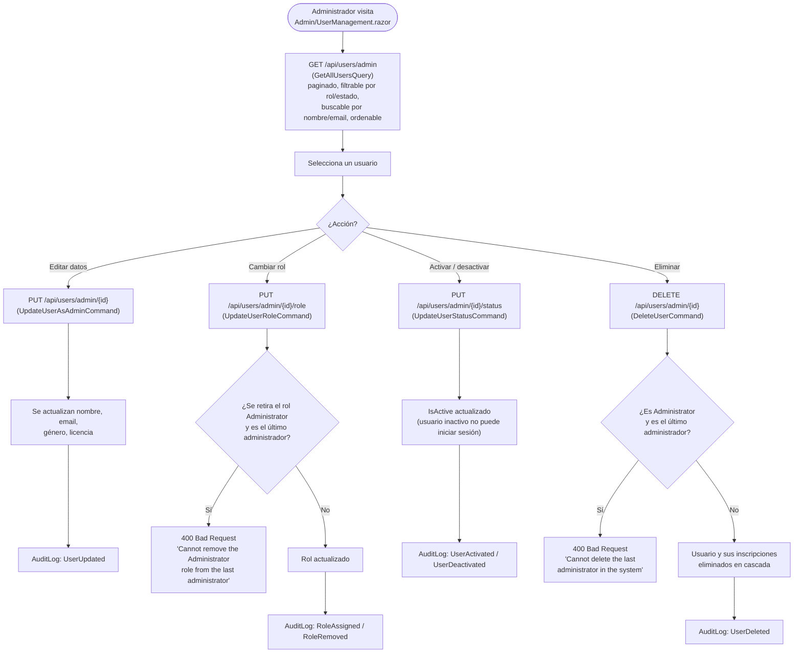

# Administración de usuarios

Exclusiva del rol `Administrator`: listado, edición, cambio de rol, activación/desactivación y borrado de cualquier socio del club. Referenciado desde la sección [`e. Funcionalidades principales`](../../README.md#e-funcionalidades-principales) del README.

## Flujo

## Explicación del flujo

`UsersController` expone un segundo grupo de endpoints bajo `/api/users/admin/...`, todos protegidos con `[Authorize(Roles = "Administrator")]` — un socio con rol `User` recibe `403 Forbidden` si intenta invocarlos.

El listado (`GET /api/users/admin`, `GetAllUsersQuery`) admite paginación, filtro por rol (`roleFilter`) y estado (`isActiveFilter`), búsqueda de texto libre por nombre o email (`searchText`), y ordenación configurable (`sortBy`/`sortOrder`) — necesario desde el momento en que el club tiene más socios de los que caben en una sola pantalla.

Dos operaciones incorporan una salvaguarda explícita para no dejar el sistema sin administradores: tanto `UpdateUserRoleCommandHandler` (al retirar el rol `Administrator` de un usuario) como `DeleteUserCommandHandler` (al eliminarlo) cuentan cuántos administradores quedarían tras la operación y la rechazan con `InvalidOperationException` (→ `400 Bad Request`) si el resultado fuera cero. Sin esta comprobación, un error de un único administrador podría dejar el club sin nadie capaz de gestionar la aplicación.

`DeleteUser` es un borrado físico, no lógico: elimina el usuario y, en cascada, todas sus `Registration` asociadas — a diferencia de `UpdateUserStatus`, que solo desactiva la cuenta (`IsActive = false`) sin perder su histórico, impidiéndole iniciar sesión pero conservando sus inscripciones pasadas.

Las cuatro operaciones de escritura (`UpdateUserAsAdmin`, `UpdateUserRole`, `UpdateUserStatus`, `DeleteUser`) registran una entrada en `AuditLog` a través de `IAuditService`, capturando qué administrador realizó el cambio, sobre qué usuario, cuándo, y desde qué IP/User-Agent — la traza de auditoría que la gestión manual por WhatsApp nunca tuvo.
