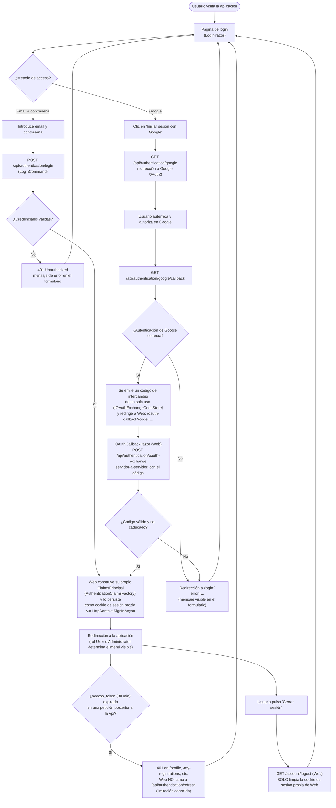

# Autenticación (inicio y cierre de sesión)

Funcionalidad transversal: es el punto de entrada obligatorio para cualquier operación que no sea pública (consultar el calendario de eventos es la única excepción — ver [`calendario-eventos.md`](calendario-eventos.md)). Referenciado desde la sección [`g. Funcionalidades principales`](../../README.md#g-funcionalidades-principales) del README.

## Flujo

## Explicación del flujo

La aplicación admite dos métodos de acceso, gestionados ambos por `AuthenticationController` (`SportsClubEventManager.Api`):

- **Login local (email + contraseña)**: el formulario envía las credenciales a `POST /api/authentication/login`, que despacha un `LoginCommand` vía MediatR. El handler compara el hash de la contraseña (`BCrypt.Net-Next`, factor de coste 12) y, si es válido, emite un JWT de acceso y un refresh token en la respuesta.
- **Login federado con Google OAuth2**: el botón "Iniciar sesión con Google" invoca `GET /api/authentication/google`, que lanza un `Challenge` contra el esquema de Google (`Microsoft.AspNetCore.Authentication.Google`). Tras el consentimiento del usuario en Google, este redirige a `GET /api/authentication/google/callback`, donde la Api recupera el `access_token`/`refresh_token` emitidos. **Como el navegador está hablando con el origen de la Api en este punto, no con el de Web**, la Api no puede establecer directamente la sesión de Web: en su lugar emite un código de intercambio de un solo uso (`IOAuthExchangeCodeStore`, en memoria) y redirige a `Web`'s `/oauth-callback?code=...`. Esa página (`OAuthCallback.razor`) canjea el código llamando servidor-a-servidor a `POST /api/authentication/oauth-exchange`, obteniendo los mismos datos que devolvería el login local (issue #125 — antes de este fix, la Api establecía cookies en su propio origen y redirigía a la raíz de Web, dejando al usuario aparentemente autenticado pero sin sesión real en Web).

En ambos flujos, el resultado (`LoginResponse` con el JWT de acceso, el refresh token y los datos del usuario) llega a **Web**, que construye su propio `ClaimsPrincipal` (`AuthenticationClaimsFactory`, compartido por ambos flujos) — incluyendo el JWT de acceso como claim propio, usado luego por `AuthTokenHandler` para autenticar las llamadas servidor-a-servidor a la Api — y lo persiste mediante su propio esquema de cookie de autenticación (`HttpOnly`, `Secure` fuera de `Development`, expira a los 30 minutos con expiración deslizante). El uso de una cookie `HttpOnly` — en vez de almacenar el token en `localStorage` — evita que un script malicioso inyectado (XSS) pueda robar la sesión.

> **Limitación conocida — sin refresco automático:** aunque `POST /api/authentication/refresh` (`RefreshTokenCommand`) existe y funciona, **Web nunca lo invoca**. El `AccessToken` que `AuthTokenHandler` adjunta a las llamadas servidor-a-servidor hacia la Api caduca a los 30 minutos desde el login y no se renueva, aunque la cookie de sesión del propio Web siga viva más tiempo (`SlidingExpiration`). Pasado ese plazo, páginas como `/profile` o `/my-registrations` vuelven a fallar con 401 hasta que el usuario cierra sesión y vuelve a iniciarla. Ver el detalle en [`docs/technical/US-27-oauth2-authentication.md`](../technical/US-27-oauth2-authentication.md#sin-refresco-automático-de-token-desde-el-web).

> **Limitación conocida — el logout no revoca nada en el servidor:** `GET /account/logout` en Web (`LoginDisplay.razor`) solo limpia la cookie de sesión propia de Web (`HttpContext.SignOutAsync`) — **nunca llama** a `POST /api/authentication/logout` (`LogoutCommand`), así que el `refresh_token` emitido en el login sigue siendo válido en base de datos hasta su expiración natural (7 días), aunque Web ni siquiera lo conserve tras el login (solo guarda el `access_token` como claim). Si ese `refresh_token` hubiera sido interceptado en algún momento (p. ej. en la propia respuesta de `POST /api/authentication/login`, antes de que Web lo descarte), seguiría siendo válido contra `POST /api/authentication/refresh` durante los 7 días completos aunque el usuario ya haya pulsado "Cerrar sesión". Ver [`docs/technical/US-27-oauth2-authentication.md`](../technical/US-27-oauth2-authentication.md#limitaciones-conocidas).
