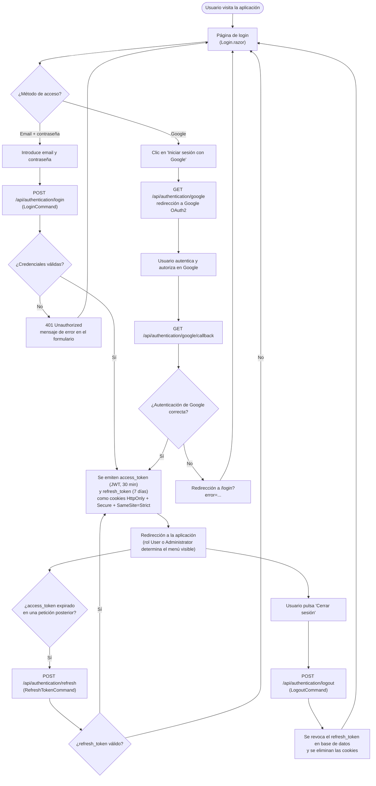

# Autenticación (inicio y cierre de sesión)

Funcionalidad transversal: es el punto de entrada obligatorio para cualquier operación que no sea pública (consultar el calendario de eventos es la única excepción — ver [`calendario-eventos.md`](calendario-eventos.md)). Referenciado desde la sección [`e. Funcionalidades principales`](../../README.md#e-funcionalidades-principales) del README.

## Flujo

## Explicación del flujo

La aplicación admite dos métodos de acceso, gestionados ambos por `AuthenticationController` (`SportsClubEventManager.Api`):

- **Login local (email + contraseña)**: el formulario envía las credenciales a `POST /api/authentication/login`, que despacha un `LoginCommand` vía MediatR. El handler compara el hash de la contraseña (`BCrypt.Net-Next`, factor de coste 12) y, si es válido, emite un JWT de acceso y un refresh token.
- **Login federado con Google OAuth2**: el botón "Iniciar sesión con Google" invoca `GET /api/authentication/google`, que lanza un `Challenge` contra el esquema de Google (`Microsoft.AspNetCore.Authentication.Google`). Tras el consentimiento del usuario en Google, este redirige a `GET /api/authentication/google/callback`, donde la Api recupera el `access_token`/`refresh_token` emitidos y continúa por el mismo camino que el login local.

En ambos casos, el resultado se materializa en dos **cookies `HttpOnly`, `Secure` y `SameSite=Strict`**: `access_token` (JWT, expira a los 30 minutos) y `refresh_token` (expira a los 7 días). El uso de cookies `HttpOnly` — en vez de almacenar el token en `localStorage` — evita que un script malicioso inyectado (XSS) pueda robar la sesión.

Cuando el `access_token` caduca durante el uso normal de la aplicación, `POST /api/authentication/refresh` (`RefreshTokenCommand`) emite un nuevo par de tokens sin que el usuario tenga que volver a introducir sus credenciales, siempre que el `refresh_token` siga siendo válido. Si también ha expirado o ha sido revocado, el usuario es redirigido de nuevo a la pantalla de login.

`POST /api/authentication/logout` (`LogoutCommand`, requiere estar autenticado) revoca el `refresh_token` almacenado en base de datos y limpia ambas cookies — un token robado después de un logout ya no puede usarse para obtener una nueva sesión, aunque el `access_token` JWT original técnicamente siga siendo válido hasta su expiración natural (máximo 30 minutos).
