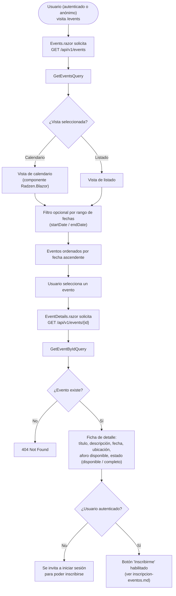

# Consulta del calendario de eventos

Única funcionalidad de la aplicación accesible sin autenticación: cualquier visitante puede consultar los eventos publicados por el club. Referenciado desde la sección [`e. Funcionalidades principales`](../../README.md#e-funcionalidades-principales) del README.

## Flujo

## Explicación del flujo

`EventsController.GetEvents` (`[AllowAnonymous]`) expone `GET /api/v1/events` sin exigir autenticación — es el único endpoint de negocio de la Api abierto al público, coherente con el objetivo del proyecto de sustituir el CSV que hoy publica la federación por una vista navegable. Acepta un filtro opcional por rango de fechas (`startDate`, `endDate`) y devuelve siempre los eventos ordenados por fecha ascendente.

La interfaz Blazor (`Events.razor`) ofrece dos formas de explorar el mismo resultado: una **vista de calendario** (componente de Radzen.Blazor) y una **vista de listado**, sin que ninguna de las dos implique una consulta distinta a la Api — ambas consumen la misma respuesta de `GetEventsQuery`.

Al seleccionar un evento concreto, `EventDetails.razor` solicita `GET /api/v1/events/{id}` (`GetEventByIdQuery`), también público. La ficha de detalle calcula y muestra el aforo disponible y si el evento está "completo", derivados de `Event.CurrentRegistrations`/`Event.IsFull` (ver el modelo de dominio en [`docs/architecture/architecture.md`](../architecture/architecture.md#7-modelo-de-dominio)) — no de un contador mantenido aparte, evitando que ambos valores puedan desincronizarse.

Si el visitante no ha iniciado sesión, la ficha de detalle sigue siendo completamente visible, pero el botón de inscripción queda sustituido por una invitación a iniciar sesión: registrarse en un evento sí requiere autenticación (ver [`inscripcion-eventos.md`](inscripcion-eventos.md) y [`autenticacion.md`](autenticacion.md)).
