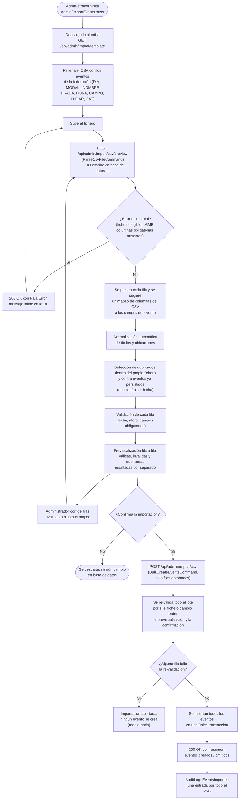

# Importación masiva de eventos por CSV

Exclusiva del rol `Administrator`: permite dar de alta en un solo paso todos los eventos del CSV que la federación publica online, en vez de transcribirlos uno a uno a mano. Referenciado desde la sección [`g. Funcionalidades principales`](../../README.md#g-funcionalidades-principales) del README.

## Flujo

## Explicación del flujo

`AdminImportController` (`[Authorize(Roles = "Administrator")]`, ruta `api/admin/import`) implementa el flujo en tres pasos que da nombre a este documento — el reemplazo directo del proceso manual descrito en la introducción del README: en vez de que el secretario transcriba a mano cada fila del CSV de la federación, la aplicación lo hace por él, con validación automática.

1. **Plantilla** (`GET /api/admin/import/template`): descarga un CSV de ejemplo con la cabecera estándar (`DÍA,MODAL.,NOMBRE TIRADA,HORA,CAMPO,LUGAR,CAT`) — el mismo formato que ya usa la federación, para que el administrador no tenga que adaptar manualmente el fichero que descarga de su web.

2. **Previsualización** (`POST /api/admin/import/csv/preview`, `ParseCsvFileCommand`): parsea el fichero subido **sin escribir nada en base de datos**. `ICsvEventImportParser` sugiere un mapeo de columnas del CSV a los campos del evento; `IEventImportValidationService` normaliza títulos y ubicaciones, detecta duplicados —tanto dentro del propio fichero como contra eventos ya existentes con el mismo título y fecha— y valida cada fila individualmente. Los errores estructurales del fichero (formato no reconocible, tamaño superior a 5 MB — `ImportSettings:MaxFileSizeBytes`, configurable; el límite de 10 MB que aparece en `RequestFormLimits`/el lector del navegador es solo un techo de transporte, no el límite real que ve el administrador — columnas obligatorias ausentes) se devuelven como `200 OK` con un `FatalError` descriptivo, no como un código de error HTTP, precisamente para que la interfaz pueda mostrar un mensaje amigable en el propio formulario en lugar de un fallo genérico. El administrador puede editar filas inválidas o ajustar el mapeo de columnas y volver a previsualizar tantas veces como necesite, sin ningún efecto en la base de datos.

3. **Confirmación** (`POST /api/admin/import/csv`, `BulkCreateEventsCommand`): solo cuando el administrador aprueba explícitamente el resultado de la previsualización se insertan los eventos. `BulkCreateEventsCommandHandler` **vuelve a validar todo el lote** antes de escribir nada —defensa en profundidad frente a un payload manipulado o desactualizado entre la previsualización y la confirmación— e inserta todos los eventos aprobados en una única transacción **todo o nada**: si una sola fila falla la re-validación, no se crea ningún evento del lote, evitando una importación parcial que dejaría el calendario en un estado inconsistente a medio revisar. Toda la operación queda registrada como una única entrada `AuditLog` de tipo `EventsImported`, con el resumen del lote completo, en vez de una entrada por cada evento creado.
