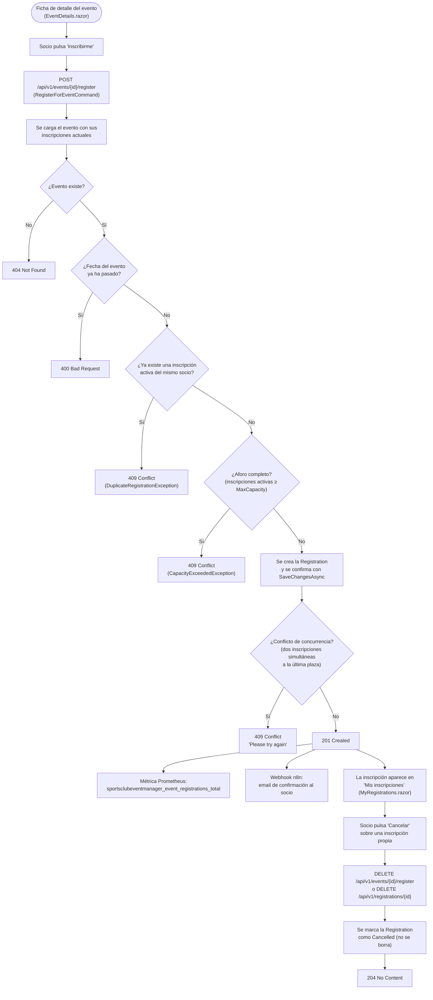

# Inscripción y cancelación de inscripción a eventos

El caso de uso principal del proyecto: sustituye el WhatsApp manual al secretario del club por una inscripción con validación automática de aforo y duplicados. Referenciado desde la sección [`e. Funcionalidades principales`](../../README.md#e-funcionalidades-principales) del README.

## Flujo

## Explicación del flujo

`EventsController.RegisterForEvent` (`[Authorize]`, `POST /api/v1/events/{id}/register`) despacha `RegisterForEventCommand` con el `EventId` de la ruta y el `UserId` extraído del JWT del socio autenticado — un usuario nunca puede inscribir a otro usuario por esta vía (esa capacidad es exclusiva de administradores, ver [`administracion-inscripciones.md`](administracion-inscripciones.md)).

`RegisterForEventCommandHandler` aplica, en orden, las tres reglas de negocio que antes verificaba manualmente el secretario del club por WhatsApp:

1. **El evento no puede haber pasado ya** (`Event.ValidateFutureDate`, vía comparación directa de `Event.Date` con `DateTime.UtcNow`).
2. **El socio no puede tener ya una inscripción activa** para el mismo evento (`DuplicateRegistrationException` si existe una `Registration` con `Status != Cancelled`).
3. **El evento no puede estar completo** (`CapacityExceededException` si las inscripciones activas ya igualan `MaxCapacity`).

Si las tres se cumplen, se crea la `Registration` y se confirma con `SaveChangesAsync`. `Event.RowVersion` proporciona **concurrencia optimista** de EF Core: si dos socios intentan inscribirse simultáneamente en la última plaza disponible, uno de los dos recibe un `DbUpdateConcurrencyException`, que el handler traduce en un `409 Conflict` pidiendo reintentar — nunca se permite que el aforo se sobrepase por una condición de carrera.

Solo **después** de que `SaveChangesAsync` confirme la escritura se disparan los efectos secundarios: el contador Prometheus `sportsclubeventmanager_event_registrations_total{source="self-service"}` y la notificación por email vía el webhook de n8n `registration-confirmed` (ver la [sección 9 del documento de arquitectura](../architecture/architecture.md#9-flujo-end-to-end-inscribirse-a-un-evento) para el diagrama de secuencia completo, capa por capa).

La cancelación (`DELETE /api/v1/events/{id}/register` desde la ficha del evento, o `DELETE /api/v1/registrations/{id}` desde "Mis inscripciones") no elimina el registro: `Registration.Cancel()` cambia su `Status` a `Cancelled`, conservando el histórico completo de altas y bajas de cada socio — visible en "Mis inscripciones" (`MyRegistrations.razor`) y en el panel de administración ([`administracion-inscripciones.md`](administracion-inscripciones.md)).
