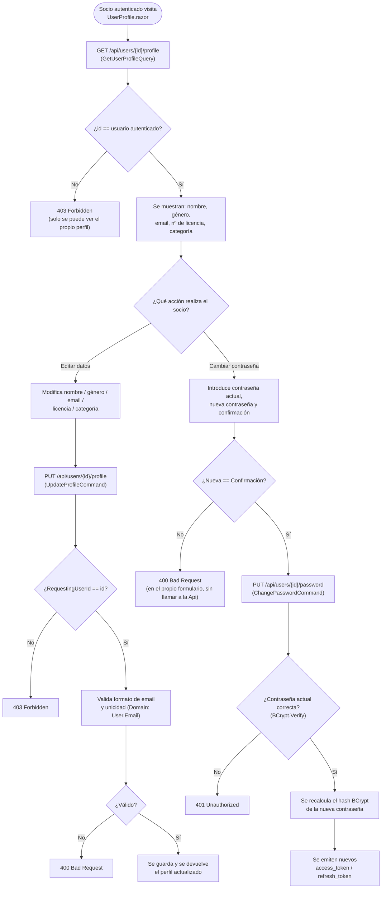

# Gestión del perfil propio

Permite a cualquier socio consultar y actualizar sus propios datos, y cambiar su contraseña, sin intervención de un administrador. Referenciado desde la sección [`g. Funcionalidades principales`](../../README.md#g-funcionalidades-principales) del README.

## Flujo

## Explicación del flujo

`UsersController` (`[Authorize]`) expone tres endpoints bajo `/api/users/{id}/...`, y los tres comparten la misma comprobación de propiedad: el `id` de la ruta debe coincidir con el `UserId` extraído del JWT del solicitante (`ClaimTypes.NameIdentifier`). Un socio nunca puede consultar ni modificar el perfil de otro socio por esta vía — esa capacidad queda reservada al rol `Administrator` (ver [`administracion-usuarios.md`](administracion-usuarios.md)).

- **`GET /api/users/{id}/profile`** (`GetUserProfileQuery`) devuelve los datos editables del perfil: nombre, género, email, número y categoría de licencia federativa.
- **`PUT /api/users/{id}/profile`** (`UpdateProfileCommand`) actualiza esos mismos campos. `User.Email`, al ser una propiedad de la entidad de dominio con validación en su propio *setter* (ver [modelo de dominio](../architecture/architecture.md#7-modelo-de-dominio)), rechaza cualquier formato de email inválido antes de llegar a persistirse, independientemente de si la validación de `FluentValidation` en `Application` ya lo había capturado antes.
- **`PUT /api/users/{id}/password`** (`ChangePasswordCommand`) exige la contraseña actual (verificada con `BCrypt.Net-Next` contra el hash almacenado) antes de aceptar la nueva; la comprobación de que "nueva contraseña" y "confirmación" coinciden se hace en el propio formulario Blazor antes de llamar a la Api, evitando una petición innecesaria si ya se sabe que fallará. Un cambio de contraseña exitoso invalida implícitamente la sesión anterior: se emite un nuevo `access_token`/`refresh_token`, igual que en un login normal.

Ninguno de estos tres flujos pasa por `AdminUser:Password` ni por ningún privilegio elevado — son operaciones de autoservicio, coherentes con el objetivo del proyecto de que el socio gestione sus propios datos sin depender del secretario del club.
