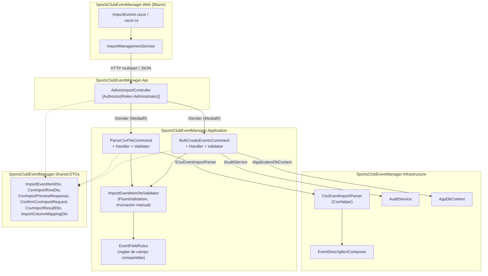
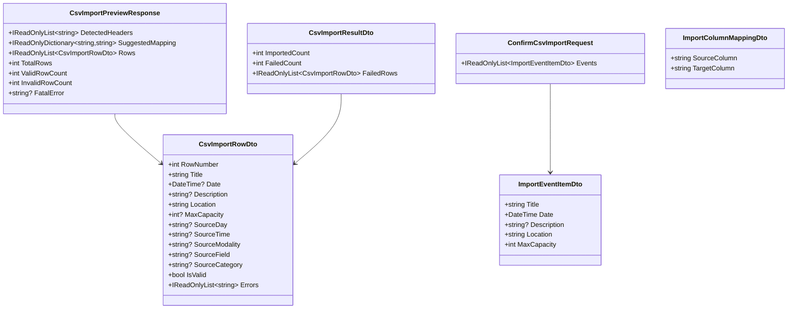

# Importación de Eventos desde CSV (Issue #35) — Documentación Técnica

**Historia / Issue:** #35
**Rama de trabajo:** features/import-implement-csvexcel-event-import
**Documento de diseño relacionado:** `.claude/docs/sdlc/design/issue-35-csv-event-import.md`
**Resumen de implementación:** `.claude/docs/sdlc/development/issue-35-csv-event-import.md`
**Estado:** Implementado (pendiente de fase de Testing/QA para bUnit y cobertura formal)

---

## Overview

Esta funcionalidad añade a la zona de Administración un flujo de **importación masiva de
eventos desde un fichero CSV**, con un patrón *preview/confirm* sin estado en el servidor: el
administrador sube un fichero, el sistema lo parsea y valida fila a fila sin escribir en base de
datos, el administrador revisa/corrige el resultado en pantalla, y solo al confirmar se insertan
los eventos en una única transacción "todo o nada".

El fichero de entrada usa una cabecera estandarizada de 7 columnas en español
(`DÍA,MODAL.,NOMBRE TIRADA,HORA,CAMPO,LUGAR,CAT`), que el parser combina/compone en los 5 campos
editables de la entidad `Event` (`Title`, `Date`, `Description`, `Location`, `MaxCapacity`). No se
ha añadido ninguna migración de base de datos: la funcionalidad reutiliza el esquema existente de
`Event`.

Solo se soporta `.csv` en esta iteración; a pesar de que el nombre de la rama menciona Excel, no
se implementó un parser de `.xlsx` (ver [Extension points](#extension-points-y-limitaciones)).

---

## Architecture

La funcionalidad sigue la Clean Architecture ya establecida en el resto del repositorio, sin
introducir capas nuevas. Se apoya en tres endpoints REST nuevos, un parser CSV en Infrastructure,
dos *commands* de MediatR en Application, y una página Blazor nueva en Web.



### Capas y responsabilidades

| Capa | Componente | Responsabilidad |
|---|---|---|
| Web | `ImportEvents.razor(.cs)` | Página `/admin/events/import`; sube fichero, muestra grid de previsualización, gestiona selección/edición por fila y remapeo de columnas |
| Web | `ImportManagementService` | `HttpClient` tipado: descarga de plantilla, subida `multipart/form-data` para preview, `POST` JSON para confirmar |
| Api | `AdminImportController` | 3 endpoints REST bajo `[Authorize(Roles = "Administrator")]`; valida extensión/tamaño de fichero antes de invocar MediatR |
| Application | `ParseCsvFileCommand/Handler/Validator` | Orquesta el parseo (dry-run) y la validación de campo por fila; no escribe en BD |
| Application | `BulkCreateEventsCommand/Handler/Validator` | Revalida cada fila (defensa en profundidad) e inserta todo en una transacción; escribe un único registro de auditoría |
| Application | `EventFieldRules` / `ImportEventItemDtoValidator` | Reglas de campo compartidas entre preview y confirm (Title/Location/Description/Date/MaxCapacity) |
| Infrastructure | `CsvEventImportParser` | Lee el stream CSV con `CsvHelper`, resuelve cabeceras, combina `DÍA`+`HORA`, aplica límites de tamaño/filas |
| Infrastructure | `EventDescriptionComposer` | Compone `MODAL.`/`CAMPO`/`CAT` en el `Description` final |
| Shared | DTOs de `Shared/DTOs/` | Contrato de API entre Web y Api (serializados por HTTP) |

---

## Key Components

### `AdminImportController` (`src/SportsClubEventManager.Api/Controllers/AdminImportController.cs`)

Expone 3 endpoints, todos restringidos a `[Authorize(Roles = "Administrator")]`:

- **`GET /api/admin/import/template`** — Devuelve un CSV embebido en el código (constante
  `TemplateCsvContent`) con la cabecera estandarizada y una fila de ejemplo, codificado en UTF-8
  **con BOM** para que `DÍA` se muestre correctamente en Excel.
- **`POST /api/admin/import/csv/preview`** — Recibe `multipart/form-data` (`file`, `columnMapping`
  JSON opcional, `defaultMaxCapacity` opcional). Valida extensión `.csv` y tamaño máximo
  (`ImportSettings:MaxFileSizeBytes`) **antes** de invocar `ParseCsvFileCommand`. No escribe en BD.
- **`POST /api/admin/import/csv`** — Recibe `ConfirmCsvImportRequest` (JSON) con las filas ya
  aprobadas por el administrador y envía `BulkCreateEventsCommand`.

Un detalle de diseño importante: los fallos **estructurales** de fichero (extensión inválida,
fichero vacío, tamaño excedido, cabecera faltante) se devuelven como **`200 OK`** con
`CsvImportPreviewResponse.FatalError` relleno, en lugar de un `4xx`, para que la UI pueda mostrar
un mensaje amigable en línea sin tratar la respuesta como un error HTTP genérico.

### `ICsvEventImportParser` / `CsvEventImportParser`

Interfaz en `Application/Common/Interfaces/ICsvEventImportParser.cs`, implementada en
`Infrastructure/Import/CsvEventImportParser.cs` usando **CsvHelper 33.1.0**. Responsabilidades:

- Lectura del stream con detección de BOM UTF-8.
- Resolución de columnas: usa el `columnMapping` explícito si se proporciona, si no cae a
  coincidencia exacta case-insensitive contra las 7 columnas canónicas
  (`DÍA, MODAL., NOMBRE TIRADA, HORA, CAMPO, LUGAR, CAT`).
- Combinación de `DÍA` (formatos permitidos `dd/MM/yyyy` luego `yyyy-MM-dd`) + `HORA` (`HH:mm`,
  con fallback al valor configurado `ImportSettings:DefaultEventTime` cuando está en blanco) en un
  único `DateTime`.
- Delegación en `EventDescriptionComposer` para construir el `Description` compuesto.
- Aplicación de los límites `ImportSettings:MaxRowCount` (corte duro con error estructural) y
  detección de fichero vacío / cabecera inválida.
- Manejo de errores en dos niveles: cualquier excepción no controlada durante el parseo degrada a
  un `FatalError` genérico (nunca se registra el contenido de las filas en el log, solo
  recuentos).

### `EventFieldRules` y `ImportEventItemDtoValidator`

`EventFieldRules` (`Application/Common/Validators/EventFieldRules.cs`) centraliza las reglas de
campo como métodos estáticos puros (`ValidateTitle`, `ValidateLocation`, `ValidateDescription`,
`ValidateDate`, `ValidateMaxCapacity`), reutilizables tanto contra campos aún parcialmente
parseados (nullable, en el preview) como contra el DTO ya completo (`ImportEventItemDto`, en el
confirm). **No** sustituye a `CreateEventCommandValidator` / `UpdateEventCommandValidator`, que
permanecen intactos.

`ImportEventItemDtoValidator` es un `AbstractValidator<ImportEventItemDto>` de FluentValidation
que envuelve esas reglas. A diferencia del resto de validators del proyecto, **no** se ejecuta
automáticamente vía el pipeline `ValidationBehavior<TRequest,TResponse>` de MediatR (porque
`ImportEventItemDto` nunca es en sí mismo un `IRequest`): se inyecta como
`IValidator<ImportEventItemDto>` y se invoca **manualmente**, fila a fila, tanto en
`ParseCsvFileCommandHandler` como en `BulkCreateEventsCommandHandler`. Esto permite que un único
error de fila produzca un mensaje estructurado por fila en vez de abortar toda la petición con una
`ValidationException` genérica.

### `ParseCsvFileCommandHandler`

Orquesta el preview: resuelve `defaultMaxCapacity` (override de la petición o configuración),
llama a `ICsvEventImportParser.Parse(...)`, y si no hay `FatalError`, valida cada fila con
`ImportEventItemDtoValidator`, combinando los errores de parseo (`row.Errors`) con los de
validación de campo en una lista `Errors` deduplicada por fila. Registra recuentos (total,
válidas, inválidas) por `ILogger`, nunca contenido de fila.

### `BulkCreateEventsCommandHandler`

Orquesta el confirm, con **defensa en profundidad**: revalida cada fila recibida (por si el
payload del cliente estuviera obsoleto o manipulado). Si **cualquier** fila falla, no se persiste
nada y se devuelve la lista de filas fallidas (comportamiento *todo o nada*). Si todas son
válidas:

1. Abre una transacción explícita **solo si el proveedor de base de datos es relacional**
   (`_context.Database.IsRelational()`) — el proveedor EF Core InMemory usado en tests unitarios
   no soporta `BeginTransactionAsync`.
2. Mapea cada `ImportEventItemDto` a una nueva entidad `Event` y llama a
   `Event.ValidateFutureDate()` como defensa adicional a nivel de dominio.
3. Escribe **un único** registro de auditoría (`AuditAction.EventsImported = 11`) con el recuento
   y el listado de `{Title, Date}` importados, **antes** de `SaveChangesAsync`, siguiendo la
   convención ya establecida en el resto del código de auditoría.
4. Hace `SaveChangesAsync` y `CommitAsync` (si aplica).

### `EventDescriptionComposer`

Clase interna y estática de Infrastructure que compone `MODAL.` / `CAMPO` / `CAT` en un único
string, p. ej. `"Modality: Trap | Field: Campo 2 | Category: S1"`, omitiendo cualquier segmento en
blanco y devolviendo `null` si los tres están vacíos.

### `ImportEvents.razor` / `ImportEvents.razor.cs`

Página en `/admin/events/import`, restringida con `[Authorize(Roles = "Administrator")]`.
Mantiene todo el estado del flujo **en el propio componente** (no hay estado en servidor entre
preview y confirm): fichero seleccionado en memoria, resultado de preview, selección por fila
(`_rowSelections`), overrides de capacidad por fila (`_rowCapacityOverrides`) y selecciones de
remapeo de columnas (`_columnMappingSelections`). Al confirmar con éxito, limpia todo el estado
local.

---

## Data Flow / Sequence

El siguiente diagrama cubre el ciclo completo: descarga de plantilla (opcional), previsualización
(con remapeo opcional de columnas) y confirmación.

```mermaid
sequenceDiagram
    actor Admin as Administrador
    participant Page as ImportEvents.razor
    participant Svc as ImportManagementService
    participant Api as AdminImportController
    participant Parse as ParseCsvFileCommandHandler
    participant Parser as CsvEventImportParser
    participant Bulk as BulkCreateEventsCommandHandler
    participant DB as AppDbContext / SQL Server
    participant Audit as AuditService

    Admin->>Page: Selecciona fichero .csv
    Admin->>Page: Clic "Preview"
    Page->>Svc: PreviewCsvAsync(bytes, nombre, mapping?, maxCapacity?)
    Svc->>Api: POST /api/admin/import/csv/preview (multipart)
    Api->>Api: Valida extensión .csv y tamaño máximo
    alt fichero inválido
        Api-->>Svc: 200 OK { FatalError }
    else fichero válido
        Api->>Parse: Send(ParseCsvFileCommand)
        Parse->>Parser: Parse(stream, mapping, defaultMaxCapacity)
        Parser-->>Parse: CsvParseResult (filas mapeadas o FatalError)
        Parse->>Parse: Valida cada fila (ImportEventItemDtoValidator)
        Parse-->>Api: CsvImportPreviewResponse
        Api-->>Svc: 200 OK { Rows, ValidRowCount, InvalidRowCount, ... }
    end
    Svc-->>Page: CsvImportPreviewResponse
    Page->>Page: Renderiza grid; filas válidas preseleccionadas

    opt Cabeceras no coinciden
        Admin->>Page: Remapea columna(s) vía dropdown
        Admin->>Page: Clic "Preview" de nuevo
        Page->>Svc: PreviewCsvAsync(..., columnMapping)
        Note over Svc,Api: Mismo flujo de preview anterior
    end

    Admin->>Page: Edita MaxCapacity / deselecciona filas inválidas
    Admin->>Page: Clic "Confirm Import"
    Page->>Svc: ConfirmImportAsync(filas seleccionadas y válidas)
    Svc->>Api: POST /api/admin/import/csv (JSON)
    Api->>Bulk: Send(BulkCreateEventsCommand)
    Bulk->>Bulk: Revalida cada fila (defensa en profundidad)
    alt alguna fila falla revalidación
        Bulk-->>Api: CsvImportResultDto { FailedCount > 0, FailedRows }
        Api-->>Svc: 200 OK (nada persistido)
    else todas las filas válidas
        Bulk->>DB: BeginTransactionAsync (solo si relacional)
        Bulk->>DB: AddRange(nuevos Event)
        Bulk->>Audit: LogAsync(AuditAction.EventsImported, ...)
        Bulk->>DB: SaveChangesAsync
        Bulk->>DB: CommitAsync
        Bulk-->>Api: CsvImportResultDto { ImportedCount, FailedCount = 0 }
        Api-->>Svc: 200 OK
    end
    Svc-->>Page: CsvImportResultDto
    Page-->>Admin: Mensaje de éxito o resumen de filas fallidas
```

---

## API Reference

### `GET /api/admin/import/template`

- **Auth:** `[Authorize(Roles = "Administrator")]`
- **Respuesta:** `200 OK`, `text/csv`, fichero `event-import-template.csv` (UTF-8 con BOM)

### `POST /api/admin/import/csv/preview`

- **Auth:** `[Authorize(Roles = "Administrator")]`
- **Content-Type:** `multipart/form-data`
- **Campos de formulario:**

  | Campo | Tipo | Obligatorio | Descripción |
  |---|---|---|---|
  | `file` | fichero | Sí | El `.csv` a previsualizar |
  | `columnMapping` | string (JSON) | No | `List<ImportColumnMappingDto>` serializado |
  | `defaultMaxCapacity` | int | No | Override del `MaxCapacity` por defecto para todas las filas |

- **Límite de tamaño de formulario:** `[RequestFormLimits(MultipartBodyLengthLimit = 10_485_760)]`
  (10 MB, backstop a nivel de Kestrel; el límite real configurable es
  `ImportSettings:MaxFileSizeBytes`, aplicado en código).
- **Respuesta `200 OK`:** `CsvImportPreviewResponse` — **siempre** `200`, incluso ante errores
  estructurales (ver `FatalError`). No hay escritura en base de datos.

### `POST /api/admin/import/csv`

- **Auth:** `[Authorize(Roles = "Administrator")]`
- **Content-Type:** `application/json`
- **Body:** `ConfirmCsvImportRequest { Events: ImportEventItemDto[] }`
- **Respuesta `200 OK`:** `CsvImportResultDto { ImportedCount, FailedCount, FailedRows }`
- **Respuesta `400 BadRequest`:** cuando el handler lanza `DomainException` (p. ej. fecha pasada
  detectada en la revalidación de dominio)
- **Respuesta `401 Unauthorized`:** cuando no se puede extraer/parsear el `ClaimTypes.NameIdentifier`
  del token

---

## Modelo de Datos / DTOs (`Shared/DTOs/`)



### Mapeo de columnas CSV → `Event`

| Columna(s) origen | Campo `Event` | Regla |
|---|---|---|
| `NOMBRE TIRADA` | `Title` | Passthrough directo, recortado (`Trim`); máx. 200 caracteres |
| `LUGAR` | `Location` | Passthrough directo, recortado; máx. **500** caracteres (constraint real de `EventConfiguration`, distinto del límite de 300 usado por `CreateEventCommandValidator`) |
| `DÍA` + `HORA` | `Date` | `DÍA` en `dd/MM/yyyy` (o `yyyy-MM-dd`); `HORA` en `HH:mm`, con fallback a `ImportSettings:DefaultEventTime` (por defecto `09:00`) si está en blanco; fecha final debe ser futura |
| `MODAL.` / `CAMPO` / `CAT` | `Description` | Compuesto como `"Modality: X \| Field: Y \| Category: Z"`, omitiendo segmentos en blanco; máx. 2000 caracteres |
| *(sin columna origen)* | `MaxCapacity` | Por defecto `ImportSettings:DefaultMaxCapacity` (30), editable por fila en el grid de preview antes de confirmar; debe ser > 0 |

---

## Configuración

Sección `ImportSettings` en `appsettings.json` (claves centralizadas en
`Application/Common/Constants/ImportSettingsKeys.cs`):

| Clave | Valor por defecto | Uso |
|---|---|---|
| `ImportSettings:DefaultMaxCapacity` | `30` | `MaxCapacity` aplicado cuando no se indica override |
| `ImportSettings:DefaultEventTime` | `"09:00"` | Hora aplicada cuando `HORA` está en blanco |
| `ImportSettings:MaxFileSizeBytes` | `5242880` (5 MB) | Límite de tamaño de fichero, comprobado en el controller |
| `ImportSettings:MaxRowCount` | `5000` | Límite de filas de datos, comprobado durante el parseo |

---

## Edge Cases & Error Handling

El diseño usa un modelo de **error en dos niveles**, coherente en todo el flujo:

1. **Errores estructurales / a nivel de fichero** (`CsvImportPreviewResponse.FatalError`):
   - Extensión distinta de `.csv`.
   - Fichero vacío o sin cabecera válida.
   - Tamaño de fichero > `MaxFileSizeBytes`.
   - Número de filas > `MaxRowCount` (corte duro tan pronto se detecta).
   - Columna(s) requerida(s) ausente(s) tras aplicar el remapeo (con mensaje indicando qué columnas
     faltan y cuál es la cabecera esperada).
   - Fallo de lectura/encoding inesperado (capturado en un `catch` genérico dentro de
     `CsvEventImportParser.Parse`, degradado a un `FatalError` sin filtrar detalles del stack
     trace).
   - Estos casos devuelven `200 OK` con `FatalError` relleno (nunca un `4xx`), por decisión de UX
     explícita del diseño.

2. **Errores a nivel de fila** (`CsvImportRowDto.Errors` / `IsValid = false`):
   - `DÍA` ausente o con formato no reconocido.
   - `HORA` con formato no reconocido (nota: si `HORA` está en blanco, **no** es error; se aplica
     el valor por defecto).
   - `Title` / `Location` vacíos o que exceden su longitud máxima.
   - `Description` compuesto que excede 2000 caracteres.
   - `MaxCapacity` ≤ 0.
   - `Date` combinada que no es futura.
   - Estas filas se muestran en el grid con badges de error; el administrador puede deseleccionarlas
     o (para errores de columna) corregir el remapeo y volver a previsualizar.

3. **Revalidación en el confirm** (`BulkCreateEventsCommandHandler`): si **cualquiera** de las
   filas enviadas falla la revalidación (por ejemplo, un cliente con datos obsoletos), **no se
   persiste nada**: comportamiento estrictamente todo-o-nada. La respuesta detalla qué filas
   fallaron y por qué.

4. **Concurrencia de transacción con el proveedor InMemory de tests:** `BeginTransactionAsync` se
   omite cuando `_context.Database.IsRelational()` es `false`, evitando el
   `TransactionIgnoredWarning` que EF Core InMemory lanza como excepción por defecto. En
   producción (SQL Server), la transacción se abre siempre.

5. **Logging sin datos personales:** tanto el parser como los handlers registran únicamente
   recuentos (total de filas, válidas/inválidas, nombre de fichero) — nunca el contenido de las
   filas, para evitar fugas de PII en los logs.

---

## Extension points y limitaciones

- **Excel (`.xlsx`) no soportado todavía.** `ICsvEventImportParser` es una interfaz
  suficientemente estrecha para que un futuro `ExcelEventImportParser` (p. ej. usando
  `ClosedXML`/`EPPlus`) pueda registrarse en `DependencyInjection.cs` sin tocar los commands, el
  controller ni la página Web — bastaría con resolver la implementación adecuada según el
  content-type/extensión del fichero subido.
- **Estructura plana asumida.** El parser asume una única fila de cabecera y filas de datos planas
  (`DÍA` por fila). No soporta el formato real del Google Sheet original con secciones por mes
  (`ENERO`, `FEBRERO`, ...) ni rangos de días (`7-8`); adaptarlo requeriría un parser con estado
  (*stateful*), un cambio de diseño más profundo.
- **Sin detección de duplicados.** El mismo título/fecha/ubicación puede importarse dos veces,
  tanto contra eventos ya existentes en BD como dentro del mismo fichero.
- **`CAT` sin traducción.** Los códigos de categoría (p. ej. `S1`) se insertan tal cual en la
  descripción; no existe tabla de lookup a nombres completos.
- **Sin cobertura bUnit para `ImportEvents.razor`**, consistente con el resto de páginas admin del
  repositorio (`EventManagement`, `RegistrationManagement`, `UserManagement`), ninguna de las
  cuales tiene tests bUnit todavía; queda para la fase QA (`sdlc-testing`).
- **`Microsoft.EntityFrameworkCore.Relational`** se añadió como dependencia de
  `Application.csproj` únicamente para poder usar `Database.IsRelational()` (mismo patrón ya
  usado en `Infrastructure/DependencyInjection.cs`).

---

## Cómo Verificar

```bash
dotnet build SportsClubEventManager.sln

dotnet test tests/SportsClubEventManager.Application/SportsClubEventManager.Application.csproj --filter "FullyQualifiedName~Import"
dotnet test tests/SportsClubEventManager.Infrastructure/SportsClubEventManager.Infrastructure.csproj --filter "FullyQualifiedName~Import"

dotnet format SportsClubEventManager.sln --verify-no-changes
```

Cobertura de tests actual (según el resumen de desarrollo): 6 tests para
`ParseCsvFileCommandHandler`, 4 para `BulkCreateEventsCommandHandler` y 10 para
`CsvEventImportParser` (`tests/SportsClubEventManager.Application/Import/` y
`tests/SportsClubEventManager.Infrastructure/Import/`).

---

**Fin de Documentación Técnica — Issue #35 (Importación de Eventos CSV)**
