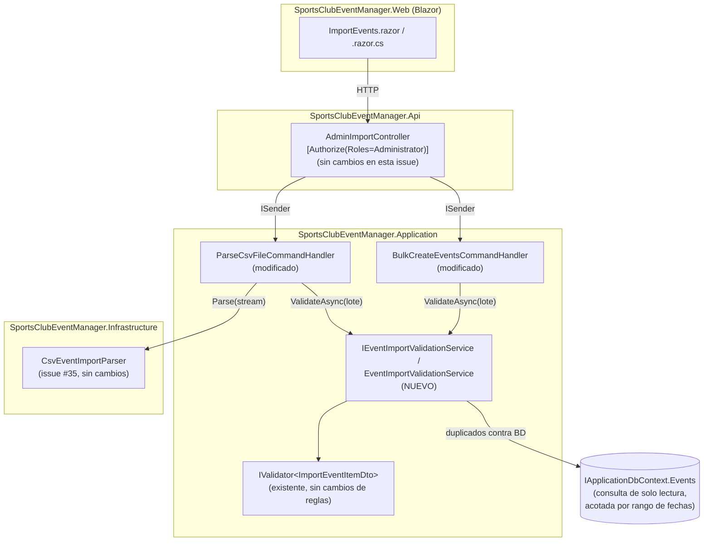

# Validación y Normalización de Eventos Importados desde CSV (Issue #36) — Documentación Técnica

**Historia / Issue:** #36
**Rama de trabajo:** features/import-implement-automatic-event-extraction-and-validation
**Documento de diseño relacionado:** `.claude/docs/sdlc/design/issue-36-validacion-normalizacion-eventos-csv.md`
**Resumen de implementación:** `.claude/docs/sdlc/development/issue-36-validacion-normalizacion-eventos-csv.md`
**Feature previa relacionada:** #35 — Importación de Eventos desde CSV
(`docs/technical/US-35-csv-event-import.md`)
**Estado:** Implementado, con tests unitarios y bUnit (fase de Testing/QA completada)

---

## Overview

Esta funcionalidad **no sustituye** la importación CSV de la issue #35 (ya en `master`); la
completa. Issue #35 dejó resuelto el *parseo* del fichero (`ICsvEventImportParser`) y la
validación *de campo* fila a fila, pero — tal como quedó documentado explícitamente en sus
propias limitaciones — **no** normalizaba la capitalización de títulos ni detectaba eventos
duplicados. Issue #36 cierra exactamente esas dos carencias, introduciendo un nuevo servicio,
`IEventImportValidationService` / `EventImportValidationService`, que centraliza para **todo el
lote**, en una única pasada:

1. **Normalización** — recorte de `Title`/`Location` y capitalización opcional del título
   (`ToTitleCase`, controlada por configuración).
2. **Validación de campo** — delega en el `IValidator<ImportEventItemDto>` ya existente de la
   issue #35, sin tocar sus reglas.
3. **Detección de duplicados**, en dos niveles: dentro del propio fichero subido (*intra-lote*) y
   contra eventos ya persistidos en base de datos.

Los dos *handlers* que ya existían de la issue #35 (`ParseCsvFileCommandHandler` para la vista
previa y `BulkCreateEventsCommandHandler` para la confirmación) dejaron de invocar el validador de
campo fila a fila y ahora invocan `IEventImportValidationService.ValidateAsync(...)` **una vez por
lote completo** — cambio necesario porque la detección de duplicados intra-lote necesita ver
todas las filas a la vez, y la detección contra BD necesita una única consulta acotada en lugar de
N consultas por fila.

No se ha añadido ninguna migración de base de datos ni ninguna librería nueva; el cambio es
enteramente de la capa Application (y un ajuste visual mínimo en Web).

---

## Architecture

La funcionalidad reutiliza exactamente la arquitectura ya establecida por la issue #35 (Clean
Architecture, MediatR + CQRS, `IApplicationDbContext` sin capa de repositorio). El único
componente nuevo es `EventImportValidationService`, situado en `Application/Import/Services/`
—no en `Infrastructure`— porque sus únicas dependencias (`IApplicationDbContext`,
`IValidator<ImportEventItemDto>`, `IConfiguration`) ya viven en Application.



### Qué cambia respecto a la issue #35

| Componente | Antes (issue #35) | Ahora (issue #36) |
|---|---|---|
| `ParseCsvFileCommandHandler` | Validaba cada fila individualmente con `IValidator<ImportEventItemDto>` inyectado directamente | Construye el lote completo de candidatos y llama **una vez** a `IEventImportValidationService.ValidateAsync` |
| `BulkCreateEventsCommandHandler` | Mismo patrón de validación fila a fila | Misma sustitución: una única llamada a `ValidateAsync` por lote; los `Event` se construyen a partir de `NormalizedItem`, no del payload crudo |
| `CsvImportRowDto` | Sin indicador de duplicado | Nueva propiedad `IsDuplicate` |
| `ImportSettingsKeys` | 4 claves (`DefaultMaxCapacity`, `DefaultEventTime`, `MaxFileSizeBytes`, `MaxRowCount`) | + `NormalizeTitleCapitalization` (bool, fallback `true`) |
| `ImportEvents.razor` | Badge de estado: `Valid` / `N error(s)` | + badge `Duplicate` (`bg-warning`), con prioridad sobre el badge de error genérico |
| `IValidator<ImportEventItemDto>` / `EventFieldRules` | — | Sin cambios; siguen siendo la única fuente de reglas de campo |

`ICsvEventImportParser`/`CsvEventImportParser` (el parser CSV en sí) **no se modifica**: sigue
siendo responsable únicamente de leer y mapear el fichero, tal como quedó diseñado en la issue
#35.

---

## Key Components

### `IEventImportValidationService` / `EventImportValidationService`

`src/SportsClubEventManager.Application/Common/Interfaces/IEventImportValidationService.cs` y
`src/SportsClubEventManager.Application/Import/Services/EventImportValidationService.cs`.

```csharp
public interface IEventImportValidationService
{
    Task<IReadOnlyList<ImportRowValidationResult>> ValidateAsync(
        IReadOnlyList<ImportEventItemDto> candidates,
        CancellationToken cancellationToken);
}
```

Registrado como `Scoped` en `Application/DependencyInjection.cs`. Es el `EventValidationService`
que la nota técnica original de la issue #36 pedía como pieza separada del parser/lector de CSV
(`ICsvEventImportParser`, que actúa de facto como el `EventImportService`).

`ValidateAsync` recibe el lote completo (`IReadOnlyList<ImportEventItemDto>`) y hace, en orden:

1. **Normalización** (método privado `Normalize`): `Title.Trim()` y, si
   `ImportSettings:NormalizeTitleCapitalization` está activo (por defecto `true`),
   `CultureInfo.InvariantCulture.TextInfo.ToTitleCase(trimmedTitle.ToLowerInvariant())`.
   `Location.Trim()` siempre. Esta normalización se re-aplica de forma defensiva aunque el parser
   de la issue #35 ya recorta, porque `BulkCreateEventsCommand` puede recibir un payload que no
   pasó por el parser (viene directamente del cliente en el paso de confirmación).
2. **Validación de campo**: `_itemValidator.Validate(normalized[i])` — el mismo
   `IValidator<ImportEventItemDto>`/`EventFieldRules` de la issue #35, sin cambios de reglas.
3. **Detección de duplicados intra-lote** (`DetectIntraBatchDuplicates`): agrupa el lote
   normalizado en memoria por `(Title.ToUpperInvariant(), Date)` — el `DateTime` **completo**,
   fecha y hora. Recorre las filas en orden y, con un diccionario `clave → primer índice`, la
   primera fila de cada clave queda registrada como "la buena"; cualquier fila posterior con la
   misma clave se marca como duplicado de esa primera, con el mensaje `Duplicate of row {N}` (N =
   posición 1-based de la primera fila del grupo).
4. **Detección de duplicados contra BD** (`DetectPersistedDuplicatesAsync`): calcula
   `minDate = normalized.Min(Date).Date` y `maxDateExclusive = normalized.Max(Date).Date.AddDays(1)`,
   ejecuta **una única consulta** `_context.Events.Where(e => e.Date >= minDate && e.Date <
   maxDateExclusive).Select(e => new { e.Title, e.Date })`, y compara en memoria por la misma
   clave `(Title.ToUpperInvariant(), Date)` exacta. Cualquier coincidencia se marca con el mensaje
   `An event with this title and date already exists`.
5. **Combinación**: los errores de campo (2) y los de duplicado (3+4) se concatenan y deduplican
   (`.Distinct()`); `IsValid = errors.Count == 0`; `IsDuplicate = true` si hubo *cualquier* error de
   duplicado (intra-lote y/o contra BD pueden coexistir, aunque en la práctica solo puede
   coincidir con uno de los dos motivos a la vez dado que la primera fila del grupo intra-lote
   "gana").
6. **Logging**: un único `ILogger.LogInformation` por lote con recuentos (total, duplicados
   intra-lote, duplicados contra BD) — **nunca** el contenido de título/ubicación, siguiendo la
   convención ya establecida por `CsvEventImportParser`/`ParseCsvFileCommandHandler` en la issue
   #35.

### `ImportRowValidationResult`

`src/SportsClubEventManager.Application/Import/Models/ImportRowValidationResult.cs` (modelo
interno, no es un DTO expuesto por la API):

```csharp
public sealed class ImportRowValidationResult
{
    public required ImportEventItemDto NormalizedItem { get; init; }
    public bool IsValid { get; init; }
    public bool IsDuplicate { get; init; }
    public IReadOnlyList<string> Errors { get; init; } = [];
}
```

### `ParseCsvFileCommandHandler` (modificado)

Ya no inyecta `IValidator<ImportEventItemDto>` directamente. Flujo: llama a
`ICsvEventImportParser.Parse(...)` (sin cambios), mapea cada `ImportRowParseResult` a un
`ImportEventItemDto` candidato (`ToCandidate`), llama **una vez** a
`IEventImportValidationService.ValidateAsync(candidates, ct)`, y combina (`Zip`) cada
`ImportRowValidationResult` con los metadatos de fila que ya tenía (`RowNumber`, columnas
`Source*`, errores de parseo de fecha/hora) mediante `BuildRowDto`. El `Title`/`Location` que
finalmente se devuelven en `CsvImportPreviewResponse` son ya los **valores normalizados**
(`validationResult.NormalizedItem.Title`/`.Location`), no el valor crudo tal como salió del
parser.

### `BulkCreateEventsCommandHandler` (modificado)

Sustituye el bucle `_itemValidator.Validate(item)` por una única llamada a
`_validationService.ValidateAsync(request.Events, ct)`. Se mantiene el comportamiento *todo o
nada* ya existente en la issue #35: si **cualquier** fila resulta inválida (incluidos los nuevos
casos de duplicado), no se persiste nada y se devuelve `FailedRows`. Cuando todas son válidas, los
`Event` que se crean se construyen a partir de `result.NormalizedItem` (no del `ImportEventItemDto`
crudo recibido en el payload), de modo que la capitalización/recorte normalizados quedan
reflejados en lo que finalmente se persiste en BD.

### `CsvImportRowDto.IsDuplicate` (nueva propiedad)

`src/SportsClubEventManager.Shared/DTOs/CsvImportRowDto.cs` añade `public bool IsDuplicate { get;
set; }`. Cambio puramente aditivo al contrato HTTP ya existente entre `AdminImportController` y
`ImportManagementService`/`ImportEvents.razor` — ningún endpoint cambia de forma.

### `ImportEvents.razor` (modificado)

En la columna "Status" de la tabla de vista previa, el orden de evaluación es: si
`row.IsDuplicate` → badge amarillo (`bg-warning text-dark`) con icono `bi-files` y texto
"Duplicate" (tooltip con `row.Errors` concatenados); si no y `row.IsValid` → badge verde "Valid";
si no → badge rojo con el recuento de errores. No fue necesario tocar
`ImportEvents.razor.cs`/`InitializeRowState`: esa función ya preseleccionaba
`_rowSelections[row.RowNumber] = row.IsValid`, y una fila duplicada llega desde el backend con
`IsValid = false` (porque un error de duplicado cuenta como error de fila), así que las filas
duplicadas heredan la no-preselección sin cambios de código adicionales.

### Configuración: `ImportSettings:NormalizeTitleCapitalization`

`src/SportsClubEventManager.Application/Common/Constants/ImportSettingsKeys.cs` añade:

```csharp
public const string NormalizeTitleCapitalization = "ImportSettings:NormalizeTitleCapitalization";
public const bool NormalizeTitleCapitalizationFallback = true;
```

Configurado en `src/SportsClubEventManager.Api/appsettings.json`, sección `ImportSettings`, junto
a las claves ya existentes de la issue #35 (`DefaultMaxCapacity`, `DefaultEventTime`,
`MaxFileSizeBytes`, `MaxRowCount`).

---

## Data Flow / Sequence

El siguiente diagrama cubre tanto la vista previa (*preview*) como la confirmación (*confirm*),
mostrando dónde se invoca `IEventImportValidationService` en cada una.

```mermaid
sequenceDiagram
    actor Admin as Administrador
    participant Page as ImportEvents.razor
    participant Api as AdminImportController
    participant Parse as ParseCsvFileCommandHandler
    participant Parser as CsvEventImportParser
    participant Val as EventImportValidationService
    participant DB as AppDbContext / SQL Server
    participant Bulk as BulkCreateEventsCommandHandler
    participant Audit as AuditService

    rect rgb(235, 245, 255)
    note over Page,DB: Vista previa (sin escritura en BD)
    Admin->>Page: Selecciona fichero, clic "Preview"
    Page->>Api: POST /csv/preview (multipart)
    Api->>Parse: Send(ParseCsvFileCommand)
    Parse->>Parser: Parse(stream, mapping, defaultMaxCapacity)
    Parser-->>Parse: filas mapeadas (Title/Date/Location/...)
    Parse->>Val: ValidateAsync(candidatos del lote completo)
    Val->>Val: Normaliza Title/Location (trim + ToTitleCase opcional)
    Val->>Val: Valida campo por fila (IValidator existente)
    Val->>Val: Agrupa por (Title, Date) exactos -> duplicados intra-lote
    Val->>DB: SELECT Title, Date WHERE Date BETWEEN [min, max) (1 consulta)
    DB-->>Val: eventos existentes en el rango
    Val->>Val: Compara claves -> duplicados contra BD
    Val-->>Parse: ImportRowValidationResult[] (NormalizedItem, IsValid, IsDuplicate, Errors)
    Parse-->>Api: CsvImportPreviewResponse (Title normalizado, IsDuplicate, Errors)
    Api-->>Page: 200 OK
    Page->>Page: Pinta grid; filas duplicadas muestran badge "Duplicate"\ny NO quedan preseleccionadas
    end

    rect rgb(255, 245, 230)
    note over Page,Audit: Confirmación (todo o nada)
    Admin->>Page: Revisa/deselecciona, clic "Confirm Import"
    Page->>Api: POST /csv (filas seleccionadas)
    Api->>Bulk: Send(BulkCreateEventsCommand)
    Bulk->>Val: ValidateAsync(request.Events) [misma lógica, defensa en profundidad]
    Val->>DB: SELECT Title, Date WHERE Date BETWEEN [min, max) (1 consulta)
    DB-->>Val: eventos existentes
    Val-->>Bulk: ImportRowValidationResult[]
    alt alguna fila inválida o duplicada
        Bulk-->>Api: CsvImportResultDto { FailedCount > 0, FailedRows }
        Api-->>Page: 200 OK (nada persistido)
    else todo válido
        Bulk->>DB: AddRange(Event con NormalizedItem.Title/Location)
        Bulk->>Audit: LogAsync(AuditAction.EventsImported)
        Bulk->>DB: SaveChangesAsync + Commit
        Bulk-->>Api: CsvImportResultDto { ImportedCount, FailedCount = 0 }
        Api-->>Page: 200 OK
    end
    end
```

---

## Algoritmo de detección de duplicados (detalle)

**Clave de duplicado**: `(Title.Trim().ToUpperInvariant() [ya normalizado], Date)`, donde `Date`
es el `DateTime` **completo** — fecha **y** hora — no solo la parte de fecha. Esta granularidad fue
una decisión cerrada explícitamente en Gate 2 del diseño (2026-07-08): dos tiradas con el mismo
nombre el mismo día pero a horas distintas se consideran eventos legítimamente distintos.
`Location` queda **deliberadamente excluida** de la clave — dos filas con mismo título/fecha/hora
pero distinta ubicación sí se marcan como duplicado.

**Nivel 1 — intra-lote**: recorre el lote normalizado en orden y usa un diccionario
`clave → índice de la primera fila`. La primera fila de cada clave repetida "gana" (queda con
`IsDuplicate = false`, salvo que además choque contra BD); todas las filas posteriores con la
misma clave se marcan `IsDuplicate = true` con `Duplicate of row {N}`, donde `N` es la posición
(1-based) de la primera fila del grupo dentro del lote recibido por el servicio. Con 3+ filas
idénticas, la 2ª y 3ª apuntan ambas a la 1ª (no entre sí).

**Nivel 2 — contra base de datos**: una única consulta de solo lectura acotada por
`[min(Date).Date, max(Date).Date + 1 día)` sobre `IApplicationDbContext.Events`, aprovechando el
índice ya existente `HasIndex(e => e.Date)` (`EventConfiguration.cs`). La comparación de la clave
exacta (incluyendo mayúsculas/minúsculas normalizadas y hora) se hace en memoria tras traer solo
`Title`+`Date` de los eventos en rango — evita tanto N consultas (una por fila) como depender de
que `ToUpper()`/comparaciones de igualdad de `DateTime` se traduzcan de forma fiable a SQL en el
proveedor EF Core.

**Riesgos residuales aceptados explícitamente en el diseño** (documentados aquí para trazabilidad,
no son defectos):
- Filas con `HORA` en blanco que comparten título y fecha heredan la misma
  `ImportSettings:DefaultEventTime` y sí se detectan como duplicado entre sí.
- Ninguna guarda adicional para lotes con rango de fechas muy amplio más allá del límite ya
  existente `ImportSettings:MaxRowCount` (5000 filas).
- No hay constraint único de BD ni revalidación inmediatamente antes de `SaveChangesAsync` para la
  condición de carrera entre dos administradores confirmando en paralelo sobre fechas/horas
  solapadas del mismo fichero.

---

## Edge Cases & Error Handling

Se mantiene el modelo de errores de dos niveles ya establecido por la issue #35
(estructural/`FatalError` vs. por fila/`Errors`+`IsValid`); esta issue solo añade nuevos motivos de
error **a nivel de fila**:

1. **Error de campo** (sin cambios, issue #35): título/ubicación vacíos o demasiado largos, fecha
   no futura, capacidad ≤ 0, etc. — reglas de `EventFieldRules`/`ImportEventItemDtoValidator`.
2. **Duplicado intra-lote** (nuevo): mensaje `Duplicate of row {N}`; `IsDuplicate = true`,
   `IsValid = false`.
3. **Duplicado contra BD** (nuevo): mensaje `An event with this title and date already exists`;
   `IsDuplicate = true`, `IsValid = false`.
4. **Combinación de errores**: una fila puede fallar simultáneamente por campo *y* por duplicado
   (por ejemplo, título vacío **y** coincidente en fecha con otra fila) — ambos mensajes se
   incluyen en `Errors` sin que uno enmascare al otro (verificado explícitamente por los tests
   `ValidateAsync_WhenCandidateFailsFieldValidation_MarksInvalidWithFieldErrorAndNotDuplicate` y
   `ValidateAsync_WhenRowIsBothFieldInvalidAndDuplicate_CombinesBothErrorSources`).
5. **Revalidación en el confirm**: si el payload del cliente llega obsoleto/manipulado
   (`BulkCreateEventsCommandHandler`), la detección de duplicados contra BD se vuelve a ejecutar
   con el estado actual de la base de datos, por lo que una fila que era válida en el momento del
   preview puede rechazarse en el confirm si otro evento colisionante se creó entretanto (riesgo de
   condición de carrera aceptado, ver arriba).
6. **Lote vacío**: `ValidateAsync` devuelve `[]` inmediatamente sin ejecutar ninguna consulta
   (`candidates.Count == 0`).
7. **Logging sin PII**: solo se registran recuentos (total de filas, duplicados intra-lote,
   duplicados contra BD), nunca títulos ni ubicaciones.

---

## Cómo Verificar

```bash
dotnet build SportsClubEventManager.sln

dotnet test tests/SportsClubEventManager.Application/SportsClubEventManager.Application.csproj --filter "FullyQualifiedName~Import"
dotnet test tests/SportsClubEventManager.Web.Tests/SportsClubEventManager.Web.Tests.csproj --filter "FullyQualifiedName~ImportEvents"

dotnet format SportsClubEventManager.sln --verify-no-changes
```

Cobertura de línea medida en la fase de Testing, acotada a los archivos nuevos/modificados por
esta issue:

| Archivo / Clase | Cobertura |
|---|---|
| `Application/Import/Services/EventImportValidationService.cs` | 100% |
| `Application/Import/Models/ImportRowValidationResult.cs` | 100% |
| `Application/Import/Commands/ParseCsvFile/ParseCsvFileCommandHandler.cs` | 100% |
| `Application/Import/Commands/BulkCreateEvents/BulkCreateEventsCommandHandler.cs` | 97% |
| `Web/Components/Pages/Admin/ImportEvents.razor` (+ code-behind) | 82.8% (antes: sin tests) |

Todas superan el umbral configurado del 75%.

---

## Extension points y limitaciones heredadas de la issue #35

- Sigue sin soportarse `.xlsx` (solo CSV) — sin cambios en esta issue.
- El parser sigue asumiendo estructura plana (una fila por evento), no el formato original con
  secciones por mes.
- La clave de duplicado no incluye `Location` (decisión de diseño explícita, ver arriba) ni
  tolera variaciones de hora aunque sean de pocos minutos.
- Si en producción se detecta degradación de rendimiento con calendarios de rango de fechas muy
  amplio en un único fichero, la mejora futura propuesta (fuera de alcance de esta issue) es un
  índice compuesto `(Date, Title)` en `EventConfiguration`.

---

**Fin de Documentación Técnica — Issue #36 (Validación y Normalización de Eventos CSV)**
