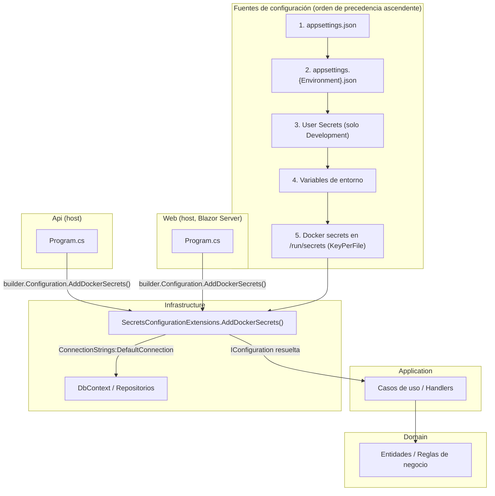
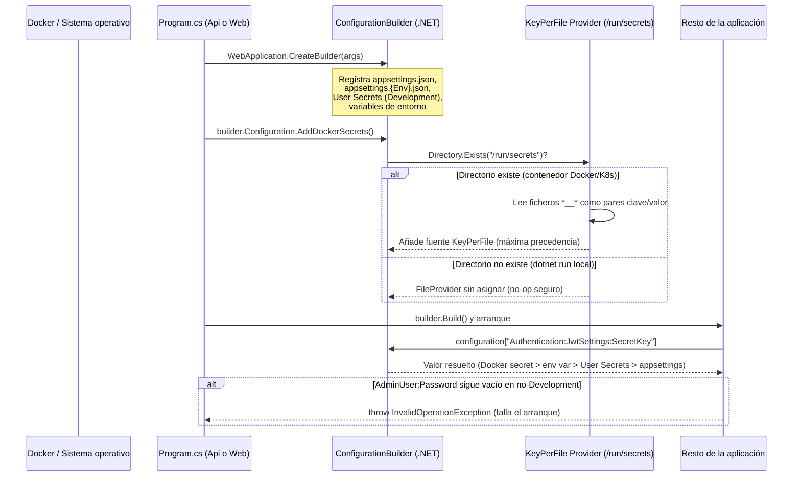
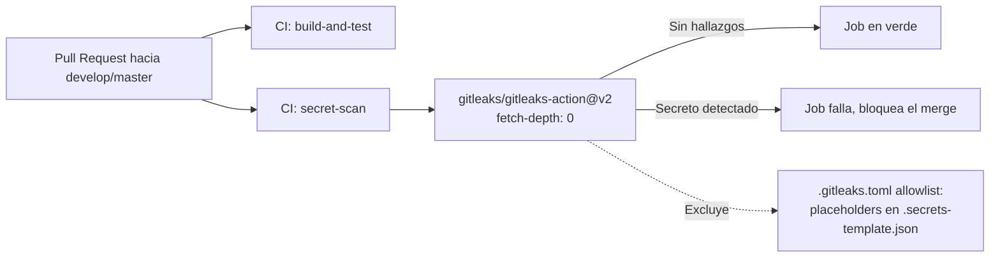

# US-38 Gestión de Secretos — Documentación Técnica

## Overview

Esta funcionalidad elimina la posibilidad de que credenciales reales (claves
JWT, credenciales OAuth2 de Google, contraseña del administrador semilla,
cadena de conexión a la base de datos) queden hardcodeadas o comiteadas en el
repositorio, y añade un mecanismo uniforme para inyectarlas en tiempo de
ejecución tanto en desarrollo local como en despliegues Docker.

La solución se apoya en tres pilares:

1. Un proveedor de configuración nuevo (`AddDockerSecrets`) en la capa
   `Infrastructure` que lee secretos montados como ficheros individuales
   (Docker/Kubernetes) con la máxima precedencia.
2. Los stacks de `docker-compose.yml` y `docker/docker-compose.prod.yml`
   pasan a declarar un bloque `secrets:` de nivel superior (driver
   `environment`) en lugar de exponer las claves sensibles como variables de
   entorno en texto plano.
3. Un job de CI (`secret-scan`, `gitleaks/gitleaks-action@v2`) que escanea
   cada Pull Request en busca de secretos comiteados por error, con una
   *allowlist* explícita para los placeholders de plantilla.

## Architecture

La lógica nueva vive en `SportsClubEventManager.Infrastructure/Configuration/`,
consumida desde los dos *hosts* ejecutables (`Api` y `Web`) en la capa más
externa de la Clean Architecture. No afecta a `Domain` ni a `Application`:
ambas capas siguen leyendo valores ya resueltos a través de
`IConfiguration`/`IOptions<T>` sin saber de dónde proceden.



**Precedencia de configuración**: `WebApplication.CreateBuilder(args)` ya
registra la cadena estándar de .NET (appsettings.json →
appsettings.{Environment}.json → User Secrets en Development → variables de
entorno → argumentos de línea de comandos). `AddDockerSecrets()` se invoca
justo después, como primera instrucción de `Program.cs` en ambos hosts, por
lo que su fuente `KeyPerFile` se añade **al final** de la cadena y por tanto
tiene **la máxima precedencia**: un fichero en `/run/secrets` siempre gana
sobre cualquier otro origen.

## Key Components

### `SecretsConfigurationExtensions` (`src/SportsClubEventManager.Infrastructure/Configuration/SecretsConfigurationExtensions.cs`)

Clase estática con el único método de extensión `AddDockerSecrets(this IConfigurationBuilder builder)`:

- Registra el proveedor `KeyPerFile` del paquete
  `Microsoft.Extensions.Configuration.KeyPerFile` (v10.0.9), apuntando al
  directorio de montaje estándar de Docker/Kubernetes: `/run/secrets`
  (constante privada `DefaultSecretsDirectory`).
- `options.SectionDelimiter = "__"`: cada fichero de secreto se nombra con el
  mismo convenio `__` ya usado por las variables de entorno del repositorio
  (p. ej. un fichero `authentication__jwtsettings__secretkey` se traduce a la
  clave de configuración `Authentication:JwtSettings:SecretKey`).
- `options.Optional = true` + comprobación explícita `Directory.Exists(...)`
  antes de construir el `PhysicalFileProvider`: si `/run/secrets` no existe
  (por ejemplo, al ejecutar `dotnet run` en local sin Docker), `FileProvider`
  se deja sin asignar y la fuente no aporta ningún valor, sin lanzar
  excepción. Esto es necesario porque el propio constructor de
  `PhysicalFileProvider` lanza `DirectoryNotFoundException` si el directorio
  no existe.
- **Desviación respecto al diseño original**: el diseño proponía una
  propiedad `SecretsDirectoryPath` y un `KeyDelimiter`; la versión real del
  paquete (10.0.9) no expone esos nombres — el directorio se aporta vía
  `FileProvider` (`IFileProvider`) y el delimitador se llama
  `SectionDelimiter` (con `"__"` ya como valor por defecto, fijado aquí de
  forma explícita para no depender de un default no documentado).

### Wiring en `Program.cs` (Api y Web)

Ambos hosts aplican el mismo patrón, por paridad:

```csharp
var builder = WebApplication.CreateBuilder(args);

builder.Configuration.AddDockerSecrets();
```

En `SportsClubEventManager.Api/Program.cs` esta línea va seguida de una
validación explícita: si `Authorization:AdminUser:DefaultPassword` sigue
conteniendo el placeholder (`"***"`) y no se ha resuelto un valor real para
`AdminUser:Password` fuera de `Development`, se lanza
`InvalidOperationException` al arrancar, evitando que la aplicación llegue a
producción con la contraseña de administrador sin configurar.

### `appsettings.json` (Api)

Los dos placeholders sensibles (`Authentication:JwtSettings:SecretKey` y
`Authorization:AdminUser:DefaultPassword`) usan ahora el texto
`*** SET VIA USER SECRETS (Development) OR DOCKER SECRETS (Production) — see docs/technical/secrets-management.md ***`,
reflejando el mecanismo real (no existe integración con Azure Key Vault en
este código base).

### `.secrets-template.json`

Plantilla de referencia (no consumida por la aplicación) que enumera los
secretos necesarios y los comandos `dotnet user-secrets set` exactos para
`Development`, incluyendo la sección `AdminUser.Password` añadida en este
cambio.

### `docker-compose.yml` / `docker/docker-compose.prod.yml`

Ambos ficheros declaran ahora un bloque `secrets:` de nivel superior con
driver `environment` (cada secreto Docker se resuelve a partir de una
variable de entorno del host que ejecuta `docker compose`):

| Secreto Docker | Variable de entorno origen | Clave de configuración resultante |
|---|---|---|
| `authentication__jwtsettings__secretkey` | `JWT_SECRET_KEY` | `Authentication:JwtSettings:SecretKey` |
| `authentication__google__clientid` | `GOOGLE_CLIENT_ID` | `Authentication:Google:ClientId` |
| `authentication__google__clientsecret` | `GOOGLE_CLIENT_SECRET` | `Authentication:Google:ClientSecret` |
| `adminuser__password` | `ADMIN_PASSWORD` | `AdminUser:Password` |
| `connectionstrings__defaultconnection` | `CONNECTION_STRING` | `ConnectionStrings:DefaultConnection` |

El servicio `api` monta los cinco secretos; el servicio `web` monta
únicamente `connectionstrings__defaultconnection` (necesita la cadena de
conexión para Blazor Server, pero no las credenciales de autenticación de la
Api). Las claves sensibles se eliminaron del bloque `environment:` de ambos
servicios en los dos ficheros. `docker/docker-compose.prod.yml` (el
realmente usado en el homelab vía Portainer) no declaraba estas claves en
absoluto antes de este cambio — era el hueco más grave detectado en el
diseño.

### `.gitleaks.toml` (raíz)

Configuración de `gitleaks` para el job `secret-scan` de CI:

- `[extend] useDefault = true`: reutiliza el conjunto de reglas por defecto
  de gitleaks (detecta patrones genéricos de claves AWS, JWT, etc.).
- `[allowlist]`: excluye del escaneo los placeholders de plantilla —
  expresiones regulares para `*** SET VIA|STORED IN USER SECRETS... ***` y
  `REPLACE_WITH_[A-Z_]+` — restringidas además por `paths` al fichero
  `.secrets-template.json`, para no silenciar accidentalmente secretos reales
  en otros ficheros.

## Data Flow / Sequence

### Resolución de configuración al arrancar un host (Api o Web)



### CI: detección de secretos comiteados



## Edge Cases & Error Handling

- **`/run/secrets` no existe** (desarrollo local con `dotnet run`, sin
  Docker): `AddDockerSecrets()` no lanza excepción; simplemente no añade
  ninguna fuente de valores. Verificado por
  `AddDockerSecrets_WhenSecretsDirectoryDoesNotExist_BuildDoesNotThrow` en
  `tests/SportsClubEventManager.Infrastructure/Configuration/SecretsConfigurationExtensionsTests.cs`.
- **`AdminUser:Password` no configurado fuera de `Development`**:
  `Api/Program.cs` lanza `InvalidOperationException` al arrancar, con un
  mensaje de excepción que **todavía menciona "Azure Key Vault"**
  (`"...Set 'AdminUser:Password' in Azure Key Vault or environment variables."`,
  línea ~25). Esto es una inconsistencia conocida y documentada como
  seguimiento: no existe integración con Azure Key Vault en este código base;
  el mensaje debería decir "Docker secrets or environment variables". No se
  corrigió durante el desarrollo por quedar fuera del alcance literal del
  diseño — se recomienda un ajuste puntual futuro.
- **Falsos positivos en `gitleaks`**: si el escáner marca un valor legítimo
  (por ejemplo, un nuevo placeholder de plantilla), se ajusta la sección
  `[allowlist]` de `.gitleaks.toml` añadiendo una regex o ruta adicional, en
  vez de deshabilitar el job.
- **Paquete `Azure.Core` eliminado**: era una dependencia huérfana en
  `SportsClubEventManager.Infrastructure.csproj` sin ningún uso real ni
  transitivo; se retiró junto con este cambio tras confirmarlo con un build
  completo del `.sln`.
- **Cobertura de test conocida como incompleta**: el método
  `AddDockerSecrets()` tiene hardcodeado el directorio `/run/secrets` sin
  ningún punto de inyección, por lo que la rama "el directorio existe y se
  leen ficheros reales" no se ejerce a través del método público en los
  entornos de test (Linux CI no permite crear subdirectorios en `/run`;
  Windows resuelve la ruta de otra forma). Los tests cubren esa rama
  reproduciendo la misma receta de opciones de `KeyPerFile` sobre un
  directorio temporal real, dejando constancia explícita de esta limitación
  en los comentarios XML de la clase de test.

## Extension points — cómo añadir un secreto nuevo

1. Añadir la clave al `appsettings.json` correspondiente con un placeholder
   siguiendo el formato ya usado:
   `*** SET VIA USER SECRETS (Development) OR DOCKER SECRETS (Production) — see docs/technical/secrets-management.md ***`.
2. Añadir la entrada equivalente (con `REPLACE_WITH_...`) y el comando
   `dotnet user-secrets set` correspondiente en `.secrets-template.json`.
3. En `docker-compose.yml` y `docker/docker-compose.prod.yml`: declarar el
   nuevo secreto en el bloque `secrets:` de nivel superior (driver
   `environment`, apuntando a una variable de entorno nueva), y añadirlo a la
   lista `secrets:` de los servicios (`api`/`web`) que lo necesiten. El
   nombre del secreto debe seguir el convenio `seccion__subseccion__clave`
   (minúsculas, delimitado por `__`) para que `KeyPerFile` lo traduzca
   correctamente a `Seccion:Subseccion:Clave`.
4. No es necesario tocar `SecretsConfigurationExtensions.cs`: el proveedor
   `KeyPerFile` ya traduce automáticamente cualquier fichero nuevo montado en
   `/run/secrets` sin cambios de código.
5. Si el nuevo secreto pudiera coincidir con un patrón de detección de
   `gitleaks` en algún fichero de ejemplo/plantilla, añadir la excepción
   correspondiente en `.gitleaks.toml`.
6. Añadir tests unitarios siguiendo el patrón de
   `SecretsConfigurationExtensionsTests.cs` si se introduce lógica nueva más
   allá de la traducción estándar de `KeyPerFile`.

## Verificación (comandos usados durante el desarrollo)

- `dotnet build SportsClubEventManager.sln --configuration Release`
- `docker compose -f docker-compose.yml config`
- `docker compose -f docker/docker-compose.prod.yml config`
- Pendiente de verificación manual (no automatizable): `docker compose up --build`
  con un `.env` que defina `JWT_SECRET_KEY`, `GOOGLE_CLIENT_ID`,
  `GOOGLE_CLIENT_SECRET`, `ADMIN_PASSWORD` y `CONNECTION_STRING`, comprobando
  con `docker exec <contenedor_api> ls /run/secrets` que los cinco ficheros
  existen y que la Api arranca sin excepciones.
