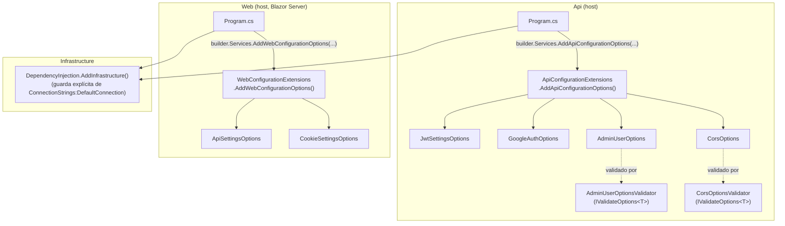

# US-39 Configuración basada en entorno — Documentación Técnica

## Overview

Esta issue de *hardening* sustituye las comprobaciones de configuración
manuales y dispersas que existían en `Api/Program.cs` y `Web/Program.cs`
(bloques `?? throw new InvalidOperationException(...)`, comparaciones de
longitud de cadenas sueltas) por el patrón *Options* nativo de .NET
(`AddOptions<T>().ValidateDataAnnotations().ValidateOnStart()`), de forma que
cada sección crítica de `appsettings.json` se modela como una clase tipada
que se valida **una sola vez, de forma agregada, durante el arranque del
host** (`IHost.StartAsync()`), antes de que se acepte ninguna petición HTTP.

No introduce gestión de secretos (ya resuelta por la issue #38, ver
`docs/technical/US-38-secrets-management.md`) ni toca de dónde vienen los
valores (User Secrets, variables de entorno, Docker secrets); solo valida que,
vengan de donde vengan, estén presentes y sean válidos antes de servir
tráfico.

## Architecture

La lógica nueva vive en `Api/Configuration/` y `Web/Configuration/`, un
directorio por host (no se comparte código de configuración vía `Shared`,
porque las secciones de cada host no se solapan salvo `ConnectionStrings`,
tratada aparte en `Infrastructure`). `Domain` y `Application` no cambian: siguen
sin conocer de dónde viene la configuración.



Ambos `ApiConfigurationExtensions`/`WebConfigurationExtensions` se invocan
justo después de `AddDockerSecrets()` (issue #38), por lo que la validación
opera sobre el `IConfiguration` ya resuelto con toda su cadena de precedencia
(`appsettings.json` → `appsettings.{Environment}.json` → User Secrets en
Development → variables de entorno → Docker secrets en `/run/secrets`).

## Key Components

### `Api/Configuration/JwtSettingsOptions.cs` y `GoogleAuthOptions.cs`

Clases *Options* puras con `System.ComponentModel.DataAnnotations`
(`[Required]`, `[MinLength(32)]` en `JwtSettingsOptions.SecretKey`,
`[Range(1, int.MaxValue)]` en los TTL de token). Se validan con
`.ValidateDataAnnotations().ValidateOnStart()` — no necesitan lógica custom
porque sus reglas son incondicionales (siempre obligatorias, en cualquier
entorno).

### `Api/Configuration/AdminUserOptions.cs` + `AdminUserOptionsValidator.cs`

`AdminUserOptions.Password` es `string?` **sin anotaciones**, porque su regla
no es expresable con `DataAnnotations`: "obligatorio fuera de `Development`,
opcional dentro". `AdminUserOptionsValidator` implementa
`IValidateOptions<AdminUserOptions>` inyectando `IHostEnvironment` para poder
consultar `environment.IsDevelopment()` en tiempo de validación — algo que
`[Required]` no puede expresar por sí solo, ya que no tiene acceso a servicios
externos al propio objeto. Se registra como `AddSingleton<IValidateOptions<AdminUserOptions>, AdminUserOptionsValidator>()`
junto al `AddOptions<AdminUserOptions>().Bind(...).ValidateOnStart()` (sin
`.ValidateDataAnnotations()`, ya que no hay anotaciones que ejecutar).

### `Api/Configuration/CorsOptions.cs` + `CorsOptionsValidator.cs`

Mismo patrón que `AdminUser`: `AllowedOrigins` es un array vacío por defecto
(fallback a `localhost` en Development, gestionado en el *wiring* de
`AddCors`), y `CorsOptionsValidator` exige al menos un origen no vacío fuera
de Development, evitando que Production arranque con CORS abierto a ningún
origen (o solo a entradas en blanco) sin caer silenciosamente en ningún
*fallback* pensado solo para desarrollo local.

### `Api/Configuration/ApiConfigurationExtensions.cs`

Único punto de entrada (`AddApiConfigurationOptions(IServiceCollection, IConfiguration)`)
que registra las cuatro secciones anteriores. Se invoca una sola vez desde
`Api/Program.cs`, inmediatamente después de `AddDockerSecrets()`.

### `Web/Configuration/ApiSettingsOptions.cs`

`BaseUrl` usa `[Required, Url]` — el atributo `[Url]` es una comprobación
**nueva** que no existía antes (antes solo se comprobaba que la cadena no
fuera nula/vacía); un valor mal formado ahora falla en el arranque con un
mensaje claro, en vez de fallar más tarde y de forma más críptica dentro de
`new Uri(baseUrl)`.

### `Web/Configuration/CookieSettingsOptions.cs`

Sustituye 5 lecturas sueltas de `IConfiguration["Authentication:CookieSettings:*"]`
(incluyendo un `TimeSpan.Parse(...)` manual) por una única clase tipada. El
*binder* nativo de `IConfiguration` convierte automáticamente cadenas como
`"00:30:00"` a `TimeSpan` para la propiedad `ExpireTimeSpan`, sin necesidad de
parseo manual.

### `Web/Configuration/WebConfigurationExtensions.cs`

Registra `ApiSettingsOptions` (con `.ValidateDataAnnotations().ValidateOnStart()`)
y `CookieSettingsOptions` (solo `.ValidateOnStart()`, sin anotaciones que
validar). Se invoca desde `Web/Program.cs` inmediatamente después de
`AddDockerSecrets()`.

### `Infrastructure/DependencyInjection.cs` — guarda de `ConnectionStrings:DefaultConnection`

No se modela como clase *Options* (seguiría siendo la validación más simple
posible del diseño: un único valor escalar). En su lugar, `AddInfrastructure`
comprueba explícitamente:

```csharp
var connectionString = configuration.GetConnectionString("DefaultConnection");
if (string.IsNullOrWhiteSpace(connectionString))
{
    throw new InvalidOperationException(
        "ConnectionStrings:DefaultConnection is not configured. " +
        "Set it via User Secrets (local) or the CONNECTION_STRING environment variable (Docker).");
}
```

Esta guarda lanza durante el propio registro de servicios
(`builder.Services.AddInfrastructure(...)`, antes incluso de `builder.Build()`),
por lo que falla **más temprano** que `ValidateOnStart()` (que se dispara en
`IHost.StartAsync()`) — coherente con que la base de datos es la dependencia
de arranque más crítica de ambos hosts.

### Niveles de logging por entorno (`appsettings.json` / `appsettings.Development.json`, Api y Web)

`appsettings.json` (base, sin sufijo) actúa, por una decisión explícita de
Gate 2 del diseño, como el **perfil de Production** — no existe
`appsettings.Production.json` en ninguno de los dos hosts. Antes de este
cambio, ambos ficheros eran byte a byte idénticos; ahora divergen de verdad:

| Namespace | `appsettings.json` (Production) | `appsettings.Development.json` |
|---|---|---|
| `Default` | `Information` | `Debug` |
| `Microsoft.AspNetCore` | `Warning` | `Information` |
| `Microsoft.EntityFrameworkCore` | `Warning` (nuevo *override*, antes ausente) | — |
| `Microsoft.EntityFrameworkCore.Database.Command` | — | `Information` |

El *override* de `Microsoft.EntityFrameworkCore: Warning` en el fichero base
es nuevo: antes de esta issue, ningún fichero acotaba ese *namespace*, por lo
que EF Core registraba cada comando SQL a nivel `Information` incluso en el
perfil que hoy hace de facto de Production.

### `.env.example` (raíz del repositorio)

Plantilla ejecutable de todas las variables de entorno que
`docker-compose.yml` espera, sin ningún secreto real (mismo criterio ya usado
por `.secrets-template.json` para User Secrets, ver #38). Documenta qué
variables son obligatorias para que el contenedor `api` arranque
(`JWT_SECRET_KEY`, `ADMIN_PASSWORD`, `GOOGLE_CLIENT_ID`,
`GOOGLE_CLIENT_SECRET`, además de `SA_PASSWORD`/`CONNECTION_STRING`) y cuáles
son opcionales (`WEB_EXTERNAL_URL`, añadida a la lista de orígenes CORS de la
Api).

## Data Flow / Sequence

### Fallo rápido y agregado en el arranque (Api y Web)

Este es el cambio de comportamiento clave de la issue: antes, en `Web`, cada
uno de los 7 `HttpClient` tipados evaluaba su delegado `configureClient` de
forma **perezosa** (la primera vez que se resolvía el `HttpClient` desde el
contenedor DI), no durante `app.Run()`. Un `ApiSettings:BaseUrl` ausente
dejaba el proceso arrancar con éxito y solo fallaba la primera vez que un
usuario navegaba a una página que invocaba ese servicio. `ValidateOnStart()`
corrige esto: la validación ahora ocurre en `IHost.StartAsync()`, antes de
que el host acepte ninguna petición.

```mermaid
sequenceDiagram
    participant OS as Docker / Sistema operativo
    participant P as Program.cs (Api o Web)
    participant SC as IServiceCollection
    participant H as IHost (arranque)
    participant Opt as Validadores de Options
    participant App as Resto de la aplicación

    P->>SC: builder.Services.AddApiConfigurationOptions(...)<br/>o AddWebConfigurationOptions(...)
    Note over SC: Registra AddOptions&lt;T&gt;()<br/>.Bind(seccion).(ValidateDataAnnotations().)ValidateOnStart()<br/>por cada sección crítica
    P->>SC: builder.Services.AddInfrastructure(...)
    alt ConnectionStrings:DefaultConnection vacía/ausente
        SC-->>P: throw InvalidOperationException (falla en el registro de servicios,<br/>antes incluso de builder.Build())
    end
    P->>H: builder.Build()
    P->>H: app.Run() (invoca IHost.StartAsync() internamente)
    H->>Opt: Resuelve IOptions&lt;T&gt;.Value de TODAS<br/>las Options con ValidateOnStart()
    alt Alguna validación falla (una o varias secciones)
        Opt-->>H: Agrega todos los fallos en una única<br/>excepción (OptionsValidationException)
        H-->>OS: El proceso termina ANTES de "Now listening on..."
    else Todas pasan
        H-->>App: Arranque normal, el host empieza a servir tráfico
    end
```

## Edge Cases & Error Handling

- **Varias secciones inválidas a la vez**: `ValidateOnStart()` agrega todos
  los fallos de validación de todas las clases *Options* registradas en una
  única excepción — un operador ve de una vez la lista completa de variables
  ausentes, no una por una en sucesivos reintentos (mejora directa de
  diagnóstico frente al comportamiento anterior, donde el primer `?? throw`
  detenía el proceso ocultando cualquier otro problema).
- **`AdminUser:Password` / `Cors:AllowedOrigins` en Development**: los
  validadores custom devuelven éxito sin exigir valor, preservando el flujo
  de desarrollo local existente (contraseña de administrador sembrada por
  defecto, CORS con *fallback* a `localhost`).
- **`ApiSettings:BaseUrl` mal formado (no-URL)**: falla en el arranque con un
  mensaje de `[Url]` claro, en vez de fallar más tarde dentro de
  `new Uri(baseUrl)` al construir el primer `HttpClient`.
- **`ConnectionStrings:DefaultConnection` vacía**: `AddInfrastructure` lanza
  `InvalidOperationException` durante el registro de servicios, antes de
  `AddDbContext` — el fallo más temprano de los tres mecanismos descritos en
  este documento.
- **Fuera de alcance explícito de esta issue** (decisiones de Gate 2, ver
  diseño):
  - **Gestión de secretos**: ya resuelta por la issue #38 — esta issue no
    almacena ni transporta secretos de forma distinta a como ya lo hacía
    (User Secrets + variables de entorno/Docker secrets); solo valida su
    presencia/forma en el arranque.
  - **Manifiestos de Kubernetes**: no existe ningún despliegue K8s en este
    repositorio (el real es Docker Compose + Portainer); se documenta el hueco
    como aceptado, no se inventan manifiestos especulativos.
  - **Feature flags**: la nota técnica de la issue los mencionaba en modo
    condicional ("consider"), sin ningún caso de uso concreto de
    comportamiento condicional por entorno; no se introduce
    `Microsoft.FeatureManagement` ni ninguna librería equivalente.
- **Limpieza posterior a la fase de QA (housekeeping, no relacionada con el
  comportamiento descrito arriba)**: tras la fase de testing se eliminó, a
  petición del humano, un fichero de test preexistente y nunca cableado
  (`tests/SportsClubEventManager.Api/Controllers/AdminEventsControllerAuthorizationTests.cs`)
  junto con el bloque `<Compile Remove="Controllers\**\*.cs" />` que lo
  excluía en `tests/SportsClubEventManager.Api/SportsClubEventManager.Api.csproj`
  — ese test dependía de una instancia de SQL Server real y no tenía relación
  con esta issue. No afecta a ninguno de los componentes de configuración
  descritos en este documento.

## Extension points

Para añadir una nueva sección de configuración crítica a un host:

1. Crear una clase *Options* en `Api/Configuration/` o `Web/Configuration/`
   con una constante `SectionName` y, si las reglas son incondicionales,
   anotaciones de `DataAnnotations`.
2. Si la regla depende del entorno (`IHostEnvironment`) o de otro servicio,
   crear un `IValidateOptions<T>` dedicado en vez de forzarlo en
   `DataAnnotations`.
3. Registrar la sección en `ApiConfigurationExtensions`/`WebConfigurationExtensions`
   con `AddOptions<T>().Bind(...).(ValidateDataAnnotations().)ValidateOnStart()`
   (y `AddSingleton<IValidateOptions<T>, ...>()` si aplica un validador
   custom).
4. Añadir la variable de entorno correspondiente a `.env.example` y, si es
   sensible, seguir el flujo de Docker secrets ya documentado en
   `docs/technical/US-38-secrets-management.md`.
5. Escribir tests siguiendo el patrón de
   `tests/SportsClubEventManager.Api/Configuration/` /
   `tests/SportsClubEventManager.Web.Tests/Configuration/` (ver Testing
   Summary de esta issue: ~99 % de cobertura sobre el código de configuración
   tocado).

## Known gaps (heredados, no introducidos por esta issue)

- `tests/SportsClubEventManager.IntegrationTests` sigue sin ejecutarse en
  `.github/workflows/ci.yml`; los tres nuevos tests de integración de la fase
  de QA (`ApiConfiguration_WithoutJwtSecretKey_FailsAtStartup`,
  `ApiConfiguration_WithShortJwtSecretKey_FailsAtStartup`,
  `ApiConfiguration_WithEmptyCorsOriginsInProduction_FailsAtStartup`) corren
  localmente pero no se verifican todavía en CI.
- El nuevo proyecto `tests/SportsClubEventManager.Api` (creado durante la
  fase de QA para poder compilar y ejecutar los tests de los validadores)
  tampoco está cableado en el job `build-and-test` de CI.
- Claves de configuración obsoletas (`Authorization:DefaultPolicy`,
  `Authorization:AdminPolicy`, `Authorization:Logging:*`) no se han tocado —
  decisión de Gate 2, oportunidad de limpieza futura fuera de alcance.
