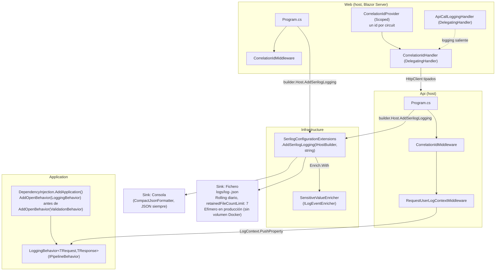
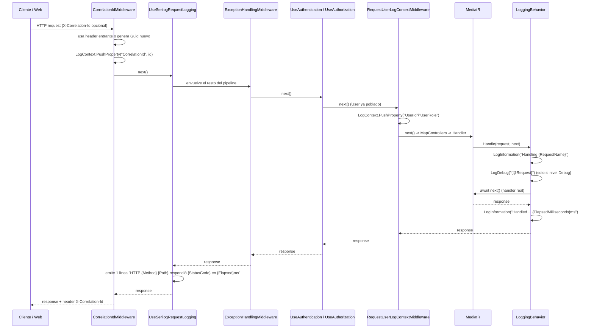

# US-40 Logging Estructurado — Documentación Técnica

## Overview

Esta issue de *hardening* sustituye el logging basado únicamente en
`Microsoft.Extensions.Logging.ILogger<T>` con el proveedor de consola por
defecto de ASP.NET Core (texto plano, sin enrichers, sin correlación entre
peticiones) por **Serilog** como proveedor de logging en los dos hosts
existentes (`Api`, `Web`), con salida JSON estructurada, redacción automática
de datos sensibles, correlación de peticiones mediante un header
`X-Correlation-Id`, y enriquecimiento ambiental de `UserId`/`UserRole`.

El trabajo vive en tres capas:

- `Infrastructure` (`src/SportsClubEventManager.Infrastructure/Logging/`):
  configuración de Serilog centralizada y política de redacción, reutilizada
  por ambos hosts.
- `Application` (`src/SportsClubEventManager.Application/Common/Behaviors/LoggingBehavior.cs`):
  logging estructurado uniforme de todos los comandos/queries de MediatR.
- `Api` y `Web` (middlewares y servicios propios de cada host): generación y
  propagación del `X-Correlation-Id`, y enriquecimiento de `LogContext` con
  identidad del usuario autenticado.

Los ~14 puntos de log `ILogger<T>` ya existentes en el código (por ejemplo en
`ChangePasswordCommandHandler` o `UnauthorizedAccessLoggingMiddleware`) siguen
funcionando sin ningún cambio, porque Serilog se integra como proveedor de
`Microsoft.Extensions.Logging`, no como una API paralela.

## Architecture



## Key Components

- **`SerilogConfigurationExtensions.AddSerilogLogging(this IHostBuilder, string applicationName)`**
  (`src/SportsClubEventManager.Infrastructure/Logging/SerilogConfigurationExtensions.cs`).
  Método de extensión sobre `IHostBuilder` invocado desde cada `Program.cs`
  (`builder.Host.AddSerilogLogging("SportsClubEventManager.Api")` /
  `"SportsClubEventManager.Web"`), justo después de `WebApplication.CreateBuilder(args)`.
  Configura:
  - `ReadFrom.Configuration(context.Configuration)`: lee la sección `"Serilog"`
    de `appsettings.json`/`appsettings.{Environment}.json` (nivel mínimo y
    overrides por namespace).
  - `Enrich.FromLogContext()`: hace ambientales las propiedades pusheadas vía
    `LogContext.PushProperty` (`CorrelationId`, `UserId`, `UserRole`).
  - `Enrich.WithMachineName()`, `Enrich.WithEnvironmentName()` (paquete
    `Serilog.Enrichers.Environment`), `Enrich.WithProperty("Application", applicationName)`:
    identifican el origen de cada línea (host, máquina/contenedor, entorno)
    cuando los logs de ambos hosts se centralizan.
  - `Enrich.With<SensitiveValueEnricher>()`: aplica la redacción (ver abajo).
  - `WriteTo.Console(new CompactJsonFormatter())`: **siempre**, en todos los
    entornos (incluido `Development`) — no existe una rama de configuración de
    texto plano.
  - `WriteTo.File(new CompactJsonFormatter(), path: "logs/log-.json", rollingInterval: RollingInterval.Day, retainedFileCountLimit: 7)`:
    rotación diaria, retención de **7 días** (decisión de Gate 2, sustituye el
    valor por defecto de 14 días propuesto en el diseño). En producción este
    sink es **efímero**: no hay volumen Docker montado para `/app/logs`
    (decisión de Gate 2, ver "Rechazado / fuera de alcance" más abajo); la
    persistencia real en producción depende del driver de logs de Docker sobre
    `stdout`, ya cubierto por el sink de consola.

  Paquetes NuGet añadidos en `SportsClubEventManager.Infrastructure.csproj`:
  `Serilog.AspNetCore` 10.0.0 (meta-paquete que incluye
  `Serilog.Extensions.Hosting`, `Serilog.Settings.Configuration`,
  `Serilog.Sinks.Console`, `Serilog.Sinks.File`, `Serilog.Formatting.Compact`)
  y `Serilog.Enrichers.Environment` 3.0.1.

- **`SensitiveValueEnricher`** (`src/SportsClubEventManager.Infrastructure/Logging/SensitiveValueEnricher.cs`).
  `ILogEventEnricher` registrado globalmente que recorre **todas** las
  propiedades de cada `LogEvent` emitido y redacta (sustituye por
  `"***REDACTED***"`) el valor de cualquier propiedad cuyo nombre contenga
  (subcadena, sin distinguir mayúsculas/minúsculas) alguno de los patrones:
  `password`, `secret`, `token`, `connectionstring`, `authorization`.
  Funciona correctamente tanto sobre:
  - **Propiedades escalares** interpoladas directamente (`{Password}`): se
    reemplaza el valor por un `ScalarValue("***REDACTED***")`.
  - **Propiedades destructuradas** (`{@Command}`, `{@Request}`): recorre
    recursivamente los `StructureValue` anidados, reconstruyendo el objeto
    completo con cada campo sensible redactado y **preservando la forma
    estructurada** (JSON anidado) del resto de campos no sensibles.

  La implementación reemplaza la propiedad con
  `logEvent.AddOrUpdateProperty(new LogEventProperty(property.Key, redactedValue))`,
  pasando directamente el `LogEventPropertyValue` ya construido (`ScalarValue`
  o `StructureValue` reconstruido) en lugar de pasarlo a través de
  `ILogEventPropertyFactory.CreateProperty(...)`. Esto es relevante porque la
  factoría de propiedades de Serilog no trata un valor que ya sea
  `LogEventPropertyValue` como caso especial: al no ser un tipo escalar nativo
  reconocido, lo envolvería en un `ScalarValue` nuevo llamando a `.ToString()`
  sobre él, lo que rompería tanto el valor exacto `***REDACTED***` en
  propiedades escalares (aparecerían comillas embebidas en el texto) como la
  forma `StructureValue` de los objetos destructurados (colapsarían a un
  `ScalarValue` plano, perdiendo la estructura JSON anidada). Usar
  `new LogEventProperty(...)` directamente evita ese problema. El
  comportamiento actual está verificado por 11 tests unitarios
  (`SensitiveValueEnricherTests`, `tests/SportsClubEventManager.Infrastructure/Logging/`),
  todos en verde, ejecutados contra un pipeline real de Serilog (no una
  factoría simulada).

- **`LoggingBehavior<TRequest, TResponse>`** (`src/SportsClubEventManager.Application/Common/Behaviors/LoggingBehavior.cs`).
  `IPipelineBehavior<TRequest, TResponse>` de MediatR aplicado a **todos** los
  comandos y queries de la aplicación, sin ninguna lista blanca ni marcador
  `ICriticalOperation` — decisión explícita de Gate 2 para que ningún handler
  nuevo quede sin logging por olvido. Por cada request:
  1. `logger.LogInformation("Handling {RequestName}", requestName)` — siempre.
  2. `logger.LogDebug("Handling {RequestName} {@Request}", requestName, request)`
     — **solo se evalúa/renderiza a nivel Debug** (deshabilitado por defecto en
     `Production`, donde `MinimumLevel.Default = Information`). Nunca se
     destructura ni se loguea la **respuesta**, para acotar el tamaño del log
     en queries que devuelven colecciones grandes.
  3. En éxito: `logger.LogInformation("Handled {RequestName} in {ElapsedMilliseconds}ms", ...)`.
  4. En fallo: si la excepción es `FluentValidation.ValidationException`, se
     loguea a **Warning** (fallo esperado/de negocio) con los mensajes de
     validación; cualquier otra excepción se loguea a **Error** con la
     excepción completa. En ambos casos la excepción se **re-lanza sin
     swallow**, dejando a `ExceptionHandlingMiddleware` la responsabilidad
     exclusiva de traducirla a una respuesta HTTP.

  Registrado en `Application/DependencyInjection.cs` vía
  `config.AddOpenBehavior(typeof(LoggingBehavior<,>))` **antes** que
  `config.AddOpenBehavior(typeof(ValidationBehavior<,>))`, por lo que es el
  comportamiento más externo del pipeline y también registra en el log los
  fallos de validación (que `ValidationBehavior`, más interno, es quien
  lanza).

- **`CorrelationIdMiddleware`** (duplicado deliberadamente en
  `src/SportsClubEventManager.Api/Middleware/CorrelationIdMiddleware.cs` y
  `src/SportsClubEventManager.Web/Middleware/CorrelationIdMiddleware.cs`, sin
  compartir código vía `Shared`, siguiendo la convención ya existente en el
  repo de mantener middlewares pequeños específicos de host independientes).
  Lee la cabecera `X-Correlation-Id` de la petición entrante; si no existe,
  genera un `Guid.NewGuid()` nuevo. Empuja el valor al `LogContext` ambiental
  (`LogContext.PushProperty("CorrelationId", correlationId)`) para que **toda**
  línea de log emitida durante el resto de la petición lo incluya, y lo
  devuelve en la cabecera de la respuesta.

- **`RequestUserLogContextMiddleware`** (solo en `Api`,
  `src/SportsClubEventManager.Api/Middleware/RequestUserLogContextMiddleware.cs`).
  Se ejecuta **después** de `UseAuthentication`/`UseAuthorization`, porque
  depende de `HttpContext.User` ya poblado. Si la petición está autenticada,
  empuja `UserId` (`ClaimTypes.NameIdentifier`) y `UserRole`
  (`ClaimTypes.Role`) al `LogContext` ambiental para el resto de la petición.

- **`ICorrelationIdProvider` / `CorrelationIdProvider`** (solo en `Web`,
  `src/SportsClubEventManager.Web/Services/`). Servicio registrado como
  **Scoped**; genera un único `Guid` en su constructor. En Blazor Server, un
  *scope* de DI equivale a una instancia por **circuit** (la conexión SignalR
  persistente que respalda la sesión interactiva de un usuario), por lo que
  este id vive tanto como la sesión interactiva. Deliberadamente **no** lee de
  `IHttpContextAccessor`, porque Microsoft documenta explícitamente que
  `HttpContext` no es fiable dentro de componentes interactivos de Blazor
  Server más allá del renderizado estático inicial.

- **`CorrelationIdHandler`** (`DelegatingHandler`, solo en `Web`). Añade la
  cabecera `X-Correlation-Id` (el id del circuit, vía `ICorrelationIdProvider`)
  a toda petición saliente hacia la Api.

- **`ApiCallLoggingHandler`** (`DelegatingHandler`, solo en `Web`). Registra
  una línea `"Calling Api {Method} {RequestUri}"` antes de cada llamada
  saliente y `"Api call {Method} {RequestUri} -> {StatusCode} in {ElapsedMilliseconds}ms"`
  después.

## Data Flow / Sequence

Petición HTTP entrante a la **Api** (o al render estático inicial de **Web**):



Para las peticiones salientes desde **Web** hacia **Api** (llamadas de los
`HttpClient` tipados, p. ej. `EventService`, `RegistrationService`), el
pipeline de `DelegatingHandler` es
`AuthTokenHandler` → `CorrelationIdHandler` → `ApiCallLoggingHandler`, en ese
orden para los siete `HttpClient` tipados existentes (`EventService`,
`UserProfileService`, `UserManagementService`, `EventManagementService`,
`RegistrationService`, `AdminRegistrationManagementService`,
`ImportManagementService`). El `CorrelationIdHandler` añade siempre el id del
**circuit** actual (no el de la petición HTTP inicial que originó el render),
que la Api recibe y trata como el `CorrelationId` de esa petición
servidor-a-servidor.

## X-Correlation-Id — contrato y limitación aceptada

- Nombre de la cabecera: `X-Correlation-Id` (constante
  `CorrelationIdMiddleware.HeaderName` en ambos hosts).
- Si el llamante la envía, se reutiliza tal cual; si no, se genera un `Guid`
  nuevo. Siempre se devuelve en la respuesta.
- **Limitación aceptada en Gate 2 (Blazor Server):** el `CorrelationId` de la
  petición HTTP inicial (render estático) y el `CorrelationId` del *circuit*
  SignalR (generado una vez por `CorrelationIdProvider` al conectar el
  circuit) **no son necesariamente el mismo valor** tras el primer
  renderizado. Es una limitación inherente al modelo de Blazor Server
  interactivo (la mayor parte de la interacción ocurre sobre una conexión
  SignalR persistente, no sobre peticiones HTTP discretas), no un defecto de
  este diseño. Dentro de un mismo circuit, todas las llamadas a la Api sí
  comparten el mismo `CorrelationId` de circuit de forma estable mientras la
  página permanece abierta.

## UserId / UserRole enrichment

Tras `UseAuthentication`/`UseAuthorization` en la Api,
`RequestUserLogContextMiddleware` empuja `UserId` (claim
`ClaimTypes.NameIdentifier`) y `UserRole` (claim `ClaimTypes.Role`) al
`LogContext` ambiental si `context.User.Identity.IsAuthenticated == true`. Si
alguno de los claims falta, se usa el literal `"Unknown"` en su lugar (nunca
se omite la propiedad). Estas propiedades quedan disponibles en todas las
líneas de log emitidas durante el resto de esa petición, incluidas las que
emite `LoggingBehavior` para cualquier comando/query invocado dentro de ella.

## Contrato de configuración `appsettings.json` ("Serilog")

La sección `"Logging"` heredada de ASP.NET Core se sustituye por una nueva
sección `"Serilog"` en `appsettings.json` de ambos hosts (Api y Web):

```json
"Serilog": {
  "MinimumLevel": {
    "Default": "Information",
    "Override": {
      "Microsoft.AspNetCore": "Warning",
      "Microsoft.EntityFrameworkCore": "Warning"
    }
  }
}
```

`appsettings.Development.json` de ambos hosts sobreescribe únicamente
`MinimumLevel.Default` a `"Debug"`:

```json
"Serilog": {
  "MinimumLevel": {
    "Default": "Debug"
  }
}
```

Al fusionarse con el fichero base vía la jerarquía estándar de
`IConfiguration` de ASP.NET Core, el resultado en `Development` es
`Default: Debug` conservando los `Override` de `Microsoft.AspNetCore` y
`Microsoft.EntityFrameworkCore` a `Warning` heredados del fichero base — esto
habilita el `{@Request}` de `LoggingBehavior` en desarrollo sin inundar los
logs con ruido del framework.

## Rechazado / fuera de alcance (Gate 2)

- **No hay integración desplegada con un agregador de logs centralizado**
  (Loki, Elasticsearch, etc.). Solo se garantiza **compatibilidad de
  formato**: JSON estructurado por línea en `stdout`, exactamente lo que un
  recolector como Promtail (Loki) o Filebeat (Elasticsearch) esperaría leer
  del driver de logs `json-file` de Docker, sin ningún cambio adicional en el
  código el día que esa infraestructura se despliegue. No existe esa
  infraestructura hoy en el repositorio.
- **No se añaden volúmenes Docker para `/app/logs`** en
  `docker-compose.prod.yml`/`docker-compose.yml`; el sink de fichero es
  efímero en producción por decisión explícita de Gate 2. La persistencia en
  producción depende exclusivamente del driver de logs de Docker sobre
  `stdout` (sink de consola).
- **No se introduce ningún feature flag** para activar/desactivar este
  logging.
- **Los "scopes de log" se implementan vía `LogContext.PushProperty`**
  (mecanismo ambiental nativo de Serilog), **no vía `ILogger.BeginScope`**
  literal. Ambos son funcionalmente equivalentes para correlacionar entradas
  relacionadas, pero `LogContext` es el mecanismo idiomático de Serilog y el
  elegido en este diseño.
- **`LoggingBehavior` no tiene lista blanca**: se aplica a todos los
  comandos/queries de MediatR, no solo a operaciones "críticas" como
  inscripciones o cancelaciones.

## Edge Cases & Error Handling

- **Excepción dentro de un handler**: `LoggingBehavior` la loguea (Warning si
  es `ValidationException`, Error en cualquier otro caso) y la re-lanza sin
  interceptarla; `ExceptionHandlingMiddleware` sigue siendo el único
  responsable de traducirla a una respuesta HTTP.
- **Campo sensible interpolado bajo un nombre no reconocido** (p. ej.
  `{RawValue}` en lugar de `{Password}`): `SensitiveValueEnricher` no puede
  detectarlo, ya que la redacción se basa exclusivamente en el nombre de la
  propiedad. Mitigado por revisión manual de los ~14 puntos de log
  preexistentes (ninguno interpola un valor sensible bajo un nombre no
  reconocido) y por el hecho de que los tres comandos con campos realmente
  sensibles (`LoginCommand.Password`, `ChangePasswordCommand.CurrentPassword`/`NewPassword`,
  `RefreshTokenCommand.RefreshToken`) sí usan nombres de propiedad reconocidos
  por el enricher.
- **`X-Correlation-Id` ausente en la petición entrante**: se genera uno nuevo;
  nunca se rechaza la petición por esta causa.
- **Circuit de Blazor Server reconectando o de larga duración**: conserva el
  mismo `CorrelationId` de circuit mientras el `DI scope` viva; solo cambia si
  se crea un nuevo circuit (p. ej. recarga completa de página).
- **Nivel `Verbose` para rutas `/health*`** en `UseSerilogRequestLogging` de la
  Api: evita que las sondas periódicas de un orquestador/Docker generen una
  línea de `Information` cada pocos segundos, sin dejar de registrarlas si se
  sube el nivel mínimo configurado.

## Extension points

- Un futuro sink adicional (por ejemplo un sink HTTP directo a Loki/Seq) se
  añadiría exclusivamente en `SerilogConfigurationExtensions.AddSerilogLogging`,
  sin tocar `Api`/`Web` ni el resto de `Infrastructure`.
- Un nuevo patrón sensible a redactar se añade en el array
  `SensitiveNamePatterns` de `SensitiveValueEnricher`, sin tocar el resto del
  pipeline de logging.
- El campo `ElapsedMilliseconds`, ya expuesto tanto por `LoggingBehavior` como
  por `UseSerilogRequestLogging`, podría reutilizarse como fuente de métricas
  de latencia si en el futuro se planifica una historia de métricas
  (Prometheus/Grafana), sin rediseñar nada de lo implementado aquí.

## Referencias

- Diseño: `.claude/docs/sdlc/design/issue-40-structured-logging.md`
- Resumen de implementación: `.claude/docs/sdlc/development/issue-40-structured-logging.md`
- Resumen de testing: `.claude/docs/sdlc/testing/issue-40-structured-logging.md`
