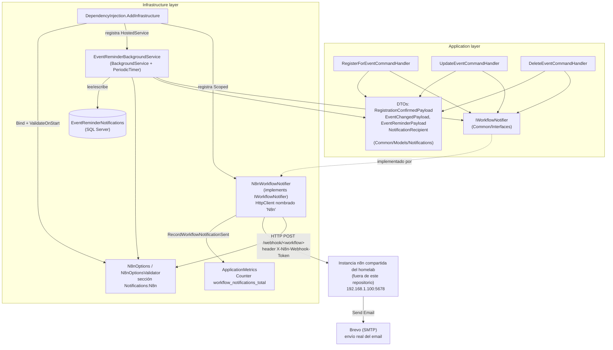
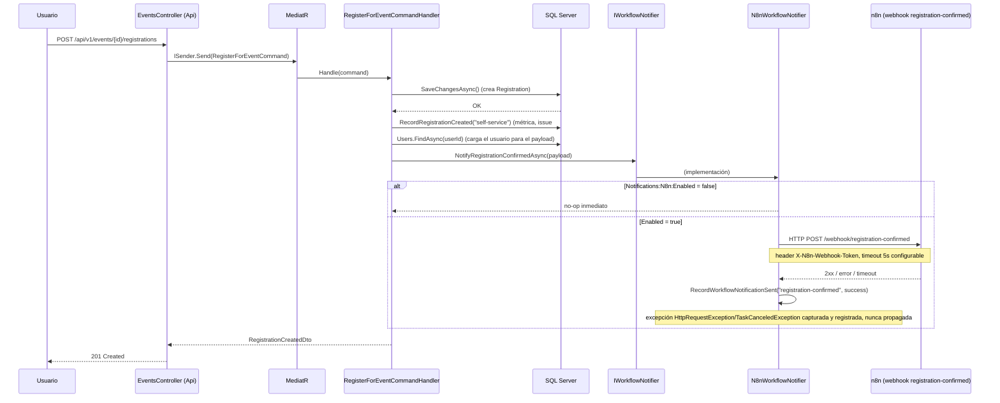

# Flujos de Trabajo n8n para Notificaciones de Eventos — Documentación Técnica

## Overview

Esta issue añade notificaciones automáticas por correo electrónico ante cuatro eventos de
negocio: registro confirmado, evento actualizado, evento cancelado (borrado) y recordatorio de
evento próximo. La aplicación **no envía correos directamente**: dispara *webhooks* HTTP hacia
una instancia de **n8n** ya existente y compartida en el homelab (no se despliega ningún
contenedor n8n propio de este proyecto, ni en desarrollo ni en producción), que es quien
construye y envía el email real (proveedor Brevo).

Sigue el mismo patrón ya establecido por `IApplicationMetrics`/`IAuditService` (issues #38-#42):
una abstracción vive en `Application` (`IWorkflowNotifier`), su implementación HTTP concreta vive
en `Infrastructure` (`N8nWorkflowNotifier`), y se invoca desde los *command handlers* **siempre
después** de que la operación de negocio haya tenido éxito, nunca antes ni dentro de un bloque que
pueda revertirla.

La integración está **deshabilitada por defecto** (`Notifications:N8n:Enabled = false`) en todos
los entornos salvo producción, y solo se activa tras un *runbook* manual documentado en
`infrastructure/n8n/README.md` y en el Apéndice A del diseño.

## Architecture



**Dirección de la integración**: la Api llama a los *webhooks* de n8n (push), nunca al revés. n8n
no expone ni consulta ningún *endpoint* nuevo de la Api; el disparo manual para pruebas (AC 5 de
la issue) se cubre con la propia funcionalidad "Execute workflow" de la UI de n8n. Esta decisión,
y la alternativa rechazada (n8n consultando un *endpoint* nuevo vía su propio *Cron Trigger*),
está documentada en detalle en el diseño (`## Architecture Overview` / `## Technology Choices`).

**Conectividad**: `api` y `n8n` corren en el mismo host físico del homelab pero en redes Docker
distintas (`sportsclub_sportsclub-network` vs. `n8n_default`), sin red compartida. La Api alcanza
n8n vía la IP del host (`192.168.1.100:5678`), no vía nombre de servicio Docker (`http://n8n:5678`
no es resoluble). Mismo patrón de conectividad ya verificado y usado para el *scrape* de
Prometheus (issue #42).

## Key Components

| Componente | Ubicación | Responsabilidad |
|---|---|---|
| `IWorkflowNotifier` | `Application/Common/Interfaces/IWorkflowNotifier.cs` | Abstracción con 4 métodos: `NotifyRegistrationConfirmedAsync`, `NotifyEventUpdatedAsync`, `NotifyEventCancelledAsync`, `NotifyEventReminderAsync`. Contrato documentado como "nunca lanza excepciones": un fallo de notificación jamás debe romper la operación de negocio que la origina. |
| `RegistrationConfirmedPayload`, `EventChangedPayload`, `EventReminderPayload`, `NotificationRecipient` | `Application/Common/Models/Notifications/` | DTOs internos de `Application`, no expuestos por la Api. `EventChangedPayload` se reutiliza tanto para actualización (`ChangeType = "updated"`) como para cancelación (`ChangeType = "cancelled"`) e incluye la lista de destinatarios activos. |
| `N8nWorkflowNotifier` | `Infrastructure/Notifications/N8nWorkflowNotifier.cs` | Implementación HTTP de `IWorkflowNotifier` vía `IHttpClientFactory` (cliente nombrado `"N8n"`). Hace `POST` con `JsonContent`, añade la cabecera `X-N8n-Webhook-Token`, aplica un *timeout* configurable (`TimeoutSeconds`, por defecto 5s) mediante un `CancellationTokenSource` vinculado, y captura internamente `HttpRequestException`/`TaskCanceledException` — cualquier otra excepción sí se propaga (verificado en tests, ver informe de testing). Registra el resultado (éxito/fallo) vía `IApplicationMetrics.RecordWorkflowNotificationSent`. Si `Enabled = false`, el método es un no-op inmediato (ni siquiera crea el `HttpClient`). |
| `EventReminderBackgroundService` | `Infrastructure/Notifications/EventReminderBackgroundService.cs` | `BackgroundService` con `PeriodicTimer` (intervalo configurable, por defecto 5 min), mismo patrón que `ActiveEventsGaugeUpdater` (issue #42). Si `Enabled = false`, `ExecuteAsync` retorna inmediatamente sin arrancar el temporizador. En cada tick llama a `ProcessDueRemindersAsync` (método `internal`, extraído para ser testeable sin depender del `PeriodicTimer`), que crea su propio `IServiceScope` para resolver `IApplicationDbContext`/`IWorkflowNotifier`. |
| `N8nOptions` / `N8nOptionsValidator` | `Infrastructure/Configuration/` | *Options* fuertemente tipadas para la sección `Notifications:N8n`: `Enabled`, 4 URLs de *webhook* (`[Url]`), `WebhookToken`, `TimeoutSeconds` (`[Range(1,60)]`, por defecto 5), `ReminderIntervalHours` (por defecto `[24, 1]`), `PollingIntervalMinutes` (por defecto 5). El validador (`IValidateOptions<N8nOptions>`) solo exige los valores cuando `Enabled = true` — mismo patrón condicional que `AdminUserOptionsValidator`/`CorsOptionsValidator` (issue #39). |
| `EventReminderNotification` | `Domain/Entities/EventReminderNotification.cs` | Entidad que registra qué combinación `(EventId, IntervalHours)` ya fue notificada, con `SentAtUtc`. Sin lógica de validación adicional — análoga en simplicidad a `AuditLog`. Evita reenviar el mismo recordatorio en sondeos sucesivos y tras reinicios del contenedor `api` (el estado en memoria no sobreviviría a un redeploy). |
| `EventReminderNotificationConfiguration` | `Infrastructure/Persistence/Configurations/` | Configuración EF Core Fluent API: tabla `EventReminderNotifications`, índice único `(EventId, IntervalHours)` (segunda barrera contra duplicados, a nivel de base de datos), FK hacia `Events` con `OnDelete(DeleteBehavior.Cascade)`. |
| Migración `20260713130034_AddEventReminderNotifications` | `Infrastructure/Migrations/` | Crea la tabla `EventReminderNotifications` con el índice único y la FK descritos arriba. |
| `IApplicationMetrics.RecordWorkflowNotificationSent` | `Application/Common/Interfaces/IApplicationMetrics.cs` (extendido), `Infrastructure/Metrics/ApplicationMetrics.cs` (implementado) | Nuevo `Counter` Prometheus `sportsclubeventmanager_workflow_notifications_total`, etiquetas `workflow` (`registration-confirmed` \| `event-updated` \| `event-cancelled` \| `event-reminder`) y `result` (`success` \| `failure`). Reutiliza la infraestructura de observabilidad ya establecida por la issue #42, sin introducir un mecanismo de métricas paralelo. |
| `infrastructure/n8n/workflows/*.json` | `registration-confirmed.json`, `event-updated.json`, `event-cancelled.json`, `event-reminder.json` | Exportaciones reales de los 4 flujos de n8n (descargadas desde la UI, no escritas a mano), versionadas como artefactos de código para cumplir el AC "store n8n workflow definitions as code". Se **importan manualmente** en la instancia n8n compartida — este repositorio no automatiza su despliegue. |
| `infrastructure/n8n/README.md` | Runbook para el propietario del homelab: credencial *Header Auth*, importación/etiquetado de los 4 flujos, verificación DNS del subdominio de envío en Brevo (`notifications.ablasco.com`), credencial SMTP de Brevo en n8n, copia de las URLs reales de *webhook* a producción, y verificación funcional/de errores (AC 5/AC 6). | |

### `DependencyInjection.cs` (Infrastructure) — registro

```csharp
services.AddOptions<N8nOptions>()
    .Bind(configuration.GetSection(N8nOptions.SectionName))
    .ValidateOnStart();
services.AddSingleton<IValidateOptions<N8nOptions>, N8nOptionsValidator>();

services.AddHttpClient("N8n");

services.AddScoped<IWorkflowNotifier, N8nWorkflowNotifier>();
services.AddHostedService<EventReminderBackgroundService>();
```

`IWorkflowNotifier` se registra como `Scoped` (coherente con `IApplicationDbContext`, ya que se
inyecta directamente en los *command handlers*, que también son `Scoped`). Se añadió
`Microsoft.Extensions.Http` como `PackageReference` explícito de `Infrastructure.csproj`, porque
`Infrastructure` es una biblioteca de clases pura sin el *framework* compartido de ASP.NET Core
(mismo motivo por el que `prometheus-net.AspNetCore` tuvo que declararse en `Api`/`Web` en la
issue #42).

## Data Flow / Sequence

### Registro de un usuario en un evento



### Actualización / cancelación (borrado) de un evento

El mismo principio aplica a `UpdateEventCommandHandler` (`NotifyEventUpdatedAsync`,
`ChangeType = "updated"`) y a `DeleteEventCommandHandler` (`NotifyEventCancelledAsync`,
`ChangeType = "cancelled"`): la notificación se invoca **después** del punto de éxito
(`SaveChangesAsync` / `CommitAsync`), nunca antes ni dentro de un bloque que pueda revertir la
operación.

En `DeleteEventCommandHandler`, la eliminación corre dentro de una estrategia de ejecución con
reintentos (`_context.Database.CreateExecutionStrategy()`, necesaria porque el `DbContext` tiene
`EnableRetryOnFailure`) que envuelve una transacción explícita con su propio `try/catch`/
`RollbackAsync`. El resultado de `strategy.ExecuteAsync(...)` se captura en una variable
(`response`) y `NotifyEventCancelledAsync` se invoca **después** de ese `await`, a nivel del
método `Handle`, fuera de cualquier bloque que pueda hacer *rollback* — así una eliminación
revertida nunca dispara una notificación de "evento cancelado". Los destinatarios reutilizan la
lista de `Registrations` ya cargada vía `.Include(e => e.Registrations).ThenInclude(r => r.User)`
antes de la cancelación masiva, sin consulta adicional.

### Recordatorio de evento (proceso periódico, sin acción de usuario)

```mermaid
sequenceDiagram
    participant Timer as PeriodicTimer
    participant ERB as EventReminderBackgroundService
    participant DB as SQL Server (IApplicationDbContext)
    participant IWN as IWorkflowNotifier
    participant N8N as n8n (webhook event-reminder)

    loop cada PollingIntervalMinutes (por defecto 5 min)
        Timer->>ERB: tick
        ERB->>ERB: crea IServiceScope
        loop para cada intervalo en ReminderIntervalHours (ej. 24, 1)
            ERB->>DB: Events con Date en [ahora, ahora+intervalo] y sin EventReminderNotification(EventId, IntervalHours)
            DB-->>ERB: eventos pendientes (con Registrations activas + User)
            loop para cada evento pendiente
                ERB->>IWN: NotifyEventReminderAsync(payload)
                IWN->>N8N: HTTP POST /webhook/event-reminder
                ERB->>DB: Add EventReminderNotification(EventId, IntervalHours, SentAtUtc)
            end
            ERB->>DB: SaveChangesAsync() (si hubo al menos un evento)
        end
        Note over ERB: excepción no OperationCanceledException capturada con LogWarning; el servicio sigue vivo, el siguiente tick reintenta
    end
```

Nótese que la notificación se registra como "ya enviada" **inmediatamente después de invocar** al
notificador, independientemente de si la llamada HTTP tuvo éxito o no (decisión aceptada en el
diseño, para evitar reintentar indefinidamente un flujo que n8n ya reporta como fallido en su
propio registro de ejecuciones).

## Configuración

Sección `Notifications:N8n` (variables de entorno con separador `__`):

| Clave | Variable de entorno | Por defecto | Notas |
|---|---|---|---|
| `Enabled` | `NOTIFICATIONS_N8N_ENABLED` | `false` | Interruptor maestro. Solo `true` en producción, tras ejecutar el runbook manual. |
| `RegistrationConfirmedWebhookUrl` | `NOTIFICATIONS_N8N_REGISTRATION_CONFIRMED_WEBHOOK_URL` | vacío | URL real generada por n8n al activar el flujo importado. |
| `EventUpdatedWebhookUrl` | `NOTIFICATIONS_N8N_EVENT_UPDATED_WEBHOOK_URL` | vacío | ídem |
| `EventCancelledWebhookUrl` | `NOTIFICATIONS_N8N_EVENT_CANCELLED_WEBHOOK_URL` | vacío | ídem |
| `EventReminderWebhookUrl` | `NOTIFICATIONS_N8N_EVENT_REMINDER_WEBHOOK_URL` | vacío | ídem |
| `WebhookToken` | secreto `n8n__webhooktoken` (dev) / `N8N_WEBHOOK_TOKEN` (prod, texto plano) | vacío | Enviado como cabecera `X-N8n-Webhook-Token`, validado por una credencial *Header Auth* nativa de n8n en cada nodo *Webhook Trigger*. |
| `TimeoutSeconds` | — (fijado en el código base) | `5` | Acota el peor caso de latencia añadida a la petición HTTP del usuario. |
| `ReminderIntervalHours` | `Notifications__N8n__ReminderIntervalHours__0` / `__1` en Docker Compose | `[24, 1]` | La variable `NOTIFICATIONS_N8N_REMINDER_INTERVALS_HOURS` de `.env.example` es solo informativa/documental — .NET no admite *array binding* desde una única variable CSV, por eso los valores reales se fijan como entradas indexadas en los ficheros Docker Compose. |
| `PollingIntervalMinutes` | — | `5` | Frecuencia de sondeo de `EventReminderBackgroundService`. |

**Docker Compose**: en desarrollo (`infrastructure/docker-compose/docker-compose.yml`), el token
viaja como secreto de fichero (`n8n__webhooktoken`, bloque `secrets:`), mismo mecanismo que el
resto de secretos de la issue #38 — aunque en la práctica no tiene uso real mientras
`Enabled = false`. En producción (`docker-compose.prod.yml`), viaja como variable de entorno en
texto plano (`Notifications__N8n__WebhookToken: ${N8N_WEBHOOK_TOKEN}`), siguiendo el hueco ya
conocido y documentado en `DEPLOYMENT_RUNBOOK.md` (los secretos de fichero no llegan al Portainer
real del homelab). **No se añade ningún servicio `n8n` a ninguno de los dos ficheros Compose.**

## Edge Cases & Error Handling

- **n8n caído, lento o inalcanzable**: `N8nWorkflowNotifier` captura `HttpRequestException` y
  `TaskCanceledException` (esta última cubre tanto el *timeout* configurado como una cancelación
  externa), registra un `LogWarning` y cuenta el fallo en la métrica — nunca propaga la excepción.
  La operación de negocio (registro, actualización, cancelación) ya se completó antes de intentar
  notificar, así que el usuario no se ve afectado.
- **Excepción fuera del contrato esperado** (p. ej. `InvalidOperationException`): se propaga sin
  capturar — verificado explícitamente en los tests de esta fase, para detectar cualquier
  regresión que ensanche el `catch` más allá de lo previsto.
- **Integración deshabilitada** (`Enabled = false`, valor por defecto fuera de producción):
  `N8nWorkflowNotifier.PostAsync` retorna inmediatamente sin crear ningún `HttpClient` ni realizar
  ninguna llamada de red; `EventReminderBackgroundService.ExecuteAsync` retorna sin arrancar el
  `PeriodicTimer`. Comportamiento aditivo sin efecto observable.
- **Reintento duplicado de un recordatorio**: mitigado con doble barrera — el filtro
  `!EventReminderNotifications.Any(...)` en la consulta (barrera principal, evita reprocesar) y el
  índice único `(EventId, IntervalHours)` a nivel de base de datos (barrera secundaria ante una
  hipotética condición de carrera).
- **Reinicio del contenedor `api`**: al persistir `EventReminderNotification` en base de datos (no
  en memoria), un recordatorio ya enviado no se repite tras un redeploy, algo especialmente
  relevante dado que este proyecto despliega con frecuencia vía el *pipeline* CD del homelab.
- **Fallo de una iteración completa de `EventReminderBackgroundService`**: capturado con
  `LogWarning` (excepto `OperationCanceledException`, que se deja propagar como señal de apagado),
  el servicio sigue vivo y el siguiente tick reintenta — mismo criterio que
  `ActiveEventsGaugeUpdater` (issue #42).
- **Usuario registrante no encontrado** (rama defensiva en `RegisterForEventCommandHandler`): si
  `context.Users.FindAsync` devuelve `null`, no se invoca `NotifyRegistrationConfirmedAsync` (no
  debería ocurrir en la práctica, dado que `UserId` ya fue validado por la autenticación, pero
  evita construir un payload con datos incompletos).

## Limitaciones conocidas (de la fase de testing)

- **`DeleteEventCommandHandler.Handle()` no es testeable con el proveedor InMemory de EF Core**
  (verificado empíricamente: `BeginTransactionAsync`/`ExecuteUpdateAsync` lanzan
  `InvalidOperationException` bajo InMemory). Su cobertura de línea quedó en 0%; requiere un test
  de integración contra un proveedor relacional real (Testcontainers + SQL Server), no ejecutable
  en el entorno de esta fase por un error 500 del *daemon* de Docker Desktop local. Se recomienda
  añadir `EventCancellationNotificationIntegrationTests.cs` cuando se disponga de un entorno con
  Docker operativo.
- **El filtro de registros cancelados dentro del `Include` filtrado de
  `EventReminderBackgroundService`** (`Registrations.Where(r => r.Status != Cancelled)`) no se
  aplica bajo el proveedor InMemory de EF Core — limitación conocida del proveedor, no un defecto;
  SQL Server sí traduce correctamente ese filtro. El mismo tipo de exclusión sí se verificó con
  éxito en `UpdateEventCommandHandler`, que usa un `.Where()` de LINQ en memoria en vez de un
  *filtered Include*.
- **`EventReminderBackgroundService.ExecuteAsync`, rama habilitada (bucle real del
  `PeriodicTimer`)**: no se testeó directamente (solo la rama deshabilitada), por ser una prueba
  basada en temporización de bajo valor añadido dado que toda la lógica de negocio real ya está
  extraída y cubierta al 100% por `ProcessDueRemindersAsync`.
- **Índice único `(EventId, IntervalHours)`**: solo verificado a nivel de metadatos del modelo bajo
  InMemory, no insertando un duplicado real (mismo patrón ya aceptado en el repositorio para otros
  índices únicos).
- **No se ha verificado la versión/funcionalidades exactas de la instancia n8n real** en cuanto a
  soporte de *tags*/*Header Auth* al momento del diseño — riesgo bajo, ya resuelto en la práctica:
  el runbook (`infrastructure/n8n/README.md`) confirma que los 4 flujos están construidos,
  etiquetados, activados y probados de extremo a extremo contra envíos reales de Brevo.
- **No se ha modificado el *dashboard* de Grafana** (`infrastructure/grafana/dashboards/sportsclubeventmanager-overview.json`)
  para incorporar el nuevo contador `sportsclubeventmanager_workflow_notifications_total` —
  explícitamente fuera de alcance de esta issue.
- **Cancelación de un registro individual** (no de un evento completo, p. ej. vía
  `CancelRegistrationCommandHandler`/`CancelRegistrationByIdCommandHandler`) **no dispara ninguna
  notificación** — no estaba pedido por los criterios de aceptación de la issue y así fue
  confirmado por el propietario del producto durante el diseño.
- Persiste, tras esta fase, un paso operativo pendiente en el runbook: copiar las URLs reales de
  los 4 *webhooks* a las variables de entorno de producción y activar
  `Notifications:N8n:Enabled` — tarea del propietario del homelab, fuera de este repositorio.

## Extension points

- Para añadir un nuevo tipo de notificación: declarar el método en `IWorkflowNotifier`, su DTO en
  `Application/Common/Models/Notifications/`, implementarlo en `N8nWorkflowNotifier.PostAsync` con
  una nueva URL en `N8nOptions`, e invocarlo desde el *handler* correspondiente tras el punto de
  éxito de la operación — mismo patrón ya establecido por los 4 métodos actuales.
- Para sustituir n8n por otro motor de automatización en el futuro: basta con una nueva
  implementación de `IWorkflowNotifier` en `Infrastructure`, sin tocar `Application` ni los
  *command handlers*.
- Si la latencia añadida por la llamada síncrona a n8n resultara problemática en producción, el
  diseño documenta como alternativas futuras (rechazadas por ahora, por sobre-ingeniería a la
  escala actual) un *fire-and-forget* con `Task.Run` o una cola interna con
  `System.Threading.Channels` + `BackgroundService` consumidor.
