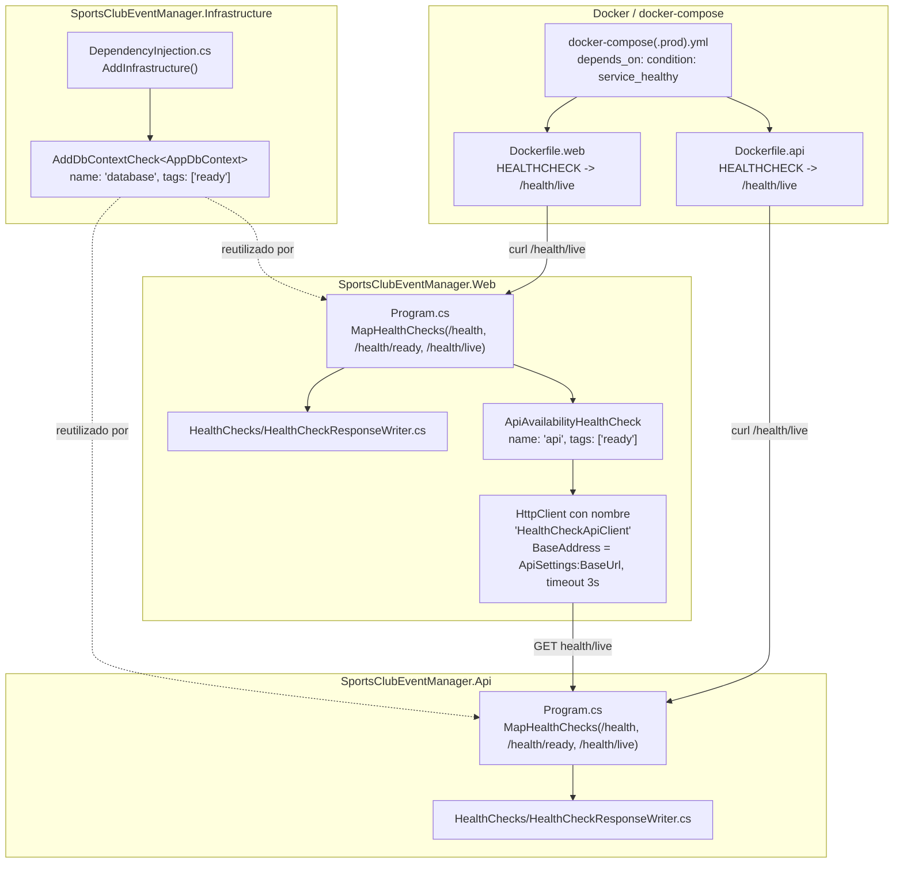
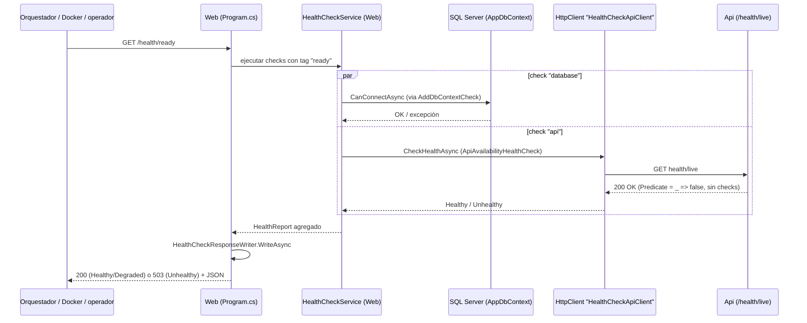

# Endpoints de Health Check (Api y Web) — Documentación Técnica

## Overview

Esta funcionalidad (issue [#41](https://github.com/AlejBlasco/SportsClubEventManager/issues/41)) añade tres endpoints de health check — `/health`, `/health/ready` y `/health/live` — a los dos hosts ASP.NET Core del monolito (`SportsClubEventManager.Api` y `SportsClubEventManager.Web`), usando el middleware nativo `Microsoft.Extensions.Diagnostics.HealthChecks`. El objetivo es que Docker (`HEALTHCHECK`), `docker-compose` (`depends_on: condition: service_healthy`) y cualquier operador humano puedan verificar la disponibilidad de cada servicio y de sus dependencias reales (base de datos y, en el caso de Web, la propia Api).

Es un cambio puramente aditivo y transversal (*hardening*): no toca `Domain`, `Application` ni `Shared`, y no introduce ninguna migración de base de datos.

## Architecture



Puntos clave del diagrama:

- El check de base de datos (`"database"`) se registra **una sola vez**, en `Infrastructure/DependencyInjection.cs`, y lo heredan ambos hosts porque los dos invocan `AddInfrastructure(...)`. `AddHealthChecks()` puede llamarse varias veces (Infrastructure, y luego cada `Program.cs`) sin duplicar registros: el framework acumula en el mismo `HealthCheckServiceOptions`.
- `Web` añade un segundo check propio, `"api"` (`ApiAvailabilityHealthCheck`), que llama a `Api`'s `/health/live` a través de un `HttpClient` con nombre dedicado (`"HealthCheckApiClient"`), sin el `AuthTokenHandler` que sí usan el resto de clientes tipados de Web (la sonda es anónima).
- `Dockerfile.api` y `Dockerfile.web` apuntan su `HEALTHCHECK` de imagen a `/health/live` de su propio host. `docker-compose.yml` y `docker-compose.prod.yml` consumen ese estado vía `depends_on: condition: service_healthy`.

## Key Components

| Componente | Ubicación | Responsabilidad |
|---|---|---|
| Registro del check de BD | `src/SportsClubEventManager.Infrastructure/DependencyInjection.cs` | `services.AddHealthChecks().AddDbContextCheck<AppDbContext>(name: "database", tags: ["ready"])`, dentro de `AddInfrastructure`, justo después de registrar `AppDbContext`. Compartido por Api y Web. |
| `HealthCheckResponseWriter` (Api) | `src/SportsClubEventManager.Api/HealthChecks/HealthCheckResponseWriter.cs` | Clase estática con `WriteAsync(HttpContext, HealthReport)`. Serializa el `HealthReport` a JSON camelCase (`status`, `totalDurationMs`, `checks[].{name,status,description,durationMs,tags}`). Fuera de `Development`, sustituye la `description` de cualquier check no sano por `"A dependency check failed."`. |
| `HealthCheckResponseWriter` (Web) | `src/SportsClubEventManager.Web/HealthChecks/HealthCheckResponseWriter.cs` | Copia deliberada de la clase anterior, mismo comportamiento, namespace `SportsClubEventManager.Web.HealthChecks`. No se comparte vía `Shared` porque no es un contrato entre hosts (nadie deserializa la respuesta de un host desde el otro), es formateo de presentación local a cada host. |
| `ApiAvailabilityHealthCheck` | `src/SportsClubEventManager.Web/HealthChecks/ApiAvailabilityHealthCheck.cs` | `IHealthCheck` que resuelve el `HttpClient` nombrado `"HealthCheckApiClient"` vía `IHttpClientFactory` y hace `GET health/live` contra la Api. 200 → `Healthy`; cualquier otro código → `Unhealthy` con el código en el mensaje; excepción (timeout, DNS, conexión rechazada) → `Unhealthy` con la excepción adjunta. |
| Mapeo de endpoints (Api) | `src/SportsClubEventManager.Api/Program.cs` | `app.MapHealthChecks("/health" | "/health/ready" | "/health/live", ...)`, cada uno con `.AllowAnonymous()` y, solo en Api (que sí expone OpenAPI nativo), `.WithTags("Health").WithSummary(...)`. Mapeado justo antes de `app.MapControllers()`. |
| Mapeo de endpoints (Web) | `src/SportsClubEventManager.Web/Program.cs` | Mismos tres endpoints, mismo `ResponseWriter`, sin metadatos OpenAPI (Web no expone Swagger). Mapeado justo antes de `app.MapStaticAssets()`. Registro previo del `HttpClient` nombrado `"HealthCheckApiClient"` y de `AddHealthChecks().AddCheck<ApiAvailabilityHealthCheck>("api", tags: ["ready"])`. |
| `HEALTHCHECK` de imagen | `docker/Dockerfile.api`, `docker/Dockerfile.web` | `CMD curl -f http://localhost:8080/health/live \|\| exit 1` (`--interval=15s --timeout=5s --start-period=40s --retries=5`). Antes, `Dockerfile.api` apuntaba a `/` (siempre 200 sin verificar nada); `Dockerfile.web` no tenía ningún `HEALTHCHECK`. |
| Logging de las sondas | `src/SportsClubEventManager.Api/Program.cs` (`UseSerilogRequestLogging`) | Las peticiones a rutas bajo `/health` se registran a nivel `Verbose` en lugar de `Information`, para que las sondas periódicas de Docker/orquestador no saturen los logs. |

## Data Flow / Sequence

El siguiente diagrama muestra el caso más completo: una petición a `/health/ready` en **Web**, que a su vez ejecuta el check de BD propio de Web y sondea a la Api.



Notas sobre el contrato JSON de respuesta (idéntico en Api y Web):

```json
{
  "status": "Healthy",
  "totalDurationMs": 12.34,
  "checks": [
    {
      "name": "database",
      "status": "Healthy",
      "description": null,
      "durationMs": 5.1,
      "tags": ["ready"]
    }
  ]
}
```

Semántica de cada endpoint:

- **`/health/live`** — `Predicate = _ => false`: no ejecuta ningún check registrado, responde 200 en microsegundos mientras el proceso esté vivo. Es el endpoint que consultan Docker `HEALTHCHECK` y `ApiAvailabilityHealthCheck` de Web. Deliberadamente no depende de la BD, para no reiniciar el contenedor por un problema transitorio de conectividad.
- **`/health/ready`** — `Predicate = check => check.Tags.Contains("ready")`: ejecuta solo los checks etiquetados `"ready"` (`"database"` en ambos hosts; `"api"` además en Web).
- **`/health`** — sin `Predicate`: ejecuta todos los checks registrados (en la práctica, hoy es equivalente a `/health/ready`, ya que no hay checks sin la etiqueta `"ready"`).
- Códigos HTTP: se usa el mapeo por defecto del middleware (`HealthCheckOptions.ResultStatusCodes` sin sobreescribir) — `Healthy`/`Degraded` → 200, `Unhealthy` → 503.

## Dependencias verificadas por host

| Host | Check `"database"` | Check `"api"` |
|---|---|---|
| Api | Sí (`AppDbContext`, vía `Microsoft.Extensions.Diagnostics.HealthChecks.EntityFrameworkCore` `10.0.1`) | No aplica |
| Web | Sí (`AppDbContext` propio de Web — registrado porque `Web/Program.cs` también llama a `AddInfrastructure(...)` y `MigrateDatabaseAsync()` al arrancar) | Sí — `GET {ApiSettings:BaseUrl}health/live`, timeout 3s |

Google OAuth2 (usado por Api durante el login interactivo) se excluye deliberadamente de los checks: solo se invoca de forma interactiva, no es una dependencia de fondo apta para un probe periódico. Tampoco existen checks de caché (no hay `IMemoryCache`/`IDistributedCache` en el código base) ni de disco/memoria (sin umbral de negocio definido, se dejan fuera de alcance).

## Edge Cases & Error Handling

- **BD inalcanzable**: `AddDbContextCheck<AppDbContext>` captura la excepción de conexión internamente; el `HealthCheckService` la traduce a `Unhealthy` sin necesidad de `try/catch` manual. `/health/ready` y `/health` devuelven 503; `/health/live` sigue devolviendo 200 (no depende de la BD).
- **Api inalcanzable desde Web**: `ApiAvailabilityHealthCheck` captura cualquier excepción (timeout a los 3s, fallo de DNS, conexión rechazada) y la reporta como `Unhealthy` con la excepción adjunta, sin propagarla.
- **Código de estado no-200 de la Api**: se reporta `Unhealthy` con el código HTTP recibido en el mensaje (por ejemplo, `"The Api responded with status code 500."`).
- **Fuga de información en `Production`/`Staging`**: `HealthCheckResponseWriter.FormatDescription` sustituye la `description` de cualquier check no sano por el texto genérico `"A dependency check failed."` fuera de `Development` — evita exponer mensajes de excepción de SQL Server (que pueden incluir nombre de servidor/instancia) a un endpoint anónimo.
- **Endpoints anónimos**: los tres endpoints llevan `.AllowAnonymous()` explícito, aunque hoy ningún host tiene una `FallbackPolicy` global de autorización — se hace explícito para blindarlos ante un futuro cambio que añada una política global, ya que un orquestador nunca podrá autenticarse.
- **Registro duplicado de `AddHealthChecks()`**: `Infrastructure` y cada `Program.cs` pueden llamar a `AddHealthChecks()` de forma independiente; el framework acumula los registros sobre el mismo `HealthCheckServiceOptions` sin sobrescribir ni duplicar (verificado por test, ver más abajo).
- **Ausencia de manifiestos Kubernetes**: este repositorio no despliega sobre Kubernetes (no hay carpeta `k8s/`, ni Helm, ni `kubectl` en ningún workflow); el despliegue real es Docker + webhook de Portainer sobre `docker-compose`. El `HEALTHCHECK` de Docker y el `depends_on: condition: service_healthy` de `docker-compose.yml`/`docker-compose.prod.yml` se consideran el equivalente real al AC de "Kubernetes probes" — decisión cerrada en Gate 2 del diseño.

## Testing Approach

| Proyecto | Archivo | Cubre |
|---|---|---|
| `tests/SportsClubEventManager.Infrastructure` | `DependencyInjectionTests.cs` (clase anidada de tests de health checks) | Que `AddInfrastructure` registra un check llamado `"database"`, que está etiquetado `"ready"`, y que no se duplica aunque `AddHealthChecks()` se invoque varias veces. |
| `tests/SportsClubEventManager.Api/HealthChecks` | `HealthCheckResponseWriterTests.cs` | Formato del JSON serializado por `WriteAsync` y el truncado de `description` fuera de `Development`. |
| `tests/SportsClubEventManager.Web.Tests/HealthChecks` | `HealthCheckResponseWriterTests.cs`, `ApiAvailabilityHealthCheckTests.cs` | Mismo formateo de JSON en Web; y los tres escenarios de `ApiAvailabilityHealthCheck` (Api responde 200 → `Healthy`, responde con otro código → `Unhealthy`, excepción de red/timeout → `Unhealthy`), usando un `HttpMessageHandler` simulado. |
| `tests/SportsClubEventManager.IntegrationTests` | `DatabaseFixture.cs` (modificado, sin nuevo archivo de tests todavía) | Preparación de la fixture para futuros tests end-to-end de `/health/*` contra un contenedor real (Testcontainers). **Pendiente**: aún no existe `HealthEndpointsIntegrationTests.cs`; esta carpeta además está comentada en `.github/workflows/ci.yml`, por lo que no se ejecuta en CI hoy. |

Verificación manual documentada en el resumen de implementación: `curl` contra `/health`, `/health/ready`, `/health/live` en Api y Web (en local y forzando `ASPNETCORE_ENVIRONMENT=Production` para comprobar el truncado de `description`), `docker build` + `docker inspect --format='{{json .State.Health}}'` sobre ambas imágenes, y `docker compose config` para confirmar el `depends_on` de `docker-compose.prod.yml`.

## Extension points

- **Nuevos checks de dependencias**: añadir `.AddCheck<T>(name, tags: [...])` (o `.AddTypeActivatedCheck<T>`) en el `Program.cs` del host correspondiente, o en `Infrastructure/DependencyInjection.cs` si el check es compartido por ambos hosts, como ya ocurre con `"database"`.
- **Checks de disco/memoria**: deliberadamente no implementados (sin umbral de negocio definido). Si se aprueba un umbral concreto, es un `IHealthCheck` custom sencillo basado en `DriveInfo`/`GC.GetTotalMemory`.
- **UI de health checks para desarrollo local**: deliberadamente no añadida (`AspNetCore.HealthChecks.UI` de Xabaril quedó descartada en Gate 2 del diseño); el JSON estructurado ya es inspeccionable vía `curl`/navegador/Swagger.
- **Métricas/telemetría (Prometheus/Grafana)**: historia futura no planificada formalmente. El campo `durationMs` por check ya queda expuesto en el contrato JSON, lo que facilitaría reutilizar ese mismo desglose como métrica cuando esa historia se aborde, sin rediseñar los `IHealthCheck` existentes.
