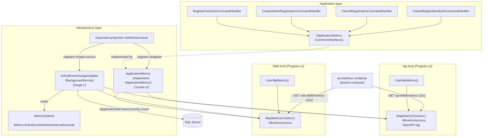
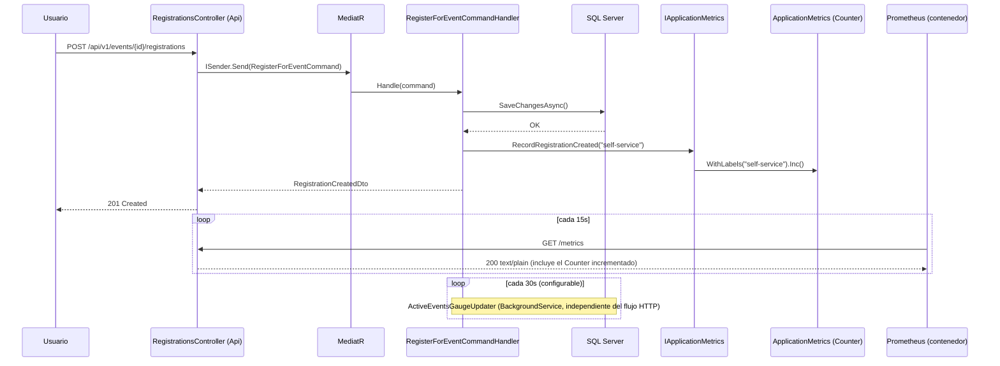

# Integración de Prometheus para recolección de métricas — Documentación Técnica

## Overview

Esta issue añade recolección de métricas en formato Prometheus a los dos hosts ASP.NET Core
del monolito (`Api` y `Web`), usando `prometheus-net` / `prometheus-net.AspNetCore` (versión
`8.2.1`). Cubre dos tipos de métricas:

- **Métricas HTTP por defecto** (peticiones, duración, en curso, proceso/runtime .NET),
  instrumentadas automáticamente por `UseHttpMetrics()`.
- **Métricas de negocio personalizadas** (registros a eventos creados/cancelados, eventos
  activos), instrumentadas manualmente a través de una nueva abstracción `IApplicationMetrics`
  invocada desde cuatro *command handlers* de `Application`.

Ambos hosts exponen el resultado en `GET /metrics`, anónimo, en el mismo espíritu que los
*health checks* de la issue #41. Un nuevo servicio `prometheus` en Docker Compose hace *scrape*
de ambos endpoints cada 15s. El acceso a la UI de Prometheus en producción queda restringido a
la red interna del homelab / Tailscale VPN — nunca al *reverse proxy* público (Nginx +
Cloudflare) que la issue #46 documenta para `web`.

Sigue el mismo patrón de Clean Architecture ya usado para `IAuditService`/`IDateTimeProvider`:
la abstracción vive en `Application`, la implementación con la librería de terceros vive en
`Infrastructure`.

## Architecture

**Nota de composición importante**: `IApplicationMetrics` y `ActiveEventsGaugeUpdater` se
registran dentro de `AddInfrastructure` (`src/SportsClubEventManager.Infrastructure/DependencyInjection.cs`,
líneas 71-81), no en `Api/Program.cs`. Como **tanto `Api/Program.cs` como `Web/Program.cs`
llaman a `AddInfrastructure`**, ambos hosts terminan registrando y exponiendo las tres métricas
de negocio, no solo `Api`. Ver "Edge Cases & Error Handling" y "Known Caveats" más abajo — es
una desviación confirmada frente al catálogo de métricas del diseño original.

## Key Components

| Componente | Ubicación | Responsabilidad |
|---|---|---|
| `IApplicationMetrics` | `Application/Common/Interfaces/IApplicationMetrics.cs` | Abstracción sin dependencia de `prometheus-net`. Dos métodos: `RecordRegistrationCreated(string source)`, `RecordRegistrationCancelled(string source)`. |
| `ApplicationMetrics` | `Infrastructure/Metrics/ApplicationMetrics.cs` | Implementación singleton. Define dos `Counter` estáticos (`sportsclubeventmanager_event_registrations_total`, `sportsclubeventmanager_registration_cancellations_total`), ambos etiquetados por `source`. Usa `Prometheus.Metrics.CreateCounter(...)` totalmente cualificado (evita ambigüedad con el propio namespace `...Infrastructure.Metrics`). |
| `ActiveEventsGaugeUpdater` | `Infrastructure/Metrics/ActiveEventsGaugeUpdater.cs` | `BackgroundService` con `PeriodicTimer`. En cada tick crea un `IServiceScope`, resuelve `IApplicationDbContext` y recalcula el *gauge* `sportsclubeventmanager_active_events` = número de eventos con `Date >= UtcNow`. El cálculo se extrae al método `internal static Task<int> GetActiveEventsCountAsync(...)` para que sea testeable sin arrancar el `BackgroundService` (requiere `InternalsVisibleTo` hacia `SportsClubEventManager.Infrastructure.Tests`, añadido en la fase de testing vía `AssemblyInfo.cs`). |
| `MetricsOptions` | `Infrastructure/Configuration/MetricsOptions.cs` | *Options* enlazadas a la sección `Metrics`, con `ActiveEventsRefreshIntervalSeconds` (`[Range(1, int.MaxValue)]`, por defecto `30`), validadas con `ValidateDataAnnotations().ValidateOnStart()`. Mismo patrón que `JwtSettingsOptions`/`CorsOptions` (issue #39). |
| `DependencyInjection.AddInfrastructure` | `Infrastructure/DependencyInjection.cs` (líneas 68-81) | Registra `MetricsOptions`, `IApplicationMetrics` (singleton) y `ActiveEventsGaugeUpdater` (hosted service). |
| `Api/Program.cs`, `Web/Program.cs` | Ambos hosts | `app.UseHttpMetrics()` junto al resto de middleware de diagnóstico; `app.MapMetrics("/metrics").AllowAnonymous()` junto a los `MapHealthChecks` existentes (issue #41). En `Api` incluye `.WithTags("Observability").WithSummary(...)` (tiene OpenAPI); en `Web` no. |
| `prometheus.yml` | `infrastructure/docker-compose/prometheus/prometheus.yml` | Configuración de *scrape*: `scrape_interval: 15s`, dos *jobs* (`sportsclubeventmanager-api` → `api:8080/metrics`, `sportsclubeventmanager-web` → `web:8080/metrics`). |
| Servicio `prometheus` | `infrastructure/docker-compose/docker-compose.yml` y `docker-compose.prod.yml` | Imagen `prom/prometheus:latest`, retención `15d`, puerto publicado acotado a `${PROMETHEUS_BIND_ADDRESS:-127.0.0.1}:${PROMETHEUS_PORT:-9090}:9090`, red `sportsclub-network` explícita (necesaria para resolver `api`/`web` por nombre de servicio Docker), `depends_on` con `condition: service_healthy` sobre `api`/`web`. |

## Data Flow / Sequence

Flujo de negocio (registro a un evento) y flujo de *scrape* de Prometheus:

## Catálogo de métricas

| Métrica | Tipo | Host(s) que la exponen realmente | Etiquetas | Origen |
|---|---|---|---|---|
| `http_requests_received_total` | Counter | Api, Web | `code`, `method`, `controller`, `action` | `UseHttpMetrics()` (prometheus-net.AspNetCore) |
| `http_request_duration_seconds` | Histogram | Api, Web | `code`, `method`, `controller`, `action` | `UseHttpMetrics()` |
| `http_requests_in_progress` | Gauge | Api, Web | `method` | `UseHttpMetrics()` |
| `process_*`, `dotnet_*` | Counter/Gauge | Api, Web | (ninguna de negocio) | Registro automático de `prometheus-net` |
| `sportsclubeventmanager_event_registrations_total` | Counter | **Api y Web** (ver Known Caveats) | `source` (`self-service` \| `admin`) | `ApplicationMetrics.RecordRegistrationCreated`, invocado desde `RegisterForEventCommandHandler` y `CreateAdminRegistrationCommandHandler` |
| `sportsclubeventmanager_registration_cancellations_total` | Counter | **Api y Web** (ver Known Caveats) | `source` (`self-service` \| `admin`) | `ApplicationMetrics.RecordRegistrationCancelled`, invocado desde `CancelRegistrationCommandHandler` y `CancelRegistrationByIdCommandHandler` |
| `sportsclubeventmanager_active_events` | Gauge | **Api y Web** (ver Known Caveats) | (ninguna) | `ActiveEventsGaugeUpdater`, recalculado cada `Metrics:ActiveEventsRefreshIntervalSeconds` (por defecto 30s) |

No existe etiqueta `event_type`: la entidad `Event` (`Domain/Entities/Event.cs`) no tiene campo
`Type`/`Category`. No existe un contador dedicado de "llamadas fallidas"; se reutiliza la
etiqueta `code` ya nativa de `http_requests_received_total` (los controladores ya traducen
excepciones de dominio a 4xx antes de que la petición termine; solo lo verdaderamente no
controlado llega a 500).

**Invocación de métricas de negocio por handler** (siempre después de un `SaveChangesAsync`
exitoso, nunca dentro del `try`/`catch` de concurrencia, para no contar operaciones que hacen
*rollback*):

| Handler | Método | `source` |
|---|---|---|
| `RegisterForEventCommandHandler` | `RecordRegistrationCreated` | `"self-service"` |
| `CreateAdminRegistrationCommandHandler` | `RecordRegistrationCreated` | `"admin"` |
| `CancelRegistrationCommandHandler` | `RecordRegistrationCancelled` | `"self-service"` |
| `CancelRegistrationByIdCommandHandler` | `RecordRegistrationCancelled` | `request.IsAdministrator ? "admin" : "self-service"` |

## ActiveEventsGaugeUpdater — mecanismo de refresco

- `BackgroundService` que usa `PeriodicTimer` con un intervalo `TimeSpan.FromSeconds(options.Value.ActiveEventsRefreshIntervalSeconds)`,
  inyectado vía `IOptions<MetricsOptions>` — configurable en `appsettings`/variables de entorno
  bajo `Metrics:ActiveEventsRefreshIntervalSeconds` (por defecto `30`), en vez del valor fijo
  que mostraba el ejemplo de código del diseño original.
- En cada tick: crea un `IServiceScope` propio (mismo patrón que `MigrateDatabaseAsync` en
  `DependencyInjection.cs`), resuelve `IApplicationDbContext` y ejecuta
  `Events.CountAsync(e => e.Date >= DateTime.UtcNow)`.
- Cualquier excepción que no sea `OperationCanceledException` se captura y se registra con
  `LogWarning`, sin detener el `BackgroundService` — el *gauge* simplemente conserva su último
  valor conocido hasta el siguiente ciclo exitoso.
- **Condición de carrera de arranque conocida** (detectada en la fase de testing): el `Gauge`
  estático solo queda "visible" en `/metrics` tras la primera ejecución completa de
  `ActiveEvents.Set(count)`, que depende de una consulta asíncrona a base de datos.
  `BackgroundService.StartAsync` no espera a que esa consulta termine antes de que el host
  quede listo para servir peticiones, así que un *scrape* inmediato tras el arranque puede no
  incluir todavía el *gauge*. Irrelevante en producción (Prometheus scrapea cada 15s, muy por
  encima de esa ventana), pero obligó a los tests de integración a usar sondeo con reintento en
  vez de una única aserción inmediata.

## Seguridad

- `/metrics` se mapea `.AllowAnonymous()` en ambos hosts — igual que `/health*` (issue #41),
  porque Prometheus no puede autenticarse frente a la aplicación al hacer *scrape* sin añadir
  complejidad adicional (usuario/contraseña o *bearer token* en la configuración de *scrape*).
- Las etiquetas de las métricas de negocio están diseñadas sin datos personales (ni email, ni
  nombre de usuario, ni identificador de evento) como defensa en profundidad.
- El puerto de la UI de Prometheus (`9090` por defecto) se publica en Docker Compose acotado a
  `${PROMETHEUS_BIND_ADDRESS:-127.0.0.1}` (forma larga de mapeo `bind:host:container`), nunca
  en todas las interfaces. En producción, el propietario del homelab debe fijar
  `PROMETHEUS_BIND_ADDRESS` en el `.env` del servidor a la IP Tailscale del host (interfaz
  `tailscale0`, típicamente `100.64.0.0/10`) o a la interfaz de red interna — nunca `0.0.0.0` ni
  la IP pública. Documentado en `.env.example` y en el Apéndice A del diseño.
- El `scrape` de `api`/`web` desde el contenedor `prometheus` ocurre siempre dentro de la red
  Docker interna (`sportsclub-network`), nunca a través de la URL pública de `web` — no requiere
  abrir `/metrics` al exterior.
- **Explícitamente fuera de esta issue**: cualquier *server block* de Nginx o registro DNS
  público en Cloudflare hacia el puerto de `prometheus` o hacia la ruta `/metrics`. El acceso
  humano a la UI está previsto exclusivamente vía Tailscale VPN o red interna del homelab.

## Edge Cases & Error Handling

- **Fallo al refrescar el *gauge*** (`ActiveEventsGaugeUpdater`): capturado, registrado como
  `LogWarning`, el *gauge* conserva su último valor; el servicio no se detiene.
- **Operación de negocio que hace *rollback***: la llamada a `IApplicationMetrics` está siempre
  fuera del bloque `try`/`catch` de concurrencia y solo se ejecuta tras un `SaveChangesAsync`
  exitoso, por lo que nunca se cuentan operaciones fallidas.
- **`prometheus-net` lanza una excepción inesperada al incrementar un contador**: no se añade
  manejo especial; se propaga igual que cualquier otra excepción dentro del *handler* (comportamiento
  consistente con el resto del código base).
- **Cardinalidad de etiquetas**: todas acotadas y de conjunto pequeño y fijo (`source` con 2
  valores, códigos HTTP, nombres de controlador/acción) — mitiga el riesgo de explosión de
  series temporales.
- **Primer *scrape* tras el arranque del host**: puede no incluir todavía
  `sportsclubeventmanager_active_events` (ver sección anterior); no afecta a los contadores de
  negocio, que existen desde el registro estático de `ApplicationMetrics` en el arranque del
  proceso.

## Known Caveats / Follow-ups

1. **`Web` también expone las tres métricas de negocio, no solo `Api`.** El catálogo del
   diseño original las marcaba como exclusivas de `Api`. En la práctica, `IApplicationMetrics` y
   `ActiveEventsGaugeUpdater` se registran dentro de `AddInfrastructure`
   (`Infrastructure/DependencyInjection.cs`), y **tanto `Api/Program.cs` como `Web/Program.cs`
   llaman a `AddInfrastructure`** — confirmado leyendo ambos ficheros directamente. El
   comentario que acompaña a `UseHttpMetrics()` en `Web/Program.cs` ("Web ... only exposes
   these default HTTP metrics, not business metrics") es, por tanto, **inexacto** frente al
   comportamiento real del proceso compilado — está describiendo la intención original del
   diseño, no lo que el código realmente hace hoy. Consecuencia práctica: `Web` ejecuta su
   propio `ActiveEventsGaugeUpdater` redundante (una consulta ligera cada 30s contra su propia
   conexión a base de datos) y expone su propia copia de los tres contadores/gauge, con valor
   irrelevante (los registros/cancelaciones de negocio se ejecutan siempre a través de `Api`, el
   único host que ejecuta comandos MediatR). Prometheus los sigue distinguiendo por las
   etiquetas `job`/`instance` de cada *target* de *scrape*, así que **no rompe** el contrato de
   cara a la futura issue #43 (Grafana), pero sí es ruido a tener en cuenta al construir
   *dashboards* o alertas (filtrar por `job="sportsclubeventmanager-api"` si solo interesan las
   métricas de negocio reales). No corregido en esta fase porque la ubicación actual del
   registro (`AddInfrastructure`) es la que pedía explícitamente el punto 4 del plan de diseño;
   queda documentado para una decisión consciente futura (p. ej. mover el registro de
   `IApplicationMetrics`/`ActiveEventsGaugeUpdater` a `Api/Program.cs` exclusivamente, como
   parte de la issue #43).
2. **Huecos preexistentes de CI/integración, no introducidos por esta issue** (confirmados
   durante la fase de testing ejecutando realmente el proyecto de integración):
   - `tests/SportsClubEventManager.IntegrationTests` sigue sin ejecutarse en el pipeline de CI
     (`.github/workflows/ci.yml`), mismo hueco ya señalado por el diseño de la issue #41.
   - Los *endpoints* `[Authorize]` de registro/cancelación devuelven `401` para cualquier
     petición sin token dentro de `WebApplicationFactory` — afecta también a los tests ya
     existentes de esa carpeta (`EventRegistrationIntegrationTests`,
     `EventCancellationIntegrationTests`), no solo a los nuevos de `/metrics`.
   - `DatabaseFixture.ResetDatabaseAsync()` (Respawner) trunca `__EFMigrationsHistory` junto con
     el resto de tablas, provocando fallos en cadena al ejecutar varios tests de la misma clase
     contra el mismo contenedor SQL.
   - Como consecuencia de los dos puntos anteriores, 3 de los 7 tests de
     `MetricsEndpointIntegrationTests.cs` (los que ejercitan el flujo real de
     registro/cancelación vía HTTP) están escritos pero no se pudieron confirmar en ejecución en
     este entorno.
   - `tests/SportsClubEventManager.Api` tampoco se ejecuta en CI (solo `Domain`, `Application`,
     `Infrastructure` y `Web.Tests`) — hueco preexistente, sin relación con esta issue.
3. **Paso manual pendiente para el propietario del homelab**: fijar `PROMETHEUS_BIND_ADDRESS`
   en el `.env` de producción a la IP Tailscale/interfaz interna real del host antes del primer
   despliegue con este cambio. Sin ello, el valor por defecto (`127.0.0.1`) deja Prometheus
   alcanzable solo desde dentro del propio contenedor/host, no desde la VPN.
4. **Portainer**: el stack de producción ya apunta al fichero Compose correcto (issue #46); el
   nuevo servicio `prometheus` solo requiere el redeploy habitual, sin reconfiguración de ruta.

## Extension points

- Para añadir una nueva métrica de negocio: declarar el método en `IApplicationMetrics`,
  implementarlo en `ApplicationMetrics` con un nuevo `Counter`/`Gauge`/`Histogram` prefijado
  `sportsclubeventmanager_`, e invocarlo desde el *handler* correspondiente tras la operación
  exitosa — mismo patrón ya establecido.
- Para añadir la etiqueta `event_type` en el futuro (bloqueada hoy por la ausencia de un campo
  `Type`/`Category` en `Event`): sería un cambio aditivo sobre el catálogo actual, sin romper el
  contrato ya consumido por Prometheus/Grafana.
- Si el desfase de hasta `Metrics:ActiveEventsRefreshIntervalSeconds` del *gauge* de eventos
  activos resultara problemático, la alternativa considerada y descartada en el diseño es
  `ICollectorRegistry.AddBeforeCollectCallback(...)` de `prometheus-net` (recalcula justo antes
  de cada *scrape*).
