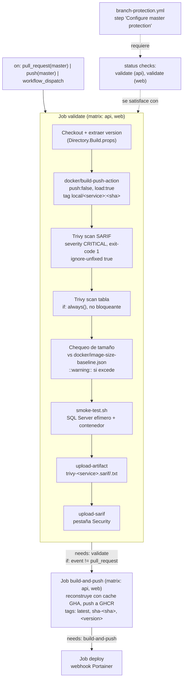
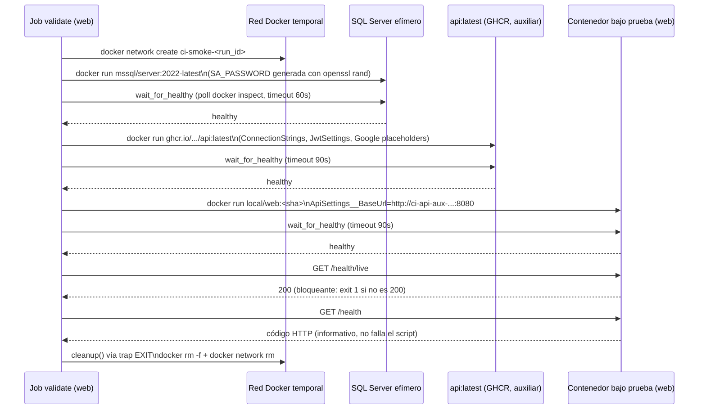

# Validación automatizada de imágenes Docker en el pipeline de CD — Documentación Técnica

## Overview

Esta funcionalidad (issue [#44](https://github.com/AlejBlasco/SportsClubEventManager/issues/44)) añade un nuevo job, `validate`, al pipeline de CD existente (`.github/workflows/cd.yml`), que se ejecuta **antes** del job de publicación (`build-and-push`) y actúa como puerta de calidad para las imágenes Docker de `api` y `web`. El job construye cada imagen localmente (sin publicarla), la escanea con Trivy, comprueba su tamaño contra una línea base versionada y la somete a un smoke test real contra un SQL Server efímero. El workflow se dispara ahora también en eventos `pull_request` contra `master`, no solo en `push`/`workflow_dispatch`, de modo que ninguna imagen no verificada pueda llegar a GHCR ni a producción.

Es un cambio puramente de infraestructura de pipeline: no se ha modificado ningún archivo `.cs`, ni `Dockerfile.api`/`Dockerfile.web` (que ya declaraban `HEALTHCHECK` contra `/health/live` desde la issue #41).

## Architecture



Puntos clave del diagrama:

- En un evento `pull_request` contra `master`, solo se ejecuta `validate`: `build-and-push` lleva `if: github.event_name != 'pull_request'` y se marca `skipped`; `deploy` depende de `build-and-push` y se salta en cascada sin necesidad de duplicar la condición.
- En `push` a `master` o `workflow_dispatch` se ejecuta la cadena completa (`validate` → `build-and-push` → `deploy`), igual que antes de esta issue, salvo por el nuevo tag de versión y el paso previo de validación.
- `validate` no usa ningún secreto de repositorio (ni `GITHUB_TOKEN` con `packages:write`, ni credenciales de producción): todas las credenciales del smoke test son valores efímeros generados dentro del propio job.

## Key Components

| Componente | Ubicación | Responsabilidad |
|---|---|---|
| Job `validate` | `.github/workflows/cd.yml` (líneas 12–104) | Matriz `api`/`web` (mismo `include` que `build-and-push`). **Sin `name:` personalizado**, para que GitHub reporte el status check exactamente como `validate (api)` / `validate (web)` (patrón por defecto `<job_id> (<valor_de_matriz>)`) — este nombre debe coincidir carácter a carácter con `required_status_checks.contexts` en `branch-protection.yml`. `permissions: contents: read, security-events: write`. |
| Step "Extract version from Directory.Build.props" | `cd.yml`, duplicado en `validate` y `build-and-push` | `grep -oP '(?<=<Version>)[^<]+' Directory.Build.props`, expuesto como `steps.version.outputs.value`. GitHub Actions no permite compartir un step entre jobs de una matriz sin una composite action o `workflow_call`; se duplicó el bloque YAML en ambos jobs en vez de introducir esa indirección (mismo patrón que ya usa `strategy.matrix.include`, también duplicado). `validate` no llega a consumir este output en ningún step propio. |
| Step "Build (local only)" | `cd.yml` | `docker/build-push-action@v7` con `push: false`, `load: true`, tag `local/<service>:<sha>`, mismos `cache-from`/`cache-to: type=gha,scope=<service>` que ya usaba `build-and-push`. Garantiza que la reconstrucción posterior en `build-and-push` reutiliza cache de capas y produce una imagen idéntica byte a byte a la validada. |
| Steps "Trivy scan (SARIF)" / "(full report, non-blocking)" | `cd.yml` | Dos ejecuciones de `aquasecurity/trivy-action@master` sobre `local/<service>:<sha>`. Ver detalle en la sección siguiente. |
| Step "Check image size against baseline" | `cd.yml` | `docker image inspect --format='{{.Size}}'` comparado contra `docker/image-size-baseline.json` vía `jq`. Solo emite `::warning::`, nunca falla el job. |
| Step "Smoke test" | `cd.yml` → `.github/scripts/smoke-test.sh` | Invoca el script con `SERVICE_NAME` e `IMAGE_REF` como argumentos posicionales. |
| `.github/scripts/smoke-test.sh` | `.github/scripts/smoke-test.sh` | Script bash (`set -euo pipefail`) que orquesta SQL Server efímero + contenedor bajo prueba en una red Docker temporal. Ver `## Data Flow / Sequence`. |
| `docker/image-size-baseline.json` | `docker/image-size-baseline.json` | Línea base versionada en el repo (`warnThresholdPercent`, `baselineBytes` por servicio). Ver `## Actualizar el baseline de tamaño`. |
| Steps "Upload Trivy reports" / "Upload Trivy SARIF to Security tab" | `cd.yml` | `actions/upload-artifact@v4` (`if: always()`) publica `trivy-<service>.sarif` y `.txt` como artefacto del workflow; `github/codeql-action/upload-sarif@v3` (`if: always()`) publica el SARIF en la pestaña **Security → Code scanning** del repositorio (posible porque el repo es público, sin necesidad de licencia GitHub Advanced Security). |
| Job `build-and-push` (modificado) | `cd.yml` | Añadido `needs: validate` e `if: github.event_name != 'pull_request'`. `docker/metadata-action@v6` gana un tercer tag `type=raw,value=${{ steps.version.outputs.value }}`, además de los ya existentes `type=raw,value=latest,enable={{is_default_branch}}` y `type=sha,prefix=sha-`. |
| `.github/workflows/branch-protection.yml` (modificado) | step "Configure master protection" | `required_status_checks.contexts` pasa de `["build-and-test"]` a `["build-and-test", "validate (api)", "validate (web)"]`. El step "Configure develop protection" queda sin cambios (comentado en el propio YAML): `cd.yml` solo dispara `pull_request` contra `master`, nunca contra `develop`. |

## Configuración del escaneo Trivy

Se ejecutan **dos** acciones `aquasecurity/trivy-action@master` sobre la misma imagen local (`local/<service>:<sha>`), con propósitos distintos:

| | SARIF (bloqueante) | Tabla (informativa) |
|---|---|---|
| `format` | `sarif` | `table` |
| `output` | `trivy-<service>.sarif` | `trivy-<service>.txt` |
| `severity` | `CRITICAL` | (todas) |
| `exit-code` | `1` | (no definido → nunca falla el step) |
| `ignore-unfixed` | `true` | `true` |
| `if:` | (por defecto, se salta si un step previo falla) | `always()` |

`ignore-unfixed: true` significa que hallazgos `CRITICAL` sin parche publicado todavía **no** bloquean el pipeline — decisión de política de seguridad confirmada por el propietario de producto en el diseño (`## Risks & Open Decisions`), alineada con las supresiones ya existentes en `Directory.Build.props` para advisories transitivas sin fix. El informe en tabla se ejecuta siempre (`if: always()`) para tener visibilidad completa incluso cuando el step SARIF ya ha fallado el job.

Ambos informes se suben como artefacto del workflow (`trivy-<service>`, descargable durante 90 días por defecto) y el SARIF se publica además en `Security → Code scanning` del repositorio (`category: trivy-<service>`), separando los hallazgos de `api` y `web`.

## Actualizar el baseline de tamaño

`docker/image-size-baseline.json` contiene, por servicio, `baselineBytes` (medido con `docker image inspect --format='{{.Size}}'`) y un campo `notes` documentando cuándo y cómo se midió. El umbral compartido `warnThresholdPercent` (actualmente `20`) define el margen de crecimiento tolerado antes de que el step emita `::warning::Image <service> grew beyond the <N>% baseline threshold...` — **nunca falla el job**, es puramente informativo (criterio de aceptación de la issue: "warn", no "fail").

Para actualizar el baseline tras un crecimiento intencional de una imagen:

1. Construir la imagen localmente: `docker build -f docker/Dockerfile.api .` (o `.web`).
2. Medir el tamaño real: `docker image inspect --format='{{.Size}}' <tag>`.
3. Actualizar `baselineBytes` y `notes` del servicio correspondiente en `docker/image-size-baseline.json`, dentro del mismo PR que causa el crecimiento.

## Data Flow / Sequence

El siguiente diagrama muestra `smoke-test.sh` para el leg `web` (el caso más completo, ya que también arranca un contenedor auxiliar de `api`):



Para el leg `api`, el flujo es idéntico salvo que no existe el contenedor auxiliar `ApiAux`: el contenedor bajo prueba se arranca directamente contra `SQL` con sus propias variables (`Authentication__JwtSettings__*`, `Authentication__Google__*`).

### Por qué el smoke test necesita SQL Server real

Ni `api` ni `web` arrancan sin una cadena de conexión alcanzable: `AddInfrastructure` lanza excepción si falta, y `MigrateDatabaseAsync()` se ejecuta antes de que el host empiece a escuchar. `api` además valida en el arranque (`ValidateOnStart()`) que `Authentication:JwtSettings:SecretKey` (≥32 caracteres), `Authentication:Google:ClientId`/`ClientSecret` estén presentes. Por eso `smoke-test.sh` no es un `docker run` aislado, sino que crea una red Docker temporal con SQL Server + (para `web`) un contenedor `api` auxiliar antes de arrancar el contenedor bajo prueba.

### Variables de entorno efímeras

Ninguna es un secreto de repositorio; se generan dentro del propio job (`openssl rand`) o son placeholders fijos, para no depender de `secrets.*` de producción en un evento `pull_request`:

| Variable | Servicio | Origen |
|---|---|---|
| `ASPNETCORE_ENVIRONMENT` | api, web | `Development` |
| `ConnectionStrings__DefaultConnection` | api, web | Apunta al contenedor SQL Server efímero de la red creada por el script |
| `Authentication__JwtSettings__SecretKey` | api | `openssl rand -base64 32` (solo se valida longitud) |
| `Authentication__JwtSettings__Issuer`/`Audience` | api | `ci-smoke-test` (fijo) |
| `Authentication__Google__ClientId`/`ClientSecret` | api | `ci-smoke-test` (fijo, `[Required]` solo exige no-vacío) |
| `ApiSettings__BaseUrl` | web | `http://<contenedor-api-aux>:8080` |

### Health checks: bloqueante vs informativo

- **`GET /health/live`** — bloqueante (`curl -f`). Es el mismo endpoint que ya usa el `HEALTHCHECK` nativo de ambos Dockerfiles desde la issue #41 (sin dependencias, `Predicate = _ => false`); si no responde 200, el script hace `exit 1` con `::error::`.
- **`GET /health`** — informativo. Se registra el código HTTP en el log pero nunca hace fallar el script. Decisión confirmada en el diseño para priorizar la estabilidad del pipeline frente a acoplar el resultado del job a la velocidad de arranque de SQL Server en el runner.
- El `HEALTHCHECK` de Docker de cada imagen (ya definido en `Dockerfile.api`/`Dockerfile.web`, apuntando a `/health/live`) es lo que consulta `wait_for_healthy()` vía `docker inspect --format='{{.State.Health.Status}}'`, con timeout de 60s para SQL Server y 90s para los contenedores de aplicación.

## Cambios en la protección de rama

`branch-protection.yml` (workflow `Enforce Branch Protection`, disparado solo por `workflow_dispatch` con `secrets.ADMIN_TOKEN`) añade `"validate (api)"` y `"validate (web)"` a `required_status_checks.contexts` del bloque `master`. El step "Configure develop protection" no se toca (comentario explícito en el YAML): `validate` solo se ejecuta en `pull_request` contra `master`.

**Modificar el YAML no aplica la protección por sí solo.** Es necesario que alguien con permisos de administrador ejecute manualmente el workflow **"Enforce Branch Protection"** — y debe hacerlo **solo después** de que `validate (api)` / `validate (web)` hayan reportado al menos una ejecución en verde contra `master` con esos nombres exactos (por ejemplo, dentro de la propia PR de esta feature, antes de fusionarla). Ejecutarlo antes deja a GitHub mostrando "Expected — Waiting for status to be reported" en PRs futuras hasta que el check se ejecute con ese nombre; y si el job cambiara de nombre más adelante (p. ej. se le añadiera un `name:` personalizado), el `required_status_check` quedaría huérfano y bloquearía todas las PRs contra `master` hasta que un administrador corrija `required_status_checks.contexts` manualmente.

## Cómo ejecutar/depurar esto

- **Leer el resultado en CI**: en la pestaña "Checks" de una PR contra `master`, o en la ejecución del workflow "CD" en Actions, el job `validate` aparece con dos entradas de matriz (`validate (api)`, `validate (web)`). Cada una tiene sus propios logs por step; los artefactos `trivy-api`/`trivy-web` (SARIF + tabla) son descargables desde el resumen de la ejecución. Los hallazgos también aparecen en `Security → Code scanning alerts`, agrupados por `category: trivy-<service>`.
- **Sintaxis del script**: `bash -n .github/scripts/smoke-test.sh` valida sintaxis sin ejecutarlo.
- **Ejecutar el smoke test localmente**: requiere Docker en marcha. Construir la imagen (`docker build -f docker/Dockerfile.api -t local/api:dev .`) y luego:
  ```
  .github/scripts/smoke-test.sh api local/api:dev
  ```
  El script crea su propia red y contenedor SQL Server efímero; no depende de `docker-compose.yml`. Para depurar un fallo, `wait_for_healthy()` ya vuelca `docker logs <contenedor>` automáticamente antes de devolver error.
- **Validar el JSON del baseline**: cualquier parser JSON estándar (p. ej. `ConvertFrom-Json` en PowerShell o `jq . docker/image-size-baseline.json`).
- **No hay linter de YAML dedicado en este repo** para `cd.yml`/`branch-protection.yml`; GitHub valida la sintaxis al parsear el workflow (fallo inmediato "workflow file issue" si hay un error), por lo que abrir la PR contra `master` es, en la práctica, la validación de sintaxis.

## Edge Cases & Error Handling

- **Vulnerabilidad `CRITICAL` con parche disponible**: el step "Trivy scan (SARIF)" falla (`exit-code: 1`), lo que detiene el resto de steps del leg de matriz afectado; el step de reporte en tabla sigue ejecutándose (`if: always()`) y los artefactos se suben igualmente.
- **Vulnerabilidad `CRITICAL` sin parche (`unfixed`)**: no bloquea, por `ignore-unfixed: true` — queda documentada en el informe en tabla y en el SARIF, pero el job pasa.
- **Imagen crece por encima del umbral de tamaño**: solo `::warning::` visible en el resumen del job; no bloquea la fusión ni la publicación.
- **SQL Server no llega a `healthy` en 60s, o el contenedor de aplicación no llega a `healthy` en 90s**: `wait_for_healthy()` emite `::error::` con el último estado conocido, vuelca `docker logs` del contenedor y devuelve 1, lo que detiene el script (`set -euo pipefail`) y hace fallar el step.
- **`/health/live` no responde 200**: `::error::` explícito y `exit 1`.
- **`/health` no responde 200**: se loguea el código (incluido `000` si `curl` no pudo ni conectar) pero el script continúa y termina en éxito si el resto de comprobaciones pasaron.
- **Fallo en cualquier step previo del smoke test**: la función `cleanup()`, registrada con `trap cleanup EXIT`, se ejecuta siempre — elimina los tres posibles contenedores (`APP_CONTAINER`, `API_AUX_CONTAINER`, `SQL_CONTAINER`) y la red temporal, evitando que queden recursos huérfanos en el runner.
- **Evento `pull_request`**: `build-and-push` y `deploy` se marcan `skipped` automáticamente (no se publica ni despliega nada); solo se ejecuta `validate`.
- **Limitación conocida de v1 (aceptada por diseño)**: el smoke test del leg `web` siempre usa `api:latest` ya publicada en GHCR, nunca la `api` recién construida en el mismo PR (viven en legs distintos de la matriz, sin transferencia de artefactos entre jobs). Un PR que rompe `api` y `web` a la vez podría ver pasar el smoke test de `web` contra la `api` antigua todavía publicada.
- **`Enforce Branch Protection` ejecutado antes de que `validate` esté verde contra `master`**: riesgo operativo documentado en el diseño — ver `## Cambios en la protección de rama` arriba.

## Extension points

- **Añadir un segundo escáner (p. ej. Grype) como fallback**: el diseño ya evaluó y descartó ejecutarlo en paralelo con Trivy por defecto (para no duplicar tiempo de pipeline); documentado como sustituto, no complemento, si Trivy diera problemas de fiabilidad en CI.
- **Comparar tamaño contra la última imagen publicada en GHCR** en lugar de un baseline estático: alternativa descartada por ahora (añadiría login a GHCR en un job que hoy no lo necesita); el fichero `docker/image-size-baseline.json` es el mecanismo actual.
- **Versionado real de imágenes**: el tag `type=raw,value=<version>` usa hoy el valor estático de `Directory.Build.props`. Issue de seguimiento pendiente de abrir (fuera de alcance de esta issue #44): `[CI/CD] Introduce real image/release versioning (replace static 1.0.0 tag)`, para decidir entre bump manual o herramienta automática (GitVersion/semantic-release).
- **Transferir la imagen `api` recién construida al leg `web`** para eliminar la limitación de v1 descrita arriba: requeriría `actions/upload-artifact`/`actions/download-artifact` del `.tar` de la imagen entre legs de la matriz, descartado en el diseño original por coste de tiempo/complejidad frente al beneficio.
