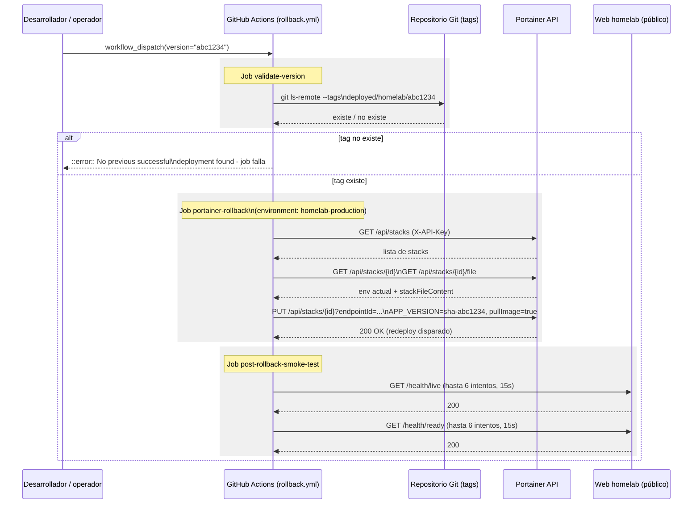

# Despliegue automatizado al homelab — Documentación Técnica

## Overview

Esta funcionalidad (issue [#45](https://github.com/AlejBlasco/SportsClubEventManager/issues/45)) cierra el ciclo de despliegue continuo al homelab: añade verificación post-despliegue real, trazabilidad de qué versión está corriendo en cada momento y un mecanismo de rollback totalmente automático. Se implementa como dos jobs nuevos al final de `.github/workflows/cd.yml` (`post-deploy-smoke-test` y `tag-deployed-version`, después del job `deploy` ya existente) y un workflow independiente, `.github/workflows/rollback.yml`, disparado manualmente. Se apoya en los health checks de la issue [#41](https://github.com/AlejBlasco/SportsClubEventManager/issues/41) (`/health/live`, `/health/ready`) y da por sentado el job `validate` de la issue #44 (validación de imágenes Docker), que ya se ejecuta antes de `build-and-push` en el mismo pipeline.

Antes de esta issue, `deploy` llamaba al webhook de GitOps de Portainer y el pipeline terminaba ahí: un despliegue roto no se detectaba hasta que alguien lo notaba manualmente, y volver a una versión anterior requería editar variables de entorno en la UI de Portainer a mano.

## Architecture

Diagrama de flujo completo del pipeline movido a [`docs/architecture/diagrams/cicd-pipeline.md`](../architecture/diagrams/cicd-pipeline.md) (catálogo de diagramas de la issue #51 — única fuente de verdad, para no mantener dos copias que puedan divergir).

Puntos clave del diagrama:

- `post-deploy-smoke-test` y `tag-deployed-version` se ejecutan siempre que `deploy` termina en verde (independientemente de si el webhook llegó a hacer algo real; ver `## Edge Cases`), en cada `push` a `master` o `workflow_dispatch` de `cd.yml`.
- `rollback.yml` es un **workflow independiente**, disparado solo por `workflow_dispatch` con el input obligatorio `version`. No forma parte de la cadena `needs` de `cd.yml`; se lanza manualmente (desde CLI o desde la pestaña Actions) cuando el smoke test de un despliegue falla, o simplemente para volver a una versión anterior.
- Ambos flujos reutilizan el mismo script, `infrastructure/deploy/smoke-test.sh`, sin duplicar lógica de polling.

## Key Components

| Componente | Ubicación | Responsabilidad |
|---|---|---|
| Job `post-deploy-smoke-test` | `.github/workflows/cd.yml` (líneas 181–231) | `needs: deploy`, `environment: homelab-production` (crea/actualiza el GitHub Deployment de esta ejecución). Ejecuta `smoke-test.sh` contra la URL pública real del homelab. Si falla, ejecuta `find-last-good-tag.sh`, escribe instrucciones de rollback en `$GITHUB_STEP_SUMMARY` con `::error::` y sale con código 1. |
| Job `tag-deployed-version` | `cd.yml` (líneas 233–257) | `needs: post-deploy-smoke-test`, `if: success()`. `permissions: contents: write` acotado únicamente a este job (el resto del workflow sigue en `contents: read` donde aplica). Calcula el sha corto con `git rev-parse --short=7 HEAD` (7 caracteres, igual que el `sha-<hash>` que genera `docker/metadata-action` en `build-and-push`) y crea/empuja el tag ligero `deployed/homelab/<sha-corto>` usando el `GITHUB_TOKEN` de la propia ejecución. |
| `infrastructure/deploy/smoke-test.sh` | `infrastructure/deploy/smoke-test.sh` | Polling bloqueante de `GET $HOMELAB_WEB_URL/health/live` y luego `/health/ready` (15s de intervalo, hasta 6 intentos, ≈90s máx. por endpoint). Compartido entre `post-deploy-smoke-test` (`cd.yml`) y `post-rollback-smoke-test` (`rollback.yml`). No contiene ninguna lógica de "si falla, calcular el tag de rollback" — eso vive en el llamador. |
| `infrastructure/deploy/find-last-good-tag.sh` | `infrastructure/deploy/find-last-good-tag.sh` | Recibe el sha actual como argumento. Consulta `gh api repos/AlejBlasco/SportsClubEventManager/deployments?environment=homelab-production`, recorre los despliegues de más reciente a más antiguo saltando el sha actual, comprueba el último `deployment_status` de cada uno vía `gh api .../deployments/{id}/statuses`, y devuelve `sha-<hash-corto>` del primero cuyo estado sea `success`. |
| `infrastructure/deploy/portainer-rollback.sh` | `infrastructure/deploy/portainer-rollback.sh` | Recibe `sha-<hash>` como argumento. Se autentica contra `$PORTAINER_API_URL` con `$PORTAINER_API_KEY` (header `X-API-Key`), localiza el stack de producción por nombre (`GET /api/stacks`, nombre configurable vía `PORTAINER_STACK_NAME`, por defecto `sportsclubeventmanager-prod`) y hace `PUT /api/stacks/{id}` fijando la variable de entorno de stack `APP_VERSION` al valor recibido y forzando `pullImage: true` — esto dispara el redeploy en la misma llamada, preservando el resto de la configuración del stack (referencias a secretos, puertos, etc.). |
| `.github/workflows/rollback.yml` | `.github/workflows/rollback.yml` | Workflow nuevo, `workflow_dispatch` con input obligatorio `version` (hash corto **sin** prefijo `sha-`, p. ej. `abc1234`). Tres jobs encadenados: `validate-version` → `portainer-rollback` → `post-rollback-smoke-test`. |
| `docker/docker-compose.prod.yml` (modificado) | `docker/docker-compose.prod.yml` | Único cambio: `image: ghcr.io/alejblasco/sportsclubeventsmanager-{api,web}:${APP_VERSION:-latest}` en los servicios `api` y `web` (antes, `:latest` fijo). Sin `APP_VERSION` fijada en Portainer, el comportamiento es idéntico al actual. Resto del fichero (secrets, healthcheck de `sqlserver`, `depends_on`, `restart`) sin cambios. |
| `infrastructure/deploy/DEPLOYMENT_RUNBOOK.md` | `infrastructure/deploy/DEPLOYMENT_RUNBOOK.md` | Runbook operativo: flujo automático completo, rollback automático, *fallback* manual "Pull and redeploy" en la UI de Portainer, rollback manual paso a paso, y la lista de prerrequisitos operativos pendientes. |

## Por qué `/health/live` y `/health/ready` son bloqueantes aquí (a diferencia de la issue #44)

El smoke test *pre-publicación* de la issue #44 (`.github/scripts/smoke-test.sh`, distinto script) trata `/health` como puramente informativo porque corre contra un SQL Server **efímero**, arrancado desde cero en el mismo job — un fallo ahí podría ser solo lentitud de arranque de una base de datos desechable, no un defecto real.

Aquí, en cambio, el SQL Server del homelab **ya está en marcha** antes del redeploy: un redeploy vía Portainer solo recrea los contenedores `api`/`web`, nunca `sqlserver`. No existe el riesgo de flakiness por arranque en frío, así que ambos checks son genuinamente bloqueantes:

- **`GET /health/live`** — el proceso de `Web` está arriba y sirviendo peticiones.
- **`GET /health/ready`** — las dependencias propias de `Web` (su base de datos) **y**, de forma transitiva, la disponibilidad de `Api` (`ApiAvailabilityHealthCheck`, issue #41) están sanas. Golpear solo `Web` desde fuera basta para verificar también `Api`, sin necesidad de exponer el health check de `Api` públicamente (`Api` no tiene hoy URL pública propia).

Un fallo en cualquiera de los dos aquí significa que el despliegue está genuinamente roto.

## Espacio de nombres de tags: `deployed/homelab/<sha>` vs. `vX.Y.Z`

`tag-deployed-version` crea tags ligeros con el formato `deployed/homelab/<sha-corto>` (p. ej. `deployed/homelab/abc1234`), **deliberadamente separados** del proceso de release SemVer ya existente en el repositorio (tags `v0.1.0`, `v0.2.0`, creados en PRs `release: vX.Y.Z`, ver `CHANGELOG.md`):

- Los despliegues al homelab ocurren en cada `push` a `master`, con una cadencia potencialmente muy distinta a la de una release SemVer formal.
- `deployed/homelab/<sha>` es la **fuente de verdad de "qué se ha desplegado con éxito y cuándo"** — es lo que `rollback.yml` valida como input `version` válido. No implica ni sustituye ninguna decisión de versionado de producto.
- El propio workflow crea y empuja el tag con el `GITHUB_TOKEN` de la ejecución de Actions — nunca es una acción manual del desarrollador ni de ningún agente del pipeline.

> **Actualización (2026-07-15, issue #99):** el tag `vX.Y.Z` ya **no** es puramente manual — el job `tag-release-version` (justo después de `tag-deployed-version`, mismo `needs`/`permissions`) lo crea automáticamente en el caso normal, si `Directory.Build.props` trae una versión sin tag todavía y `CHANGELOG.md` ya la documenta. Sigue siendo un espacio de nombres separado y con propósito distinto de `deployed/homelab/<sha>` — la separación conceptual de este apartado no cambia, solo quién ejecuta materialmente el `git tag`/`git push` del lado `vX.Y.Z`. Detalle completo en [`docs/technical/issue-99-versionado-real-imagenes-y-releases.md`](issue-99-versionado-real-imagenes-y-releases.md#automatización-del-tag-vxyz-2026-07-15).

## Rollback: workflow, scripts y prerrequisitos

### Los tres jobs de `rollback.yml`



1. **`validate-version`**: comprueba con `git ls-remote --exit-code --tags origin deployed/homelab/<version>` que ese tag existe antes de continuar. Si no existe, falla con un mensaje explícito en vez de intentar desplegar un commit que nunca llegó a desplegarse con éxito.
2. **`portainer-rollback`** (`needs: validate-version`, `environment: homelab-production`): llama a `infrastructure/deploy/portainer-rollback.sh "sha-${{ inputs.version }}"`. El script fusiona `APP_VERSION=sha-<version>` con el resto de variables de entorno ya configuradas en el stack (preservando referencias a secretos, puertos, etc.) y hace `PUT /api/stacks/{id}` con `pullImage: true`. La imagen con ese tag ya existe en GHCR (publicada por una ejecución anterior de `build-and-push`) — este script nunca construye ni publica nada.
3. **`post-rollback-smoke-test`** (`needs: portainer-rollback`): reutiliza `smoke-test.sh`, los mismos checks bloqueantes de `/health/live` y `/health/ready`. Si falla, el job falla con una alerta explícita. **No hay reintento automático ni "rollback del rollback"** — en ese caso el runbook (`infrastructure/deploy/DEPLOYMENT_RUNBOOK.md`, sección 4) documenta el procedimiento manual paso a paso en la UI de Portainer.

### Por qué la API REST de Portainer y no el webhook de GitOps

El webhook usado por el job `deploy` de `cd.yml` (mecanismo de despliegue normal) solo dispara "re-pull con la configuración actual del stack" — no acepta parámetros para cambiar `APP_VERSION`, así que no sirve para rollback a una versión distinta de la configurada. La API REST de Portainer Business Edition sí permite actualizar las variables de entorno del stack y forzar `pullImage` en la misma llamada, lo que automatiza exactamente el procedimiento manual ("fijar `APP_VERSION` y pulsar Update the stack") sin intervención humana en la UI.

### Prerrequisitos: GitHub Environment `homelab-production`

Tanto `post-deploy-smoke-test`/`tag-deployed-version` (en `cd.yml`) como los tres jobs de `rollback.yml` dependen del entorno GitHub `homelab-production` y de cuatro secretos/variables que debe cargar el propietario del homelab. **A fecha de esta documentación, estos son prerrequisitos manuales pendientes, no configurados todavía**:

| Nombre | Tipo | Usado por | Efecto si falta |
|---|---|---|---|
| `PORTAINER_WEBHOOK_URL` | Secret | Job `deploy` (`cd.yml`, ya existente) | El `if: env.PORTAINER_WEBHOOK_URL != ''` nunca se cumple; `deploy` termina en verde sin haber llamado a ningún webhook real (comportamiento actual, sin cambios de esta issue). |
| `HOMELAB_WEB_URL` | Variable (o secret, ver nota abajo) | `post-deploy-smoke-test`, `post-rollback-smoke-test` (`smoke-test.sh`) | El step falla inmediatamente (`::error::HOMELAB_WEB_URL is not set`). |
| `PORTAINER_API_URL` | Secret | Job `portainer-rollback` (`portainer-rollback.sh`) | El script falla (`::error::PORTAINER_API_URL and PORTAINER_API_KEY must be set`); `rollback.yml` no puede ejecutarse en absoluto. |
| `PORTAINER_API_KEY` | Secret | Job `portainer-rollback` (`portainer-rollback.sh`) | Igual que arriba. |

Nota: el campo `environment.url` de un job en GitHub Actions no admite el contexto `secrets` (solo `env`, `github`, `inputs`, `job`, `matrix`, `needs`, `runner`, `steps`, `strategy`, `vars`), verificado con `actionlint`. Por eso `post-deploy-smoke-test` referencia `url: ${{ vars.HOMELAB_WEB_URL }}` en ese campo concreto, mientras que el step real de smoke test lee `${{ vars.HOMELAB_WEB_URL || secrets.HOMELAB_WEB_URL }}` — si `HOMELAB_WEB_URL` solo se carga como *secret*, el smoke test funciona igual, pero el enlace visible en la pestaña "Environments" queda vacío.

Sin estos cuatro valores cargados en el entorno `homelab-production` (`Settings → Environments → homelab-production` del repositorio), el flujo automático descrito en este documento no está activo todavía — ver `infrastructure/deploy/DEPLOYMENT_RUNBOOK.md`, sección 5, y el `## Apéndice A` del [documento de diseño](../../.claude/docs/sdlc/design/issue-45-despliegue-automatizado-al-homelab.md) para los pasos exactos de generación de cada secreto.

## Cómo disparar un rollback

Vía CLI (recomendado):

```bash
# Ver qué versiones se han desplegado con éxito (más reciente primero):
git fetch --tags
git tag -l 'deployed/homelab/*' --sort=-creatordate

# Lanzar el rollback (usar solo el hash corto, SIN el prefijo "sha-"):
gh workflow run rollback.yml -f version=abc1234
```

También puede lanzarse desde **Actions → Rollback Homelab Deployment → Run workflow** en GitHub, indicando el mismo valor en el campo `version`.

Para el procedimiento completo (incluyendo los *fallbacks* manuales si la API de Portainer no fuera alcanzable desde runners GitHub-hosted), ver `infrastructure/deploy/DEPLOYMENT_RUNBOOK.md`.

## Edge Cases & Error Handling

- **`post-deploy-smoke-test` falla (`/health/live` o `/health/ready` no responde 200 en ~90s)**: se ejecuta `find-last-good-tag.sh`, se escriben instrucciones de rollback (incluido el comando `gh workflow run rollback.yml` exacto) en `$GITHUB_STEP_SUMMARY`, se emite `::error::` y el job sale con código 1 — esto marca el GitHub Deployment de `homelab-production` como `failure`, visible en la pestaña Environments. `tag-deployed-version` no se ejecuta (`needs: post-deploy-smoke-test` sin `if: success()` explícito habría bastado, pero además el job en sí ya no correría por la cascada normal de `needs`).
- **No existe ningún despliegue anterior con estado `success`** (p. ej. es el primer despliegue): `find-last-good-tag.sh` sale con `::error::No previous successful deployment found...` y código 1; el step que lo invoca en `cd.yml` captura ese fallo con `|| echo 'unknown'`, así que el resumen del job igualmente se genera, con `unknown` como tag sugerido.
- **`rollback.yml` disparado con un `version` que no tiene tag `deployed/homelab/<version>`**: `validate-version` falla explícitamente antes de tocar Portainer — nunca se intenta desplegar un commit que no llegó a desplegarse con éxito.
- **La API de Portainer devuelve algo distinto de HTTP 200 al actualizar el stack**: `portainer-rollback.sh` emite `::error::Portainer API returned HTTP <code>...`, vuelca el cuerpo de la respuesta y sale con 1.
- **El stack configurado en `PORTAINER_STACK_NAME` no existe** (nombre real distinto del valor por defecto `sportsclubeventmanager-prod`): `portainer-rollback.sh` falla con `::error::Stack '<nombre>' not found in Portainer...` antes de intentar ningún `PUT`.
- **`post-rollback-smoke-test` falla tras un rollback**: el job falla con alerta explícita. **No hay reintento automático ni "rollback del rollback"** — decisión de diseño explícita para no encadenar rollbacks automáticos indefinidamente; requiere intervención manual siguiendo el runbook.
- **`PORTAINER_API_URL` no alcanzable desde runners GitHub-hosted** (riesgo residual documentado, no bloqueante): si ocurriera, la contingencia ya prevista es migrar únicamente el job `portainer-rollback` a un runner autoalojado dentro de la red del homelab, sin tocar `cd.yml` ni el resto de `rollback.yml`.
- **Secretos de `homelab-production` no cargados todavía**: `deploy` sigue siendo un no-op (como hoy); `post-deploy-smoke-test`/`post-rollback-smoke-test` fallan de forma explícita e inmediata (`HOMELAB_WEB_URL is not set`) en vez de colgarse o dar un falso positivo.

## Extension points

- **Runner autoalojado para `portainer-rollback`**: si `PORTAINER_API_URL` resultara no alcanzable desde runners GitHub-hosted, migrar solo ese job (`runs-on: self-hosted` dentro de la red del homelab), manteniendo el resto de `rollback.yml` y todo `cd.yml` sin cambios.
- **Token de Portainer de mínimo privilegio**: `PORTAINER_API_KEY` puede, según la edición de Portainer, conceder más alcance que "gestionar este stack concreto". Se recomienda crear un usuario/token dedicado de mínimo privilegio si la edición instalada lo permite (responsabilidad del propietario del homelab, Apéndice A.2 del diseño).
- **Exponer `Api` públicamente para un smoke test directo**: hoy `post-deploy-smoke-test`/`post-rollback-smoke-test` verifican `Api` de forma transitiva a través de `/health/ready` de `Web`. Golpear `Api` directamente requeriría exponer una URL pública nueva, descartado para v1 por no ser necesario.
- **`PORTAINER_STACK_NAME` configurable**: si el nombre real del stack en Portainer difiere de `sportsclubeventmanager-prod`, se puede fijar como variable de entorno adicional en el job `portainer-rollback` de `rollback.yml`, sin tocar el script.
