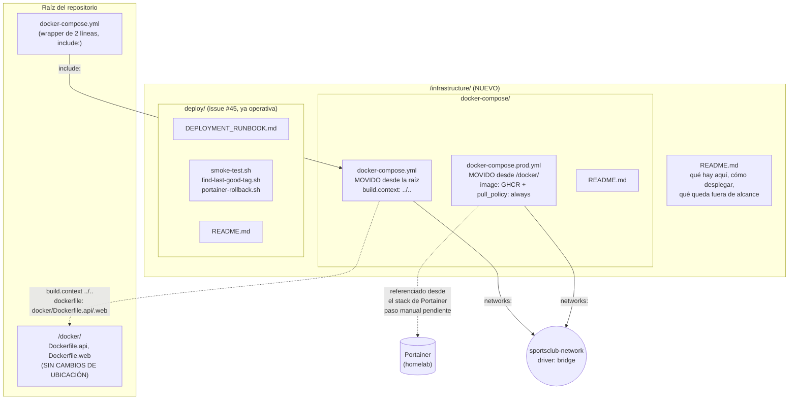
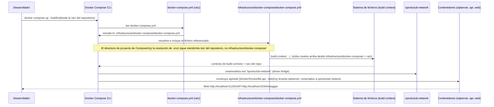

# Infraestructura como Código — Documentación Técnica

## Overview

Esta funcionalidad (issue [#46](https://github.com/AlejBlasco/SportsClubEventManager/issues/46)) reorganiza toda la infraestructura como código (IaC) de `SportsClubEventManager` bajo una carpeta única y versionada, `/infrastructure/`, moviendo a ella los dos ficheros Docker Compose ya existentes (antes dispersos entre la raíz del repositorio y `/docker/`) y añadiendo una red Docker nombrada explícita. No cambia ni un byte de lógica de negocio: es una issue puramente de organización de ficheros y documentación, construida sobre las issues [#44](../technical/issue-44-validacion-imagenes-docker-pipeline-cd.md) (validación de imágenes Docker) y [#45](../technical/issue-45-despliegue-automatizado-al-homelab.md) (despliegue automatizado al homelab), que ya asumían en sus propios diseños una carpeta `infrastructure/deploy/` para sus scripts.

El comando de desarrollo documentado en el README, `docker compose up --build` desde la raíz del repositorio, sigue funcionando exactamente igual que antes de esta issue — es la primera restricción de diseño y se cumple mediante la clave `include:` de Docker Compose (ver `## Architecture`).

## Architecture

Puntos clave del diagrama:

- `/infrastructure/` tiene dos subcarpetas con responsabilidades distintas: `docker-compose/` (qué se despliega — orquestación) y `deploy/` (cómo se dispara/verifica/revierte ese despliegue — automatización CI/CD, ya implementada por la issue #45 antes de que esta issue #46 se ejecutara).
- Los `Dockerfile.api`/`Dockerfile.web` **no** se mueven: siguen en `/docker/`, porque son una preocupación de *build* de imagen, distinta de la orquestación/despliegue que sí vive en `/infrastructure/`.
- `docker-compose.prod.yml` no tiene wrapper equivalente en la raíz: no forma parte de ningún comando de una línea que ejecute un desarrollador — es Portainer quien apunta directamente a su ruta dentro del repositorio, configuración externa a este repositorio.

## Key Components

| Componente | Ubicación | Responsabilidad |
|---|---|---|
| `docker-compose.yml` (raíz) | `docker-compose.yml` | *Wrapper* de dos líneas con la clave `include:` de la especificación de Compose. Sustituye íntegramente el contenido que antes vivía aquí. Preserva `docker compose up --build` como comando de desarrollo sin cambios. |
| `docker-compose.yml` (real) | `infrastructure/docker-compose/docker-compose.yml` | Stack de desarrollo local: `sqlserver`, `api`, `web`. Contenido idéntico al fichero movido (secretos, healthcheck, puertos, `depends_on`) salvo dos cambios: `build.context` de `api`/`web` pasa de `.` a `../..`, y se añade el bloque `networks: sportsclub-network`. |
| `docker-compose.prod.yml` | `infrastructure/docker-compose/docker-compose.prod.yml` | Stack de producción/homelab: usa `image:` publicada en GHCR (`pull_policy: always`) en vez de `build:`, más `restart: unless-stopped`. Movido tal cual desde `docker/docker-compose.prod.yml`, con el mismo bloque `networks:` añadido. No requiere ajuste de `context` porque no usa `build:`. |
| `infrastructure/README.md` | `infrastructure/README.md` | Documentación general de IaC: qué hay en `docker-compose/` y `deploy/`, cómo desplegar desde cero (desarrollo y producción), y qué queda explícitamente fuera de alcance. |
| `infrastructure/docker-compose/README.md` | `infrastructure/docker-compose/README.md` | Diferencias funcionales entre ambos ficheros Compose, comandos de verificación (`docker compose config`) y el paso manual pendiente en Portainer. |
| `infrastructure/deploy/README.md` | `infrastructure/deploy/README.md` | Documenta el contenido ya real y operativo de esta carpeta (los cuatro ficheros de la issue #45) — no es un placeholder, ver `## Edge Cases & Error Handling`. |
| `infrastructure/deploy/DEPLOYMENT_RUNBOOK.md` | `infrastructure/deploy/DEPLOYMENT_RUNBOOK.md` | Preexistente (issue #45). Dos referencias a la ruta antigua `docker/docker-compose.prod.yml` actualizadas a la nueva ubicación. |
| Red `sportsclub-network` | Bloque `networks:` en ambos Compose | Red Docker de tipo `bridge`, nombrada explícitamente, que sustituye a la red por defecto implícita que Compose crea automáticamente por proyecto. Los tres servicios (`sqlserver`, `api`, `web`) la referencian explícitamente en ambos ficheros. |
| `README.md` (raíz) | `README.md` | Sección "d. Estructura del proyecto": `/docker` pierde `docker-compose.prod.yml` (movido), se añade la entrada `/infrastructure`. Sección "c. Instalación y ejecución", paso 3: nota aclaratoria sobre la nueva ubicación del contenido real, sin cambiar el comando documentado. |

## Data Flow / Sequence

Resolución de `docker compose up --build` ejecutado desde la raíz del repositorio (flujo de desarrollo sin cambios respecto a antes de esta issue):

Puntos clave:

- `include:` hace que Compose resuelva el proyecto **exactamente igual** que si todo el contenido de `infrastructure/docker-compose/docker-compose.yml` estuviera en la raíz: el directorio de proyecto (y por tanto la resolución por defecto de `.env`/`.env.example`) sigue siendo la raíz del repositorio. Por eso `.env`/`.env.example` no se han movido.
- Las rutas relativas **dentro** del fichero incluido (`build.context`, `dockerfile`) se resuelven relativas a la ubicación de ese fichero, no a la raíz — de ahí que `context: .` pasara a `context: ../..` al mover el fichero dos niveles hacia dentro (`infrastructure/docker-compose/`).
- `include:` es una clave estable desde Docker Compose v2.20, muy por debajo de cualquier versión razonable instalada en 2026.

## Qué NO cambió

- **Los Dockerfiles siguen en `/docker/`.** No se movieron porque son una preocupación de *build* de imagen, no de orquestación/despliegue — moverlos habría obligado además a tocar `.github/workflows/cd.yml` (que referencia `docker/Dockerfile.api`/`docker/Dockerfile.web` explícitamente) sin que ningún criterio de aceptación de esta issue lo exigiera. `.github/workflows/cd.yml` no referencia ningún fichero Compose (construye las imágenes directamente vía `docker/build-push-action`), por lo que tampoco requirió cambios.
- **No se añadió ningún script de inicialización de base de datos.** El arranque desde cero ya funciona hoy mediante `MigrateDatabaseAsync()` en `Program.cs` (EF Core): un `sqlserver` recién creado (volumen vacío) recibe el esquema completo al primer arranque de `api`/`web`. Un script SQL de inicialización paralelo habría duplicado la fuente de verdad del esquema y arriesgado desincronización con el tiempo.
- **El comportamiento de conectividad entre servicios no cambia.** `sqlserver`, `api` y `web` seguían compartiendo ya una misma red (la red *bridge* por defecto implícita de Compose); ahora esa red simplemente tiene nombre y es explícita/revisable en el diff de una PR.

## Fuera de alcance (con seguimiento propio)

| Elemento | Motivo | Issue de seguimiento |
|---|---|---|
| Terraform | Sin recursos cloud que aprovisionar — el despliegue real es un único nodo Docker/Portainer del homelab. Confirmado como no aplicable, no como omisión. | — (decisión registrada en el diseño) |
| Prometheus | Fuera de alcance de la #46, confirmado por el propietario del producto. | [#42](https://github.com/AlejBlasco/SportsClubEventManager/issues/42) |
| Grafana | Ídem. | [#43](https://github.com/AlejBlasco/SportsClubEventManager/issues/43) |
| n8n | Ídem. | [#37](https://github.com/AlejBlasco/SportsClubEventManager/issues/37) |
| Backup/restauración del volumen `sqlserver_data` | No exigido por los criterios de aceptación literales (solo exigen que el volumen esté declarado como IaC, lo cual ya ocurría). Detectado como hueco real durante el diseño. | [#100](https://github.com/AlejBlasco/SportsClubEventManager/issues/100) |
| `CODEOWNERS` para `/infrastructure/` | La revisión por PR ya se cumple estructuralmente vía `branch-protection.yml` (revisión obligatoria en `master`/`develop` para cualquier fichero). Mejora opcional, no exigida literalmente. | Decisión abierta, no bloqueante |

## Edge Cases & Error Handling

- **`infrastructure/deploy/` no es un placeholder, es contenido real.** El diseño original de esta issue (escrito antes de que la #45 se fusionara) especificaba un `README.md` "reservado, sin implementar" para esta carpeta. Al ejecutar la implementación, la #45 ya estaba mergeada y `infrastructure/deploy/` ya contenía `DEPLOYMENT_RUNBOOK.md` y tres scripts en producción, referenciados activamente desde `.github/workflows/cd.yml` y `rollback.yml`. Se documentó el contenido real en su lugar (ver `docs/technical/issue-45-*.md` para el detalle de esos scripts).
- **`docker compose config --project-directory .` puede resolver `build.context` de forma incorrecta en algunas instalaciones locales de Docker Compose en Windows.** Se observó, en una instalación concreta de Docker Compose v5.3.0 en Windows, que combinar `--project-directory <ruta>` con un `build.context` relativo de más de un nivel (`../..`) produce una resolución de ruta duplicada/incorrecta (recorta siempre 2 niveles de más). **No afecta al flujo de desarrollo real documentado** (`docker compose up --build`, sin `--project-directory`, desde la raíz): en ese caso `context` resuelve correctamente. Se recomienda validar con `docker compose config` **sin** el flag `--project-directory`, o en un entorno distinto, antes de confiar en esa verificación concreta.
- **Paso manual pendiente — ruta del stack de producción en Portainer.** `docker-compose.prod.yml` se movió de `docker/docker-compose.prod.yml` a `infrastructure/docker-compose/docker-compose.prod.yml`. Portainer no sigue automáticamente ese movimiento: el propietario del homelab debe actualizar manualmente, en la configuración del stack de producción, la ruta del fichero Compose a la nueva ubicación, **antes o inmediatamente después** de fusionar esta issue. Si no se actualiza a tiempo, el próximo redeploy (manual o vía el webhook GitOps ya existente de `cd.yml`) dejará de encontrar el fichero y fallará. Documentado en `infrastructure/docker-compose/README.md`.
- **Paso manual pendiente — ingress/DNS público (Nginx + Cloudflare).** Fuera de este repositorio: añadir un nuevo *server block* de Nginx a nivel de host apuntando al puerto publicado de `web` (`${WEB_PORT:-5123}` por defecto), y el registro DNS correspondiente en Cloudflare, siguiendo el mismo patrón ya usado hoy para otras aplicaciones del mismo homelab. No bloquea el desarrollo/pruebas locales — solo es necesario antes de que `web` deba ser accesible públicamente. Documentado en `infrastructure/README.md`, que referencia el Apéndice A del documento de diseño de esta issue para el detalle paso a paso.
- **`docker compose up --build` de extremo a extremo no se ha ejecutado como parte de la verificación automatizada de esta issue** (arranque completo de los tres contenedores, incluyendo un SQL Server en frío) — se recomienda al humano ejecutarlo al menos una vez antes de fusionar, para confirmar que `sqlserver` alcanza `healthy` y que `api`/`web` sirven tráfico con la nueva estructura de ficheros. La validación sintáctica (`docker compose config`) sí se ejecutó y terminó en código 0 para ambos ficheros movidos.

## Extension points

- **Ficheros Compose adicionales** (por ejemplo, un `docker-compose.override.yml` de desarrollo, o un stack de monitorización cuando se implementen las issues #42/#43): pueden añadirse como entradas adicionales de la lista `include:` en la raíz, o como ficheros nuevos dentro de `infrastructure/docker-compose/`, sin romper el wrapper actual.
- **`CODEOWNERS` para `/infrastructure/`**: si en el futuro se decide reforzar la revisión de esta carpeta con un revisor específico, es una adición de bajo riesgo — no requiere cambios en la estructura documentada aquí.
- **Runner autoalojado / automatización adicional del paso de Portainer**: el paso manual de actualizar la ruta del stack en Portainer podría automatizarse en el futuro (p. ej. vía la misma API REST de Portainer que ya usa `portainer-rollback.sh` en la issue #45), pero queda fuera de alcance de esta issue.
