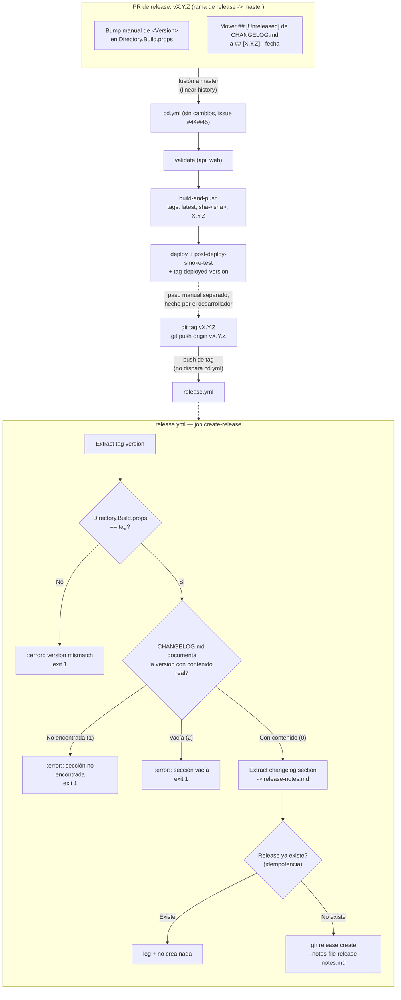
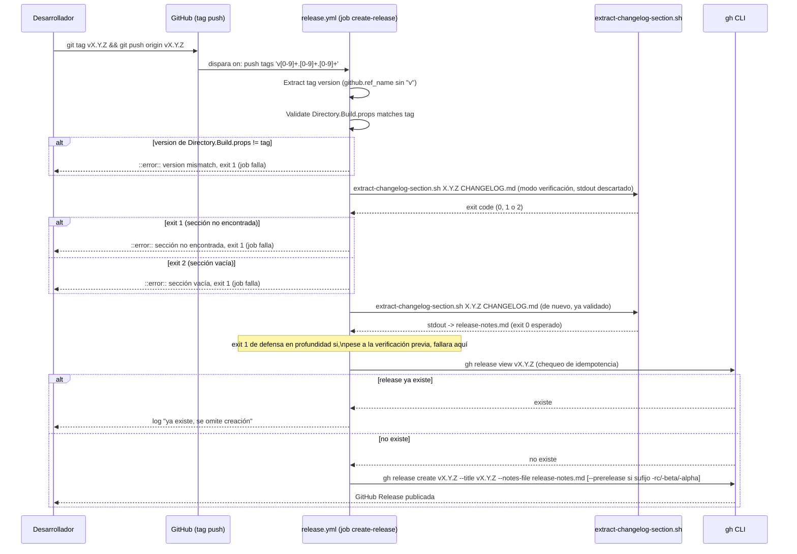
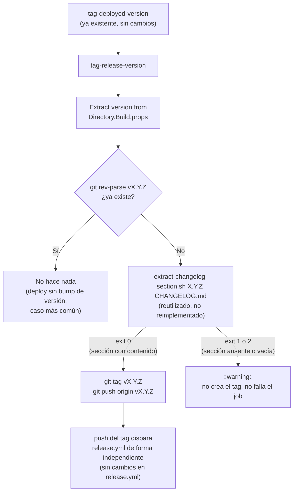

# Versionado real de imágenes Docker y releases — Documentación Técnica

## Overview

Esta funcionalidad (issue [#99](https://github.com/AlejBlasco/SportsClubEventManager/issues/99)) sustituye el valor estático `<Version>1.0.0</Version>` de `Directory.Build.props` — que nunca correspondió a una release real y nunca se incrementaba — por un proceso de versionado manual, ligero y dirigido por el desarrollador, integrado en la convención de PR `release: vX.Y.Z` que el repositorio ya usaba. Añade además un workflow nuevo, `.github/workflows/release.yml`, disparado por el `push` del tag de Git `vX.Y.Z`, que valida la consistencia entre el tag y `Directory.Build.props`, comprueba que `CHANGELOG.md` documenta contenido real para esa versión, y publica automáticamente la GitHub Release usando ese contenido como notas.

> **Actualización (2026-07-15):** el tag `vX.Y.Z` que dispara `release.yml`, descrito como paso manual del desarrollador en el resto de este documento, ahora se crea **automáticamente** en el caso normal — ver [`## Automatización del tag vX.Y.Z (2026-07-15)`](#automatización-del-tag-vxyz-2026-07-15) al final de este documento. El resto del documento se deja tal cual para conservar el razonamiento original de diseño (por qué versionado manual, por qué workflow separado); esa sección final documenta solo lo que cambió y por qué.

Es un seguimiento explícito de la issue [#44](../technical/issue-44-validacion-imagenes-docker-pipeline-cd.md) (validación de imágenes Docker en `cd.yml`): esa issue ya dejó `build-and-push` etiquetando las imágenes con `latest`, `sha-<sha>` y `<version>` (leído de `Directory.Build.props`), pero `<version>` seguía siendo el valor estático `1.0.0`. Esta issue no toca la mecánica de tageo de imágenes (ya correcta) ni la validación de smoke-test/vulnerabilidades — solo hace que `<Version>` deje de ser un valor muerto y que la creación de la GitHub Release deje de ser 100% manual.

No hay cambios de código `.cs`, DTOs, ni esquema de base de datos: es, igual que las issues #44/#45/#46, infraestructura de pipeline/proceso.

## Architecture



Puntos clave del diagrama:

- El tag `vX.Y.Z` **no dispara** `cd.yml` (que solo escucha `push: branches: [master]`, `pull_request` y `workflow_dispatch`); no hay reconstrucción ni republicación de imágenes al crear el tag. La imagen con el tag `X.Y.Z` correcto ya se publicó en el paso anterior (push a `master`), siempre que el bump se haya hecho antes de fusionar (ver `## Orden de operaciones recomendado`).
- `release.yml` es un workflow independiente de `cd.yml`, con su propio job y sus propios permisos (`contents: write`), deliberadamente no fusionado dentro de `cd.yml` — ver `## Por qué un workflow separado`.
- Cualquiera de las dos comprobaciones (`S2`, `S3`) que falla detiene el job **antes** de tocar `CHANGELOG.md` para extracción o de crear ninguna Release: no se publica nunca una Release con versión incorrecta o notas vacías.

## Key Components

| Componente | Ubicación | Responsabilidad |
|---|---|---|
| `<Version>` | `Directory.Build.props` | Corregido de `1.0.0` a `0.2.0` (última release real del repositorio) como parte de esta misma issue, dejando el repositorio en estado consistente de inmediato. A partir de ahora se considera campo obligatorio de cada PR `release: vX.Y.Z`: debe coincidir exactamente (sin prefijo `v`) con el tag de Git que se cree después de fusionar esa PR. |
| Nota de proceso en `CHANGELOG.md` | `CHANGELOG.md`, bajo `## [Unreleased] > ### Changed` | Documenta que `Directory.Build.props` se versiona ahora como parte de cada PR de release. No es una entrada de release ni un bump de versión. |
| Viñeta en `README.md` | `README.md`, sección `## Calidad y CI/CD` | Describe el flujo completo de release para cualquier lector del repositorio (ver `## Cómo verificar` más abajo). |
| `.github/scripts/extract-changelog-section.sh` (nuevo) | `.github/scripts/extract-changelog-section.sh` | Script `bash`/`awk`/`grep`/`sed` sin dependencias nuevas, mismo estilo que `.github/scripts/smoke-test.sh` (issue #44). Extrae por stdout el contenido de la sección `## [X.Y.Z]` de `CHANGELOG.md` (sin la cabecera). Contrato de tres códigos de salida — ver `## Contrato de extract-changelog-section.sh`. |
| `.github/workflows/release.yml` (nuevo) | `.github/workflows/release.yml` | Trigger `on: push: tags: ['v[0-9]+.[0-9]+.[0-9]+']`. Job único `create-release`, `permissions: contents: write`. Ver `## Data Flow / Sequence` para el detalle de sus steps. |

## Por qué un workflow separado de `cd.yml`

`release.yml` reutiliza el propio tag de Git que el desarrollador **ya crea manualmente hoy** como disparador — no introduce ningún paso nuevo en el flujo humano, solo automatiza lo que viene después de crear el tag. Se mantiene como workflow independiente de `cd.yml` por dos motivos verificados durante el diseño:

1. `cd.yml` no tiene hoy ningún trigger de tags, y añadirlo mezclaría dos ciclos de vida distintos: publicación de imagen (en cada push a `master`) frente a creación de release (una vez por versión, en un commit que normalmente **ya fue publicado** por `cd.yml` en el push anterior).
2. Mantenerlos separados no interfiere con el pipeline ya validado de las issues #44/#45 (`validate` → `build-and-push` → `deploy`), que queda completamente sin cambios.

## Por qué versionado manual y no GitVersion/semantic-release

La issue #99 pedía explícitamente **evaluar** un enfoque de incremento automático (GitVersion, semantic-release) frente a uno manual, sin asumir que la opción con más *tooling* fuera la correcta por defecto solo por aparecer primero en la lista de ejemplos de la issue. El análisis, verificado contra el `git log` real del repositorio (no asumido), concluyó en bump manual documentado por estas razones:

- **Disciplina de Conventional Commits verificada como insuficiente**, no asumida: muestreo real de los últimos ~100 commits encontró mensajes con scope vacío y solo emoji (`feat(security): :fire: Add oAuth`), espacios que rompen el regex estándar (`fix: (test) Add email validation`), commits de Dependabot sin ningún prefijo de tipo, y merges clásicos (`Merge pull request #NN from ...`). Esto contradecía una asunción registrada previamente en el seguimiento de la issue #44 ("Conventional Commits, ya usados en los mensajes de commit del repo"), que quedó corregida en el diseño de esta issue. Cualquier herramienta de bump automático derivado de esos mensajes calcularía versiones erróneas o inconsistentes sin antes invertir en linting de commits/PR — trabajo no pedido por esta issue.
- **El tag `sha-<sha>` ya es la clave de trazabilidad/rollback real** (issue #44/#45): el mecanismo de rollback automático (`deployed/homelab/*`) depende exclusivamente de `sha-<sha>`, nunca de un SemVer. El tag `X.Y.Z` que introduce esta issue es puramente comunicativo (para quien navegue GHCR o las Releases de GitHub) — no es infraestructura crítica de la que dependa ningún mecanismo de despliegue, lo que reduce sustancialmente el coste de un eventual fallo en el proceso de versionado.
- **Proyecto de desarrollador único, TFM con calendario de sprint ajustado** (milestone Sprint 3, deliberadamente priorizando desarrollo funcional visible frente a mayor profundidad de CI/CD en el tiempo disponible).
- **El repositorio ya tenía un proceso de release manual funcionando** (tags `v0.1.0`/`v0.2.0`, GitHub Releases creadas a mano, PR `release: vX.Y.Z`): la opción manual completa ese proceso existente en vez de sustituirlo, con la mínima fricción añadida.

GitVersion y semantic-release quedan documentados como *upgrade path* futuro, condicionado a que se normalicen antes los Conventional Commits del repositorio (linting de PR title, plantillas de squash message) — no implementados en esta issue.

## Data Flow / Sequence



Steps reales de `release.yml`, en orden (`.github/workflows/release.yml`):

1. **Checkout** — `actions/checkout@v7`, checkout por defecto del commit apuntado por el tag.
2. **Extract tag version** — deriva `X.Y.Z` de `github.ref_name` quitando el prefijo `v`.
3. **Validate Directory.Build.props matches tag** — mismo patrón `grep -oP '(?<=<Version>)[^<]+'` ya usado en `cd.yml`; falla (`::error::` + `exit 1`) **antes** de tocar `CHANGELOG.md` o crear nada si no coincide con el tag.
4. **Verify CHANGELOG documents this release** — invoca el script en modo verificación (stdout a `/dev/null`, solo interesa el código de salida) y bifurca con un mensaje `::error::` distinto para cada caso (`1` vs `2`, ver siguiente sección).
5. **Extract changelog section** — vuelca el contenido real a `release-notes.md`; conserva un `exit 1` de defensa en profundidad si, pese a la verificación previa del step anterior, fallara aquí.
6. **Check for existing release** — `gh release view "$TAG"`; idempotencia ante reintentos del workflow (no falla si ya existe, simplemente omite la creación).
7. **Create GitHub Release** — `gh release create` con `--notes-file release-notes.md`; añade `--prerelease` automáticamente si `X.Y.Z` contiene el sufijo `-rc`, `-beta` o `-alpha` (el repositorio no usa hoy pre-releases con sufijo, pero el flag queda preparado sin coste adicional).

## Contrato de `extract-changelog-section.sh`

```bash
extract-changelog-section.sh <version-sin-v> <ruta-al-changelog>
```

Imprime por stdout el contenido de la sección `## [X.Y.Z]` (sin la cabecera) y sale con:

| Código | Significado | Cuándo ocurre |
|---|---|---|
| `0` | Cabecera encontrada y con contenido real | Al menos una línea no vacía entre la cabecera `## [X.Y.Z] - ...` y el fin de la sección |
| `1` | Cabecera no encontrada | No existe ninguna línea `^## \[X.Y.Z\]` en el fichero |
| `2` | Cabecera encontrada pero sección vacía | La sección solo contiene líneas en blanco entre la cabecera y el fin |

Detalles de implementación relevantes (`.github/scripts/extract-changelog-section.sh`):

- El valor de versión se escapa para regex (`sed 's/[.[\*^$]/\\&/g'`) antes de construir el patrón `^## \[${ESCAPED_VERSION}\]`, para que una versión como `0.2.0` no se interprete como comodín (`0X2X0`).
- La captura de la sección (vía `awk`) corta tanto al encontrar la siguiente cabecera `## [` como al encontrar una línea de enlace de referencia del pie (`^\[...\]:`) — esto cubre explícitamente el caso de que la sección objetivo sea la **última** del fichero, evitando incluir por error los enlaces de comparación del final de `CHANGELOG.md` en el cuerpo de la Release (verificado manualmente: hoy `[0.1.0]` es la última sección antes del bloque de enlaces).
- El recorte de líneas en blanco iniciales/finales usa el idiomatismo estándar de `sed` (`/./,$!d` + bucle `:a`), disponible en el `sed` GNU de `ubuntu-latest` (mismo runner que `cd.yml`), sin necesidad de herramientas adicionales (`tac`, etc.).

El script se invoca **dos veces** en `release.yml`: una en modo verificación (step 4, solo interesa el código de salida) y otra para la extracción real (step 5, se usa el stdout). Es la misma llamada idempotente; no hay estado compartido entre ambas invocaciones.

## Orden de operaciones recomendado (y por qué no hay gate de CI que lo fuerce)

Orden correcto documentado en el README y en el runbook de release:

1. Fusionar la PR `release: vX.Y.Z` en `master` (bump de `<Version>` + cierre de `## [Unreleased]` a `## [X.Y.Z] - fecha`).
2. Confirmar en Actions que `cd.yml` ha publicado la imagen con el tag de versión `X.Y.Z` esperado.
3. Solo entonces, crear y empujar el tag de Git `vX.Y.Z` sobre ese commit de `master`.

Si el tag se crea **antes** de que la PR de release esté fusionada (o contra un commit sin el bump), `release.yml` fallará limpiamente en el step "Validate Directory.Build.props matches tag" — no se llega a crear ninguna Release incorrecta. Es una decisión deliberada de coste/beneficio para un proyecto de mantenedor único: no se ha añadido ningún gate bloqueante nuevo en CI (ni cambios en `branch-protection.yml`) para forzar este orden; la mitigación es exclusivamente documental. El coste de un gate adicional (más complejidad de pipeline) no se consideró justificado frente al riesgo real (un tag mal ordenado falla de forma visible y explícita en `release.yml`, sin efectos colaterales sobre `cd.yml` ni sobre el mecanismo de rollback basado en `sha-<sha>`).

## Qué no se ha construido (y por qué)

- **Ninguna plantilla `.github/PULL_REQUEST_TEMPLATE.md` nueva**: se verificó que no existe ninguna en el repositorio; el checklist de la PR de release se mantiene documentado solo en el README, coherente con la prioridad explícita de dedicar el tiempo restante del sprint a desarrollo funcional visible antes que a más *tooling* de proceso.
- **Ninguna herramienta de bump automático de SemVer (GitVersion, semantic-release)**: descartadas por la disciplina de commits insuficiente y el bajo valor añadido frente al coste de introducirlas bajo presión de plazo — ver `## Por qué versionado manual y no GitVersion/semantic-release`. Quedan documentadas como *upgrade path* futuro.
- **Ningún gate de CI que fuerce el orden bump-antes-que-tag**: ver sección anterior.
- **Ningún cambio en `cd.yml`**: se verificó, leyendo el fichero real, que los steps `Extract version from Directory.Build.props` y el tag `type=raw,value=${{ steps.version.outputs.value }}` en `docker/metadata-action` ya existían desde la issue #44 y ya hacían exactamente lo que pedía esta issue una vez `<Version>` dejó de ser estático.

## Edge Cases & Error Handling

- **Tag creado antes de fusionar la PR de release, o `Directory.Build.props` desactualizado en el commit etiquetado**: step "Validate Directory.Build.props matches tag" falla con `::error::` explicando qué corregir (bump de `<Version>` o borrar/recrear el tag), `exit 1` antes de tocar `CHANGELOG.md`.
- **`CHANGELOG.md` sin sección `## [X.Y.Z]`** (el desarrollador olvidó mover `## [Unreleased]` a la sección versionada en la PR de release): `extract-changelog-section.sh` devuelve `1`; `release.yml` falla con un mensaje `::error::` que pregunta explícitamente si falta ese paso.
- **`CHANGELOG.md` con la sección `## [X.Y.Z]` presente pero vacía** (el desarrollador olvidó documentar los cambios bajo `## [Unreleased]` antes de abrir la PR de release): `extract-changelog-section.sh` devuelve `2`; `release.yml` falla con un mensaje `::error::` distinto, orientado a añadir entradas a `## [Unreleased]` antes de la PR de release.
- **Fallo inesperado en la extracción real (step 5) pese a que la verificación (step 4) ya confirmó código `0`**: defensa en profundidad, `exit 1` con `::error::` genérico — no debería ocurrir en la práctica, ya que ambas invocaciones del script son idempotentes sobre el mismo commit/fichero.
- **Reintento del workflow tras una ejecución exitosa previa** (p. ej. re-disparo manual): el step "Check for existing release" detecta la Release ya creada vía `gh release view` y omite el step de creación en vez de fallar por conflicto — idempotencia ante reintentos.
- **Versión con sufijo de pre-release** (`-rc`, `-beta`, `-alpha`): el step "Create GitHub Release" activa `--prerelease` automáticamente; no hay lógica adicional más allá de esa detección por patrón, y el repositorio no usa hoy este esquema de sufijos.
- **Fallo de cualquiera de los steps de validación**: no se crea nunca una Release con versión incorrecta o notas vacías/incorrectas en ninguno de los casos. El fallback documentado ante cualquiera de estos fallos es crear la Release manualmente (`gh release create vX.Y.Z --notes-file ...` o vía la UI), exactamente como se hacía antes de esta issue para `v0.1.0`/`v0.2.0` — esta issue automatiza el camino feliz, no elimina la vía manual.

## Cómo verificar

Verificación estática ya realizada como parte de la implementación:

- `bash -n .github/scripts/extract-changelog-section.sh` → sintaxis válida.
- `dotnet build SportsClubEventManager.sln -c Release` → 0 errores/advertencias tras el bump de `<Version>`.
- Revisión manual línea a línea de `release.yml` contra el patrón ya validado en `cd.yml`/`rollback.yml` (mismos estilos de `grep -oP`, `::error::`, `GH_TOKEN`, permisos mínimos). Se recomienda pasar `actionlint` sobre el fichero antes de fusionar (no disponible en el entorno donde se implementó esta issue).

Verificación funcional recomendada (manual, contra el `CHANGELOG.md` real del repositorio):

```bash
# Extracción con contenido real (exit 0, imprime el bloque 0.2.0)
.github/scripts/extract-changelog-section.sh 0.2.0 CHANGELOG.md

# Última sección del fichero, antes de los enlaces de referencia del pie (exit 0)
.github/scripts/extract-changelog-section.sh 0.1.0 CHANGELOG.md

# Prueba negativa: versión inexistente (exit 1, "no encontrada")
.github/scripts/extract-changelog-section.sh 9.9.9 CHANGELOG.md; echo "exit=$?"

# Prueba negativa: sección presente pero vacía (exit 2) - contra una copia
# local de CHANGELOG.md con una sección "## [9.9.9]" sin contenido
```

Flujo de extremo a extremo (requiere push/tag reales, no ejecutado por el agente que implementó esta issue):

1. Abrir una PR `release: vX.Y.Z` con el bump de `<Version>` y el cierre de `## [Unreleased]` a `## [X.Y.Z] - fecha`.
2. Fusionar en `master` y confirmar en Actions que `cd.yml` publicó la imagen con los tags `latest`, `sha-<sha>` y `X.Y.Z`.
3. `git tag vX.Y.Z && git push origin vX.Y.Z`.
4. Observar en Actions que `release.yml` pasa sus validaciones y crea la GitHub Release con las notas extraídas de `CHANGELOG.md`.
5. Como prueba negativa controlada, repetir contra un tag cuya sección de `CHANGELOG.md` esté vacía o cuyo `Directory.Build.props` no coincida, y confirmar que el job falla con el `::error::` correcto sin crear ninguna Release.

## Extension points

- **Upgrade path a GitVersion/semantic-release**: documentado (sin implementar) como opción futura si se normalizan antes los Conventional Commits del repositorio (linting de PR title, plantillas de squash message). Ver `## Por qué versionado manual y no GitVersion/semantic-release`.
- **Gate de CI para el orden bump-antes-que-tag**: descartado deliberadamente por ahora (ver `## Orden de operaciones recomendado`); si el proyecto creciera a varios mantenedores, sería el primer candidato a reconsiderar.
- **Lint de `CHANGELOG.md` como status check sobre la propia PR de release**: evaluado y descartado en el diseño — se prefirió mantener la verificación en `release.yml` (disparado por el tag) en vez de añadir un status check nuevo sobre la PR, que además habría requerido tocar `branch-protection.yml`.

## Automatización del tag `vX.Y.Z` (2026-07-15)

El resto de este documento describe el tag `vX.Y.Z` como un paso manual del desarrollador (`## Orden de operaciones recomendado`, punto 3), decisión tomada explícitamente para no tocar `cd.yml` (`## Qué no se ha construido`, último punto). Esta sección documenta por qué y cómo cambió eso.

### Motivación

Surgió al comparar con el mecanismo ya existente `tag-deployed-version` (issue #45): ese job de `cd.yml` ya crea automáticamente el tag `deployed/homelab/<sha-corto>` tras cada despliegue exitoso, puramente para trazabilidad/rollback. El tag `vX.Y.Z`, en cambio, seguía siendo 100% manual (Paso 6 de `docs/deployment/homelab-deployment.md`) pese a que toda la información necesaria para crearlo automáticamente ya existe en el propio pipeline: `Directory.Build.props` (la versión) y `CHANGELOG.md` (si esa versión está documentada) — las mismas dos fuentes que `release.yml` ya valida tras el hecho.

### Diseño

Nuevo job `tag-release-version` en `cd.yml`, con `needs: tag-deployed-version` (corre justo después, mismo `permissions: contents: write`):



Puntos de diseño verificados/decididos durante la implementación:

- **Reutiliza `extract-changelog-section.sh` tal cual**, sin duplicar su lógica de parseo — el mismo script que ya usa `release.yml` para lo mismo, invocado en modo verificación (stdout descartado, solo interesa el código de salida), igual que el step "Verify CHANGELOG documents this release" de `release.yml`.
- **`git rev-parse "vX.Y.Z"` como comprobación de idempotencia**, sobre un checkout con `fetch-depth: 0` (necesario para que los tags existentes sean visibles localmente; el resto de jobs de `cd.yml` usan el checkout superficial por defecto, que no trae tags). Sin este chequeo, cada deploy sin bump de versión (la mayoría) intentaría recrear un tag ya existente y fallaría con "tag already exists".
- **Un `CHANGELOG.md` incompleto emite `::warning::` y omite el tag, sin hacer fallar el job.** Decisión explícita, distinta de cómo `release.yml` sí falla (`exit 1`) ante el mismo problema: en `release.yml` fallar es correcto porque el tag ya existe y algo va mal con él; aquí, en cambio, `tag-deployed-version` (el job anterior) ya confirmó que el despliegue al homelab tuvo éxito — poner en rojo `tag-release-version` dejaría la falsa impresión de que el propio despliegue falló. El coste de este trade-off es que un CHANGELOG mal cerrado se descubre por un aviso amarillo en el resumen del run, no por un job rojo — mitigado porque el Paso 2 del runbook de release ya hace el cierre del CHANGELOG en el mismo commit que el bump de versión, así que este camino de aviso debería ser la excepción, no la norma.
- **No se ha tocado `release.yml`.** El tag `vX.Y.Z`, se cree a mano o automáticamente, sigue siendo el único disparador de `release.yml`, que conserva sus propias validaciones (versión vs. tag, CHANGELOG) intactas como defensa en profundidad — si `tag-release-version` tuviera algún fallo lógico y creara un tag inconsistente, `release.yml` seguiría rechazándolo.
- **No afecta a `rollback.yml`.** Ese workflow vive fuera de `cd.yml` y no se dispara por pushes a `master`, así que un rollback (que no cambia `Directory.Build.props`) nunca provoca la creación de un tag `vX.Y.Z` nuevo.

### Impacto en el runbook de release

`docs/deployment/homelab-deployment.md`, Paso 6, pasa de instrucciones manuales obligatorias a "automático en el caso normal, con fallback manual documentado para cuando `tag-release-version` avisa". El Paso 2 (bump de versión + cierre de CHANGELOG en la misma PR de release) no cambia — sigue siendo la práctica que hace que el camino automático funcione siempre.

### Verificación

- `actionlint` sobre `cd.yml` tras el cambio: sin errores.
- No verificado end-to-end contra un despliegue real en el momento de escribir esto (requiere un push a `master` con bump de versión real) — pendiente de confirmar en el próximo release real que `tag-release-version` crea el tag y que `release.yml` se dispara solo, sin intervención manual.
